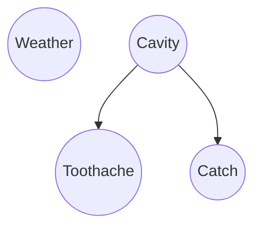
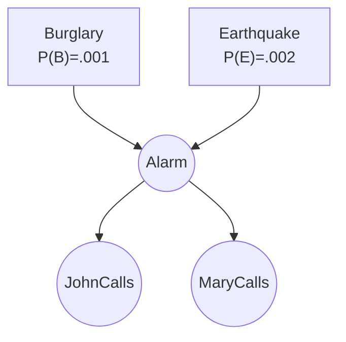
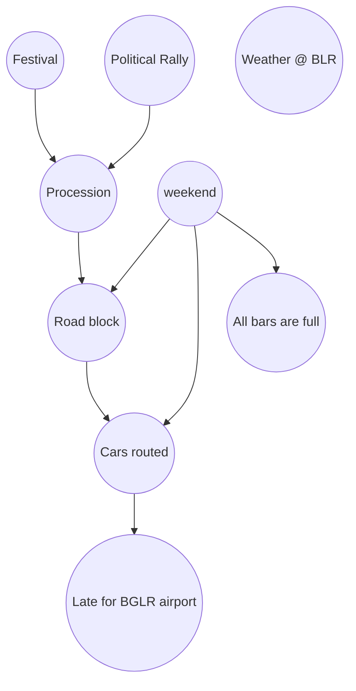
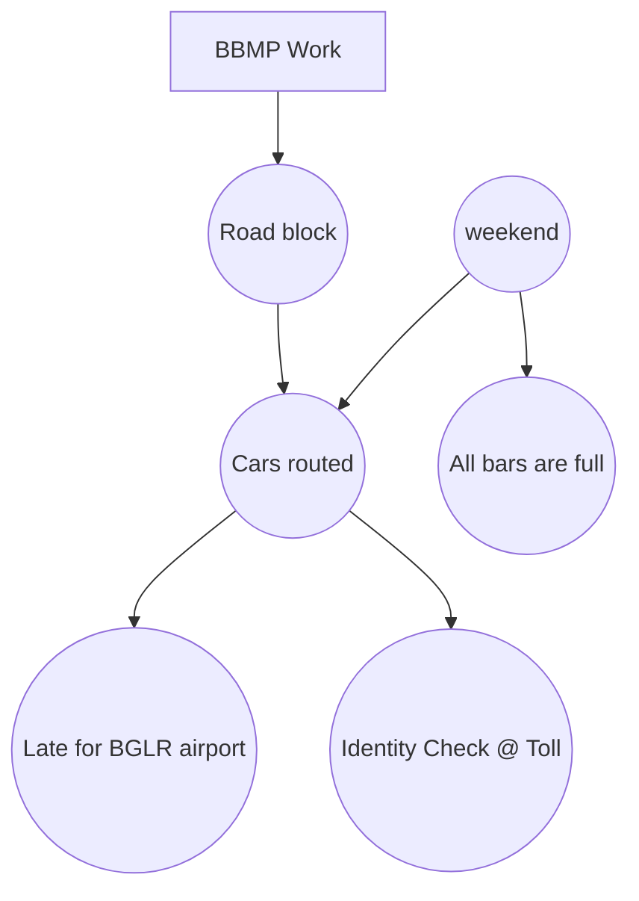
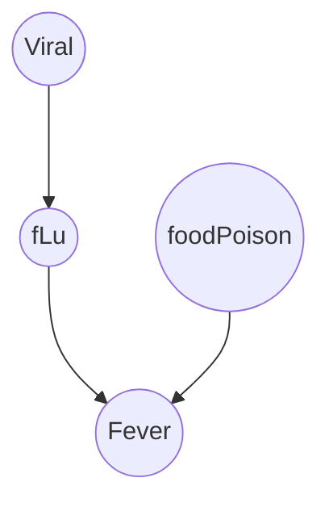
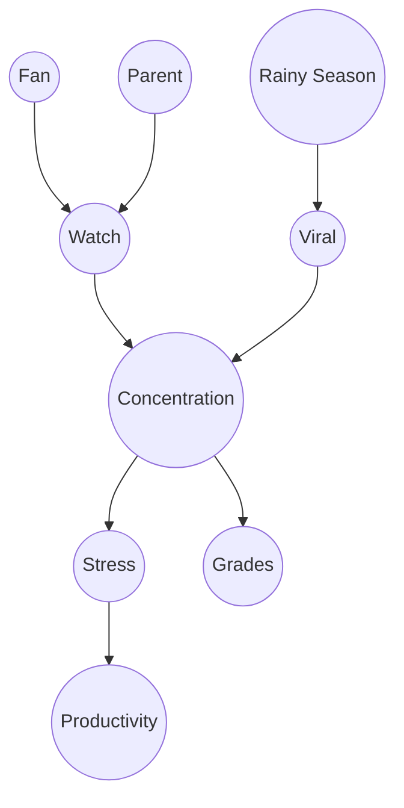
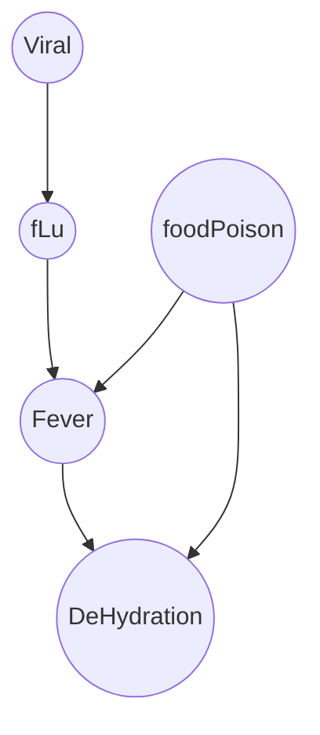

# Artificial and Computational Intelligence (AIMLCZG557)
## CS #11–12 — Probabilistic Representation and Reasoning
*BITS Pilani WILP — ACI Team*

---

## Table of Contents
This study file follows the deck slide-by-slide (74 slides across 19 pages), with every slide broken into **Extracted → Explained → Researched Context**, followed by a full document summary and revision checklist at the end. A few slides in the source deck are pure "animation builds" (the same slide re-shown with one more line/highlight revealed) — these are merged into the fullest version of that slide, and merges are called out explicitly.

---

## Slides 1–2 — Title Slides

Title slide ("Artificial and Computational Intelligence, AIMLCZG557") and section title slide ("CS#11-12 — Probabilistic Representation and Reasoning"). Purely administrative — no content to extract, explain, or research.

---

## Slide 3 — Agenda for CS #11-12

**Extracted Info Page No 3:**
1. Recap of CS#10
2. Brief on Probability (Conditional Probability)
3. Bayes Theorem
4. Bayesian Networks
5. Inference with Bayesian Networks
6. Exact Inference
   - By Enumeration
   - Variable Elimination
7. Approximate Inference
8. Exercises

**Explained in Simple Terms Page No 3:**
This is the roadmap for the whole lecture. It moves from the basic building blocks (probability, conditional probability, Bayes' theorem) up to the main event: Bayesian Networks — a compact way to represent uncertain knowledge — and then two families of techniques for actually *using* a Bayesian network to answer questions: exact methods (enumeration, variable elimination) that give precise answers but can be slow, and approximate methods (sampling) that trade a little accuracy for a lot of speed.

*(No Researched Context — purely administrative/navigation slide.)*

---

## Slide 4 — Course Progress

**Extracted Info Page No 4:**
- M1 Introduction to AI
- M2 Problem Solving Agent using Search
- M3 Game Playing
- M4 Knowledge Representation using Logics
- **M5 Probabilistic Representation and Reasoning** (current module, highlighted)
- M6 Reasoning over time
- M7 Multiagent Decision Making
- M8 Ethics in AI

**Explained in Simple Terms Page No 4:**
This shows where today's topic sits in the overall course. The course builds up an AI agent's toolkit step by step: first it can search for solutions (M2) and play games (M3), then it can represent knowledge with hard logical rules (M4). Module 5 (this lecture) is the turning point — the course admits that hard logic alone can't handle a messy, uncertain real world, so it introduces probability as a new foundation. Later modules build directly on this: M6 (reasoning over time, e.g. tracking a moving object) uses the same Bayesian-network machinery extended across time steps (Hidden Markov Models / Dynamic Bayesian Networks), and M7 (multiagent decision making) often folds in probabilistic beliefs about what other agents will do.

*(No Researched Context — purely administrative/navigation slide.)*

---

## Slide 5 — Reasoning: Monotonic vs Non-Monotonic

**Extracted Info Page No 5:**
- Monotonic Reasoning
- Non-Monotonic Reasoning

| Monotonic | Non-Monotonic |
|---|---|
| Consistent | Relaxed Consistency |
| Complete Knowledge | Incomplete Knowledge |
| Static | Dynamic |
| Discrete | Continuous & Learning Agent |
| Predicate Logic | Probabilistic Model |

**Explained in Simple Terms Page No 5:**
"Monotonic" reasoning is like classical math proofs: once you know something is true, adding more facts never makes it false — your knowledge only grows, never shrinks or gets contradicted (this is what predicate logic gives you, but it needs *complete* knowledge of a *static*, unchanging world). "Non-monotonic" reasoning is how humans actually reason day to day: you believe "birds fly," then learn "this bird is a penguin," and you *retract* your earlier belief. Real-world agents rarely have complete information, the world keeps changing, and new evidence can overturn old conclusions — which is exactly the kind of flexibility a probabilistic model provides (a probability can go up or down as new evidence arrives, without breaking anything).

**Researched Context Page No 5:**
Non-monotonic logics (default logic, circumscription, autoepistemic logic) were developed in AI in the late 1970s/1980s specifically to handle the "penguin problem" — that classical (monotonic) first-order logic cannot gracefully represent default assumptions and exceptions. Probability theory sidesteps the whole debate: instead of a belief being simply true/false and revocable, a Bayesian agent just assigns "flies" a high probability for birds in general and a very low probability once "penguin" is observed, updating smoothly via conditioning rather than retracting a hard rule. This is one of the core motivations, from Judea Pearl's own writing, for why probabilistic graphical models displaced purely logical expert systems in 1980s AI.

Sources:
- https://en.wikipedia.org/wiki/Judea_Pearl

---

## Slide 6 — Need for Reasoning with Uncertainty

**Extracted Info Page No 6:**
- The world is full of uncertainty
  - Chance nodes / sensor noise / actuator error / partial info
  - Logic is brittle
    - Can't encode exceptions to rules
    - Can't encode statistical properties in a domain
  - Computers need to be able to handle uncertainty
- Probability: new foundation for AI (& CS!)
- Massive amounts of data around today
  - Statistics and CS are both about data
  - Statistics lets us summarize and understand it
  - Statistics is the basis for most learning
  - Statistics lets data do our work for us

**Explained in Simple Terms Page No 6:**
Real sensors are noisy, real actuators don't always do exactly what you told them, and an agent almost never has full information about the world — all classic "uncertainty" sources. Pure logic (if-then rules) is brittle because it can't say "usually true, but not always" — a rule either fires or it doesn't. Probability theory is the fix: instead of "all birds fly" (a rule that breaks the moment you meet a penguin), you get "P(flies | bird) = 0.95" — a number that quietly absorbs exceptions instead of needing a special case for every one. The slide also connects this to the modern data explosion: probability and statistics are the mathematical language that lets an algorithm learn patterns from mountains of data automatically, rather than a human having to hand-write every rule.

**Researched Context Page No 6:**
This slide's argument mirrors a well-known transition in the history of AI: expert systems of the 1970s–80s (like MYCIN for medical diagnosis) used brittle certainty-factor hacks bolted onto rule-based logic to fake uncertainty handling. Judea Pearl's development of Bayesian networks in the mid-1980s gave the field a mathematically principled alternative, and it is widely credited with helping trigger the field's broader shift toward statistical and probabilistic methods — the same shift that, decades later, underlies modern machine learning's reliance on probability (e.g., softmax outputs as probability distributions, Bayesian deep learning, etc.).

Sources:
- https://en.wikipedia.org/wiki/Judea_Pearl

---

## Slides 7–8 — Uncertainty (Bangalore Airport Example)

**Extracted Info Page No 7:**
> "You can reach Bangalore Airport from MG Road within 90 mins if you go by route A."
- There is uncertainty in this information due to partial observability and non-determinism.
- Agents should handle such uncertainty.
- Previous approaches like Logic represent all possible world states.
- Such approaches can't be used, as multiple possible states need to be enumerated to handle the uncertainty in our information.

**Extracted Info Page No 8:**
Continuation of the same example, with a worked frequency table (20 observations of a trip) broken down by three Boolean factors — Road Block, Festival Season, Weekend:

| Road Block | Festival Season | Weekend | Observation (of 20) | Prob |
|---|---|---|---|---|
| F | F | F | 12 | 0.6 |
| F | F | T | 3 | 0.15 |
| F | T | F | 2 | 0.1 |
| F | T | T | 2 | 0.1 |
| T | F | F | 0 | 0 |
| T | F | T | 0 | 0 |
| T | T | F | 1 | 0.05 |
| T | T | T | 0 | 0 |
| | | | | **= 1** |

**Explained in Simple Terms Pages No 7–8:**
The claim "you can reach the airport in 90 minutes via route A" *sounds* like a fact, but it's really a statistical summary hiding a lot of uncertainty — traffic, road blocks, festivals, and weekends all change the actual travel time. Old-school logic would try to handle this by listing every possible world (blocked-or-not × festival-or-not × weekend-or-not × ...) as separate hard facts, which explodes combinatorially and still can't express "usually 90 minutes, but sometimes more." The table on slide 8 shows the probabilistic alternative directly: out of 20 observed trips, 12 had no road block, no festival, and weren't on a weekend (probability 0.6 = 12/20); only 1 trip out of 20 had a road block *and* was during a festival on a weekday (probability 0.05 = 1/20). Every row is a possible combination of the three factors, and the probabilities across all 8 rows must add up to exactly 1, because those 8 rows cover every possibility.

**Researched Context Pages No 7–8:**
This table is a small hand-built example of a **joint probability distribution** over three Boolean variables — exactly the concept formalized a few slides later (Slide 16), and exactly the object that gets impractically large as more variables are added (a fully-general joint table over $n$ Boolean variables needs $2^n$ rows). This "explosion" is precisely the motivation for Bayesian networks: instead of storing all $2^n$ joint probabilities directly, a Bayesian network stores only local conditional probabilities between causally/statistically related variables, which is exponentially cheaper when most variables are independent or only weakly related.

Sources:
- https://en.wikipedia.org/wiki/Joint_probability_distribution

---

## Slide 9 — Probability Basics (Self Study)

**Extracted Info Page No 9:**
- Begin with a set $S$: the *sample space* — e.g., 6 possible rolls of a die.
- $x \in S$ is a *sample point / possible world / atomic event*.
- A *probability space* (or *probability model*) is a sample space with an assignment $P(x)$ for every $x$ such that $0 \le P(x) \le 1$ and $\sum P(x) = 1$.
- An *event* $A$ is any subset of $S$ — e.g. $A$ = "die roll < 4".
- A *random variable* is a function from sample points to some range, e.g., the reals or Booleans.

**Explained in Simple Terms Page No 9:**
Think of rolling a die: the sample space $S$ is just the list of everything that could happen — $\{1,2,3,4,5,6\}$. Each individual outcome (rolling exactly a "3") is a sample point. A probability space attaches a number between 0 and 1 to every outcome, and all those numbers must add up to exactly 1 (something has to happen). An "event" is just a *group* of outcomes you care about — "rolling less than 4" bundles together $\{1,2,3\}$. A random variable is a convenient relabeling function — instead of talking about raw outcomes, you talk about a variable like "Weather" that maps each possible world to a value like "sunny" or "rainy".

*(No Researched Context — flagged "Self Study" in the source deck; foundational textbook material, not a slide requiring external grounding.)*

---

## Slide 10 — Types of Probability Spaces (Self Study)

**Extracted Info Page No 10:**
- **Propositional or Boolean random variables** — e.g., *Cavity* (do I have a cavity?)
- **Discrete random variables** (finite or infinite) — e.g., *Weather* is one of $\langle sunny, rain, cloudy, snow \rangle$; $Weather = rain$ is a proposition. Values must be exhaustive and mutually exclusive.
- **Continuous random variables** (bounded or unbounded) — e.g., $Temp = 21.6$; also allow, e.g., $Temp < 22.0$.
- Arbitrary Boolean combinations of basic propositions are allowed.

**Explained in Simple Terms Page No 10:**
Not every random variable looks like a coin flip. A **Boolean** variable only has two values (true/false) — "Cavity: yes or no". A **discrete** variable can have several distinct named values, like Weather being exactly one of sunny/rain/cloudy/snow (it can't secretly be two of these at once — "exhaustive and mutually exclusive" just means the list covers everything possible and the options don't overlap). A **continuous** variable can take any value along a range, like temperature being 21.6°C exactly, or you might only care about a range like "colder than 22°C". You can also combine these with AND/OR/NOT to build more complex questions, e.g. "Cavity AND Weather=rain".

*(No Researched Context — Self Study slide, foundational definitions.)*

---

## Slide 11 — Axioms of Probability Theory (Self Study)

**Extracted Info Page No 11:**
- All probabilities between 0 and 1: $0 \le P(A) \le 1$
- $P(true) = 1$
- $P(false) = 0$
- The probability of disjunction is:
$$P(A \lor B) = P(A) + P(B) - P(A \land B)$$
- Venn diagram shown: circle $A$, circle $B$ overlapping inside universe $S$; $P(A \lor B)$ is the union region, and the formula subtracts the double-counted overlap $P(A \land B)$.

**Explained in Simple Terms Page No 11:**
These are the three foundational rules (Kolmogorov's axioms, informally) that every probability must obey: probabilities live between 0 and 1, a certain (always-true) event has probability 1, and an impossible (always-false) event has probability 0. The disjunction rule handles "A or B" (at least one happens): you can't just add $P(A) + P(B)$, because if $A$ and $B$ can both happen at once, you'd double-count the overlap — so you subtract it back out once. Picture two overlapping circles in a Venn diagram: adding both circles' areas counts the overlapping lens-shaped region twice, so you subtract it once to get the true combined area.

*(No Researched Context — Self Study slide, foundational axioms.)*

---

## Slides 12–13 — Conditional Probability (Self Study)

**Extracted Info Page No 12:**
- Conditional or posterior probabilities, e.g., $P(cavity \mid toothache) = 0.8$ — i.e., given that toothache is all I know, there is an 80% chance of cavity.
- Notation for conditional distributions: $\mathbf{P}(Cavity \mid Toothache)$ = 2-element vector of 2-element vectors.
- If we know more, e.g., cavity is also given, then $P(cavity \mid toothache, cavity) = 1$.
- New evidence may be irrelevant, allowing simplification: $P(cavity \mid toothache, sunny) = P(cavity \mid toothache) = 0.8$.
- This kind of inference, sanctioned by domain knowledge, is crucial.

**Extracted Info Page No 13:**
- $P(A \mid B)$ is the probability of $A$ given $B$. Assumes that $B$ is the only info known.
- Defined by:
$$P(A \mid B) = \frac{P(A \land B)}{P(B)}$$
- Venn diagram: circles $A$ and $B$ overlap inside universe $S$; $P(A \mid B) = \dfrac{P(A \cap B)}{P(B)}$ — i.e., restrict attention to the $B$ circle only, and ask what fraction of it is also inside $A$.

**Explained in Simple Terms Pages No 12–13:**
Conditional probability answers: "given that I already know one thing, how likely is the other thing?" $P(cavity \mid toothache) = 0.8$ reads as "if all I know is that this patient has a toothache, there's an 80% chance they also have a cavity." The formula $P(A|B) = P(A \land B)/P(B)$ is really just "zoom into the world of B" — imagine the full universe of possibilities shrinks down to just the cases where $B$ is true, and then ask what fraction of *that* smaller world also has $A$ true. Two nice properties follow naturally: if you already know a cavity is present, then of course $P(cavity | toothache, cavity) = 1$ (100% — you already know it!). And if some new evidence is irrelevant (like "it's sunny outside" — clearly unrelated to cavities), conditioning on it changes nothing: $P(cavity | toothache, sunny) = P(cavity | toothache)$.

*(No Researched Context — Self Study slides, foundational definitions.)*

---

## Slide 14 — Chain Rule / Product Rule (Self Study)

**Extracted Info Page No 14:**
$$P(X_1, \dots, X_n) = P(X_n \mid X_1..X_{n-1})\,P(X_{n-1} \mid X_1..X_{n-2}) \dots P(X_1) = \prod_i P(X_i \mid X_1,..X_{i-1})$$

**Explained in Simple Terms Page No 14:**
This is a way to break a big, scary joint probability (the chance that a whole bunch of things are simultaneously true) into a chain of smaller, more manageable conditional probabilities. Instead of needing to know the joint probability of everything at once, you can build it up one variable at a time: "what's the chance of $X_1$? Now, given $X_1$, what's the chance of $X_2$? Now, given $X_1$ and $X_2$, what's the chance of $X_3$?" and so on, multiplying all those step-by-step probabilities together. This chain rule is the mathematical backbone that makes Bayesian networks possible — a BN is essentially a smart way of applying the chain rule while dropping unnecessary conditioning variables using conditional independence.

*(No Researched Context — Self Study slide, foundational identity used constantly later in the deck.)*

---

## Slide 15 — Dilemma at the Dentist's (Self Study)

**Extracted Info Page No 15:**
- Cartoon image referencing a nervous dental patient (Mr. Bean) and a dental probe illustration.
- Question posed: *What is the probability of a cavity given a toothache?*
- Question posed: *What is the probability of a cavity given the probe catches?*

**Explained in Simple Terms Page No 15:**
This introduces the running example used for the next several slides: a dentist's world with three Boolean variables — *Toothache* (does the patient report pain?), *Cavity* (does the patient actually have a cavity?), and *Catch* (does the dentist's steel probe catch/snag on the tooth?). The two questions being teed up — "P(cavity | toothache)" and "P(cavity | probe catches)" — are the classic motivating queries that the next few slides answer using a full joint probability table.

**Researched Context Page No 15:**
This exact dentist/cavity/toothache/catch example comes directly from Russell & Norvig's textbook *Artificial Intelligence: A Modern Approach* (AIMA), where it is the canonical teaching example for conditional probability and, later, for conditional independence in Bayesian networks. It's one of the most widely reused toy examples in AI courses worldwide because it's simple enough to compute by hand yet rich enough to demonstrate every key concept — joint distributions, conditioning, and independence.

Sources:
- https://cs.jmu.edu/molloykp/teaching/cs444/cs444_2021Spring/slides/18_Prob_Reasoning.pdf

---

## Slide 16 — Inference by Enumeration: Joint Probability Distribution (Self Study)

**Extracted Info Page No 16:**
The full joint probability table for Toothache, Catch, and Cavity:

| | toothache, catch | toothache, ¬catch | ¬toothache, catch | ¬toothache, ¬catch |
|---|---|---|---|---|
| **cavity** | 0.108 | 0.012 | 0.072 | 0.008 |
| **¬cavity** | 0.016 | 0.064 | 0.144 | 0.576 |

- Table must sum to 1.
- Size of table is a concern.

**Explained in Simple Terms Page No 16:**
This is the full joint probability distribution for the dentist example — every possible combination of Cavity (yes/no), Toothache (yes/no), and Catch (yes/no) has its own probability, and all 8 numbers in the table add up to exactly 1 (you can check: $0.108+0.012+0.072+0.008+0.016+0.064+0.144+0.576 = 1.0$). This table is powerful because it lets you compute *any* question about these three variables just by adding up the right cells — but the slide flags the catch: with 3 Boolean variables you needed 8 numbers; with 20 Boolean variables you'd need over a million. That's "the size of table is a concern," and it's the whole reason Bayesian networks were invented — full joint tables don't scale.

*(No Researched Context — Self Study slide; scaling concern is elaborated with real numbers on Slide 23.)*

---

## Slides 17–20 — Inference by Enumeration: Worked Examples (Self Study)

**Extracted Info Page No 17:**
> To reason on any proposition $\varphi$, sum the atomic events where it is true:
$$P(\varphi) = \sum_{\omega:\omega \models \varphi} P(\omega)$$
(Same joint table as Slide 16 repeated, with the *cavity* row highlighted.)

**Extracted Info Page No 18 — Compute $P(toothache)$:**
$$P(toothache) = 0.108 + 0.012 + 0.016 + 0.064 = 0.20$$

**Extracted Info Page No 19 — Compute $P(cavity)$:**
$$P(cavity) = 0.108 + 0.012 + 0.072 + 0.008 = 0.20$$

**Extracted Info Page No 20 — Compute $P(cavity \lor toothache)$:**
$$P(cavity \lor toothache) = 0.108 + 0.012 + 0.072 + 0.008 + 0.016 + 0.064 = 0.28$$

**Explained in Simple Terms Pages No 17–20:**
This is "inference by enumeration" in action — a fancy name for a simple idea: to find the probability of anything, just add up every cell in the joint table where that thing is true. For $P(toothache)$, you sum all 4 cells in the "toothache" column-group (both cavity and ¬cavity rows, both catch and ¬catch columns) = 0.108+0.012+0.016+0.064 = 0.20. For $P(cavity)$, you sum the entire "cavity" row = 0.108+0.012+0.072+0.008 = 0.20 (coincidentally also 0.20 here). For $P(cavity \lor toothache)$ ("cavity OR toothache, or both"), you add up every cell where *either* is true — that's 6 of the 8 cells (everything except the two "¬cavity, ¬toothache" cells) = 0.28. Notice this matches the disjunction rule from Slide 11: $P(cavity) + P(toothache) - P(cavity \land toothache) = 0.20 + 0.20 - 0.12 = 0.28$ ✓.

*(No Researched Context — Self Study slides, mechanical worked examples of a definition already covered.)*

---

## Slides 21–22 — Inference by Enumeration: Conditional Queries (Self Study)

**Extracted Info Page No 21 — Compute $P(\lnot cavity \mid toothache)$:**
$$P(\lnot cavity \mid toothache) = \frac{P(\lnot cavity \land toothache)}{P(toothache)} = \frac{0.016 + 0.064}{0.108 + 0.012 + 0.016 + 0.064} = 0.4$$

**Extracted Info Page No 22 — Compute $P(cavity \mid toothache)$:**
$$P(cavity \mid toothache) = \frac{P(cavity \land toothache)}{P(toothache)} = \frac{0.108 + 0.012}{0.108 + 0.012 + 0.016 + 0.064} = 0.6$$

**Explained in Simple Terms Pages No 21–22:**
Now the enumeration technique answers a *conditional* question — this is where it gets useful for diagnosis. To compute $P(cavity | toothache)$: restrict attention only to the "toothache" world (denominator = sum of the toothache column = 0.20, as computed on Slide 18), then ask what fraction of that restricted world also has a cavity (numerator = the two toothache-and-cavity cells = 0.108+0.012 = 0.12). $0.12 / 0.20 = 0.6$ — so given a toothache, there's a 60% chance of a cavity. Sanity check: $P(cavity|toothache) + P(\lnot cavity|toothache) = 0.6 + 0.4 = 1.0$ ✓, exactly as it should, since given a toothache, the patient either has a cavity or doesn't.

*(No Researched Context — Self Study slides, mechanical worked examples.)*

---

## Slide 23 — Complexity of Enumeration (Self Study)

**Extracted Info Page No 23:**
- Worst case time: $O(d^n)$ — where $d$ = max arity, $n$ = number of random variables.
- Space complexity also $O(d^n)$ — size of the joint distribution.
- Prohibitive!

**Explained in Simple Terms Page No 23:**
This is the punchline that motivates everything that follows in the lecture. If each variable can take $d$ different values (arity $d$; for Booleans, $d=2$) and there are $n$ variables total, the full joint distribution needs $d^n$ numbers. For our tiny 3-variable dentist example that was only $2^3=8$ numbers — totally fine. But real-world problems have dozens or hundreds of variables: with just 30 Boolean variables, $2^{30}$ is over a billion — completely unmanageable to store, let alone enumerate by hand. This exponential blow-up is "prohibitive," and it's exactly the gap that Bayesian networks are designed to close, by exploiting the fact that most variables are *not* directly related to most other variables.

**Researched Context Page No 23:**
This exponential blow-up is a concrete instance of the "curse of dimensionality." It is precisely why, even after Bayesian networks compress the *representation* of a joint distribution, exact *inference* on those networks (enumeration or its faster cousin, variable elimination) is still, in the worst case, NP-hard — a result formally proven by Gregory Cooper in 1990. This theoretical limit is the direct justification for the "Approximate Inference" section that appears later in this same lecture (from Slide 60 onward): when exact computation is intractable, sampling-based methods trade a guaranteed exact answer for a fast, "good enough" estimate.

Sources:
- https://www.sciencedirect.com/science/article/pii/000437029090060D
- https://en.wikipedia.org/wiki/Curse_of_dimensionality

---

## Slide 24 — Independence

**Extracted Info Page No 24:**
$A$ and $B$ are *independent* iff:
$$P(A \mid B) = P(A) \qquad P(B \mid A) = P(B)$$
(These two constraints are logically equivalent.)

Therefore, if $A$ and $B$ are independent:
$$P(A \mid B) = \frac{P(A \land B)}{P(B)} = P(A)$$
$$P(A \land B) = P(A)P(B)$$

**Explained in Simple Terms Page No 24:**
Two events are "independent" when knowing one tells you *nothing new* about the other — learning $B$ happened doesn't change your belief about $A$ at all, so $P(A|B)$ is just the same as the plain $P(A)$. Classic example: two separate coin flips are independent — knowing the first flip landed heads tells you nothing about the second flip. Algebraically, plugging $P(A|B) = P(A)$ into the conditional probability definition and rearranging gives the famous product rule for independent events: $P(A \land B) = P(A) \cdot P(B)$ — "just multiply the two probabilities together," which is a massive shortcut compared to needing the full joint table. This is the key mathematical tool Bayesian networks exploit: wherever two variables really are independent (or conditionally independent), you get to skip storing their joint relationship entirely.

*(No Researched Context — foundational definition, directly built upon in Slide 27's conditional-independence example.)*

---

## Slide 25 — Bayes Rule

**Extracted Info Page No 25:**
$$P(A \mid B) = \frac{P(B \mid A) \cdot P(A)}{P(B)}$$
where $A, B$ = events; $P(A|B)$ = probability of A given B is true; $P(B|A)$ = probability of B given A is true; $P(A), P(B)$ = the independent (marginal/prior) probabilities of A and B.

**Explained in Simple Terms Page No 25:**
Bayes' Rule is the single most important formula in this lecture — it lets you **flip** a conditional probability around. Often you know $P(B|A)$ easily (e.g., "if a patient has flu, what's the chance they have a fever?" — easy, doctors know this from experience) but you actually want the *reverse*, $P(A|B)$ ("given the patient has a fever, what's the chance they have flu?" — this is the diagnostic question you actually care about, and it's much harder to measure directly). Bayes' Rule shows you can compute the hard-to-measure direction from the easy-to-measure direction, as long as you also know the "base rates" $P(A)$ and $P(B)$. It's derived by simply combining the conditional probability definition ($P(A|B)=P(A\land B)/P(B)$) applied in both directions and noting $P(A \land B) = P(B\land A)$.

**Researched Context Page No 25:**
Bayes' theorem is named after the Reverend Thomas Bayes (1701–1761), an English statistician and Presbyterian minister; his work on the theorem was published posthumously in 1763. Its modern-day applications are everywhere: early spam filters (including Gmail's original implementation) used a "Naive Bayes" classifier that applies exactly this rule to compute $P(\text{spam} \mid \text{words in email})$ from the easier-to-estimate $P(\text{words} \mid \text{spam})$; medical diagnosis systems use it to turn "P(symptom | disease)" (known from clinical studies) into "P(disease | symptom)" (what a doctor actually wants to know) combined with the disease's base-rate prevalence — which is also the classic reason rare-disease screening tests have surprisingly many false positives, since a low prior $P(disease)$ pulls the posterior down even with an accurate test.

Sources:
- https://en.wikipedia.org/wiki/Thomas_Bayes
- https://medium.com/@nirvan.uttamchandani99/bayes-theorem-in-real-life-from-spam-filters-to-medical-diagnosis-85b8183bc295

---

## Slide 26 — Bayesian Network

**Extracted Info Page No 26:**
- A simple, graphical notation for conditional independence assertions, and hence for compact specification of full joint distributions.
- Syntax:
  - A set of nodes, one per variable.
  - A directed, acyclic graph (link ≈ "directly influences").
  - A conditional distribution for each node given its parents: $P(X_i \mid Parents(X_i))$.
- In the simplest case, the conditional distribution is represented as a **conditional probability table (CPT)** giving the distribution over $X_i$ for each combination of parent values.

**Explained in Simple Terms Page No 26:**
A Bayesian network is the direct solution to the "table explodes exponentially" problem from Slide 23. Instead of one giant joint table, you draw a graph: one node per variable, and an arrow from $X$ to $Y$ if $X$ "directly influences" $Y$. Then, instead of storing the *entire* joint distribution, you only store, for each node, a small table showing how likely that node's values are *given only its direct parents* (not every other variable in the whole network). The graph must be a **DAG** (Directed Acyclic Graph — arrows only, and you can never loop back to where you started), which mirrors the natural flow of cause-to-effect. This local, compact bookkeeping is what makes big real-world probability models tractable.

**Researched Context Page No 26:**
Bayesian networks were formally introduced by Judea Pearl in 1985, who coined the term specifically to emphasize (1) the often-subjective nature of the input probabilities, (2) reliance on Bayesian conditioning as the basis for updating belief, and (3) the distinction between causal and evidential reasoning modes. Pearl's invention is widely credited with helping move AI away from brittle rule-based expert systems (popular in the 1970s–80s) toward principled probabilistic reasoning, work for which he later won the 2011 ACM A.M. Turing Award.

Sources:
- https://en.wikipedia.org/wiki/Judea_Pearl
- https://amturing.acm.org/award_winners/pearl_2658896.cfm

---

## Slides 27–28 — Example Bayesian Net #1 (Weather / Toothache / Cavity / Catch)

*(Slide 28 is an animation-build repeat of Slide 27 with identical content — merged here.)*

**Extracted Info Page No 27–28:**
A simple world with four random variables: Weather, Toothache, Cavity, Catch.
- Weather is independent of other variables.
- Toothache and Catch are conditionally independent given Cavity:
$$P(Toothache, Catch \mid Cavity) = P(Toothache \mid Cavity) \cdot P(Catch \mid Cavity)$$
- Cavity is a direct cause of Toothache and Catch.
- No direct relation between Toothache and Catch exists.
- Side annotation: *"ML here is marginalization. Not Machine learning!"* — plus a small circular flow diagram of the general BN-building process: Identify the R.Vs → Dependencies among RVs → Find the Conditional Independences → Use ML to get the best Linearization among RVs → Construct the Bayes Net → Encode the Local dependencies by CPT.

**Explained in Simple Terms Page No 27–28:**
This is the network version of the dentist example. Weather sits off on its own with no arrows in or out — it's *marginally independent* of the dental variables (rain has nothing to do with your teeth). Cavity is drawn as the common cause, with arrows pointing *out* to both Toothache and Catch, because having a cavity is what *causes* both the pain and the probe catching. Critically, there's no arrow directly between Toothache and Catch — they are **conditionally independent given Cavity**: once you already know whether the patient has a cavity, learning that they have a toothache tells you *nothing extra* about whether the probe will catch (and vice versa). That's the mathematical payoff of the graph: instead of a $2^4=16$-row joint table, you only need small local tables for Weather, Cavity, Toothache|Cavity, and Catch|Cavity — far fewer numbers overall. (Small note on the slide: "ML" in the little cycle diagram means *marginalization*, the summing-out operation used throughout inference — not "Machine Learning.")

**Researched Context Page No 27–28:**
This four-variable Weather/Cavity/Toothache/Catch network is a direct extension of the classic dentist example from Russell & Norvig's *AIMA* textbook, used specifically to teach conditional independence: the book states explicitly that, given knowledge of whether a cavity exists, the probability the probe catches is independent of whether there's a toothache. Adding "Weather" (a completely unrelated variable) alongside it is a common pedagogical trick to also illustrate *plain* (unconditional) independence in the same diagram — showing students both flavors of independence side-by-side.

Sources:
- https://cs.jmu.edu/molloykp/teaching/cs444/cs444_2021Spring/slides/18_Prob_Reasoning.pdf

---

## Slides 29–30 — Example Bayesian Net #1: Worked Question

*(Slide 30 is an animation-build repeat of Slide 29 showing the same tables with cells highlighted for the answer — merged here.)*

**Extracted Info Page No 29–30:**
*Question:* What is the probability of good weather, not having toothache, not having cavity, and having catch?
$$P(W, \lnot T, \lnot V, C) = ?$$
*(Blank/partially-filled CPT tables shown for Weather (W/¬W), Cavity (V/¬V), Toothache|Cavity, Catch|Cavity — left for the student to fill in and compute the answer using the chain rule implied by the network structure.)*

**Explained in Simple Terms Page No 29–30:**
This exercise asks students to actually use the network from Slides 27–28 to answer a joint query, rather than just look up a table. Because of the graph's structure, the chain rule simplifies dramatically:
$$P(W, \lnot T, \lnot V, C) = P(W) \cdot P(\lnot V) \cdot P(\lnot T \mid \lnot V) \cdot P(C \mid \lnot V)$$
Notice that's only 4 small numbers multiplied together — Weather's own prior, Cavity's own prior, and Toothache/Catch each conditioned *only* on Cavity (not on Weather or on each other), reflecting exactly the independence assumptions baked into the graph. This is the core efficiency win of a Bayesian network over a raw joint table: the query decomposes into a short product instead of a single 16-row table lookup.

*(No Researched Context — mechanical application of the previous slide's concept.)*

---

## Slides 31–32 — Example Bayesian Net #2 (Burglary Alarm System)

*(Slide 32 is an animation-build repeat of Slide 31, revealing the full network diagram with CPTs — merged here.)*

**Extracted Info Page No 31–32:**
A Burglary Alarm System:
- Fairly reliable at detecting a burglary.
- Also responds to earthquakes.
- Two neighbors, John and Mary, are asked to call you at work when Burglary happens and they hear the Alarm.
- John nearly always calls when he hears the alarm, but sometimes confuses the telephone ring with the alarm and calls then too.
- Mary likes loud music and often misses the alarm altogether.
- **Problem:** Given the information that who has/has not called, estimate the probability of a burglary.

Full network with CPTs:

| B | E | P(A) |
|---|---|---|
| t | t | 0.95 |
| t | f | 0.94 |
| f | t | 0.29 |
| f | f | 0.001 |

| A | P(J) |
|---|---|
| t | 0.90 |
| f | 0.05 |

| A | P(M) |
|---|---|
| t | 0.70 |
| f | 0.01 |

**Explained in Simple Terms Page No 31–32:**
This is arguably *the* most famous example in all of Bayesian-network teaching. Two independent root causes — Burglary and Earthquake — can each trigger the Alarm. The Alarm, in turn, can cause two neighbors to call. Read the CPTs like this: if there's both a burglary and an earthquake, the alarm goes off 95% of the time (P(A|B,E)=0.95); if there's a burglary alone, 94%; an earthquake alone, 29% (earthquakes are less reliable triggers); and if neither happens, the alarm still has a tiny 0.1% chance of a false alarm. John calls 90% of the time when the alarm sounds but also has a 5% chance of a false-positive call (he sometimes confuses the phone ringing with the alarm); Mary is less reliable, calling 70% of the time the alarm sounds but almost never calling by mistake (1%). None of these numbers involve the full 5-variable joint table — each is a small, locally-estimable probability, exactly the efficiency Bayesian networks are built for.

**Researched Context Page No 31–32:**
This exact network — Burglary, Earthquake, Alarm, JohnCalls, MaryCalls, with these same CPT values — originates from Judea Pearl's own foundational work on Bayesian networks and was popularized worldwide through Russell & Norvig's *Artificial Intelligence: A Modern Approach*, where it remains the textbook's flagship example for exact inference by enumeration. It has since become a near-universal teaching device, appearing in AI courses at MIT, Berkeley, UW, IIT Delhi, and countless others, precisely because it's small enough to compute by hand yet rich enough to demonstrate causal reasoning (burglary → alarm), diagnostic reasoning (calls → burglary), and "explaining away" (learning about the earthquake reduces suspicion of a burglary, even though burglary and earthquake are marginally independent).

Sources:
- https://github.com/aimacode/aima-python/blob/master/probability4e.ipynb
- https://people.cs.pitt.edu/~milos/courses/cs2740/Lectures/class19.pdf

---

## Slide 33 — Examples: Joint Probability Calculation on the Alarm Network

**Extracted Info Page No 33:**
*Calculate the probability that the alarm has sounded, but neither burglary nor earthquake happened, and both John and Mary called.*
$$P(j,m,a,\lnot b,\lnot e) = P(j\mid a)\,P(m\mid a)\,P(a\mid \lnot b \land \lnot e)\,P(\lnot b)\,P(\lnot e)$$
$$= 0.90 \times 0.70 \times 0.001 \times 0.999 \times 0.998 = 0.000628$$

**Explained in Simple Terms Page No 33:**
This is a direct application of the chain rule, shaped by the network's structure: each node's probability is conditioned only on its parents. So the joint probability of this specific scenario (no burglary, no earthquake, but the alarm somehow goes off anyway, and both neighbors call) is the product of: John calling given the alarm sounded (0.90), Mary calling given the alarm sounded (0.70), the alarm sounding given *neither* burglary nor earthquake occurred (0.001 — the "false alarm" rate), the probability of no burglary (0.999 = 1−0.001), and the probability of no earthquake (0.998 = 1−0.002). Multiplying these five small, locally-known numbers together gives the overall probability of this exact, quite unlikely, combination of events: about 0.06%.

*(No Researched Context — direct numeric application of the previous slide's network.)*

---

## Slides 34–35 — Example Bayesian Net #3: Traffic Prediction

*(Slide 35 is an animation-build repeat of Slide 34's problem statement while revealing the network diagram — merged here.)*

**Extracted Info Page No 34–35:**
**Traffic Prediction – Travel Estimation:**
- AI system reminds traveler regarding start time.
- Travel plan is to reach BLR; the weather of BLR may influence accommodation plans.
- Traveler always takes a car to reach the airport.
- Car may be rerouted either due to road block or weekend traffic during working hours, which delays arrival at the airport.
- Bars are always observed to be full on weekends.
- Authorities block roads to safeguard processions.
- Processions are observed during festive season or due to a political rally.
- **Problem:** Given the information that a political rally is expected, estimate the probability of late arrival.

**Explained in Simple Terms Page No 34–35:**
This is a brand-new, home-grown network (not from a textbook) modeling why a traveler might arrive late at Bangalore airport. Trace the causal story: a Festival *or* a Political Rally can cause a Procession; a Procession (plus it being a weekend) can cause authorities to put up a Road Block; a Road Block (plus weekend traffic in general) causes the car to be Rerouted ("Cars routed"); and being rerouted causes the traveler to be Late for the airport. Weekend also independently makes "All bars are full" (irrelevant to lateness, just flavor/context) and directly contributes to routing delays. "Weather @ BLR" sits off to the side, disconnected — it affects accommodation planning, not travel time, so it isn't wired into the lateness chain at all. This is a nice example of *designing* a Bayesian network from a word problem: you first identify the variables, then ask "what causes what?" to decide the arrow directions.

*(No Researched Context — original instructor-built example illustrating BN construction; no external grounding needed beyond BN theory already covered.)*

---

## Slide 36 — (Not Captured / Transitional Slide)

No distinct content was extracted for slide 36 in the source deck between the traffic-network diagram (Slide 35) and the three-panel comparison diagram (Slide 37) — it appears to be an intermediate animation-build frame of the same diagram sequence, fully superseded by the content on Slide 37 below.

---

## Slide 37 — Example Bayesian Nets: Building Up the Network + D-Separation Rules

**Extracted Info Page No 37:**
Three progressively larger versions of the same core sub-network (Road block, weekend → Cars routed, All bars are full → Late for BGLR airport), showing the network being built up incrementally, plus two extra nodes layered on top in the rightmost/fullest version: "BBMP Work" (feeding into Road block) and "Identity Check @ Toll" (fed by Cars routed).

Two general graph-theoretic rules stated:
- A node is conditionally independent of its non-descendants, given its parents.
- A node is conditionally independent of all other nodes in the net, given its parents, children, and children's parents.

**Explained in Simple Terms Page No 37:**
This slide shows the traffic network growing incrementally (a common teaching device — introduce a small piece, then add complexity) and adds two new plausible real-world causes: municipal road work ("BBMP Work", BBMP being Bangalore's civic body) as another cause of road blocks, and an "Identity Check @ Toll" as a *consequence* of being routed a certain way (an extra delay once you're already on a rerouted path). The two independence rules stated here are general facts about *any* Bayesian network, not just this one: (1) once you know a node's direct parents, nothing about its more distant ancestors (non-descendants) changes your belief about it — the parents "screen off" the rest of the ancestry; (2) more broadly, a node is *fully* insulated from the entire rest of the network once you know its "Markov blanket" — its parents, its children, and its children's other parents (co-parents). This Markov blanket idea is a preview of the formal **d-separation** rule covered a few slides later.

**Researched Context Page No 37:**
The "Markov blanket" concept described in the second bullet (parents + children + children's other parents) is a standard, formally-named result in Bayesian network theory: it defines the *minimal* set of nodes that renders a given node conditionally independent of every other node in the network. It is heavily used in practice for efficient inference and structure learning — e.g., feature-selection algorithms in machine learning sometimes use the Markov blanket concept to identify the minimal set of "relevant" variables needed to predict a target variable, discarding everything else without losing predictive information.

Sources:
- https://en.wikipedia.org/wiki/Bayesian_network#Markov_blanket

---

## Slide 38 — Example Bayesian Nets (Colored Recap)

**Extracted Info Page No 38:**
A colored recap of the same three-stage traffic network build-up from Slide 37 (Road block/weekend → Cars routed/All bars are full → Late for BGLR airport), shown with color-coded node categories (blue = intermediate causes, white = independent root causes, green = final outcome).

**Explained in Simple Terms Page No 38:**
Purely a visual recap/animation-build of Slide 37's network, now color-coded to make the causal layers easier to see at a glance: white nodes are independent starting causes (Road block, weekend), blue nodes are intermediate effects that become causes of something else (Cars routed, All bars are full), and the green node is the final outcome variable everyone actually cares about (Late for BGLR airport). This layered coloring is a common way to visually communicate a Bayesian network's causal "depth."

*(No Researched Context — pure visual recap of already-covered content.)*

---

## Slide 39 — Belief Nets: The Four Inference Types

**Extracted Info Page No 39:**
Four categories of inference over a Bayesian network, illustrated with small 2-node diagrams (Q = query node, E = evidence node):
- **Diagnostic**: Q above, E below (query is the *cause*, evidence is the *effect*) — inferring cause from observed effect.
- **Causal**: E above, Q below (evidence is the cause, query is the effect) — inferring effect from a known cause.
- **Inter-Causal**: Q and E both feed into a common node below (two causes of the same effect) — "explaining away" reasoning.
- **Mixed Inferences**: shown on the full Burglary-Earthquake-Alarm-JohnCalls-MaryCalls network (annotated E, Q, E at different nodes) and the full traffic/festival network — combining more than one of the above patterns in a single query.

**Explained in Simple Terms Page No 39:**
This slide names the four "directions" you can reason in through a Bayesian network, all using the *same* graph and the *same* math, just querying different nodes:
- **Diagnostic** ("bottom-up," effect → cause): "The alarm went off (evidence) — was there a burglary (query)?" You're reasoning *against* the arrows.
- **Causal** ("top-down," cause → effect): "There's a burglary (evidence) — will the alarm go off (query)?" You're reasoning *with* the arrows.
- **Inter-causal**: Two potential causes share a common effect; learning about one changes your belief about the other, even with no direct arrow between them — e.g., learning there was an earthquake (evidence) can *lower* your suspicion of burglary (query), because the earthquake now "explains" the alarm sounding.
- **Mixed**: real questions often combine all three at once, using several pieces of evidence scattered around the network to update belief about several unknowns simultaneously.

**Researched Context Page No 39:**
"Explaining away" (the inter-causal pattern) is one of the signature phenomena that makes Bayesian networks more powerful than naive rule chaining: two causes of a shared effect are *marginally* independent, but become *dependent* once you condition on their shared effect. This is precisely why, in the Burglary–Earthquake–Alarm network, learning the alarm sounded raises suspicion of both burglary and earthquake, but then additionally learning an earthquake definitely occurred *lowers* the burglary probability back down — the earthquake "explains away" the alarm, even though burglary and earthquake have no direct causal link.

Sources:
- https://people.cs.pitt.edu/~milos/courses/cs2740/Lectures/class19.pdf

---

## Slide 40 — Belief Nets: Identify the Inference Type (Exercise)

**Extracted Info Page No 40:**
Using the Burglary–Earthquake–Alarm–JohnCalls–MaryCalls network from Slides 31–32, classify each query's inference type:
1. $P(J \mid B, \lnot A)$
2. $P(E \mid B, M)$
3. $P(A \mid J)$

**Explained in Simple Terms Page No 40:**
Working through each using the four categories from Slide 39:
1. **$P(J \mid B, \lnot A)$** — asking about JohnCalls (a descendant/effect two steps below Burglary, one step below Alarm), given Burglary (an ancestor) and ¬Alarm (its direct parent). Since both pieces of evidence sit *above* the query in the causal chain, this is reasoning *with* the arrows — a **causal** query.
2. **$P(E \mid B, M)$** — asking about Earthquake (a root cause), given Burglary (its co-parent, sharing the child Alarm) and MaryCalls (a "grandchild" descendant, two steps below Alarm). Evidence coming from a descendant of a shared effect makes this a mix of diagnostic (M → up through A → E) and inter-causal (B as a co-parent of E through Alarm) reasoning — a **mixed** query.
3. **$P(A \mid J)$** — asking about Alarm (the direct cause of JohnCalls), given JohnCalls (its child/effect). Reasoning from an effect back up to its direct cause is the textbook definition of a **diagnostic** query.

*(No Researched Context — direct application of the classification scheme from Slide 39.)*

---

## Slide 41 — Inference with Bayesian Networks (Section Overview)

**Extracted Info Page No 41:**
- Exact Inference
  - By Enumeration
  - Variable Elimination
- Approximate Inference

**Explained in Simple Terms Page No 41:**
This is a mini section-divider recapping the roadmap first shown on the agenda (Slide 3), right before the deck dives into the mechanics. Two exact methods are covered first — brute-force Enumeration (sum over the full joint, but computed *through* the network's local CPTs rather than one giant table) and the smarter Variable Elimination (avoid recomputing the same sub-sums repeatedly). Then Approximate Inference (random sampling methods) is covered as the practical fallback for when exact methods are too slow on large networks.

*(No Researched Context — pure section-navigation slide.)*

---

## Slide 42 — Inferences in Bayesian Nets: Enumeration (Section Divider)

Section divider slide introducing the "Inferences in Bayesian Nets — Enumeration" block covered in Slides 43–49. No standalone content to extract or explain.

---

## Slide 43 — Examples: Traffic Network Queries

**Extracted Info Page No 43:**
Using an extended traffic network (Cars routed, Road block, weekend, Weather @ Delhi, Festival, All bars are full, Late for BGLR airport):
1. Calculate the probability that arrival at the airport was delayed during a weekend, but there was no road block or festival, and the car was not routed anywhere. → $P(L, W, \lnot R, \lnot F, \lnot C)$ — a **joint** query.
2. What is the probability that it is a festival season, given cars were routed? → $P(F \mid C)$ — a **conditional** query.
3. What is the probability that the car arrived late at the airport, given it's a festival day? → $P(L \mid F)$ — a **conditional** query.

**Explained in Simple Terms Page No 43:**
This slide labels each question by query *type* — an important habit before trying to solve one. Question 1 asks for one specific, fully-detailed combination of every variable's value at once (a joint probability — every variable pinned down: late, weekend, no road block, no festival, car not routed). Questions 2 and 3 are conditional queries — they ask about one variable's probability *given that another is already known*, which (as covered from Slide 12 onward) requires computing a ratio of two probabilities: $P(F \mid C) = P(F \land C)/P(C)$, and similarly for $P(L \mid F)$.

*(No Researched Context — classification exercise applying earlier definitions.)*

---

## Slides 44–45 — Examples: Deriving P(B | J,M) Symbolically

**Extracted Info Page No 44:**
*What is the probability that Burglary happened, given John & Mary called the police?*

Starting from $P(A) + P(\lnot A) = 1$ and $P(A|B) = P(AB)/P(B)$:
$$P(B \mid JM) + P(\lnot B \mid JM) = 1$$
$$\frac{P(BJM)}{P(JM)} + \frac{P(\lnot B\, JM)}{P(JM)} = 1$$
$$\frac{1}{P(JM)}\big[P(BJM) + P(\lnot B\,JM)\big] = 1$$

Let $\alpha = \dfrac{1}{P(JM)}$. Then:
$$\alpha = \frac{1}{P(BJM) + P(\lnot B\,JM)} \quad \text{--- (1)}$$

**Extracted Info Page No 45:**
$$P(B \mid JM) = \frac{P(BJM)}{P(JM)} \quad \text{--- (2)}$$
Substituting (1) into (2):
$$P(B \mid JM) = \frac{P(BJM)}{P(BJM) + P(\lnot B\,JM)}$$
*"Now query is in joint probability!"* — calculate $P(BJM)$ and $P(\lnot B\,JM)$ and substitute into the above to get the answer.

**Explained in Simple Terms Pages No 44–45:**
This is a clever algebraic trick that shows up constantly in Bayesian inference: you want $P(B \mid J,M)$ directly, but the *joint* probabilities $P(B,J,M)$ and $P(\lnot B,J,M)$ are much easier to compute from a Bayesian network (via the chain rule through the graph) than the conditional probability is directly. The trick is to notice that $P(B|JM)$ and $P(\lnot B|JM)$ must add up to 1 (since Burglary is either true or false), which lets you avoid ever computing $P(JM)$ directly — instead, you compute both joint probabilities $P(B,J,M)$ and $P(\lnot B,J,M)$, and then just **normalize** them (divide each by their sum) to get a valid conditional probability. This normalization constant is traditionally called $\alpha$ in AI textbooks, and this exact trick (compute unnormalized joint terms, then normalize) is the standard strategy used by every exact-inference algorithm covered in this lecture.

**Researched Context Page No 44–45:**
This "compute joints, then normalize" strategy is precisely the algorithmic pattern used in the enumeration-ask and variable-elimination algorithms formalized in Russell & Norvig's AIMA textbook (Chapter 13/14), where the normalization constant is conventionally written as $\alpha$. It generalizes cleanly beyond two-valued (Boolean) variables — for a variable with $k$ possible values, you'd compute $k$ unnormalized joint terms and divide each by their sum — which is exactly how modern Bayesian-network software libraries (e.g., pgmpy, bnlearn) implement exact query answering internally.

Sources:
- https://github.com/aimacode/aima-python/blob/master/probability4e.ipynb

---

## Slides 46–48 — Examples: Computing P(BJM) and P(¬BJM) Numerically

**Extracted Info Page No 46:**
$P(BJM) = ?$ — Here, $A$ (Alarm) and $E$ (Earthquake) are hidden variables (neither query nor evidence), so they must be marginalized (summed) out:
$$P(BJM) = \sum_A \sum_E P(J,M,A,B,E)$$
Applying the chain rule per the network structure:
$$P(BJM) = \sum_A \sum_E P(J\mid A)\,P(M\mid A)\,P(A\mid BE)\,P(B)\,P(E)$$
Removing $\sum_E$ by assigning T, F:
$$P(BJM) = \sum_A \big[P(J|A)P(M|A)P(A|BE)P(B)P(E)\big] + \big[P(J|A)P(M|A)P(A|B\lnot E)P(B)P(\lnot E)\big]$$

**Extracted Info Page No 47:**
Removing $\sum_A$ by assigning T, F (4 terms total, covering A=T/F crossed with E=T/F):
$$P(BJM) = [0.90 \times 0.70 \times 0.95 \times 0.001 \times 0.002] + [0.05 \times 0.01 \times (1-0.95) \times 0.001 \times 0.002]$$
$$+ [0.90 \times 0.70 \times 0.94 \times 0.001 \times (1-0.002)] + [0.05 \times 0.01 \times (1-0.94) \times 0.01 \times (1-0.002)]$$
$$P(BJM) = 0.000001197 + 0.00000000005 + 0.000592 + 0.0000002994 \approx 0.0005935$$
*(Note: "We still do not know about P(¬BJM)!")*

**Extracted Info Page No 48:**
$$P(\lnot B\,JM) = [0.90 \times 0.70 \times 0.29 \times (1-0.001) \times 0.002] + [0.05 \times 0.01 \times (1-0.29) \times (1-0.001) \times 0.002]$$
$$+ [0.90 \times 0.70 \times 0.001 \times (1-0.001) \times (1-0.002)] + [0.05 \times 0.01 \times (1-0.001) \times (1-0.001) \times (1-0.002)]$$
$$P(\lnot B\,JM) = 0.0003650346 + 0.00000070929 + 0.00062811126 + 0.000498002499 \approx 0.001492$$

Final answer:
$$P(B \mid JM) = \frac{P(BJM)}{P(BJM) + P(\lnot B\,JM)} = \frac{0.0005935}{0.0005935 + 0.001492} = \mathbf{0.2847}$$

**Explained in Simple Terms Page No 46–48:**
This is the full, hand-cranked exact-inference calculation using the plan set up on Slides 44–45. Since Alarm and Earthquake aren't directly observed (they're neither the query nor the evidence — John and Mary calling is the evidence, Burglary is the query), you have to consider *every* possible combination of Alarm (true/false) and Earthquake (true/false) and add up their contributions — this is called **marginalization**, "summing out" a variable you don't care about but which still affects the probability. That's why there are 4 terms in the final sum (2 values of A × 2 values of E). Each of the four numeric terms multiplies together: P(John calls | that Alarm value), P(Mary calls | that Alarm value), P(that Alarm value | Burglary and that Earthquake value), P(Burglary), and P(that Earthquake value) — exactly the chain rule read off the network graph. Doing this twice (once assuming Burglary is true, once assuming it's false) and then normalizing (dividing the "Burglary=true" total by the sum of both totals, per Slide 45's trick) gives the final answer: **28.47% chance of burglary**, given that both John and Mary called. Notice this is *much* higher than the raw prior $P(Burglary)=0.001$ (0.1%) — the two phone calls are strong evidence, even though it's still less than 50/50 because false alarms and false-positive calls are also somewhat likely explanations.

*(No Researched Context — this is the full worked numeric solution to the network already grounded on Slides 31–32.)*

---

## Slide 49 — Exercise: P(John calls | Earthquake)

**Extracted Info Page No 49:**
*What is the probability that John calls, given an earthquake occurred?* $P(J \mid E) = ?$ (same Burglary/Earthquake/Alarm/JohnCalls/MaryCalls network and CPTs as Slides 31–32).

**Explained in Simple Terms Page No 49:**
This exercise asks students to repeat the same enumeration technique from Slides 46–48, but for a different, somewhat simpler query. Here, Burglary and Alarm are the hidden variables to marginalize out (Earthquake is now the *evidence*, and JohnCalls is the *query*):
$$P(J \mid E) = \frac{\sum_B \sum_A P(J\mid A)P(A\mid B,E)P(B)P(E)}{P(E)} = \sum_B \sum_A P(J\mid A)P(A\mid B,E)P(B)$$
Since $E$ is fixed as evidence, it cancels out of the ratio, and you just need to sum $P(J|A) \cdot P(A|B,E) \cdot P(B)$ over the 4 combinations of $B \in \{t,f\}$ and $A \in \{t,f\}$ — a smaller version of the same calculation seen on Slides 46–48.

*(No Researched Context — direct practice exercise reusing the network and technique already covered.)*

---

## Slide 50 — Inferences in Bayesian Nets: Variable Elimination (Section Divider)

Section divider introducing the "Variable Elimination — Reduce Guaranteed Independent nodes" block covered starting Slide 51. No standalone content beyond the section title.

---

## Slides 51–52 — D-Connectedness vs D-Separation

**Extracted Info Page No 51:**
Three principles for Variable Elimination, using the traffic network (Festival, Weather@Delhi, Road block, weekend, Cars routed, All Bars are full, Late for BGLR airport):
1. Each variable is conditionally independent of its non-descendants, given its parents.
2. Eliminate the hidden variables that are neither a query nor an evidence.
3. **Two variables are d-separated if they are conditionally independent given evidence.**

**Extracted Info Page No 52 — "Try it & Test":**
| X | Y | Evidence Z | d-sep? |
|---|---|---|---|
| F | W | C | No |
| L | W | R | No |
| **R** | **L** | **C** | **Yes** |
| B | R | C | No |

$$P(R \mid L, C) = P(R \mid L)$$
"R & L are d-separated i.e., conditionally independent given C."
*(Here F=Festival, W=Weather@Delhi, L=Late for BGLR airport, R=Road block, C=Cars routed, B=All Bars are full.)*

**Explained in Simple Terms Page No 51–52:**
D-separation ("directed separation") is the formal graph-based rule that tells you, just by *looking at the picture* (no arithmetic needed), whether two variables are guaranteed to be conditionally independent given some evidence. The table walks through several pairs to build intuition: Road block (R) and Late-for-airport (L), given Cars-routed (C) as evidence, *are* d-separated — because Road block only affects Lateness *through* Cars routed; once you already know whether the car was rerouted, learning about the road block itself adds nothing more about lateness. That's the everyday meaning of $P(R|L,C) = P(R|L)$: knowing C already "blocks the information flow" from R to L, so L stops caring about R directly. The other rows in the table (F&W given C, L&W given R, B&R given C) are *not* d-separated — meaning there remains some path along which information can still flow between them even after conditioning on that evidence.

**Researched Context Page No 51–52:**
D-separation is a purely graph-theoretic criterion, formally defined by considering every path between two nodes and checking whether each path is "blocked" by the evidence set (chains and forks are blocked if the middle node is in the evidence; colliders/"v-structures" are blocked *unless* the middle node or one of its descendants is in the evidence — the opposite rule, which underlies "explaining away" from Slide 39). It is proven to be both *sound and complete*: if d-separation says two variables are independent given some evidence, they genuinely are independent in every probability distribution the graph can represent, and conversely, any independence that actually holds is guaranteed to be detectable via d-separation. This graph-only check is what lets algorithms determine, before doing any arithmetic, which variables can be safely ignored — the exact efficiency trick Variable Elimination exploits next.

Sources:
- https://helenedk.medium.com/bayesian-networks-d-separation-e2a8f483b721
- https://www.cse.unsw.edu.au/~cs9417ml/Bayes/Pages/Bayesian_Networks_D_Separation.html

---

## Slide 53 — Variable Elimination: Targeting Irrelevant Nodes

**Extracted Info Page No 53:**
Using the traffic network (Festival(F), Weather@Delhi(W), Road block(R), weekend, Cars routed(C), All Bars are full(B), Late for BGLR airport(L)):
$$P(B) = \sum_{L,C,W,R,F} P(L,C,B,W,R,F)$$
$$= \sum_L \sum_C P(L|C) \cdot P(B \mid W) \cdot \sum_W P(C \mid W, R) \cdot \sum_R P(R \mid F) \cdot \sum_F P(F)$$
$$= P(B \mid W)$$
*(Note: here "B" in this query refers to the "All bars are full" node, and "W" refers to weekend — distinct from the Burglary example's B/W.)*

All other variables are hidden with respect to B, since (L, C, R, F) are neither evidence nor query, nor ancestors of (W, B).

**Explained in Simple Terms Page No 53:**
This is the core insight of Variable Elimination: instead of naively summing over *every* variable in the network to answer a query (which is what plain enumeration does), you first ask "which variables can I safely ignore entirely?" Here, "All bars are full" (B) only actually depends on "weekend" (W) — nothing else in the network influences it. So even though the network has 7 variables total, the query $P(B)$ collapses down to a single lookup, $P(B|W)$, because Festival, Road block, Cars routed, and Late-for-airport are all "downstream" of variables that don't affect B at all — they're irrelevant nodes that can be eliminated (dropped) before doing any real work, rather than laboriously summed over.

*(No Researched Context — worked example directly applying the d-separation/elimination principle just introduced.)*

---

## Slide 54 — D-Separation in Inference: The Fever/Flu/FoodPoison Network

**Extracted Info Page No 54:**
A new running example network: Viral (V) → fLu (L); Viral (V) & foodPoison (D) → Fever (F).

CPTs:
| V | ~V |
|---|---|
| 0.6 | 0.4 |

| V | L | ~L |
|---|---|---|
| T | 0.8 | 0.2 |
| F | 0.01 | 0.99 |

| D | ~D |
|---|---|
| 0.1 | 0.9 |

| L | D | F | ~F |
|---|---|---|---|
| T | T | 0.99 | 0.01 |
| T | F | 0.8 | 0.2 |
| F | T | 0.8 | 0.2 |
| F | F | 0.05 | 0.95 |

Two d-separation queries posed:
- $X{=}V, Y{=}F$, Evidence $Z{=}L$ → **d-sep? Yes**: $P(V \mid F, L)$
- $X{=}V, Y{=}D$, Evidence $Z{=}L$ → **d-sep? Yes**: $P(V \mid D, L)$

**Explained in Simple Terms Page No 54:**
This introduces a new example network for practicing d-separation and variable elimination: Viral infection (V) causes fLu-like symptoms (L), and both fLu (L) and food-poisoning (D) can independently cause Fever (F). Reading the CPTs: a person has a 60% prior chance of a viral infection; if viral, an 80% chance of flu symptoms (only 1% if not viral); a 10% prior chance of food poisoning; and Fever is very likely (99%) if you have both flu symptoms and food poisoning, fairly likely (80%) with just one of the two, and unlikely (5%) with neither. The two d-separation questions check: is Viral (V) independent of Fever (F) once you already know fLu (L)? **Yes** — because V only affects F *through* L (V→L→F is the only path, and knowing the middle node L "blocks" that path). Similarly, is Viral (V) independent of foodPoisoning (D) once you know L? **Yes**, and in fact even more trivially — V and D aren't connected by *any* path in the graph at all (they only share a common *effect*, F, further downstream), so they were already independent before even conditioning on L.

*(No Researched Context — self-contained worked example directly applying d-separation, already grounded in Slides 51–52.)*

---

## Slides 55–57 — Variable Elimination on the Fever Network

*(Slide 56 is an animation-build intermediate frame of the same "Variable Elimination: L, D" calculation shown in full on Slide 57 — merged here.)*

**Extracted Info Page No 55 — Eliminate V:**
Multiply out $P(V)$ against $P(L|V)$ to get a joint $P(V,L)$ table, then sum out (marginalize) V to get $P(L)$ alone:

| V | L | value |
|---|---|---|
| T | T | 0.48 |
| T | F | 0.12 |
| F | T | 0.004 |
| F | F | 0.396 |

| L | value |
|---|---|
| T | 0.484 |
| F | 0.516 |

(i.e. $P(L{=}T) = 0.48+0.004=0.484$; $P(L{=}F)=0.12+0.396=0.516$.)

**Extracted Info Page No 56–57 — Eliminate L, D (combine with Fever factor):**
Combine the now-eliminated $P(L)$ table with $P(D)$ and $P(F|L,D)$ into a single $D,L,F$ factor table, then sum out L and D to leave only $P(F)$:

| D | L | F | value |
|---|---|---|---|
| T | T | T | 0.048 |
| T | F | T | 0.04128 |
| F | T | T | 0.34852 |
| F | F | T | 0.02322 |
| T | T | F | 0.00048 |
| T | F | F | 0.01032 |
| F | T | F | 0.087 |
| F | F | F | 0.44118 |

Summed by F:
| L | F | value |
|---|---|---|
| T | T | 0.39652 |
| F | T | 0.0645 |
| T | F | 0.08748 |
| F | F | 0.4515 |

Final:
| F | value |
|---|---|
| T | 0.46102 |
| F | 0.53898 |

**Explained in Simple Terms Page No 55–57:**
This is Variable Elimination worked out mechanically, step by step, on the Fever network. The idea: instead of computing one giant joint distribution over V, L, D, F all at once, you eliminate ("sum out") one variable at a time, each time only multiplying together the small local factors that actually mention that variable, producing a smaller intermediate table each round. Step 1 (Slide 55): combine $P(V)$ and $P(L|V)$ into a joint $P(V,L)$ table, then sum over V's two rows to get the marginal $P(L)$ — a 60% viral prior combined with an 80%/1% flu-given-viral rate nets out to $P(L{=}T) = 0.484$ (48.4% chance of flu symptoms overall, blending the "viral and got flu" and "not viral but got flu anyway" paths). Step 2 (Slides 56–57): take that freshly-computed $P(L)$, combine it with the food-poisoning prior $P(D)$ and the Fever CPT $P(F|L,D)$, producing an 8-row joint table over (D,L,F), then sum out both D and L, leaving just the final marginal $P(Fever)$: **46.1% chance of fever, 53.9% chance of no fever**, blending all four combinations of flu-symptoms-or-not and food-poisoning-or-not. The key efficiency win versus enumeration: at no point did the algorithm ever build a table over *all four* variables (V,L,D,F) simultaneously — it only ever worked with 2-variable and 3-variable intermediate factors, one elimination at a time.

**Researched Context Page No 55–57:**
This step-by-step "multiply relevant factors, then sum out one variable, repeat" procedure is the textbook Variable Elimination algorithm, formalized by Zhang & Poole (1994) and popularized in AI curricula via Russell & Norvig's AIMA. Its worst-case complexity is $O(d^r)$, where $d$ is the maximum number of values any variable can take and $r$ is the size of the largest intermediate factor produced — which depends heavily on the *order* in which variables are eliminated. Finding the optimal elimination order is itself NP-hard, so in practice heuristics (like "min-degree" or "min-fill" ordering) are used; nonetheless, variable elimination is typically dramatically faster than brute-force enumeration on sparsely-connected real-world networks, which is exactly why it's the standard exact-inference workhorse in libraries like pgmpy and Hugin.

Sources:
- https://en.wikipedia.org/wiki/Variable_elimination
- https://www.cs.mcgill.ca/~dprecup/courses/Prob/Lectures/prob-lecture06.pdf

---

## Slide 58 — Exercise: Cricket/IPL Network

**Extracted Info Page No 58:**
Word problem to be turned into a Bayesian network:
> Most WILP students are fans (F) of cricket irrespective of gender. With the new IPL season starting during the exam month, almost every cricket fan spends time to watch (W) the live play. Being a parent (P) reduces the probability of watching. A consequence of watching matches is reduced concentration (C) the following day/s. A consequence of reduced concentration is increased stress (S) with the work environment leading to reduced productivity (D) in the project. Lack of concentration might also be caused by viral (V) infection, common in this rainy season (R). Comprehensive exams and reduced concentration would reduce the probability of good grades (G) in the exam.

Questions posed:
1. Construct the Bayesian network.
2. What is the chance that "an ardent fan of cricket who is a parent of two kids, never misses an IPL match, doesn't get stressed in a work environment, is not affected by viral infection, and performs well in the comprehensive examination"?
3. Performance in the examination is independent of stress in the work environment, given it's known the student is affected by viral infection — check for d-separation.

**Explained in Simple Terms Page No 58:**
This is a full "build a Bayesian network from a paragraph" exercise, the same skill practiced earlier for the traffic network. Reading the causal chain out of the paragraph: Fan-ness (F) and being a Parent (P) both influence Watching (W) — being a fan increases it, being a parent decreases it. Watching (W) causes reduced Concentration (C). Rainy season (R) causes Viral infection (V), which is a *second*, independent cause of reduced Concentration (C). Reduced Concentration then has two downstream effects: it increases Stress (S) (which reduces work Productivity/Deliverables, D), and separately it reduces exam Grades (G). A reasonable network:

For question 3: is Grades (G) independent of Stress (S), given Viral (V) is known? Tracing paths from G to S: G←Concentration→S is the only path, and it runs *through* Concentration, not through Viral. Knowing V (a different upstream cause of Concentration) does *not* block the G←Concentration→S path — so G and S remain d-connected (**not** d-separated) even given V; you'd need to condition on **Concentration** itself, not Viral, to separate them.

*(No Researched Context — self-contained exercise applying BN-construction and d-separation skills already covered.)*

---

## Slides 59–61 — Approximate Inference: Introduction & Prior Sampling

*(Slide 59, the "Approximate Inferences in Bayesian Nets — Introduction" section-title frame, is a divider merged into the fuller content on Slides 60–61.)*

**Extracted Info Page No 60–61 — Prior Sampling:**
- A long stream of pre-generated random numbers between 0 and 1 is used to "roll dice" against each node's CPT, in topological order (parents before children): e.g. `0.3, 0.2, 0.6, 0.58, 0.73, 0.87, 0.15, 0.6, 0.57, 0.85, 0.12, 0.004, 0.93, 0.0002, 0.9, 0.55, ...`
- Each full pass through the network (V, then L, then D, then F, sampled from their CPTs using successive random numbers) produces one complete sample row.
- Example generated samples (V, L, D, F):

| V | L | D | F |
|---|---|---|---|
| T | T | F | T |
| F | F | F | F |
| T | F | F | T |
| F | T | F | T |

**Explained in Simple Terms Page No 60–61:**
This is the simplest approximate-inference method: instead of doing exact arithmetic, you simulate the network thousands of times and just *count*. For each simulated "patient," you generate them variable-by-variable, always in an order where causes come before effects (V before L before D before F, since L depends on V and F depends on both L and D). For each variable, you draw a fresh random number between 0 and 1 and compare it against that variable's probability: e.g., since $P(V{=}T)=0.6$, if the random number is below 0.6 the sample gets V=True, otherwise V=False (this is literally how a computer "flips a biased coin"). You repeat this for every downstream variable using its *specific* CPT row that matches the values already sampled for its parents. After generating many such rows, this large table of simulated patients approximates the true joint distribution — and any probability question can then be answered just by counting rows, no algebra required (this counting step is shown explicitly on Slide 62).

**Researched Context Page No 60–61:**
This technique is properly called **Prior Sampling** (or *ancestral sampling* / *forward sampling*) in the Monte-Carlo inference literature, and it's the conceptual foundation both Rejection Sampling and Likelihood Weighting (covered next) build on. It works because, as the sample count grows, the *law of large numbers* guarantees the fraction of generated samples matching any given combination of variable values converges to that combination's true probability. This general family of technique — draw pseudo-random uniform numbers, use them to simulate a stochastic process, and estimate probabilities by counting — is the same core idea behind Monte Carlo methods broadly, first systematically used by physicists (Stanislaw Ulam and John von Neumann) at Los Alamos in the 1940s to simulate neutron diffusion, and now a workhorse technique across statistics, finance, physics, and AI.

Sources:
- https://web.eecs.utk.edu/~leparker/Courses/CS594-fall09/Lectures/12-Chapter14b-Oct22.pdf
- https://en.wikipedia.org/wiki/Monte_Carlo_method

---

## Slide 62 — Inference via Prior Sampling: Counting Results

**Extracted Info Page No 62:**
Using a larger generated sample table (8 rows of V,L,D,F shown), several probabilities are estimated purely by counting matching rows:
- $P(L) = 3/8$
- $P(F,L) = 3/8$
- $P(L \mid F) = 3/5$
- $P(\lnot V \mid F) = 2/5$
- $P(L \mid V, \lnot F) = 0$
- $P(F \mid D) = ?????$ (posed as the next question to solve)

**Explained in Simple Terms Page No 62:**
This shows the payoff of the sampling approach from Slides 60–61: once you have a table of generated samples, every probability becomes a simple fraction — no formulas, no CPT lookups, just counting rows. $P(L)=3/8$ means 3 of the 8 sample rows had L=True. $P(L \mid F) = 3/5$ means: first filter down to only the rows where Fever is true (there happen to be 5 such rows), then count how many of *those* also have L=True (3 of them) — giving $3/5$. $P(L \mid V, \lnot F) = 0$ is a good illustration of sampling's core weakness: it's not that this combination is *truly* impossible, it's just that *none* of these particular 8 random samples happened to land on "Viral=True AND Fever=False AND L=True" — with more samples, this estimate would likely become nonzero and more accurate. This weakness becomes especially painful for conditional queries like the posed $P(F|D)$, because you have to throw away every sample that doesn't match the "D=True" evidence — which, with rare evidence, can waste the vast majority of your samples. That exact problem is what motivates Rejection Sampling next.

*(No Researched Context — direct mechanical counting exercise on the sampling method already grounded above.)*

---

## Slides 63–65 — Rejection Sampling

*(Slide 64 is an animation-build intermediate frame showing partially-filled sample rows, merged into the fuller content of Slides 63/65.)*

**Extracted Info Page No 63–65:**
Goal: estimate $P(F \mid D)$ (probability of Fever given foodPoison is true).
- Generate samples exactly as in Prior Sampling (same random-number stream), but this time **reject** (discard) any sample where $D \neq True$ (i.e., doesn't match the evidence).
- Only keep samples consistent with the evidence, then compute the query probability by counting among the *surviving* samples only.
- Example surviving samples (V, L, D, F), all with D=T:

| V | L | D | F |
|---|---|---|---|
| T | T | T | T |
| F | F | T | F |
| T | F | T | T |
| F | T | T | T |
| T | T | T | T |
| T | F | T | F |
| F | F | T | T |
| T | F | T | F |

**Final result:** $P(F \mid D) = 5/8$

**Explained in Simple Terms Page No 63–65:**
Rejection Sampling fixes the "wasted samples" problem hinted at on Slide 62 by being explicit about it: generate samples the exact same way as before, but the moment a sample doesn't match your evidence (here, foodPoison must be True), you throw it away entirely — it never gets counted at all. Only samples that are *consistent* with the evidence survive into your final tally. Once you have a batch of surviving samples (here, 8 samples, all correctly showing D=True), you just count directly among them: 5 out of 8 have Fever=True, so $P(F|D) = 5/8 = 0.625$. This directly matches what conditional probability *means* — "restrict to the world where the evidence is true, then look at the fraction where the query is also true" — it's the same logic as Slides 21–22's enumeration example, just implemented by simulation-and-filtering instead of algebra.

**Researched Context Page No 63–65:**
Rejection sampling is simple and unbiased (it converges to the true conditional probability as sample count grows), but it has a well-known, serious flaw: if the evidence is rare (say $P(D)$ is small), the vast majority of generated samples get thrown away, wasting enormous computational effort just to get a handful of usable samples — this problem gets exponentially worse as the number of evidence variables grows, since a sample must match *all* of them simultaneously to survive. This exact inefficiency is what motivated the development of Likelihood Weighting (covered next), which never discards a single sample — instead, every sample survives but gets a numeric "weight" reflecting how consistent it was with the evidence.

Sources:
- https://web.eecs.utk.edu/~leparker/Courses/CS594-fall09/Lectures/12-Chapter14b-Oct22.pdf
- https://nikhil-st8.medium.com/approximate-exact-inference-in-bayesian-networks-b682ed19fbbf

---

## Slides 66–69 — Likelihood Weighting

*(Slide 67 is an animation-build intermediate frame of Slide 66's sample generation, and Slide 69's setup for the "another example" is completed on Slide 70 — content consolidated across the two worked examples below.)*

**Extracted Info Page No 66–68 — Example 1: $P(\lnot F \mid D, \lnot V)$:**
- Evidence variables (D=True, V=False) are **fixed** rather than sampled — only the non-evidence variables (L, F) are actually sampled randomly.
- Each generated sample is assigned a **weight** = the product of the CPT probabilities of each *evidence* variable given its already-fixed/sampled parents (instead of rejecting non-matching samples, every sample counts, just scaled by its weight).
- Example weight calculation shown: $wgt = 0.4 \times 1 \times 0.1 \times 1 = 0.04$ (i.e., $P(\lnot V) \times P(D) $, since V and D are root evidence nodes here with no parents of their own — their CPT entries contribute the weight factors directly).
- Four sample rows generated (all with V=F, D=T fixed), each carrying weight 0.04:

| V | L | D | F | wgt |
|---|---|---|---|---|
| F | F | T | F | 0.04 |
| F | T | T | T | 0.04 |
| F | F | T | T | 0.04 |
| F | F | T | F | 0.04 |

**Final result (Slide 68):**
$$P(F \mid D, \lnot V) = \frac{0.04 + 0.04}{4 \times 0.04}$$
(sum of weights of samples where F=True, divided by the sum of weights of *all* samples — here the two F=True rows contribute weight 0.04 each, out of 4 total samples each weighted 0.04.)

**Extracted Info Page No 69–70 — Example 2: $P(F \mid D, \lnot L)$:**
Evidence this time: D=True, L=False (fixed). V is now sampled normally (not fixed), and its resulting value feeds into the weight for L, since $L$'s CPT is conditioned on $V$.
Four sample rows (all D=T, L=F fixed by evidence), with per-row weights based on $P(\lnot L \mid V) \times P(D)$:

| V | L | D | F | wgt |
|---|---|---|---|---|
| F | F | T | F | $1 \times 0.99 \times 0.1 \times 1 = 0.099$ |
| F | F | T | T | $1 \times 0.99 \times 0.1 \times 1 = 0.099$ |
| F | F | T | T | $1 \times 0.99 \times 0.1 \times 1 = 0.099$ |
| T | F | T | F | $1 \times 0.2 \times 0.1 \times 1 = 0.02$ |

**Final result:**
$$P(F \mid D, \lnot L) = \frac{0.099 + 0.099}{(3 \times 0.099) + 0.02}$$

**Explained in Simple Terms Page No 66–70:**
Likelihood Weighting is the smarter cousin of Rejection Sampling: instead of generating a sample and then possibly *throwing it away* if it doesn't match the evidence, you **force** the evidence variables to their known values from the start (no coin-flip needed for them — you already know D=True and V=False, say, so just set them), and only randomly sample the *remaining* (non-evidence) variables. Since you skipped the "random" step for the evidence variables, you can't just count each sample equally anymore — some samples were "more consistent" with the CPTs than others, so each sample gets a **weight** reflecting how probable its forced evidence values actually were, given the (possibly-sampled) values of their parents. In the first example, V=False and D=True are both *root* nodes (no parents), so their weight contribution is simply their prior probabilities multiplied together: $P(\lnot V) \times P(D) = 0.4 \times 0.1 = 0.04$ — and since this doesn't depend on anything randomly sampled downstream, every sample in that batch gets the exact same weight of 0.04. In the second example, the evidence is L=False, which *does* depend on the randomly-sampled parent V — so different samples get different weights depending on what V happened to be sampled as (0.099 when V=False, only 0.02 when V=True, since $P(\lnot L | V{=}T) = 0.2$ is much lower than $P(\lnot L|V{=}F)=0.99$). Either way, the final answer is always: **(sum of weights of samples where the query is true) ÷ (sum of weights of all samples)** — a weighted average instead of a simple count, and crucially, *no sample is ever wasted*.

**Researched Context Page No 66–70:**
Likelihood Weighting is widely cited as the most commonly implemented approximate-inference algorithm for Bayesian networks in practice, precisely because it's easy to implement and typically converges much faster than plain Rejection Sampling — since it never discards a sample, it makes full use of every simulation run even when evidence is rare. Its main remaining weakness is that its efficiency still degrades when there are *many* evidence variables downstream of variables that get sampled somewhat randomly, since the weights can become very small and highly variable (a small number of high-weight samples can dominate the estimate) — this remaining problem is what more advanced methods like **Markov Chain Monte Carlo (MCMC)**, e.g. Gibbs sampling, are designed to further improve upon by sampling from the full joint posterior directly rather than weighting forward samples.

Sources:
- https://nikhil-st8.medium.com/approximate-exact-inference-in-bayesian-networks-b682ed19fbbf
- https://cs.uwaterloo.ca/~ppoupart/teaching/cs786-spring12/slides/cs786-lecture13.pdf

---

## Slide 71 — Exercise Problem 1: Viral/Fever/Dehydration Network

**Extracted Info Page No 71:**
Extended version of the Fever network, adding a DeHydration node:

CPTs given: $P(V)=0.4$; $P(\lnot L \mid V)$: T→0.3, F→0.7; $P(D)=0.2$; $P(F \mid L,D)$: all four combinations (TT, TF, FT, FF) = 0.25 each; $P(\lnot H \mid F,D)$: all four combinations = 0.25 each.

Questions posed:
- **Exact Inference:** What is the chance that a person doesn't get fever, given the evidence that their blood test results show viral infection and severe dehydration?
- **Approximate inference** (Prior Sampling, Rejection Sampling, Likelihood Weighting) using the random-number stream: `0.3, 0.6, 0.2, 0.1, 0.7, 0.5, 0.5, 0.25, 0.45, 0.85, 0.35, 0.9, 0.15, 0.65, 0.51, 0.2, 0.7, 0.10, 0.6, 0.8`.

**Explained in Simple Terms Page No 71:**
This is a comprehensive practice exercise combining every technique from the whole lecture on one network: build the graph (Viral → fLu → Fever ← foodPoison, and Fever & foodPoison → Dehydration), then answer the *same* query — "$P(\lnot F \mid V, H)$" (no fever, given viral infection and severe dehydration) — **four different ways**: once exactly (using enumeration or variable elimination, as in Slides 44–57), and three times approximately (prior sampling, rejection sampling, and likelihood weighting, as in Slides 60–70), using the *same* pre-supplied random-number stream each time so the three approximate answers can be directly compared to each other and to the exact answer. This is a great way to sanity-check understanding: all four methods should converge to roughly the same number, though the approximate methods will only match *exactly* with enough samples.

*(No Researched Context — self-contained comprehensive exercise, all techniques already grounded in earlier slides.)*

---

## Slide 72 — Exercise Problem 2: Cricket/IPL Network (Full Numeric Version)

**Extracted Info Page No 72:**
A fuller, numeric version of the cricket/IPL word problem first introduced (without numbers) on Slide 58:
> Most WILP students are fans (F) of cricket irrespective of gender. With the new season of IPL having started in the exam month, almost every cricket fan spends time to watch (W) the live play. Sometimes being a parent (P) reduces the probability of watching the IPL live season. A likely consequence of watching matches is reduced concentration (C) on the following day/s. A consequence of the reduced concentration is increased stress (S) with work environment leading to reduced productivity (D) in project. Lack of concentration might also be caused by viral (V) infection, which is common in this rainy season (R). WILP students have the comprehensive exams and reduced concentration would reduce the probability of good grades (G) in the exam.

Questions posed:
1. Construct the Bayesian network.
2. What is the chance that "an ardent fan of cricket who is a parent of two kids, never misses an IPL match, doesn't get stressed in work environment, is affected by viral infection, and performs well in the comprehensive examination"?
3. Performance in the examination is independent of stress in the work environment, given it's known the student is affected by viral infection — check for d-separation.

**Explained in Simple Terms Page No 72:**
This is essentially the same exercise as Slide 58, restated with slightly different wording (note question 2 here says "is affected by viral infection," the opposite of Slide 58's "is not affected" — the two versions are meant as parallel practice variants). Using the same network structure suggested for Slide 58 (Fan, Parent → Watch → Concentration ← Viral ← Rainy Season; Concentration → Stress → Productivity; Concentration → Grades), question 2 asks for a full joint probability — multiply together the CPT entries for every stated condition (Fan=T, Parent=T, Watch=T, Stress=F, Viral=T, Grades=good) following the chain rule through the graph, exactly as practiced in Slides 29–30 and 33. Question 3 repeats the same d-separation check as Slide 58: Grades and Stress share Concentration as a common cause, so conditioning on Viral (a *different* upstream cause of Concentration) does not block that path — Grades and Stress remain d-connected (not independent) given only Viral.

*(No Researched Context — restated practice variant of Slide 58's exercise, already grounded.)*

---

## Slide 73 — Citations and References

Administrative acknowledgements slide: content sourced from prescribed textbooks and other freely-available online course materials; slide deck prepared/reviewed by BITS Pilani WILP faculty (Prof. Raja Vadhana, Prof. Indumathi, Prof. Sangeetha) and BITS On-Campus/External contributor (Mr. Santosh GSK). No technical content to extract, explain, or research.

---

## Slide 74 — Thank You

Closing slide: contact email `parthasarathypd@wilp.bits-pilani.ac.in`; slides licensed under CC BY-NC-SA 4.0. No technical content to extract, explain, or research.

---

# Document Summary

## Main Topics
- The motivation for probabilistic reasoning: why classical (monotonic) logic is brittle under real-world uncertainty.
- Foundations of probability: sample spaces, events, random variables, axioms, conditional probability, the chain/product rule, and independence.
- Bayes' Theorem — flipping a conditional probability, and its role as the mathematical basis for diagnostic reasoning.
- Bayesian Networks — DAG representation, CPTs, conditional independence, and compact factorization of a joint distribution.
- Worked example networks: Weather/Toothache/Cavity/Catch; Burglary/Earthquake/Alarm/JohnCalls/MaryCalls; the traffic/airport-lateness network; the Viral/fLu/foodPoison/Fever network; and two open exercise networks (dehydration; cricket/IPL).
- Types of inference over a Bayesian network: diagnostic, causal, inter-causal ("explaining away"), and mixed.
- Exact inference: inference by enumeration, and the more efficient Variable Elimination.
- D-separation: the graphical test for reading conditional independence directly off a network's structure.
- Approximate (sampling-based) inference: Prior Sampling, Rejection Sampling, and Likelihood Weighting.

## Important Concepts
- **Joint probability**: $P(\varphi) = \sum_{\omega:\omega\models\varphi} P(\omega)$ — sum over all matching atomic events.
- **Conditional probability**: $P(A|B) = \dfrac{P(A\land B)}{P(B)}$.
- **Chain/product rule**: $P(X_1,\dots,X_n) = \prod_i P(X_i \mid X_1,\dots,X_{i-1})$.
- **Independence**: $A \perp B \iff P(A|B)=P(A) \iff P(A\land B)=P(A)P(B)$.
- **Bayes' Rule**: $P(A|B) = \dfrac{P(B|A)P(A)}{P(B)}$.
- **Bayesian Network**: DAG + one CPT per node, $P(X_i \mid Parents(X_i))$; compactly encodes the full joint via the chain rule restricted to parents.
- **Complexity of enumeration**: $O(d^n)$ time and space — exponential, and the reason BNs and variable elimination exist.
- **D-separation**: a graphical (no-arithmetic) test for whether two nodes are conditionally independent given an evidence set; chains/forks are blocked by evidence, colliders are blocked *unless* evidence is on the collider or its descendants ("explaining away").
- **Variable Elimination**: eliminate irrelevant/hidden variables by summing them out one at a time, keeping only small local factors — much cheaper than a full joint table when the network is sparse.
- **Normalization trick ($\alpha$)**: compute unnormalized joint terms for each value of the query variable, then divide each by their sum to get a valid conditional probability.
- **Prior Sampling**: simulate the network top-down (parents before children) using random numbers against each CPT; estimate probabilities by counting sample rows.
- **Rejection Sampling**: like prior sampling, but discard any sample inconsistent with the evidence before counting.
- **Likelihood Weighting**: fix evidence variables directly (never sample them), sample the rest, and weight each sample by the product of the evidence variables' CPT probabilities; answer = (sum of weights where query is true) ÷ (sum of all weights).

## Frequently Tested Topics
- Deriving/using the Bayes' Rule normalization trick ($\alpha = 1/P(evidence)$) to reduce a conditional query to two joint-probability computations.
- Computing a joint probability along a Bayesian network using the chain rule restricted to each node's parents (e.g., $P(j,m,a,\lnot b,\lnot e)$ on the Burglary network).
- Full enumeration inference with hidden-variable marginalization (e.g., $P(B \mid J,M)$ — summing out Alarm and Earthquake).
- Classifying a query as diagnostic / causal / inter-causal / mixed given a network and a query+evidence pair.
- Reading off d-separation directly from a graph, including the "collider blocks unless evidence given" exception behind explaining-away.
- Building a Bayesian network from a word-problem paragraph (identifying variables and causal arrow directions) — as in the traffic-lateness, fever/dehydration, and cricket/IPL exercises.
- Performing Variable Elimination by hand: building small joint factor tables, then summing out one variable at a time.
- Running Prior Sampling / Rejection Sampling / Likelihood Weighting by hand given a fixed stream of pseudo-random numbers and a network's CPTs, and comparing the resulting estimates.
- Explaining why exact inference is exponential/NP-hard in the worst case, and why that motivates approximate inference.

## Revision Checklist
- [ ] Can state why monotonic (logic-based) reasoning fails under real-world uncertainty, and how probability fixes it.
- [ ] Can define sample space, event, random variable, and state Kolmogorov's three axioms.
- [ ] Can compute a conditional probability from a joint table by restricting and re-normalizing.
- [ ] Can apply the chain rule to decompose an n-variable joint probability into a product of conditionals.
- [ ] Can state and apply the definition of independence, and derive $P(A\land B)=P(A)P(B)$.
- [ ] Can state Bayes' Rule from memory and explain when/why you'd want to "flip" a conditional probability.
- [ ] Can draw a Bayesian network (DAG + CPTs) from a word-problem description, correctly identifying cause→effect arrow directions.
- [ ] Can explain why the size of a full joint table is $O(d^n)$ and why that's "prohibitive" for real problems.
- [ ] Can classify a query as diagnostic, causal, inter-causal, or mixed inference.
- [ ] Can explain "explaining away" using the Burglary/Earthquake/Alarm network.
- [ ] Can perform inference by enumeration on a small network, including marginalizing out hidden variables.
- [ ] Can apply the d-separation rule (including the collider exception) to determine conditional independence directly from a graph, without computing any probabilities.
- [ ] Can perform Variable Elimination by hand: identify eliminable/irrelevant variables, build small factor tables, sum out one variable at a time.
- [ ] Can explain the difference between Prior Sampling, Rejection Sampling, and Likelihood Weighting, and state the core weakness each successive method fixes.
- [ ] Can compute a query probability from a table of generated samples (plain counting for prior/rejection sampling; weighted sums for likelihood weighting).
- [ ] Can explain why exact inference is worst-case NP-hard, and why that motivates approximate/sampling-based inference for large real-world networks.

---

# Additional Research Sources
- https://en.wikipedia.org/wiki/Judea_Pearl
- https://medium.com/@nirvan.uttamchandani99/bayes-theorem-in-real-life-from-spam-filters-to-medical-diagnosis-85b8183bc295
- https://en.wikipedia.org/wiki/Thomas_Bayes
- https://amturing.acm.org/award_winners/pearl_2658896.cfm
- https://cs.jmu.edu/molloykp/teaching/cs444/cs444_2021Spring/slides/18_Prob_Reasoning.pdf
- https://github.com/aimacode/aima-python/blob/master/probability4e.ipynb
- https://people.cs.pitt.edu/~milos/courses/cs2740/Lectures/class19.pdf
- https://en.wikipedia.org/wiki/Joint_probability_distribution
- https://www.sciencedirect.com/science/article/pii/000437029090060D
- https://en.wikipedia.org/wiki/Curse_of_dimensionality
- https://en.wikipedia.org/wiki/Bayesian_network#Markov_blanket
- https://helenedk.medium.com/bayesian-networks-d-separation-e2a8f483b721
- https://www.cse.unsw.edu.au/~cs9417ml/Bayes/Pages/Bayesian_Networks_D_Separation.html
- https://en.wikipedia.org/wiki/Variable_elimination
- https://www.cs.mcgill.ca/~dprecup/courses/Prob/Lectures/prob-lecture06.pdf
- https://web.eecs.utk.edu/~leparker/Courses/CS594-fall09/Lectures/12-Chapter14b-Oct22.pdf
- https://en.wikipedia.org/wiki/Monte_Carlo_method
- https://nikhil-st8.medium.com/approximate-exact-inference-in-bayesian-networks-b682ed19fbbf
- https://cs.uwaterloo.ca/~ppoupart/teaching/cs786-spring12/slides/cs786-lecture13.pdf
