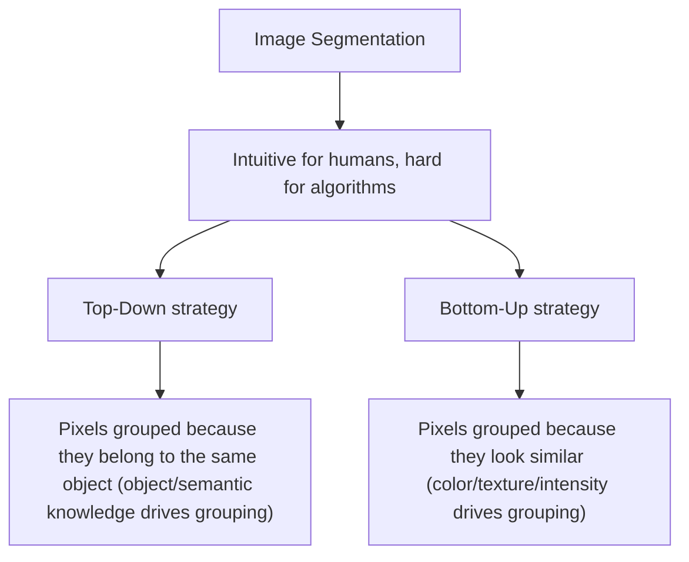
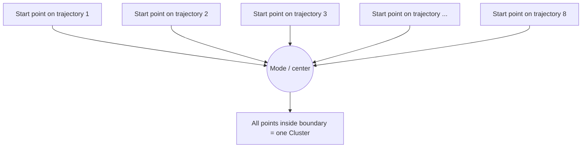

# CV Session #11: Image Segmentation — Study Notes

**Source:** CV11.pdf / CV11 Image Segmentation.pptx — Session #11, Dhruba Adhikary (Dhruba.a@wilp.bits-pilani.ac.in)
**Acknowledgement (from slides):** Slide materials adopted from EECS 442 – David Fouhey. The mean-shift figures (slides 29–41) are additionally credited "Slide by Y. Ukrainitz & B. Sarel."
**Note on source extraction:** The exported PDF interleaves text from overlapping slide elements and is unreliable to parse directly, so this document was built from the underlying PowerPoint (47 slides), extracting each slide's text boxes, tables, and embedded images directly. "Page No X" below refers to the slide number (1–47) in that original deck.

---

## Extracted Info Page No 1:
- Title: **Session #11: Image Segmentation**
- Presenter: Dhruba Adhikary (Dhruba.a@wilp.bits-pilani.ac.in)
- Acknowledgement: Slide Materials adopted from EECS 442 – David Fouhey
- Slide contains the BITS Pilani logo/wordmark ("BITS Pilani — Pilani | Dubai | Goa | Hyderabad") in the top-right corner, and a plain background image (light beige/cream diagonal-split panel) used as the title-slide decorative backdrop.
- Page number: 1

## Explained in Simple Terms Page No 1:
This is the title/cover slide for Session 11 of the Computer Vision course, covering "Image Segmentation," presented by Dhruba Adhikary. It credits EECS 442 (a computer vision course taught by Professor David Fouhey, formerly at University of Michigan) as the source of some of the slide material. It's purely administrative/introductory — no technical content to explain yet.

*(Researched Context skipped for this administrative title slide.)*

---

## Extracted Info Page No 2:
- Header: CV 11: Image Segmentation
- Section title: Image Segmentation
- Body text: "Image segmentation is a process in computer vision that involves dividing an image into multiple segments, or regions, to simplify or change the representation of an image into something more meaningful and easier to analyze. It's often used to locate objects and boundaries within images."
- Accompanying figure (image comparing four related computer-vision tasks side by side, using a cat photo and a dog/christmas-tree photo):
  - **Semantic Segmentation**: a cat silhouette filled solid yellow against a segmented background of purple (sky) and green (grass); labels shown: GRASS, CAT, TREE, SKY (each pixel labeled, no distinction between object instances) — captioned "No objects, just pixels"
  - **Classification + Localization**: photo of a kitten with a single red bounding box around it, labeled "CAT" — captioned "Single Object"
  - **Object Detection**: photo with a dog, a puppy, and a christmas ornament, each surrounded by its own colored bounding box, labeled "DOG, DOG, CAT" — captioned "Multiple Object"
  - **Instance Segmentation**: same multi-object photo but with pixel-precise colored masks (red, green, blue) over each individual dog/cat instance instead of boxes, labeled "DOG, DOG, CAT" — captioned "Multiple Object"
  - This is the well-known illustrative panel (commonly used in CS231n-style lectures) contrasting semantic segmentation, classification+localization, object detection, and instance segmentation.

## Explained in Simple Terms Page No 2:
Think of a digital photo as a giant grid of colored dots (pixels). Right now, the computer just sees a jumble of numbers — it has no idea which dots belong to "the cat" and which belong to "the grass." Image segmentation is the process of sorting those pixels into meaningful groups, like coloring a paint-by-numbers picture: every pixel that belongs to the same object or region gets grouped together, so the computer (and we) can tell "this blob of pixels is the cat," "this blob is the sky," etc.

The example image on this slide shows how segmentation is different from other related vision tasks:
- **Semantic segmentation** paints every pixel with its class color — it knows "this area is cat" but not "this is cat #1 vs cat #2."
- **Classification + localization** just draws one box around the main object and names it.
- **Object detection** draws a box around every object and labels each one, but still doesn't trace their exact outlines.
- **Instance segmentation** is the most detailed: it draws a precise, pixel-level outline around each individual object, so two dogs get two different-colored masks even though they're the same species.

In short: segmentation is about answering "which exact pixels make up this thing?" rather than just "what's in the picture" or "roughly where is it?"

## Researched Context Page No 2:
Semantic, instance, and panoptic segmentation aren't just academic distinctions — they map directly onto different production needs:

- **Self-driving cars**: Semantic segmentation labels drivable road surface, lane markings, and sidewalks, while instance segmentation individually tracks each pedestrian and vehicle so the planning system can estimate their separate positions, speeds, and trajectories. Modern autonomous-driving stacks effectively need panoptic-style output: know both the "stuff" (road, sky) and the individually-tracked "things" (each car, each pedestrian) in real time.
- **Medical imaging**: Radiologists use both semantic segmentation (labeling all tissue of a certain type in an MRI/CT slice) and instance segmentation (counting and measuring individual tumors or cells in digital pathology slides) to quantify disease.
- The image comparison used on this slide (cat/dog photos contrasted across classification, detection, semantic, and instance segmentation) closely mirrors the famous illustrative panel popularized in Stanford's CS231n deep learning course, one of the most widely reused teaching graphics for explaining the vision-task hierarchy.
- **Misconception**: People often assume "segmentation" always means "detecting objects." In fact semantic segmentation says nothing about individual object counts — it treats the image purely as a per-pixel labeling problem, which is why panoptic segmentation (Kirillov et al., 2019, Facebook AI Research) was created to unify per-pixel category labels ("stuff") with per-instance masks ("things") into one task and one metric (Panoptic Quality, PQ).

Sources:
- [Semantic vs. Instance vs. Panoptic Segmentation - PyImageSearch](https://pyimagesearch.com/2022/06/29/semantic-vs-instance-vs-panoptic-segmentation/)
- [Image segmentation: what, why & how in self-driving cars - Labellerr](https://www.labellerr.com/blog/image-segmentation-in-self-driving-cars/)
- [What is Panoptic Segmentation? Stuff vs. Things - Ultralytics](https://www.ultralytics.com/glossary/panoptic-segmentation)
- [A Beginner's Guide to Panoptic Segmentation - Lightly.ai](https://www.lightly.ai/blog/panoptic-segmentation)

---

## Extracted Info Page No 3:
- Header: CV 11: Image Segmentation
- Section title: Types
- Bullet list of segmentation types:
  - **Semantic Segmentation**: Assigns a label to every pixel in the image, meaning each pixel is classified as belonging to a specific object class (e.g., car, tree, road).
  - **Instance Segmentation**: Similar to semantic segmentation but differentiates between different instances of the same object class (e.g., multiple cars in an image).
  - **Panoptic Segmentation**: A combination of both semantic and instance segmentation, providing a comprehensive view by segmenting both object instances and the background.
  - **Thresholding**: Simplest form where pixels are classified based on a threshold value.
  - **Edge-based Segmentation**: Uses edges (sharp changes in intensity) to identify objects.
  - **Region-based Segmentation**: Groups pixels into regions based on some predefined criteria like color, intensity, or texture.

## Explained in Simple Terms Page No 3:
This slide is a menu of different flavors of segmentation, from "coarse" to "fine" and from "simple" to "sophisticated":
- **Semantic segmentation**: label every pixel by category (cat, road, sky), but don't count individual objects — like coloring a map by country without drawing borders between individual houses.
- **Instance segmentation**: like semantic segmentation, but now it also tells apart individual objects of the same type — imagine outlining every single car in a parking lot separately, even though they're all "cars."
- **Panoptic segmentation**: the "best of both worlds" — it labels the background stuff (sky, road, grass — things you can't count individually, called "stuff") AND separately outlines each countable object (cars, people — called "things").
- **Thresholding**: the simplest method — just pick a brightness cutoff; anything darker than the cutoff is "object," anything lighter is "background."
- **Edge-based segmentation**: find outlines by looking for sudden jumps in brightness/color.
- **Region-based segmentation**: start from a pixel and keep adding neighboring pixels that look similar (same color/texture) until you've grown a full region — like a paint bucket tool filling connected similar-colored areas.

## Researched Context Page No 3:
These six categories track roughly the historical evolution of segmentation techniques, from classical image-processing methods to modern learned approaches:

- **Thresholding** is the oldest and simplest method — Otsu's method (1979) is the classic algorithm for automatically picking the best threshold value by minimizing intra-class variance, still used today for quick tasks like document binarization or simple object/background separation under controlled lighting.
- **Edge-based segmentation** relies on classic edge detectors like Sobel or Canny (1986) — finding boundaries by looking for sharp intensity gradients, underlying early industrial machine-vision quality-control systems.
- **Region-based segmentation** includes region growing and the watershed algorithm, historically used in medical image analysis before deep learning became dominant.
- **Semantic, instance, and panoptic segmentation** are the modern, deep-learning-driven categories. The turning point was the Fully Convolutional Network (FCN, Long et al., 2015), followed by U-Net (2015), Mask R-CNN (2017), and panoptic FPN (2019).
- **Common misconception**: beginners often think "more advanced" (panoptic) is always "better" — but classical thresholding remains the right, cheaper, faster choice for simple, well-controlled scenarios like barcode/document scanning.
- Real-world usage spans healthcare, manufacturing quality control, autonomous vehicles, agriculture, security/surveillance, and remote sensing.

Sources:
- [Explain Image Segmentation: Techniques and Applications - GeeksforGeeks](https://www.geeksforgeeks.org/explain-image-segmentation-techniques-and-applications/)
- [Image Segmentation: Essential Guide to Key Techniques - viso.ai](https://viso.ai/deep-learning/image-segmentation-using-deep-learning/)
- [Image segmentation detailed overview - SuperAnnotate](https://www.superannotate.com/blog/image-segmentation-for-machine-learning)

---

## Extracted Info Page No 4:
- Header: CV 11: Image Segmentation
- Section title: Image Segmentation
- Sub-heading: Gestalt psychology
- Statement: "We perceive objects in its entirety before their individual parts"
- Accompanying figure: a high-contrast black-and-white speckled/textured image that at first glance looks like random black blotches scattered across a mottled ground (leaves/shadows). Embedded within the noise is a camouflaged Dalmatian dog with its head down, sniffing the ground — the classic "hidden Dalmatian" illustration used to demonstrate Gestalt figure-ground perception.

## Explained in Simple Terms Page No 4:
This slide introduces Gestalt psychology, a school of thought about how humans perceive things. The key idea quoted — "we perceive objects in its entirety before their individual parts" — means our brains are wired to instantly recognize a whole shape as a single unit, rather than first noticing every little edge or dot and then mentally assembling them.

The dog picture demonstrates this perfectly. At first it just looks like meaningless black splotches. But the moment you're told "there's a dog in there" (or you spot it yourself), your brain locks onto the whole dog shape instantly, and you can never "unsee" it again — even though no single edge or spot changed. This shows human vision isn't just bottom-up pixel-by-pixel processing; it also uses top-down knowledge and a strong drive to organize scattered fragments into a coherent whole. This is directly relevant to image segmentation because computer vision systems face the same fundamental challenge: deciding which scattered pixels belong together as "one object," something the human brain does almost instantly and unconsciously.

## Researched Context Page No 4:
The speckled dog image is a genuinely famous piece of vision-science history: it's the **"Dalmatian dog" photograph by R. C. James**, a textbook staple in perceptual psychology, cognitive science, and computer vision courses alike.

- When people view the image cold, it looks like meaningless noise. Once told "there's a Dalmatian sniffing the ground in there," most viewers suddenly and permanently perceive the dog. This "aha" flip is one of the most compelling demonstrations of **top-down processing**: prior knowledge fundamentally changes what we consciously perceive from the exact same raw visual input.
- It's a canonical illustration of **figure-ground segregation** — the perceptual act of separating an object ("figure") from its surrounding context ("ground"). Gestalt psychology (Wertheimer, Koffka, Köhler, early 20th-century Germany) is famous for the maxim "the whole is different from the sum of its parts."
- This connects directly to why image segmentation is hard for computers: a machine looking at raw pixel intensities has no built-in "aha" moment. Getting a model to group scattered, disconnected pixel patches into one coherent "dog" object is functionally the same challenge the human visual system solves almost instantly using contextual and prior knowledge.

Sources:
- [Hidden Figure – Dalmatian Dog - michaelbach.de](https://michaelbach.de/ot/cog-Dalmatian/)
- [Figure–ground (perception) - Wikipedia](https://en.wikipedia.org/wiki/Figure%E2%80%93ground_(perception))
- [A Century of Gestalt Psychology in Visual Perception II - PMC](https://pmc.ncbi.nlm.nih.gov/articles/PMC3728284/)
- [The Dalmatian by R. C. James - ResearchGate figure](https://www.researchgate.net/figure/The-Dalmatian-by-R-C-James-left-the-same-image-with-the-dog-highlighted-from-the_fig1_280328719)

---

## Extracted Info Page No 5:

- **Slide title (reconstructed from interleaved text "Gestalt: Seeing the unified wholCeV 11: Image Segmentation"):** Gestalt: Seeing the unified whole
  - (The words "CV 11: Image Segmentation" are the running footer/header text box that got extracted interleaved character-by-character with the title.)
- **Reference URL (garbled as "https://ai.stanford.edu/~syyeung/cv web/tutorial3.html"):** https://ai.stanford.edu/~syyeung/cvweb/tutorial3.html (Stanford CS tutorial on segmentation)
- **Figure on slide** (2×2 grid of black silhouette shapes on white background):
  - **A/B — "Illusory/subjective contours":** Three (panel A) or two (panel B) black "Pac-Man"-like disks with wedge cutouts arranged so the missing wedges align; the human visual system perceives a bright triangle "floating" on top with edges that don't actually exist (classic Kanizsa-style illusory contour).
  - **Panel "Occlusion":** Two black rounded/comma-shaped blobs positioned so one appears to sit behind/in front of the other, giving the impression of a single continuous object partly hidden behind another.
  - **Panel C/D — "Familiar configuration":** A ring of black spike/dart shapes arranged radially around a central gap (starburst/pinwheel), and separate curved black segments that, seen together, are recognized as fragments of a familiar shape even though disconnected.
  - Overall point: several distinct Gestalt cues (illusory contours, occlusion, familiar configuration) all cause the brain to perceive a single unified "whole" object out of separate, incomplete, or ambiguous fragments.

## Explained in Simple Terms Page No 5:

- Our brains don't see a scene as a pile of disconnected dots, edges, and blobs — we automatically group things into whole shapes and objects. This is called "Gestalt" perception (German for "shape"/"form"), and the core idea is "the whole is different from (often perceived as more than) the sum of its parts."
- In "illusory contours," you don't actually see a triangle drawn anywhere — there are just three Pac-Man shapes with wedges cut out. But your brain "connects the dots" and you see a bright triangle sitting on top, with edges that aren't really there.
- In "occlusion," two blob shapes are positioned so it looks like one continuous object is partly hidden behind another — the same way you know a person is still a whole person even though a pillar blocks part of them in a photo.
- In "familiar configuration," pieces that individually look meaningless snap into a recognizable whole once you know the pattern.
- Why this matters for computer vision: humans effortlessly do this grouping, but teaching a computer to look at pixels and decide "these belong to the same object" is genuinely hard — that's the segmentation problem this lecture is building toward.

## Researched Context Page No 5:

- The illusory-contour example (Pac-Man-like disks implying a triangle) is a variant of the **Kanizsa triangle**, first described by Italian psychologist Gaetano Kanizsa in 1955 — one of the most famous demonstrations in visual perception research: the brain "fills in" edges and even perceives the illusory triangle as appearing brighter than the background, though no such contour physically exists.
- Kanizsa figures are still used today in neuroscience and AI research to study "amodal completion" — including recent papers testing whether CNNs and vision transformers can replicate this human illusion (they mostly cannot without explicit training, revealing a gap between human and machine vision).
- The occlusion cue is the same principle self-driving car perception systems rely on: recognizing that a partially hidden object (a pedestrian behind a car) is still a single continuous entity.
- A common misconception is that these are just "optical tricks" with no practical relevance — Gestalt-inspired grouping cues (proximity, similarity, closure, continuation, common fate) directly inspired classical computer vision segmentation algorithms (region growing, graph-based grouping, normalized cuts).

Sources:
- [Gaetano Kanizsa (Wikipedia)](https://en.wikipedia.org/wiki/Gaetano_Kanizsa)
- [Kanizsa Triangle - The Illusions Index](https://www.illusionsindex.org/i/kanizsa-triangle)
- [Finding Closure: A Closer Look at the Gestalt Law of Closure in CNNs](https://arxiv.org/pdf/2408.12460)

---

## Extracted Info Page No 6:

- **Slide title (reconstructed from interleaved text "Human perception of shape recCoV 11g: Imange Seigmteintaotion n"):** Human perception of shape recognition
- **Reference URL (garbled, same as slide 5):** https://ai.stanford.edu/~syyeung/cvweb/tutorial3.html
- **Figure on slide** — the classic Gestalt grouping-laws chart, two columns:
  - **Left column (dot patterns, top to bottom):** "Not grouped" (six evenly-spaced identical dots); "Proximity" (same six dots spaced in close-far pairs); "Similarity" (1) (alternating open/filled circles); "Similarity" (2) (dots varying by shape/orientation); "Common Fate" (dots with motion-arrows in two directions); "Common Region" (dot pairs enclosed by an oval outline).
  - **Right column (line/curve patterns):** "Parallelism" (wavy parallel curves); "Symmetry" (mirror-symmetric wavy pairs); "Continuity" (crossing curved lines); "Closure" (an open, incomplete outline the eye perceptually completes).

## Explained in Simple Terms Page No 6:

- This is the "cheat sheet" of Gestalt grouping rules — the tricks your brain uses to decide "these separate marks belong together."
- **Proximity**: things close together feel like a group. **Similarity**: things that look alike feel grouped even if scattered. **Common fate**: things moving the same way feel grouped (a flock of birds veering together reads as "one flock"). **Common region**: things inside the same boundary feel grouped. **Parallelism/symmetry**: shapes sharing direction or mirroring each other feel related. **Continuity**: your eye follows a smooth path through a crossing point. **Closure**: your brain "closes the gap" on nearly-complete shapes.
- These are exactly the cues that make segmentation "easy" for humans but hard for algorithms: a computer must be explicitly told to look for proximity, similarity, motion, enclosure, symmetry, continuity, and closure — none of it is automatic.

## Researched Context Page No 6:

- This chart is a well-known, widely reproduced figure summarizing the Gestalt "laws of perceptual organization," first laid out by Max Wertheimer (1923 paper on apparent motion and grouping), developed further by Wolfgang Köhler and Kurt Koffka in the early-20th-century Gestalt psychology movement.
- These principles moved directly into computer vision: proximity/similarity motivate clustering-based segmentation (k-means on pixel color/position), common fate motivates motion-based segmentation (optical flow grouping), closure/continuity motivate contour-completion and edge-linking algorithms.
- Modern research still tests whether these principles hold up rigorously — studies find no single Gestalt law dominates; human grouping usually results from several laws acting together and sometimes competing.
- A common misconception is that these are purely "design principles" (heavily used in UI/graphic design) — they originated as, and remain, testable psychological theories, underpinning real segmentation datasets like the Berkeley Segmentation Dataset.

Sources:
- [Principles of grouping (Wikipedia)](https://en.wikipedia.org/wiki/Principles_of_grouping)
- [Gestalt principles - Scholarpedia](http://www.scholarpedia.org/article/Gestalt_principles)
- [The collaboration of grouping laws in vision - ScienceDirect](https://www.sciencedirect.com/science/article/abs/pii/S0928425712000046)

---

## Extracted Info Page No 7:

- **Header:** CV 11: Image Segmentation
- **Title:** From images to objects
- **Figure (two side-by-side images):**
  - Left: an ordinary color photograph of a tiger walking on a sandy/grassy bank next to a blue river.
  - Right: the same scene in flat, simplified colors/textures — green textured background (grass), blue wavy strip (river), dotted tan region (sand), tiger silhouette filled with a diagonal-striped/hatched pattern — a manual or algorithmic segmentation of the same photo.
- **Text box "What Defines an Object?"**
  - Subjective problem, but well-studied
  - Gestalt Laws seek to formalize this
  - Cues listed: proximity, similarity, continuation, closure, common fate
  - Attribution: see notes by Steve Joordens, U. Toronto

## Explained in Simple Terms Page No 7:

- This slide shows the actual goal of segmentation with a picture: a normal tiger photo vs. the same photo broken into "regions" — grass is one region, water another, sand another, the tiger its own region. That's "from images to objects": going from raw colored pixels to a small number of meaningful chunks.
- The natural next question: how do you even define what counts as "one object"? That turns out to be subjective — is the tiger's shadow part of the tiger? There's no single hard rule, but the Gestalt laws (proximity, similarity, continuation, closure, common fate) formalize the intuitive tricks our brain uses.
- The reference to Steve Joordens (U. Toronto psychology professor) signals this material is grounded in mainstream cognitive psychology — computer vision borrowed these ideas directly from perception science.

## Researched Context Page No 7:

- The tiger photo is a famous example from the **Berkeley Segmentation Dataset (BSDS)**, created by David Martin, Charless Fowlkes, Doron Tal, and Jitendra Malik at UC Berkeley (ICCV 2001). Researchers had many human volunteers manually segment the same photos and found substantial disagreement between people on exactly where object boundaries should go — directly illustrating that "what defines an object" is subjective even for humans.
- BSDS became a standard benchmark for decades of segmentation research, scoring algorithms by how closely their output boundaries match human-drawn ones, and helped shift research from pure bottom-up edge detection toward incorporating human perceptual/Gestalt grouping statistics.
- In modern production CV, this "from images to objects" idea underlies semantic segmentation (autonomous driving) and instance segmentation (Mask R-CNN) — direct descendants of the manual, Gestalt-inspired segmentation demonstrated in this 2001-era dataset.
- A common misconception is that "object" has one objective, universal definition in an image — the BSDS human-annotation disagreement data is often cited as proof that ground truth itself is inherently fuzzy.

Sources:
- [The Berkeley Segmentation Dataset and Benchmark](https://www2.eecs.berkeley.edu/Research/Projects/CS/vision/bsds/)
- [MartinFTM ICCV 2001 paper (PDF)](https://vision.ics.uci.edu/papers/MartinFTM_ICCV_2001/MartinFTM_ICCV_2001.pdf)
- [GitHub - BIDS/BSDS500 (Mirror of the Berkeley Segmentation Data Set)](https://github.com/BIDS/BSDS500)

---

## Extracted Info Page No 8:

- **Header:** CV 11: Image Segmentation
- **Title:** Image Segmentation
- **Text:**
  - Intuitive to us
  - Hard to translate to algorithms
  - Strategies:
    - **Top Down:** Pixels belong together because they come from the same object
    - **Bottom Up:** Pixels belong together because they look similar
- No images/tables on this slide.



## Explained in Simple Terms Page No 8:

- Segmenting an image feels effortless to a human — you glance at a photo and instantly know "that's the sky, that's the tree, that's the dog" — but writing an algorithm to do the same is genuinely difficult, because a computer only sees numbers, not "objects."
- **Top-down**: start from the idea of "objects" and work backward — like a detective who already has a suspect in mind and gathers evidence to fit that theory.
- **Bottom-up**: start from raw pixels and group them purely because they look alike — like sorting a huge pile of mixed candy purely by color, without knowing what brand each candy is.
- Most practical segmentation systems, especially modern deep-learning ones, blend both: bottom-up cues provide the raw signal, top-down knowledge resolves ambiguous cases.

## Researched Context Page No 8:

- This top-down vs. bottom-up framing reflects the two major families of pre-deep-learning segmentation algorithms: bottom-up methods (region growing, watershed, normalized cuts — Shi & Malik, 2000) group pixels using local similarity; top-down methods (Active Shape Models, Active Contours/"snakes," template-based segmentation) use prior knowledge of expected object shape.
- In modern deep learning the distinction has blurred: CNNs for semantic/instance segmentation (U-Net, Mask R-CNN, DeepLab) learn both cues jointly — low-level filters act as bottom-up similarity detectors, learned object-category knowledge acts as the top-down prior.
- A classic real-world case of pure bottom-up failing is camouflage: an animal whose texture blends into the background defeats bottom-up similarity-based segmentation, because the pixels genuinely do look similar to the background — only top-down, object-level knowledge lets a human or trained model still separate it out.
- A common misconception is that "bottom-up" segmentation is obsolete — bottom-up superpixel algorithms (like SLIC) are still widely used today as a fast preprocessing step even inside modern top-down/deep-learning pipelines.

Sources:
- [Principles of grouping (Wikipedia)](https://en.wikipedia.org/wiki/Principles_of_grouping)
- [Gestalt principles - Scholarpedia](http://www.scholarpedia.org/article/Gestalt_principles)

---

## Extracted Info Page No 9:
- Heading: "CV 11: Image Segmentation" / "Image histograms"
- Motivating question: "How many 'orange' pixels are in this image?"
- Photo shown: a tiger walking on a sandy/grassy bank near blue water — its orange-and-black-striped coat is the obvious "orange pixels" region, against green grass, tan dirt, and blue water/sky.
- "This type of question answered by looking at the histogram"
- "A histogram counts the number of occurrences of each color"
- "Given an image ... The histogram is defined to be:"

$$H_f[c] = \big|\{(x,y) \mid f[x,y] = c\}\big|$$

where $f$ is the image (mapping pixel coordinates $(x,y)$ to a color/intensity value), $c$ is a particular color/intensity value, and $H_f[c]$ is the count of pixels whose value equals $c$.

Equivalent summation form for an image with $N$ total pixels $I_1, \dots, I_N$:

$$H(v) = \sum_{i=1}^{N} \mathbb{1}[I_i = v]$$

for each possible value $v$, where $\mathbb{1}[\cdot]$ is the indicator function.

## Explained in Simple Terms Page No 9:
- Imagine sorting every pixel in the tiger photo into buckets labeled by color — one bucket for "pure orange," one for "dark green," one for "sky blue." The histogram is the final tally sheet: how many pixels ended up in each bucket.
- Answering "how many orange pixels are there?" is trivial — read off the count in the "orange" bucket instead of staring at the picture and guessing.
- Analogy: it's exactly like a teacher tallying how many students got an A, B, C, etc. on a test — the histogram of grades tells you the shape of the class's performance without needing every individual score.

## Researched Context Page No 9:
- The image histogram is one of the oldest and most universal tools in image processing — the same "tally the tonal distribution" concept used in camera exposure histograms, medical imaging (CT/MRI intensity histograms separating bone/tissue/air), and OpenCV's `cv2.calcHist`.
- A common beginner misconception: a histogram stores *how many* pixels of a color exist, not *where* they are — it discards all spatial information. Two very different-looking images can have identical histograms.
- Concrete example: histogram equalization reshapes an image's histogram to spread out intensity values and improve contrast — used routinely in medical imaging and satellite photo enhancement.

Sources:
- [What Are Image Histograms? — Baeldung on Computer Science](https://www.baeldung.com/cs/image-histograms)
- [Image Analysis - Intensity Histogram — University of Edinburgh](https://homepages.inf.ed.ac.uk/rbf/HIPR2/histgram.htm)
- [Color histogram — Wikipedia](https://en.wikipedia.org/wiki/Color_histogram)

---

## Extracted Info Page No 10:
- Heading: "CV 11: Image Segmentation" / "What do histograms look like?"
- Left image: a grayscale photo of many circular beads/spheres of varying sizes on a lighter background.
- Right image: the corresponding histogram — x-axis intensity (dark to light), y-axis pixel count. Two modes: a tall, narrow, spiky peak on the left (dark bead pixels) and a broader, lower peak toward the middle-right (lighter background pixels).
- Text box heading: "How Many Modes Are There?"
- Line: "Easy to see, hard to compute"

## Explained in Simple Terms Page No 10:
- A histogram "mode" is a hump/peak in the plot — a value many pixels share. Dark bead-pixels cluster around one intensity, lighter background-pixels around another, giving two bumps.
- "Easy to see, hard to compute": a human glancing at the plot instantly says "two humps," but an algorithm that reliably counts humps in noisy, jagged real-world histograms is surprisingly tricky — noise creates spurious tiny bumps.

## Researched Context Page No 10:
- This is the classic setup for histogram-based (bimodal) thresholding, most famously formalized as Otsu's method (1979), which automatically picks a threshold separating a two-peaked histogram into foreground and background by maximizing between-class variance.
- The bead/particle image is a very typical example in textbooks and tools like ImageJ/Fiji "particle counting" tutorials — separating dark circular particles from a lighter background via histogram valleys is common in microscopy, materials science, and quality control.
- The "easy to see, hard to compute" problem motivates mode-finding algorithms like mean-shift, valley-seeking, and Gaussian mixture model fitting — naive local-maximum detection on a noisy histogram finds far too many spurious peaks.
- Otsu's method specifically struggles when a histogram has more than two real peaks or very different class variances.

Sources:
- [Otsu's method — Wikipedia](https://en.wikipedia.org/wiki/Otsu%27s_method)
- [Understanding Otsu's Method for Image Segmentation — Baeldung](https://www.baeldung.com/cs/otsu-segmentation)
- [Otsu Thresholding with OpenCV: Theory and Code — LearnOpenCV](https://learnopencv.com/otsu-thresholding-with-opencv/)

---

## Extracted Info Page No 11:
- Heading: "Histogram-based segmentation" / "CV 11: Image Segmentation"
- "Goal": "Break the image into K regions (segments)"
- "Solve this by reducing the number of colors to K and mapping each pixel to the closest color — photoshop demo"
- Left/right images: same grayscale beads photo and bimodal histogram as slide 10.

## Explained in Simple Terms Page No 11:
- The "goal" reframes histogram peak-finding as segmentation: pick $K$ representative colors (e.g., "K=2: dark" and "light"), then repaint every pixel with whichever color it's closest to. The result: an image reduced to $K$ flat color regions.
- Conceptually the same as Photoshop's "Posterize"/"Indexed Color": collapse the full-color image to $K$ colors by finding good representatives and reassigning each pixel to its nearest match.
- Analogy: sorting a box of crayons into just $K$ bins ("reds," "greens," "blues") and re-coloring a drawing using only those crayons.

## Researched Context Page No 11:
- This is color quantization/posterization, mathematically close to k-means clustering on pixel color values: choose $K$ cluster centers minimizing distance from each pixel to its assigned center, then flat-fill each pixel with its nearest center's color.
- Photoshop's "Indexed Color" mode and GIF's 256-color palette reduction use exactly this kind of algorithm (median-cut or k-means-like) to shrink a 24-bit image to a small palette.
- A known limitation: purely color-based clustering ignores spatial location, so it can lump together disconnected regions sharing a similar color (e.g., sky seen through gaps in trees).

Sources:
- [Color histogram — Wikipedia](https://en.wikipedia.org/wiki/Color_histogram)
- [Otsu's method — Wikipedia](https://en.wikipedia.org/wiki/Otsu%27s_method)

---

## Extracted Info Page No 12:
- Heading: "Histogram-based segmentation" / "CV 11: Image Segmentation"
- "Here's what it looks like if we use two colors"
- Result image: a pure black-and-white (K=2) segmentation of the beads photo — bead silhouettes render as solid black blobs (with small bright highlight spots preserved inside larger spheres), while the background renders as a stippled/dithered mix of black and white pixels rather than a clean white, because background pixels straddling the threshold flip unpredictably.

## Explained in Simple Terms Page No 12:
- This is the payoff of "reduce to K colors" with $K=2$: every pixel becomes black or white based on which side of a chosen threshold its brightness falls on.
- The big dark spheres become clean black blobs (solidly inside the "dark" peak), but the background, though visually smooth, spans a range of values, and many pixels sit close to the dividing line — hence the "salty" speckled look.
- Analogy: drawing one line down the middle of a room — people far from the line are unambiguous, but people milling near the line get randomly split between teams even though they're really the same background crowd.

## Researched Context Page No 12:
- This "dark blobs vs. speckled background" outcome is a textbook demonstration of global thresholding (à la Otsu): works great when object/background intensities are clearly separated, but produces noisy results wherever local variation makes background pixels straddle the global threshold.
- In production pipelines (ImageJ/Fiji particle analysis, industrial bubble/droplet counting), this speckle problem is fixed with morphological opening/closing or adaptive/local thresholding.
- This "spheres on textured background" image is a commonly used sample precisely because its bimodal histogram makes an easy first example while exposing the limitation of naive binary thresholding.
- Illustrative parallel: medical image binarization hits the same speckle artifact under uneven illumination, which is why adaptive thresholding or learned segmentation (U-Net) is preferred in modern clinical pipelines.

Sources:
- [Otsu's method — Wikipedia](https://en.wikipedia.org/wiki/Otsu%27s_method)
- [Understanding Otsu's Method for Image Segmentation — Baeldung](https://www.baeldung.com/cs/otsu-segmentation)
- [Otsu Thresholding with OpenCV: Theory and Code — LearnOpenCV](https://learnopencv.com/otsu-thresholding-with-opencv/)

---

## Extracted Info Page No 13:

**Clustering**

- How to choose the representative colors? — This is a clustering problem!
- Diagram: two side-by-side 2D scatter plots, axes **R** (vertical) and **G** (horizontal) — pixel colors projected onto the Red–Green plane, each plot made of ~20 small colored dot markers representing individual pixels. This is the raw, unclustered "point cloud" of pixel colors.
- **Objective**
  - Each point should be as close as possible to a cluster center
  - Minimize sum squared distance of each point to closest center

$$\sum_{\text{clusters } i} \sum_{\text{points } p \text{ in cluster } i} \lVert p - c_i \rVert^2$$

- A small label "$c_3$" appears near one image element, hinting at a cluster-center label used in the accompanying figure.

## Explained in Simple Terms Page No 13:

Imagine every pixel in a photo as a dot on a graph, positioned by how much Red and Green it has. A photo with millions of pixels becomes a "cloud" of dots on this R-G graph. Some dots cluster together, some are spread out.

"How do we pick a few representative colors?" is just asking: "if I could only keep a handful of colors, which best summarize this whole cloud?" Clustering algorithms find a small number of "center" colors ($c_i$) such that every dot (pixel color) is as close as possible to its nearest center, measured by low squared distance in color space.

## Researched Context Page No 13:

This idea — representing a color image as a scatter of points in a color space — is the starting point for **color quantization**. It's why old GIF images could only have 256 colors: software plotted every pixel's color in 3D RGB space and clustered those points down to 256 representative colors, storing just an index per pixel instead of full 24-bit color. Modern uses include palette-extraction features in image editors and Python's `scikit-learn`/`OpenCV`, and reducing PNG file sizes for the web.

Sources:
- [Color Quantization Using K-Means Clustering (Medium)](https://medium.com/swlh/color-quantization-using-k-means-clustering-999278d0889e)
- [Colour Image Quantization using K-means (Towards Data Science)](https://towardsdatascience.com/colour-image-quantization-using-k-means-636d93887061/)

---

## Extracted Info Page No 14:

**Break it down into subproblems**

- Diagram: two clusters of small colored dots in the same R–G-plane style as slide 13, one group left, one right, each annotated with a cluster-center label ($c_3$, $c_2$), illustrating points already grouped around two distinct centers.
- Suppose I tell you the cluster centers $c_i$
  - Q: how to determine which points to associate with each $c_i$?
  - A: for each point $p$, choose closest $c_i$
- Suppose I tell you the points in each cluster
  - Q: how to determine the cluster centers?
  - A: choose $c_i$ to be the mean of all points in the cluster

## Explained in Simple Terms Page No 14:

This slide breaks the "chicken-and-egg" problem inside clustering into two easier halves:

1. **If you already know where the cluster centers are**, it's easy to decide where each point goes: measure distance to every center, assign to the closest.
2. **If you already know which points are in which pile**, it's easy to find the best center for that pile: average the positions of everything in it — the mean minimizes total squared distance to all points in the group.

The catch: in real life you know neither the centers nor the groupings — only the raw cloud of dots. K-means (next slide) solves this by guessing one side first, then alternating between these two easy steps until things stop changing.

## Researched Context Page No 14:

This "chicken-and-egg" framing is a textbook description of an **alternating optimization** (block coordinate descent) — a general strategy used far beyond clustering. The same idea appears in Expectation-Maximization (guess the model, assign responsibilities, re-estimate, repeat), in ICP (Iterative Closest Point) for 3D point-cloud alignment, and in matrix factorization for recommender systems. Recognizing "if I knew A, solving B would be easy, and vice versa" is one of the most reusable problem-solving patterns in computer vision and machine learning.

Sources:
- [Lloyd's algorithm (Wikipedia)](https://en.wikipedia.org/wiki/Lloyd%27s_algorithm)
- [Expectation–maximization algorithm overview](https://en.wikipedia.org/wiki/Expectation%E2%80%93maximization_algorithm)

---

## Extracted Info Page No 15:

**K-means clustering**

**K-means clustering algorithm**

```
1. Randomly initialize the cluster centers, c1, ..., cK
2. Given cluster centers, determine points in each cluster
     For each point p, find the closest ci. Put p into cluster i
3. Given points in each cluster, solve for ci
     Set ci to be the mean of points in cluster i
4. If ci have changed, repeat Step 2
```

Demo: https://ai.stanford.edu/~syyeung/cvweb/tutorial3.html

**Properties**
- Will always converge to some solution
- Can be a "local minimum" — does not always find the global minimum of the objective function:

$$\sum_{\text{clusters } i} \sum_{\text{points } p \text{ in cluster } i} \lVert p - c_i \rVert^2$$

## Explained in Simple Terms Page No 15:

K-means is the alternating trick from the last slide, run in a loop:

1. **Start randomly**: throw down $K$ pile-centers ($c_1 \ldots c_K$) anywhere.
2. **Assign**: every point joins whichever center it's closest to.
3. **Update**: recompute each center as the average of its assigned points.
4. **Repeat** steps 2–3 until the centers stop moving.

Think of sorting a bag of M&Ms into color piles: guess where 3 pile-centers sit, sort every candy into its nearest pile, slide each center to the true average position of the candies now in it, re-sort — repeat until nobody switches piles.

It always converges to *some* stable answer, but because the starting guess was random, it might settle into an okay-but-not-perfect grouping — a "local minimum" — rather than the global best. Different random starts can give different final answers, which is why K-means is often run several times and the best (lowest total squared distance) result is kept.

## Researched Context Page No 15:

K-means (technically "Lloyd's algorithm") is one of the oldest and most widely used algorithms in data science. Stuart Lloyd proposed it at Bell Labs in 1957 for pulse-code modulation (published 1982); the "k-means" name comes from James MacQueen's 1967 paper. The convergence guarantee is real — the algorithm never increases the total squared-distance objective on any step — but it is only guaranteed to reach a local minimum. A classic misconception is that K-means "finds the true number of clusters" — $K$ must be chosen in advance (e.g., elbow method, silhouette score), and a poor $K$ or unlucky initialization (mitigated by K-means++ in practice) can produce noticeably different clusterings. In vision, K-means underlies color quantization, image segmentation, visual bag-of-words codebooks, and initialization for Gaussian Mixture Models.

Sources:
- [Lloyd's algorithm (Wikipedia)](https://en.wikipedia.org/wiki/Lloyd%27s_algorithm)
- [K-Means Clustering history (Medium)](https://darrsheni-sapovadia26.medium.com/k-means-clustering-96711652a0e9)
- [Stanford CV tutorial demo referenced on the slide](https://ai.stanford.edu/~syyeung/cvweb/tutorial3.html)

---

## Extracted Info Page No 16:

*(No title or text on this slide — it consists of a single embedded full-slide image.)*

- Full-slide figure: a 2D scatter plot, x- and y-axes both ranging from 0 to 1 (gridded plot area). Roughly 30–35 small open ("O") circle markers scattered across the plot, each drawn in a distinct color (blues, greens, reds, magentas, yellows, cyans, oranges), no two adjacent points obviously sharing a color, no visible cluster-center markers, lines, or legend.
- Circles spread fairly evenly/randomly across the unit square; the color of each marker appears to be the distinguishing feature illustrated, not its (x, y) position.

## Explained in Simple Terms Page No 16:

Following directly from the K-means algorithm on the previous slide, this picture is best read as a **before-clustering snapshot** of data: a scatter of points in a 2D feature space (e.g., R and G pixel values, normalized to 0–1), where each point is drawn in a different color just to make individual points easy to tell apart — not necessarily to show finished cluster assignments. It's the same idea as slide 13's tiny colored-dot scatter, redrawn as a single, larger, standalone plot: a cloud of points in feature space that K-means will process by picking $K$ centers and grouping nearby points together.

## Researched Context Page No 16:

Plots like this — points on a unit-square axis rendered as open, distinctly colored circles — are a very common way MATLAB, Python (matplotlib/seaborn), and R generate simple synthetic 2D datasets for teaching clustering, since normalized/toy coordinates make it easy to demonstrate K-means mechanics without real image data. Countless K-means tutorials use near-identical scatter plots as the "here is our raw unclustered data" starting frame, immediately followed by a second frame showing the same points recolored by cluster membership with center markers overlaid — a classic "before/after K-means" teaching pair.

Sources:
- [K-Means Clustering in OpenCV and Application for Color Quantization](https://machinelearningmastery.com/k-means-clustering-in-opencv-and-application-for-color-quantization/)
- [Stanford CV K-means demo](https://ai.stanford.edu/~syyeung/cvweb/tutorial3.html)

---

## Extracted Info Page No 17:

- **Title:** CV 11: Image Segmentation
- **Heading:** K means clustering
- **Diagram:** A four-panel illustration of the K-means loop:
  1. **"Initialize Cluster Centers"** — grey square points (unlabeled data) plus three colored circles (red, green, blue) as initial centers.
  2. **"Assign Points to Clusters"** — the plane partitioned into three regions by straight decision boundaries; each grey square recolored to match its region.
  3. **"Re-compute Means"** — mean position of points per color recalculated; faded circles show old centers, solid circles the new (moved) centers, with lines to assigned points.
  4. **"Repeat (2) and (3)"** — assignment re-run with updated centers, producing new decision boundaries and a new partition.

## Explained in Simple Terms Page No 17:

A picture-strip recap of K-means, like sorting a mixed bag of marbles into three baskets:

1. **Pick 3 random spots** and call them "basket centers" (red, green, blue).
2. **Assign**: every marble goes to the nearest basket center.
3. **Re-center**: each basket moves to the average position of its marbles.
4. **Repeat**: with new basket positions, some marbles switch, so reassign and re-center again.

The straight lines dividing colored regions are "boundaries of ownership." This is a hard, all-or-nothing assignment — never "70% red, 30% blue" — which motivates the probabilistic approach on the next slide.

## Researched Context Page No 17:

K-means (Lloyd's algorithm, 1957/1982) remains a default baseline in image segmentation, color quantization, document clustering, and initialization for Gaussian Mixture Models. In computer vision it's classically used for color-based segmentation, vector quantization/codebook learning ("visual words"), and superpixel-adjacent preprocessing. A well-known limitation shown by this exact figure style (mirroring Andrew Ng's CS229 notes and scikit-learn's documentation gallery) is that K-means always produces convex, linearly-separated (Voronoi) regions and hard boundaries — it cannot represent elongated, overlapping, or differently-shaped/sized clusters, which is exactly why the deck pivots next to probabilistic clustering / Mixture-of-Gaussians.

Sources:
- [K-means clustering (Wikipedia)](https://en.wikipedia.org/wiki/K-means_clustering)
- [scikit-learn K-means docs](https://scikit-learn.org/stable/modules/clustering.html#k-means)
- [OpenCV K-Means tutorial](https://docs.opencv.org/4.x/d1/d5c/tutorial_py_kmeans_opencv.html)

---

## Extracted Info Page No 18:

- **Title:** CV 11: Image Segmentation
- **Heading:** Probabilistic clustering

**Basic questions**
- what's the probability that a point x is in cluster m?
- what's the shape of each cluster?
- K-means doesn't answer these questions

**Basic idea**
- instead of treating the data as a bunch of points, assume that they are all generated by sampling a continuous function
- This function is called a **generative model**
  - defined by a vector of parameters θ

## Explained in Simple Terms Page No 18:

K-means gives a yes/no answer ("this pixel belongs to cluster 2"), but two questions remain unanswered:

1. **"How confident are we?"** — a point in the middle of cluster 2 vs. sitting right on the border with cluster 3. K-means can't express "60% cluster 2, 40% cluster 3."
2. **"What does each cluster actually look like?"** — a tight round blob, or a long stretched-out tilted ellipse? K-means implicitly assumes every cluster is a same-sized circular blob.

The fix: instead of "here are scattered dots I need to group," think "these dots were *generated* by some underlying random process" — a **generative model**, whose dial settings are collectively called **θ** (theta). Once you assume a machine generates the data, you can ask precise probability questions — the foundation for Mixture of Gaussians and EM.

## Researched Context Page No 18:

This slide marks the classic transition from *discriminative/heuristic* clustering (K-means) to *generative probabilistic modeling*. Generative models underpin far more than clustering:
- **Speech recognition** historically relied on Gaussian Mixture Models combined with Hidden Markov Models before deep neural networks took over around 2012.
- **Background subtraction in video surveillance** uses a per-pixel GMM (Stauffer & Grimson, 1999), shipped today as `cv2.createBackgroundSubtractorMOG2`.
- **Anomaly/fraud detection** systems fit a generative model to "normal" behavior and flag low-probability points.

A common misconception is that "generative" means "used only to generate new synthetic samples" (as with GANs); classically, "generative model" means any model of the full data distribution $P(x|\theta)$, usable for both clustering and classification via Bayes' rule.

Sources:
- [Generative model (Wikipedia)](https://en.wikipedia.org/wiki/Generative_model)
- [Mixture model (Wikipedia)](https://en.wikipedia.org/wiki/Mixture_model)
- [OpenCV background subtraction tutorial](https://docs.opencv.org/4.x/d1/dc5/tutorial_background_subtraction.html)

---

## Extracted Info Page No 19:

- **Title:** CV 11: Image Segmentation
- **Heading:** Mixture of Gaussians

- One generative model is a mixture of Gaussians (MOG)
- K Gaussian blobs with means $\mu_b$, covariance matrices $V_b$, dimension $d$
- blob $b$ is selected with probability (mixing coefficient) $\alpha_b$
- the likelihood of observing $x$ is a weighted mixture of Gaussians

$$
P(x \mid \mu_b, V_b) = \frac{1}{\sqrt{(2\pi)^d |V_b|}} \, e^{-\frac{1}{2}(x - \mu_b)^T V_b^{-1} (x - \mu_b)}
$$

**Overall mixture likelihood:**

$$
P(x \mid \theta) = \sum_{b=1}^{K} \alpha_b \, P(x \mid \mu_b, V_b), \qquad \sum_{b=1}^{K} \alpha_b = 1
$$

This matches the standard MOG/GMM density $p(x) = \sum_{m=1}^{M} \pi_m \, \mathcal{N}(x; \mu_m, \Sigma_m)$, with $\alpha_b \leftrightarrow \pi_m$, $\mu_b \leftrightarrow \mu_m$, $V_b \leftrightarrow \Sigma_m$.

**Diagram:** a thin, elongated, tilted ellipse ("blob") — the iso-probability contour of one Gaussian component, shape/orientation determined by its covariance matrix $V_b$.

**E-step Bayes-rule ownership (previewed here, detailed on slide 21):**

$$P(b \mid x_i, \mu_b, V_b) = \frac{\alpha_b P(x_i \mid \mu_b, V_b)}{\sum_{k=1}^{K} \alpha_k P(x_i \mid \mu_k, V_k)}$$

Full parameter vector: $\theta = [\mu_1,\ldots,\mu_K, V_1,\ldots,V_K, \alpha_1,\ldots,\alpha_K]$.

## Explained in Simple Terms Page No 19:

Imagine each cluster is a fuzzy, glowing blob of ink — dense at the center, fading toward the edges, possibly smeared into an elongated oval. A **Mixture of Gaussians (MOG)** says: "the dataset was made by picking one of K such blobs at random (some more likely — that's $\alpha_b$), then dropping a point somewhere inside it, more likely near its center ($\mu_b$), with a spread/tilt given by $V_b$."

- $\mu_b$: where is this blob centered?
- $V_b$ (covariance): how fat, stretched, and in which direction does it lean?
- $\alpha_b$: how popular is this blob overall?

The overall probability of seeing a point $x$ anywhere is a *weighted blend* of how bright each blob is at that spot. This blend of overlapping fuzzy blobs answers the two questions K-means couldn't: overlap regions naturally get non-trivial probability under both blobs (soft assignment), and each blob's shape is explicit (elongated, round, tilted).

## Researched Context Page No 19:

The Gaussian Mixture Model (GMM) is one of the most heavily used probabilistic models in signal processing, speech, and vision:
- **Speech recognition**: GMM-HMM systems were the industry standard for acoustic modeling for decades before deep learning.
- **Background subtraction (MOG2)**: Stauffer & Grimson's 1999 algorithm models each pixel's color history as a mixture of Gaussians, shipped as `cv2.createBackgroundSubtractorMOG2()`.
- **Color/texture segmentation**: interactive tools like GrabCut model each region's pixel colors with a small GMM (typically 5 components) in RGB space.
- **Speaker verification**: GMM supervectors / universal background models predate deep embeddings for voice biometrics.

A classic textbook illustration (Bishop's PRML, the "Old Faithful geyser" dataset) shows exactly the tilted-ellipse blob depicted here. A common misconception is that GMM/EM always finds the global best fit — like K-means, it converges to a local optimum and is sensitive to initialization (often seeded from K-means output).

Sources:
- [Mixture model — Gaussian mixture model section (Wikipedia)](https://en.wikipedia.org/wiki/Mixture_model#Gaussian_mixture_model)
- [OpenCV background subtraction tutorial](https://docs.opencv.org/4.x/d1/dc5/tutorial_background_subtraction.html)
- [OpenCV GrabCut tutorial](https://docs.opencv.org/4.x/d8/d83/tutorial_py_grabcut.html)
- [Gaussian Mixture Models recitation notes (CMU)](https://www.cs.cmu.edu/~epxing/Class/10701-08s/recitation/gaussian-mixture.pdf)

---

## Extracted Info Page No 20:

- **Heading:** Expectation maximization (EM) — CV 11: Image Segmentation

**Goal**: find blob parameters θ that maximize the likelihood function:

$$
P(\text{data} \mid \theta) = \prod_{x} P(x \mid \theta)
$$

i.e., total data likelihood is the product of individual-point likelihoods over all points $x$, under the mixture-of-Gaussians parameters $\theta$.

**Approach:**
- **E step**: given current guess of blobs, compute ownership of each point
- **M step**: given ownership probabilities, update blobs to maximize likelihood function
- repeat until convergence

## Explained in Simple Terms Page No 20:

Now that data is described as a mix of fuzzy blobs, the natural question: what blob settings (θ) make the observed data as likely as possible? The likelihood formula multiplies together "how likely was this point under our current settings" for every point, and tries to make that product as large as possible.

The problem: we don't know in advance which blob generated which point — a chicken-and-egg problem. **Expectation-Maximization (EM)** breaks the deadlock:

- **E step ("guess who owns what")**: freeze blob parameters, calculate each point's probability of belonging to each blob (soft ownership, e.g. "70% blob A, 30% blob B").
- **M step ("update the blobs to fit their owners")**: freeze ownership probabilities, re-estimate each blob's center, shape, popularity as a weighted average.
- **Repeat**: each round is guaranteed to make the overall likelihood no worse, until parameters converge.

It's the probabilistic, soft-assignment cousin of the K-means loop: "assign soft probability → recompute weighted mean/shape/popularity → repeat" instead of "assign hard label → recompute mean → repeat."

## Researched Context Page No 20:

The EM algorithm was formalized in the seminal 1977 paper by Dempster, Laird, and Rubin ("Maximum Likelihood from Incomplete Data via the EM Algorithm," JRSS). Its core insight — alternating between inferring hidden variables (E-step) and re-optimizing parameters (M-step) — generalizes far beyond Gaussian mixtures:
- **Speech recognition (Baum-Welch)**: a special case of EM used to train Hidden Markov Models.
- **Motion segmentation**: Wang & Adelson's 1994 "layered representation for motion analysis" uses EM to segment video into moving layers while estimating each layer's motion.
- **Missing data imputation**: EM's original 1977 motivating use case.
- **GrabCut**: uses EM-like iterative re-estimation of GMM color models for foreground/background.

A common misconception is that EM always finds the global maximum of the likelihood — the guarantee is only monotonically non-decreasing log-likelihood, converging to a local maximum, which is why EM is typically run multiple times or initialized from K-means.

Sources:
- [Expectation–maximization algorithm (Wikipedia)](https://en.wikipedia.org/wiki/Expectation%E2%80%93maximization_algorithm)
- [Dempster, Laird, Rubin 1977 original EM paper (JSTOR)](https://www.jstor.org/stable/2984875)
- [OpenCV GrabCut tutorial](https://docs.opencv.org/4.x/d8/d83/tutorial_py_grabcut.html)
- [EM algorithm notes (Bishop, via Berkeley)](https://people.eecs.berkeley.edu/~malik/cs294/EM-algorithm-Bishop.pdf)

---

## Extracted Info Page No 21:

- Heading: "EM details"
- **E-step**
  - "compute probability that point x is in blob i, given current guess of θ"

$$P(b \mid x, \mu_b, V_b) = \frac{\alpha_b\, P(x \mid \mu_b, V_b)}{\sum_{i=1}^{K} \alpha_i\, P(x \mid \mu_i, V_i)}$$

  - Sub-label: "covariance of blob b"

$$V_b^{new} = \frac{\sum_{i=1}^{N} (x_i - \mu_b^{new})(x_i - \mu_b^{new})^{T}\, P(b \mid x_i, \mu_b, V_b)}{\sum_{i=1}^{N} P(b \mid x_i, \mu_b, V_b)}$$

- **M-step**
  - "compute probability that blob b is selected"
  - "N data points"
  - "mean of blob b"
  - *(Gap-fill note: the mean-update and mixing-weight formula images were not recovered in extraction; reconstructed here as the standard GMM-EM forms, consistent with the labels given.)*

$$\mu_b^{new} = \frac{\sum_{i=1}^{N} x_i\, P(b \mid x_i, \mu_b, V_b)}{\sum_{i=1}^{N} P(b \mid x_i, \mu_b, V_b)} \qquad \alpha_b^{new} = \frac{1}{N}\sum_{i=1}^{N} P(b \mid x_i, \mu_b, V_b)$$

## Explained in Simple Terms Page No 21:

- EM is "guess-then-refine": you don't know which point came from which blob, so you alternate between two steps until things stop changing.
- **E-step**: for every point, ask "given my current guess of each blob's shape and popularity, how likely does this point belong to blob $b$ vs. every other blob?" — a soft, fractional *responsibility* (e.g. point $x_i$ might be 70% blob 1, 30% blob 2), unlike k-means's hard yes/no.
- **M-step**: re-fit each blob's parameters using those weights — new mean is a weighted average of all points, new covariance measures spread around the new mean, new mixing weight is what fraction of total responsibility belongs to blob $b$.
- Repeat E then M like tightening a knot by pulling first one side, then the other, until snug (converged).

## Researched Context Page No 21:

- The EM algorithm was formalized by Dempster, Laird, and Rubin (1977, JRSS), though special cases existed earlier (e.g., H.O. Hartley, 1958); the 1977 paper generalized the idea and proved a convergence result for a broad class of "incomplete data" problems.
- These formulas are the textbook EM update for a GMM, mathematically identical (up to notation) to the standard derivation in Bishop's *Pattern Recognition and Machine Learning* and Forsyth & Ponce's *Computer Vision*.
- A common misconception is that EM finds the globally best clustering — each run only guarantees non-decreasing log-likelihood and converges to a local maximum (or saddle point).
- Concrete example: color-based image segmentation fits a GMM over pixel colors (RGB), each component representing one color cluster (sky, grass, skin); the E-step softly assigns each pixel, the M-step updates each cluster's mean color and covariance, iterating until segments stabilize.

Sources:
- [Expectation–maximization algorithm — Wikipedia](https://en.wikipedia.org/wiki/Expectation%E2%80%93maximization_algorithm)
- [Data Mining Algorithms In R/Clustering/Expectation Maximization (EM) — Wikibooks](https://en.wikibooks.org/wiki/Data_Mining_Algorithms_In_R/Clustering/Expectation_Maximization_(EM))

---

## Extracted Info Page No 22:

- Heading: "EM demos"
- Link: https://github.com/annoviko/pyclustering

## Explained in Simple Terms Page No 22:

- The slide points students to a practical demo resource: the `pyclustering` open-source library, where they can run actual EM-based clustering code and watch the "guess-then-refine" process converge on real or synthetic 2D data, rather than only seeing static formulas.

## Researched Context Page No 22:

- `pyclustering` (by Andrei Novikov, GitHub user `annoviko`) is a Python/C++ data-mining library offering many clustering algorithms — k-means, k-medoids, CLARANS, DBSCAN, OPTICS, CURE, BIRCH, self-organizing maps, and an EM-based Gaussian Mixture Model clusterer in `pyclustering.cluster.ema`. It ships a C++ backend (CCORE) for performance, with a pure-Python fallback.
- Its EM/GMM implementation follows the same E-step/M-step structure covered on slide 21: initialize means/covariances/weights (often via k-means++-style seeding), alternate soft-assignment (E) and weighted re-estimation (M), and visualize the resulting Gaussian ellipses over the data.

Sources:
- [GitHub - annoviko/pyclustering](https://github.com/annoviko/pyclustering)
- [PyClustering documentation](https://pyclustering.github.io/)

---

## Extracted Info Page No 23:

- Heading: "Applications of EM"
- "Turns out this is useful for all sorts of problems"
  - any clustering problem
  - any model estimation problem
  - missing data problems
  - finding outliers
  - segmentation problems
    - segmentation based on color
    - segmentation based on motion
  - foreground/background separation
  - ...

## Explained in Simple Terms Page No 23:

- EM isn't just for clustering colored blobs — it's a general recipe for any situation where you're missing some piece of information and need to estimate model parameters anyway: guess the missing piece (E-step), refit the model (M-step), repeat.
- Examples: **Clustering** ("which group is this point in?"); **Model estimation** (fit any statistical model with hidden variables); **Missing data** (fill in blanks in a dataset consistently with the rest of the model); **Outlier finding** (points that consistently get very low probability under every component); **Color segmentation** (which color cluster does each pixel belong to?); **Motion segmentation** (which moving pattern does each pixel/trajectory belong to?); **Foreground/background separation** (moving foreground vs. static background, pixel by pixel).

## Researched Context Page No 23:

- EM's generality comes from its formulation as maximum-likelihood estimation with latent variables — anywhere a problem is "observed data + hidden variables + a probabilistic model," EM applies. This underlies GMM clustering, HMM training (Baum-Welch, historically important in speech recognition), missing-data imputation, and item-response/latent-class models in psychometrics.
- EM-based background subtraction (Stauffer & Grimson, 1999) is a textbook foreground/background separation application matching this slide's bullet list directly.
- Motion segmentation via EM was explored in Wang & Adelson's 1994 "Representing Moving Images with Layers" — each layer is a mixture component whose motion parameters are refit in the M-step.
- Concrete example: a photo-editing "magic wand"/background-blur feature can be implemented by fitting a two-component GMM (foreground person vs. background) over color+position features, using EM to iteratively refine the mask.

Sources:
- [Expectation–maximization algorithm — Wikipedia](https://en.wikipedia.org/wiki/Expectation%E2%80%93maximization_algorithm)
- [Data Mining Algorithms In R/Clustering/Expectation Maximization (EM) — Wikibooks](https://en.wikibooks.org/wiki/Data_Mining_Algorithms_In_R/Clustering/Expectation_Maximization_(EM))

---

## Extracted Info Page No 24:

- Heading: "Problems with EM"
- "Local minima"
- "Need to know number of segments"
- "Need to choose generative model"

## Explained in Simple Terms Page No 24:

- **Local minima**: EM always improves (or keeps the same) fit at each step, but can get stuck in a fit that's good compared to nearby alternatives yet not the best overall — like hiking downhill into a valley that isn't the lowest on the whole range. The starting guess strongly affects the outcome, so practitioners run EM several times and keep the best result.
- **Need to know the number of segments**: you must tell EM in advance how many blobs (K) to look for — too few merges distinct groups, too many splits one true group or creates degenerate components. Choosing K usually requires BIC/AIC or domain knowledge.
- **Need to choose a generative model**: EM assumes a specific shape for each blob (e.g., Gaussian/elliptical). If real clusters aren't shaped like that, even a perfect EM fit misrepresents the data.

## Researched Context Page No 24:

- The local-minima problem is well-documented and frequently misunderstood: EM guarantees monotonic non-decrease of log-likelihood and convergence to a stationary point, not the global maximum. Standard mitigations: multiple random restarts, smart initialization (k-means/k-means++ seeding), deterministic-annealing EM, split-and-merge EM.
- Choosing K is a classic model-selection problem; common tools are BIC, AIC, and non-parametric alternatives like Dirichlet Process Mixture Models.
- The "choose a generative model" limitation is why non-parametric segmentation methods (mean-shift, spectral clustering, graph cuts) became popular — they don't require assuming a specific parametric shape, at the cost of losing EM's clean probabilistic interpretation.
- Concrete example: fitting a 2-component GMM to two interleaving "moon"-shaped clusters fails badly no matter how EM is initialized, because ellipses cannot represent crescent shapes — the standard textbook counterexample motivating non-Gaussian clustering methods.

Sources:
- [Expectation–maximization algorithm — Wikipedia](https://en.wikipedia.org/wiki/Expectation%E2%80%93maximization_algorithm)
- [Data Mining Algorithms In R/Clustering/Expectation Maximization (EM) — Wikibooks](https://en.wikibooks.org/wiki/Data_Mining_Algorithms_In_R/Clustering/Expectation_Maximization_(EM))

---

## Extracted Info Page No 25:
- Heading: "Mean-shift for image segmentation"
- Bullets:
  - Useful to take into account spatial information
  - instead of (R, G, B), run in (R, G, B, x, y) space
  - D. Comaniciu, P. Meer, "Mean shift analysis and applications," 7th International Conference on Computer Vision, Kerkyra, Greece, September 1999, 1197-1203.
- Two side-by-side pictures: a color-segmented house photo (flat, posterized regions of brick wall, lawn/trees, sky/windows) and the same scene as a black-and-white edge/boundary line drawing.
- Text: "More Examples:" — link to Rutgers CAIP examples page.

## Explained in Simple Terms Page No 25:
- Ordinary color clustering (k-means on RGB) ignores where a pixel sits in the image, so two unrelated red objects far apart could get merged into "the same cluster." Mean-shift fixes this by treating each pixel as a point in 5-D space: three color coordinates plus two spatial coordinates (x, y) — pixels only cluster together if close in color AND close in the image.
- Analogy: sorting candy by color alone throws all red candies in one bin regardless of location; sorting by color-and-location also requires the candies to have come from the same tray.
- The two example images show the smoothed/segmented output (flat colors) and the traced boundaries — a visual check that segmentation lines up with real object edges.

## Researched Context Page No 25:
- This slide references Comaniciu and Meer's 1999 ICCV paper, which first proposed folding spatial (x, y) coordinates in with color/range features (a "joint domain") so mean-shift could be used directly for image segmentation.
- The house image is a classic benchmark reused in Comaniciu & Meer's papers to demonstrate how joint spatial-range mean-shift filtering produces flat, homogeneous regions while preserving edges — a precursor to superpixel and edge-preserving smoothing techniques.
- This joint-domain idea underlies "edge-preserving smoothing" filters (similar to bilateral filtering) and is the conceptual ancestor of modern superpixel algorithms (e.g., SLIC).
- Misconception to flag: mean-shift segmentation is not a fixed-k method like k-means — the number of segments emerges naturally from how many density modes exist in the joint feature space.

Sources:
- [Mean shift analysis and applications (Comaniciu & Meer, 1999 PDF)](http://www.caip.rutgers.edu/riul/research/papers/pdf/spatmsft.pdf)
- [More segmentation examples — Comaniciu/Meer](http://www.caip.rutgers.edu/~comanici/segm_images.html)

---

## Extracted Info Page No 26:
- Heading: "Mean shift segmentation"
- Text: "Versatile technique for clustering-based segmentation"
- Citation: D. Comaniciu and P. Meer, "Mean Shift: A Robust Approach toward Feature Space Analysis," PAMI 2002.
- Picture: two side-by-side outdoor lake/landscape photos, "Segmented 'landscape 1'" and "Segmented 'landscape 2'," each with thick white contour outlines marking boundaries mean-shift found between regions.

## Explained in Simple Terms Page No 26:
- "Versatile" means mean-shift isn't a one-trick algorithm — the same core idea (climb uphill on a density surface until you reach a peak) reuses for segmenting images, tracking objects in video, edge-preserving smoothing, and general clustering.
- The two lake photos demo the output: the algorithm grouped pixels by color (and position) into "the water," "the trees," "the shore," then drew a white outline wherever one group ends and another begins.
- Segmentation isn't perfect — some outlines follow real edges, others cut through fairly uniform regions, reflecting how noisy real photographic density modes can be.

## Researched Context Page No 26:
- D. Comaniciu and P. Meer, "Mean Shift: A Robust Approach Toward Feature Space Analysis," IEEE PAMI 2002, is the single most-cited mean-shift paper (tens of thousands of citations), rigorously proving convergence properties and demonstrating discontinuity-preserving smoothing and segmentation.
- Mean shift traces back to Fukunaga and Hostetler (1975), a general non-parametric mode-seeking method; Cheng (1995) generalized and popularized it further before Comaniciu and Meer's 2002 paper made it a standard vision tool.
- Production usage: OpenCV ships `cv2.meanShift` (object tracking within a search window) and `cv2.CamShift` (adds automatic scale/orientation adjustment) — used for face/hand tracking, video surveillance, gesture interaction.
- Misconception: mean-shift segmentation does not require specifying the number of clusters up front, unlike k-means.

Sources:
- [OpenCV Meanshift tutorial](https://docs.opencv.org/4.13.0/d7/d00/tutorial_meanshift.html)

---

## Extracted Info Page No 27:
- Heading: "Mean shift algorithm"
- Text: "Try to find modes of this non-parametric density"
- Pictures:
  - A 3D surface/relief plot, axes "NORMALIZED DENSITY" (z), "L*" and "u*" (CIE L*u*v* color space) — a bumpy terrain colored blue-to-yellow-to-red by height, with black branching trajectories climbing the slopes toward red dot markers at local peaks/modes.
  - A 3D scatter plot, axes "L*", "u*", "v*" showing thousands of small black data points (pixel colors of some image in L*u*v* space) forming clusters of varying density — the raw data whose density the other plot visualizes.

## Explained in Simple Terms Page No 27:
- "Non-parametric density" means we don't assume the data follows a known formula (like a Gaussian) — we estimate the density shape directly from the data.
- "Modes" are the peaks (local maxima) of that density — where data points are most crowded. Mean-shift is a "hill climbing" hike: drop a marker at a data point, repeatedly nudge it uphill toward denser neighboring points, until it can't climb any higher — that's a mode; markers at the same peak get grouped into the same cluster.
- The scatter plot (raw color points) is the town map of houses; the surface plot is the terrain of "how crowded is each neighborhood," and the branching paths show many climbers converging onto the same few hilltops (red dots), which become the cluster centers/segment colors.

## Researched Context Page No 27:
- The L*u*v* (CIELUV) color space is often preferred over raw RGB for mean-shift segmentation because Euclidean distances in L*u*v* better approximate human-perceived color differences — a deliberate design choice in Comaniciu & Meer's original mean-shift segmentation work.
- This mode-seeking view is the same math used in tracking: in `cv2.meanShift`, the "density" is a color histogram back-projection over an image region, and the algorithm iteratively shifts a tracking window toward the centroid (mode) of that histogram.
- A common misconception is that mean-shift always finds the single global mode; with real, multi-modal data it finds many local modes, one per basin of attraction — precisely what allows it to produce multiple segments.

Sources:
- [OpenCV Meanshift tutorial](https://docs.opencv.org/4.13.0/d7/d00/tutorial_meanshift.html)
- [Mean Shift Clustering lecture notes (Derpanis)](http://www.cse.yorku.ca/~kosta/CompVis_Notes/mean_shift.pdf)

---

## Extracted Info Page No 28:
- Heading: "Kernel density estimation"
- Text labels: "Kernel density estimation function" and "Gaussian kernel"

$$\hat{f}_h(x) = \frac{1}{nh}\sum_{i=1}^{n} K\left(\frac{x-x_i}{h}\right)$$

Gaussian kernel:

$$K\left(\frac{x-x_i}{h}\right) = \frac{1}{\sqrt{2\pi}}\, e^{-\frac{(x-x_i)^2}{2h^2}}$$

This is the special case ($d=1$) of the general multivariate KDE $\hat{f}(x) = \frac{1}{nh^d}\sum_{i=1}^n K\left(\frac{x-x_i}{h}\right)$.

## Explained in Simple Terms Page No 28:
- Kernel density estimation (KDE) guesses the "shape" of a probability distribution just by looking at a pile of sample points, without assuming it's a neat bell curve.
- The trick: put a small "bump" (kernel, often a mini Gaussian) centered on every data point, then add up all the bumps. Where points are close together, bumps overlap and stack into a tall pile — a high-density region.
- Analogy: each data point is a tiny sprinkler spraying a soft puddle around itself; pour all the sprinklers at once — puddles overlap where sprinklers were close together, forming deep pools (density modes).
- Bandwidth $h$ controls bump width: small $h$ gives narrow, spiky (overfit/noisy) bumps; large $h$ gives wide, smooth bumps that can blur separate peaks together. Choosing $h$ well is a key practical decision in KDE and mean-shift.

## Researched Context Page No 28:
- KDE was formalized by Rosenblatt (1956) and Parzen (1962) — still often called the "Parzen window" method — the non-parametric density tool Fukunaga and Hostetler (1975) built mean-shift on top of.
- The mean-shift vector is proportional to the gradient of the KDE estimate, which is exactly why mean-shift reliably climbs toward modes: it performs gradient ascent on a KDE surface.
- Bandwidth selection is a classic bias-variance tradeoff: too small overfits (every point becomes its own tiny spike), too large oversmooths (distinct clusters merge) — a staple example in every intro statistics/ML course.
- Real-world use beyond vision: KDE with Gaussian kernels underlies density plots (violin plots, seaborn's `kdeplot`), heatmaps from GPS pings, and anomaly detection.

Sources:
- [Mean Shift Clustering lecture notes (Derpanis)](http://www.cse.yorku.ca/~kosta/CompVis_Notes/mean_shift.pdf)
- [Kernel density estimation (Wikipedia)](https://en.wikipedia.org/wiki/Kernel_density_estimation)

---

## Extracted Info Page No 29 (covering slides 29–32, animation build):

- Slide title/placeholder text (identical on all four slides): "Mean shift"
- Footer/attribution (identical on all four slides): "Slide by Y. Ukrainitz & B. Sarel"
- Three annotation labels on every slide in this range: "Region of interest", "Center of mass", "Mean Shift vector"
- No equation is spelled out in the extracted text of these four slides. The standard mean shift vector equation (gap-filled from the standard Comaniciu & Meer / Fukunaga & Hostetler formulation) is:

$$m(x) = \frac{\sum_{i} x_i \, K(x_i - x)}{\sum_{i} K(x_i - x)} - x$$

where $x$ is the current center of the search window, $x_i$ are data points inside the window, $K(\cdot)$ is a kernel weighting function, the fraction term is the weighted centroid ("center of mass") of the points in the window, and $m(x)$ is the mean shift vector — the displacement from the window's current center to that centroid.

- Diagram (reconstructed from the underlying picture-shape geometry, since no single flattened image exists — each slide is composed of roughly 90 identical small red/maroon dot-shaped pictures plus two larger "highlight" dot-shapes and a cyan ring shape for the search window):
  - A static, irregular scatter of ~85 small dark-red dots fills the slide — data points in a 2-D feature space. Their coordinates are byte-for-byte identical across slides 29, 30, 31, and 32 — the underlying data never moves; only the search window and its vector move.
  - A large circle ("Region of interest") overlays part of the scatter — the search window/kernel support.
  - Two enlarged marker-dots sit inside the circle: the current window center, and the "Center of mass" (centroid) of the points captured by the window.
  - An arrow ("Mean Shift vector") connects the window center to the center of mass, showing the direction/magnitude the window should move next.
  - **Animation-build progression:** Slides 29 and 30 are geometrically identical (highlight markers at the same position, mid-left of the scatter) — slide 30 is a build-reveal duplicate of 29. Slides 31 and 32 are likewise identical to each other, but the highlight-marker pair has shifted roughly 0.6–0.75 inch right/down relative to 29/30 — consistent with the search window re-centering at the tip of the previous mean-shift vector, i.e., one iteration of the algorithm. Net effect: slides 29-30 show iteration step 1 (initial window placement and its vector), slides 31-32 show iteration step 2 (window re-centered at the prior center of mass, with a new vector pointing further toward the mode).
- *Note: Slides 29-32 are an animation-build sequence of one figure; merged here, continued in slides 33-35 below.*

## Explained in Simple Terms Page No 29 (covering slides 29–32, animation build):

Imagine scattering dots randomly on a table, some areas more crowded than others. Drop a circular hoop ("region of interest") somewhere on the table. Look only at the dots caught inside the hoop and compute their average position — their "center of mass." That average is usually pulled toward wherever dots are more clustered. The arrow from the hoop's center to that average — the "mean shift vector" — points toward the crowd.

The rule: slide the hoop so its center lands exactly on that average position, then repeat — recompute which dots are inside, find the new average, get a new (usually shorter) arrow, slide again. Slides 29→30 are one repeated snapshot of a step; 31→32 show the hoop having moved to the tip of the earlier arrow. Keep hopping and the hoop eventually settles on the densest cluster and the arrow shrinks to zero — that resting point is a "mode." This is how mean shift finds clusters or tracks objects without ever needing to be told how many clusters exist.

## Researched Context Page No 29 (covering slides 29–32, animation build):

- **Origin of the mean shift vector**: introduced by Fukunaga and Hostetler in "The Estimation of the Gradient of a Density Function, with Applications in Pattern Recognition" (IEEE Trans. Information Theory, 21(1), 1975). They showed the vector from a kernel window's center to the local weighted mean of samples inside it is proportional to the gradient of the estimated density, so repeatedly shifting toward that mean is gradient ascent on the density surface.
- **Revival and formalization**: dormant until Yizong Cheng's 1995 paper generalized it with different kernels; Comaniciu & Meer's 2002 PAMI paper proved convergence properties and popularized it for computer vision — the likely origin of the "Region of interest / Center of mass / Mean Shift vector" teaching diagram (credited to Y. Ukrainitz & B. Sarel) reused across many CV course decks.
- **Production usage — object tracking**: OpenCV implements this directly as `cv2.meanShift()`, where a target's color histogram is back-projected onto each new video frame and the search window is iteratively shifted to the mode of that back-projected density — the "region of interest chases the center of mass" animation applied frame-by-frame. `cv2.CamShift()` extends this by adapting the window's size and orientation between frames.
- **Classic textbook treatment**: covered in Szeliski's *Computer Vision: Algorithms and Applications* and Forsyth & Ponce's *Computer Vision: A Modern Approach* in the context of clustering-based segmentation.

Sources:
- [Fukunaga & Hostetler 1975 — Springer chapter reprint](https://link.springer.com/chapter/10.1007/978-3-662-44845-8_2)
- [Mean Shift Clustering lecture notes (Derpanis)](http://www.cse.yorku.ca/~kosta/CompVis_Notes/mean_shift.pdf)
- [OpenCV: Meanshift and Camshift tutorial](https://docs.opencv.org/3.4.20/d7/d00/tutorial_meanshift.html)
- [Track objects with Camshift using OpenCV — GeeksforGeeks](https://www.geeksforgeeks.org/python/track-objects-with-camshift-using-opencv/)
- [Mean Shift and Cam Shift Object Tracking — Towards Data Science](https://towardsdatascience.com/mean-shift-and-cam-shift-object-tracking-f1c2c515b6bc/)

---

## Extracted Info Page No 33 (slides 33–35, continuation/conclusion of the animation build started at slide 29):

- Continues the animation build from slides 29-32; slides 33-35 show the final convergence steps.
- Slides 33 and 34 repeat the same local view used in the preceding steps: a small cluster of data points, a circular "Region of interest" drawn around the "Center of mass" of the points it currently encloses, and a "Mean Shift vector" arrow — now very short, the window having moved almost exactly onto the local point cluster.
- Slide 35 pulls back to the full data set (roughly 40 point-markers instead of ~7-10), still showing "Region of interest" centered on "Center of mass" — but the "Mean Shift vector" label/arrow is no longer present.
- The disappearance of the vector at slide 35 is the visual cue for convergence: once the window's center coincides with the center of mass of the points inside it, the shift vector's magnitude is ~0, and the algorithm stops. The zoomed-out view recaps the whole point cloud to show the window settled on a genuine density mode of the overall distribution.
- Attribution footer on all three slides: "Slide by Y. Ukrainitz & B. Sarel."

## Explained in Simple Terms Page No 33 (slides 33–35):
Think of the search window as a net repeatedly re-centered on the "center of gravity" of the points caught inside it, drawing an arrow each time showing how far the net just moved. In slides 33-34 that arrow is already tiny — the net has almost reached the crowd it was chasing. By slide 35 the arrow is gone entirely: the net stopped moving because it is centered exactly on the densest clump of points. That "stop moving" moment is convergence, and the settled point is a mode. The animation's punchline: the procedure runs until the shift becomes negligible, not for an arbitrary fixed number of steps.

## Researched Context Page No 33 (slides 33–35):
Standard practice is to stop iterating once the shift vector's magnitude falls below a small threshold, $\lVert m(\mathbf{x}) \rVert < \epsilon$ (or after a max iteration cap) — exactly the "vector shrinks to nothing" behavior the animation dramatizes.

Sources:
- [Comaniciu & Meer, "Mean Shift: A Robust Approach Toward Feature Space Analysis" (PAMI 2002)](https://ieeexplore.ieee.org/document/1000236)

---

## Extracted Info Page No 36:
- Slide title/header: "Computing the Mean Shift" / "Simple Mean Shift procedure:"

```
Simple Mean Shift procedure:
1. Compute mean shift vector
2. Translate the Kernel window by m(x)
```

$$
m(\mathbf{x}) = \left[ \frac{\displaystyle\sum_{i=1}^{n} \mathbf{x}_i \, g\!\left(\left\lVert \frac{\mathbf{x}-\mathbf{x}_i}{h} \right\rVert^{2}\right)}{\displaystyle\sum_{i=1}^{n} g\!\left(\left\lVert \frac{\mathbf{x}-\mathbf{x}_i}{h}\right\rVert^{2}\right)} \right] - \mathbf{x}
$$

where the weighting function is defined as:

$$
g(\mathbf{x}) = -k'(\mathbf{x})
$$

i.e., $g$ is the negative derivative of the kernel profile $k$ — the "derivative kernel" used to weight neighboring points in the formula above.

- Diagram: a cluster of scattered data points (same style as slides 29-35) with a circular kernel/search window over part of the cluster, illustrating the window whose translation is governed by $m(\mathbf{x})$.
- Footer: "Slide by Y. Ukrainitz & B. Sarel."

## Explained in Simple Terms Page No 36:
Mean shift boils down to two repeated steps: (1) at the window's current position $\mathbf{x}$, compute the mean shift vector $m(\mathbf{x})$ — "where is the weighted average of nearby points, relative to where I am now"; (2) move the window by that vector. Inside $m(\mathbf{x})$: every data point $\mathbf{x}_i$ within reach is weighted by $g(\cdot)$, giving more weight to points close to $\mathbf{x}$ (within bandwidth $h$) and less/no weight to far ones — $g$ derives from the kernel's shape ($g = -k'$). Repeating steps 1-2 makes the window climb the local density surface until it yields (almost) no shift — the convergence point discussed for slides 33-35.

## Researched Context Page No 36:
- In practice this two-line procedure is implemented with a Gaussian or Epanechnikov kernel for $g$, and libraries expose it directly: OpenCV's `cv2.meanShift` (single-window tracking) and `cv2.pyrMeanShiftFiltering` (image segmentation/smoothing), and scikit-learn's `sklearn.cluster.MeanShift` (full clustering by running the procedure from many seed points and merging windows converging to the same mode).
- Bandwidth $h$ is the most consequential hyperparameter; scikit-learn provides `sklearn.cluster.estimate_bandwidth` (a nearest-neighbor/quantile heuristic) for a reasonable default.
- Common misconception: mean-shift is "slow because it's O(n²) per iteration" if implemented naively — true for the textbook version, but practical implementations reduce this with spatial indexing (KD-trees/ball-trees), truncated kernel support, and coarse-binning acceleration; OpenCV's single-window tracking use case is cheap for real-time tracking regardless.

Sources:
- [OpenCV mean-shift tracking tutorial](https://docs.opencv.org/4.x/d7/d00/tutorial_meanshift.html)
- [scikit-learn MeanShift docs](https://scikit-learn.org/stable/modules/generated/sklearn.cluster.MeanShift.html)
- [Comaniciu & Meer PAMI 2002](https://ieeexplore.ieee.org/document/1000236)

---

## Extracted Info Page No 37:

- Heading: **Real Modality Analysis**
- The slide has no bullet text — a single composite figure built from dozens of small overlapping picture objects (~80 tiny copies of the same yellow/orange dot image) layered on a larger picture object.
- Rendered composite: a scatter of yellow/orange dots in 2-D feature space, with **two blue circular outlines** enclosing two dense groupings of dots — two discovered "modes" (density peaks) with their attraction basins/clusters drawn as circles.

## Explained in Simple Terms Page No 37:

Earlier slides likely showed mean-shift mode-finding on neat, synthetic data. This slide asks: what happens with *real* data instead? Real data is messier. Even so, scattering dozens of dots onto a plane and running mean-shift, the points still naturally cluster into two identifiable "clumps," and the blue circles mark them. Analogy: a field with two ant colonies — ants wander somewhat randomly, but watch long enough and you notice they mostly stay near one of two nests; circling "who belongs to which nest" is exactly the attraction-basin idea.

## Researched Context Page No 37:

- This is part of the classic mean-shift teaching sequence (Comaniciu & Meer, popularized by Y. Ukrainitz & B. Sarel) reused across many computer-vision courses.
- In real applications, mean-shift typically runs on pixel colors transformed into a perceptually uniform color space like **L\*u\*v\*** (or L\*a\*b\*), because Euclidean distance there better matches human-perceived color difference. A canonical example: mean-shift segmentation of a Berkeley Segmentation Dataset (BSDS) photo, treating the 5-D joint spatial-range vector (x, y, L\*, u\*, v\*) per pixel as a data point.
- Production usage: `pyrMeanShiftFiltering` (OpenCV) or scikit-learn's `MeanShift` for superpixel/region grouping in medical image segmentation and object tracking.
- Misconception: mean-shift does not require specifying the number of clusters up front — the number of modes emerges from the density landscape and bandwidth.

Sources:
- [Image Segmentation Using Mean Shift Clustering — GeeksforGeeks](https://www.geeksforgeeks.org/image-segmentation-using-mean-shift-clustering/)
- [An Implementation of the Mean Shift Algorithm (IPOL)](https://www.ipol.im/pub/art/2019/255/article_lr.pdf)
- [Histological image segmentation using fast mean shift clustering method](https://biomedical-engineering-online.biomedcentral.com/articles/10.1186/s12938-015-0020-x)
- [Mean shift — Wikipedia](https://en.wikipedia.org/wiki/Mean_shift)

---

## Extracted Info Page No 38:

- Heading: **Attraction basin**
- Body text: "Attraction basin: the region for which all trajectories lead to the same mode"; "Cluster: all data points in the attraction basin of a mode"
- Credit: "Slide by Y. Ukrainitz & B. Sarel"
- Figure: two side-by-side, near-identical hand-drawn "flower/pinwheel" diagrams, each enclosed by an irregular rounded boundary (one dark blue, one light blue). Inside each, ~8 curved black lines ("trajectories") radiate outward from a common central point.



- The two side-by-side diagrams likely represent two adjacent attraction basins (two different modes) — two neighboring clusters in feature space.

## Explained in Simple Terms Page No 38:

**Attraction basin** = the "watershed" region of a density landscape: every raindrop landing anywhere inside a river's watershed eventually flows into the same river mouth, and every data point starting a mean-shift "walk" anywhere inside this region eventually climbs (in density) to the same peak (mode). The curved lines are the paths individual points take as mean-shift nudges them toward higher density; no matter where a point starts inside the boundary, its path bends inward and ends at the same central point. **Cluster** = "all points whose trajectories end at the same mode" — mean-shift lets the *data's own density* decide cluster boundaries.

## Researched Context Page No 38:

- This exact figure and definition traces back to widely circulated CV course slides credited to Y. Ukrainitz and B. Sarel (built on Comaniciu & Meer's PAMI 2002 work), reused verbatim across many university CV courses.
- "Basin of attraction" is much older terminology from dynamical systems/optimization theory: in gradient ascent/descent, the basin of attraction of a local optimum is the set of starting points from which iteration converges to it. Mean-shift is literally adaptive gradient ascent on a KDE, so its "attraction basin" directly applies this classical concept.
- Misconception to flag: attraction basins are not the same as Voronoi cells around modes — because the density landscape can be irregularly shaped, basin boundaries can be non-convex and asymmetric, exactly as the irregular hand-drawn boundaries in the figure suggest.

Sources:
- [Mean shift — Wikipedia](https://en.wikipedia.org/wiki/Mean_shift)
- [PPT: Algorithms & Applications in Computer Vision (SlideServe)](https://www.slideserve.com/baba/algorithms-applications-in-computer-vision-powerpoint-ppt-presentation)
- [Lecture: k-means & mean-shift clustering (SlidePlayer)](https://slideplayer.com/slide/14096982/)
- [Grouping and Segmentation, Computer Vision CS 543](https://slidetodoc.com/031715-grouping-and-segmentation-computer-vision-cs-543/)

---

## Extracted Info Page No 39:

- Heading (continuation of the previous slide's topic): **Attraction basin**
- Single large figure: a dense cloud/blob of tiny red points/strokes, roughly circular-to-irregular, concentrated toward the center and thinning at the edges — thousands of short red trajectory segments overlapping so densely they blur into a red "cloud."
- *Merge decision: not merged with slide 38* — it introduces a visually distinct figure (dense trajectory cloud vs. clean schematic), so it gets its own breakdown while noted as a direct visual continuation of slide 38's concept.

## Explained in Simple Terms Page No 39:

Where slide 38 showed a clean schematic of a handful of trajectories converging to one point, this slide shows what it looks like plotting **thousands** of real trajectories at once — individual paths blur into a dense red cloud. Analogy: slide 38 is a diagram of 8 streams flowing into a lake; slide 39 is a satellite photo of an actual watershed during a rainstorm — you can't trace each stream, but you clearly see the overall shape of convergence. The takeaway is the same: all trajectories funnel toward the same central mode.

## Researched Context Page No 39:

- This dense scatter/trajectory visualization is standard in mean-shift papers to empirically show the "basin of attraction" concept holds with real numbers of points, not just illustrative arrows (e.g., Cheng's 1995 "Mean Shift, Mode Seeking, and Clustering").
- Visualizing trajectories this densely also exposes a known limitation: near the boundary between two basins, trajectories can be very sensitive to small perturbations — a point just on one side of a density "ridge" goes to mode A, a point a tiny distance away goes to mode B — visible as fuzziness at the edges of the red cloud rather than a crisp boundary.
- Concrete illustrative parallel: analogous to "flow field" visualizations in fluid dynamics or gradient-descent loss-landscape visualizations in deep learning, where many starting points' optimization trajectories are all plotted together.

Sources:
- [Mean shift — Wikipedia](https://en.wikipedia.org/wiki/Mean_shift)
- [An Implementation of the Mean Shift Algorithm (IPOL)](https://www.ipol.im/pub/art/2019/255/article_lr.pdf)
- [The functional mean-shift algorithm for mode hunting and clustering (arXiv)](https://arxiv.org/pdf/1408.1187)

---

## Extracted Info Page No 40:

- Heading: **Finding Modes in a Histogram**
- Sub-heading/body: "How Many Modes Are There?" / "Easy to see, hard to compute"
- Figure: a 1-D histogram (bar chart), x-axis roughly −4 to 8, y-axis (frequency count) 0 to 12. Roughly bimodal-to-trimodal shape: taller bars around x≈0–1 (peak ~11), dip around x≈1.5–2 (~3), rise around x≈3–4 (peak ~10), tapering toward x≈5–6. An asterisk (*) marker sits above the bar near x≈0; a plus (+) marker above the bar near x≈1.5. Two vertical solid lines near x≈2.7–3 mark a boundary/threshold region between two mode groupings.

## Explained in Simple Terms Page No 40:

"How many modes are there?" asks: how many separate "bumps" do you count? A human eye glances and says "looks like 2 (or 3)" instantly — "easy to see." The "hard to compute" part: turning eyeballing into a precise automatic algorithm is tricky — how wide must a group be to count as a separate bump vs. noise? The * / + markers and two vertical lines represent competing candidate ways an algorithm might try to identify/separate modes. Analogy: a skyline of hills from a distance — instantly countable by eye, but writing a program to reliably count hills for any skyline (accounting for noise, ridges connecting peaks) is a genuinely hard problem — exactly the motivation for principled algorithms like mean-shift.

## Researched Context Page No 40:

- This slide encapsulates the core motivation for KDE and mode-seeking algorithms like mean-shift: histograms are a crude, bin-size-dependent density estimate, and the apparent number of modes changes dramatically with bin width.
- A well-known related result: for a Gaussian KDE, the number of modes is provably non-increasing as bandwidth increases — why bandwidth choice is the single most important tuning parameter in mean-shift and KDE-based mode finding.
- Concrete illustrative example: performance-monitoring engineers use similar "frequency trail"/histogram visualizations to spot multiple modes in latency distributions (e.g., a fast-cache-hit mode and a slow-cache-miss mode) — visually obvious once plotted, but automatic detection needs the same density-based mode-finding techniques.

Sources:
- [Mean shift — Wikipedia](https://en.wikipedia.org/wiki/Mean_shift)
- [Frequency Trails: Modes and Modality (Brendan Gregg)](https://www.brendangregg.com/FrequencyTrails/modes.html)
- [How to Find the Mode of a Histogram (With Example) — Statology](https://www.statology.org/histogram-mode/)
- [Unsupervised Learning Series: Exploring the Mean-Shift Algorithm (Medium)](https://medium.com/data-science/unsupervised-learning-series-exploring-mean-shift-algorithm-2be0adc6354c)

---

## Extracted Info Page No 41:

**Mean Shift [Comaniciu & Meer]** — Iterative Mode Search

- Initialize random seed, and window $W$
- Calculate center of gravity (the "mean") of $W$:

$$m(x) = \frac{\sum_{x_i \in W} x_i \, H(x_i)}{\sum_{x_i \in W} H(x_i)}$$

- Translate the search window to the mean
- Repeat Step 2 until convergence

- **Diagram**: a 1-D histogram of point density (x-axis −4 to 8, counts 0–12), multi-modal (bumps around −1, 0–1, 3–4), with an asterisk (*) near x≈0 and a plus (+) near x≈1.5 representing two different window/seed starting positions during the iterative search — illustrating a window centered at different starting points moving toward its nearest density peak.

## Explained in Simple Terms Page No 41:

Imagine standing in a crowd, wanting to find where it's thickest near you. Look around within arm's reach (your "window"), find the average position of everyone near you, and step toward that average. Repeat — look, find the new local average, step — each step moves you further "uphill" into denser territory, until you stop moving because the local average is exactly where you're standing — a peak (mode). That's mean shift: place a window on a data point, compute the weighted "center of gravity" of points inside it, slide the window there, repeat. No matter where the two starting marks (* and +) begin, they drift toward the nearest hill.

## Researched Context Page No 41:

Mean shift's mode-seeking behavior comes from Comaniciu and Meer's 2002 IEEE PAMI paper, which proved the recursive procedure converges to the nearest stationary point (mode) of the density estimated via KDE, tracing back to Fukunaga and Hostetler (1975). A classic misconception: mean shift is not a "clustering algorithm" in the K-means sense (no need to specify K ahead of time) — it discovers the number of clusters automatically, each detected mode becoming a cluster center. It's also the theoretical basis of the CAMShift object-tracking algorithm used in early OpenCV face/object trackers.

Sources:
- [Comaniciu & Meer "Mean shift analysis and applications" (PDF)](https://comaniciu.net/Papers/MsAnalysis.pdf)
- [Mean Shift: A Robust Approach Toward Feature Space Analysis — Semantic Scholar](https://www.semanticscholar.org/paper/Mean-Shift:-A-Robust-Approach-Toward-Feature-Space-Comaniciu-Meer/74f4ecc3e4e5b91fbb54330b285ed5214afe2001)
- [An Implementation of the Mean Shift Algorithm (IPOL)](https://www.ipol.im/pub/art/2019/255/article_lr.pdf)

---

## Extracted Info Page No 42:

**Mean-Shift Approach**

- Initialize a window around each point
- See where it shifts — this determines which segment it's in
- Multiple points will shift to the same segment

- **Diagram**: titled "Multimodal Distributions," sub-bullets: parallel processing of an initial tessellation; pruning of mode candidates; classification based on the basin of attraction. Two side-by-side 3-D surface plots (a bumpy density surface, axes ~"L*"/"u*"/"v*", "normalized density" vertical): left plot shows red dots (original sample points, un-clustered); right plot shows the same surface with green trajectory lines connecting red dots and converging toward peaks — captioned "Mean shift trajectories."

## Explained in Simple Terms Page No 42:

Think of the image's colors/features plotted as a bumpy landscape — taller peaks mean more pixels share that color. Mean shift drops a tiny "ball" at every data point and lets it roll uphill, step by step, following the local average direction, until it settles at the nearest hill's top (a mode). Because nearby points roll uphill toward the same peak, they end up clustered together, and that shared peak becomes their segment. The green squiggly lines show dozens of starting points (red dots) tracing paths that converge onto just a few peaks.

## Researched Context Page No 42:

- The "basin of attraction" idea is the crux of mean-shift's popularity for edge-preserving smoothing and segmentation: unlike K-means, the number of modes found in the data determines the number of segments. Comaniciu and Meer's 2002 paper applied mean shift to the joint spatial-color feature space of an image: each pixel becomes a 5-D point (x, y, L, u, v).
- "Parallel processing of an initial tessellation" and "pruning of mode candidates" refer to practical speedups: divide the space into small cells (tessellation), run one representative mean-shift per cell, then merge/prune nearby mode candidates that are extremely close — exactly how the EDISON system (the reference C++ implementation) speeds up mean-shift to be practical on full-resolution photographs.

Sources:
- [Comaniciu & Meer "Mean shift analysis and applications" (PDF)](https://comaniciu.net/Papers/MsAnalysis.pdf)
- [Cornell CS4670 segmentation lecture slides](https://www.cs.cornell.edu/courses/cs4670/2013fa/lectures/lec30_segmentation.pdf)

---

## Extracted Info Page No 43:

**Mean shift clustering** — "The mean shift algorithm seeks modes of the given set of points"

```
1. Choose kernel and bandwidth
2. For each point:
   a. Center a window on that point
   b. Compute the mean of the data in the search window
   c. Center the search window at the new mean location
   d. Repeat (b, c) until convergence
3. Assign points that lead to nearby modes to the same cluster
```

## Explained in Simple Terms Page No 43:

The full recipe for mean-shift clustering: (1) decide the shape of your neighborhood-averaging rule (kernel, e.g., Gaussian) and how wide it is (bandwidth — a small bandwidth finds many small clusters, a large one merges everything into fewer, bigger clusters); (2) for every point, do the "roll uphill" dance — window on it, find local average, move there, repeat until it stops (that's the point's "mode"); (3) group together points whose journeys ended at essentially the same hill-top — no need to pre-specify how many clusters exist. Like releasing many marbles on a hilly surface and letting each roll to the nearest peak — marbles ending on the same peak belong to the same group.

## Researched Context Page No 43:

This numbered procedure is the canonical statement of Comaniciu & Meer's mean-shift clustering algorithm (2002, PAMI), widely taught in this same form (e.g., Cornell CS4670). It underlies image segmentation (pixels as points in joint color+spatial space), object tracking (CAMShift, built into OpenCV), and general-purpose clustering (scikit-learn's `MeanShift`). Key practical caveat: bandwidth choice is critical — too small yields near-singleton clusters (over-segmentation), too large yields one giant blob (under-segmentation), analogous to choosing K in K-means but as a continuous scale parameter. Naive mean shift is $O(n^2)$ per iteration, which is why practical implementations (EDISON) use spatial data structures (k-d trees) and tessellation/pruning tricks to scale.

Sources:
- [Comaniciu & Meer "Mean shift analysis and applications" (PDF)](https://comaniciu.net/Papers/MsAnalysis.pdf)
- [scikit-learn MeanShift docs](https://scikit-learn.org/stable/modules/generated/sklearn.cluster.MeanShift.html)
- [An Implementation of the Mean Shift Algorithm (IPOL)](https://www.ipol.im/pub/art/2019/255/article_lr.pdf)

---

## Extracted Info Page No 44:

**Mean shift segmentation results**

- Link: http://www.caip.rutgers.edu/~comanici/MSPAMI/msPamiResults.html
- **Diagrams**: a 2×2 grid of photographic before/after image pairs demonstrating mean-shift segmentation on real photographs. The extracted sample shows a mountain range scene: **original** — a rugged, jagged mountain ridge with snow patches, dark rocky foreground, hazy sky; **segmented/smoothed** — the fine texture and gradient shading replaced by flattened regions of nearly uniform color (posterized look), while major structural boundaries (ridge lines, snow-patch outlines, sky-mountain boundary) are preserved.

## Explained in Simple Terms Page No 44:

Real "before and after" examples from Comaniciu and Meer's own results webpage. Run mean-shift segmentation on a mountain photo and the output looks like a simplified, "cartoon-like" version: instead of smooth gradual shading, large blocks of nearly-solid color appear, but the mountain/snow outlines stay crisp and correctly positioned. This happens because mean shift is applied per-pixel in color+position space and each pixel "rolls" to the nearest density peak — pixels in a similar-colored, similar-located neighborhood roll to the same peak and get painted the same flattened color, while pixels straddling a real object boundary belong to two different "hills" and stay separated — this edge-preserving smoothing is mean-shift's signature property.

## Researched Context Page No 44:

The referenced webpage is the original results/demo gallery accompanying Comaniciu and Meer's 2002 PAMI paper, hosted at Rutgers' CAIP lab, widely cited in computer vision courses worldwide (e.g., Cornell's CS4670/5670) for its dramatic, intuitive before/after pairs, generated with the EDISON (Edge Detection and Image SegmentatiON) system software also released by the group. This "discontinuity-preserving smoothing" is functionally similar to (and often compared against) bilateral filtering and anisotropic diffusion, but mean shift additionally yields a genuine segmentation because points converging to the same mode are explicitly grouped into the same region label. Mean-shift segmentation was historically used as a pre-processing/superpixel step before more complex pipelines (e.g., graph-cut refinement) before being largely superseded by learned (deep-network) segmentation methods in recent years, though it remains a standard non-learned baseline.

Sources:
- [Mean shift segmentation results gallery — Rutgers CAIP](http://www.caip.rutgers.edu/~comanici/MSPAMI/msPamiResults.html)
- [Comaniciu & Meer "Mean shift analysis and applications" (PDF)](https://comaniciu.net/Papers/MsAnalysis.pdf)
- [Cornell CS4670 segmentation lecture slides](https://www.cs.cornell.edu/courses/cs4670/2013fa/lectures/lec30_segmentation.pdf)

---

## Extracted Info Page No 45:
- Heading: "CV 11: Image Segmentation"
- Link (same as slide 44): http://www.caip.rutgers.edu/~comanici/MSPAMI/msPamiResults.html
- This slide is a **continuation of slide 44** — the identical link and presenter title, no new text content, just the next set of example images from the same online results gallery (additional before/after segmentation panels).

## Explained in Simple Terms Page No 45:
Think of slides 44 and 45 as two pages of the same photo album — slide 44 explained how the "before/after" mean-shift pictures were made; slide 45 just turns the page to show more examples from that same gallery. No new concept — purely more visual proof that mean-shift segmentation works well across different kinds of images.

## Researched Context Page No 45:
The Comaniciu-Meer results page has historically served as a benchmark gallery cited by countless computer vision papers and courses to visually demonstrate mean shift's edge-preserving-while-smoothing property — a property later compared against superpixel methods (SLIC, watershed) and, more recently, learned segmentation (Mask R-CNN, U-Net, Segment Anything). No additional research needed beyond slide 44's sources, since this slide directly continues the same topic.

---

## Extracted Info Page No 46:
- Heading: "CV 11: Image Segmentation"
- Section title: **Mean-shift: other issues**
- Sub-heading: **Speedups**
  - Binned estimation
  - Fast search of neighbors
  - Update each window in each iteration (faster convergence)
- Sub-heading: **Other tricks**
  - Use kNN to determine window sizes adaptively
- Note: "Lots of theoretical support" — citation: D. Comaniciu and P. Meer, *Mean Shift: A Robust Approach toward Feature Space Analysis*, PAMI 2002.

## Explained in Simple Terms Page No 46:
Mean shift can be slow because, for every point, it must look around at many neighbors repeatedly until it "shifts" to a density peak. Practical speedup tricks:
- **Binned estimation**: group nearby points into bins (a coarse grid/histogram) and estimate density from the bins instead of exact distances for every pixel.
- **Fast search of neighbors**: use smarter data structures (KD-trees) to quickly find nearby points instead of comparing against every other point — like using an alphabetical index instead of a phone book page by page.
- **Update each window per iteration**: update many windows together as the algorithm iterates, converging to the final modes faster.
- **Adaptive window size via kNN**: use the k nearest neighbors of each point to decide a locally-appropriate window size, helping in regions where data density varies.
- The final line reassures this isn't a hack — years of statistical theory (density estimation, gradient ascent) back why mean shift works.

## Researched Context Page No 46:
- Naive mean shift has time complexity roughly $O(Tn^2)$ ($n$ points, $T$ iterations), because each point's neighborhood search compares against all other points — the central practical bottleneck for large images.
- **Binned/spatial discretization** has been shown to speed up Gaussian mean-shift image segmentation by one to two orders of magnitude while producing nearly identical segmentations.
- **KD-trees** are the standard "fast neighbor search" solution — scikit-learn's `MeanShift` implementation uses KD-trees/ball-trees to accelerate O(n²) neighbor lookups.
- Modern successors go further: **MeanShift++** (CVPR 2021) alternates between grid-based mode-finding and merging cluster assignments, reporting speedups of over 10,000x versus classic mean shift with competitive clustering quality; a later α-MeanShift++ variant runs another 4–7x faster while improving segmentation quality.
- GPU-accelerated mean-shift variants (e.g., for microscopy cell segmentation/tracking) apply the same speedup philosophy for parallel execution.

Sources:
- [Spatial discretization to accelerate Gaussian MeanShift image segmentation](https://www.researchgate.net/publication/286846411_Fast_mean-shift_algorithm_for_image_segmentation)
- [Efficient Mean-shift Clustering Using Gaussian KD-Tree](https://www.researchgate.net/publication/220507000_Efficient_Mean-shift_Clustering_Using_Gaussian_KD-Tree)
- [MeanShift++: Extremely Fast Mode-Seeking With Applications to Segmentation and Object Tracking (arXiv)](https://arxiv.org/pdf/2104.00303)
- [Faster Mean-shift: GPU-accelerated clustering for cosine embedding-based cell segmentation and tracking](https://arxiv.org/pdf/2007.14283)
- [TD 4 - Mean-shift clustering and image segmentation (KD-tree walkthrough)](https://www.enseignement.polytechnique.fr/informatique/INF556/TD1/kd_tree/index.html)

---

## Extracted Info Page No 47:
- Heading: "CV 11: Image Segmentation"
- Section title: **Mean shift pros and cons**

| Pros | Cons |
|---|---|
| Good general-practice segmentation | Have to choose kernel size (bandwidth) in advance |
| Flexible in number and shape of regions | Not suitable for high-dimensional features |
| Robust to outliers | |

- **When to use it:**
  - Oversegmentation
  - Multiple segmentations
  - Tracking, clustering, filtering applications

## Explained in Simple Terms Page No 47:
This final slide is the "report card" for mean shift.
- **Pros**: it's a solid, general-purpose tool that works reasonably well on most everyday images without much algorithmic tuning; it doesn't force you to pre-decide "how many segments" or "what shape" (unlike K-means, which needs a fixed K and blob-like clusters) — it naturally finds however many density-peak modes exist and follows arbitrarily shaped regions; a few weird/noisy pixels don't throw off the result, because mean shift is based on where the data is *dense*, not on averages outliers can skew.
- **Cons**: you still have to pick the kernel/bandwidth size ahead of time — getting it wrong (too small or too large) gives poor segments; in high-dimensional feature spaces, mean shift's density estimation stops working well (like judging how "crowded" a room is when everyone is scattered across a thousand different rooms).
- **When to use it**: when you deliberately want more, smaller pieces than strictly necessary (oversegmentation, useful as preprocessing for later grouping), when you want several candidate segmentations, or for tracking, general clustering, or noise-reducing filtering.

## Researched Context Page No 47:
- Mean shift requires no pre-specified number of clusters (unlike K-means/GMM-EM), is robust to outliers because it relies on local density modes rather than means, and has no local-minima issue since the result is fully determined by the bandwidth — but pays for this with quadratic-time neighbor search and known failure in high dimensions (curse of dimensionality).
- Compared to **K-means**: more flexible (arbitrary cluster shape/count, robust to outliers) but far slower per iteration and more sensitive to a single hyperparameter (bandwidth) than K-means is to K.
- Compared to **GMM/EM**: both are density-based, but GMM assumes a parametric (typically Gaussian) shape, while mean shift is nonparametric — at the cost of higher computational demand and worse scaling with dimensionality.
- Production usage today: pure mean-shift segmentation is now mostly seen in classic-CV pipelines, image editing tools (an "oversegmentation" pre-step before graph-based merging), object tracking (CamShift in OpenCV), and edge-preserving filtering. For large-scale or high-dimensional clustering, it has largely been superseded by learned segmentation networks (U-Net, Mask R-CNN, Segment Anything) or faster/scalable variants like MeanShift++.

Sources:
- [A review of mean-shift algorithms for clustering (Carreira-Perpiñán)](https://faculty.ucmerced.edu/mcarreira-perpinan/papers/mean-shift-review.pdf)
- [Mean Shift Clustering Overview - Atomic Spin](https://spin.atomicobject.com/mean-shift-clustering/)
- [Mean Shift Clustering - ScienceDirect Topics overview](https://www.sciencedirect.com/topics/computer-science/mean-shift-clustering)
- [MeanShift++: Extremely Fast Mode-Seeking With Applications to Segmentation and Object Tracking](https://openaccess.thecvf.com/content/CVPR2021/papers/Jang_MeanShift_Extremely_Fast_Mode-Seeking_With_Applications_to_Segmentation_and_Object_CVPR_2021_paper.pdf)

---

# Document Summary

## Main Topics
- Definition and taxonomy of image segmentation (semantic, instance, panoptic, thresholding, edge-based, region-based)
- Gestalt psychology as the perceptual foundation for "what defines an object" (figure-ground, illusory contours, grouping laws, top-down vs. bottom-up)
- Image histograms and histogram-based (thresholding) segmentation
- K-means clustering for color/pixel grouping
- Probabilistic clustering: Mixture of Gaussians (MOG/GMM) and generative models
- Expectation-Maximization (EM): E-step/M-step, applications, and limitations
- Mean-shift for image segmentation: kernel density estimation, the mean shift vector, attraction basins, iterative mode search, speedups, and pros/cons

## Important Concepts
- **Histogram**: $H_f[c] = |\{(x,y) \mid f[x,y]=c\}|$ — counts pixels per value, discards spatial info
- **K-means objective**: $\sum_{i}\sum_{p \in \text{cluster } i} \lVert p-c_i\rVert^2$, solved by alternating assign/update steps; converges only to a local minimum
- **Mixture of Gaussians density**: $P(x\mid\theta) = \sum_{b=1}^K \alpha_b P(x\mid\mu_b,V_b)$, with $\sum_b \alpha_b = 1$
- **EM algorithm**: E-step computes responsibility $P(b\mid x,\mu_b,V_b) = \dfrac{\alpha_b P(x\mid\mu_b,V_b)}{\sum_i \alpha_i P(x\mid\mu_i,V_i)}$; M-step re-estimates $\mu_b, V_b, \alpha_b$ as responsibility-weighted statistics; monotonically non-decreasing likelihood, converges only to a local optimum
- **Kernel density estimation**: $\hat{f}_h(x) = \frac{1}{nh}\sum_i K\left(\frac{x-x_i}{h}\right)$, Gaussian kernel $K(u) = \frac{1}{\sqrt{2\pi}}e^{-u^2/2}$
- **Mean shift vector**: $m(\mathbf{x}) = \left[\dfrac{\sum_i \mathbf{x}_i\,g(\lVert(\mathbf{x}-\mathbf{x}_i)/h\rVert^2)}{\sum_i g(\lVert(\mathbf{x}-\mathbf{x}_i)/h\rVert^2)}\right] - \mathbf{x}$, where $g = -k'$; the algorithm iteratively translates the search window by $m(\mathbf{x})$ until convergence
- **Attraction basin**: the region of feature space whose mean-shift trajectories all converge to the same mode; defines a "cluster" without needing a pre-specified K
- **Bandwidth $h$**: the single most consequential hyperparameter in both KDE and mean-shift — small $h$ overfits/over-segments, large $h$ oversmooths/under-segments

## Frequently Tested Topics
- K-means algorithm steps, convergence guarantee vs. local-minimum limitation, and the objective function
- Difference between hard assignment (K-means) and soft assignment (EM/GMM)
- Deriving/explaining the E-step and M-step update equations for a GMM
- Why EM/K-means can get stuck in local optima, and standard mitigations (restarts, k-means++ seeding)
- The mean shift vector formula and its geometric interpretation (weighted centroid minus current position)
- Why mean-shift needs no pre-specified number of clusters, unlike K-means/GMM
- Mean shift pros/cons table (bandwidth sensitivity, high-dimensional breakdown, robustness to outliers, flexible cluster shape)
- Semantic vs. instance vs. panoptic segmentation distinctions

## Revision Checklist
- [ ] Can state the definitions of semantic, instance, panoptic, thresholding, edge-based, and region-based segmentation
- [ ] Can explain Gestalt principles (proximity, similarity, common fate, common region, closure, continuity) and why they motivate segmentation
- [ ] Can write the histogram formula and explain why histograms lose spatial information
- [ ] Can write out the K-means algorithm and explain the chicken-and-egg (alternating optimization) framing
- [ ] Can explain why K-means converges only to a local minimum, and what k-means++ fixes
- [ ] Can write the Mixture-of-Gaussians density formula and explain each parameter ($\mu_b$, $V_b$, $\alpha_b$)
- [ ] Can derive/explain the EM E-step (responsibility) and M-step (weighted re-estimation) formulas
- [ ] Can list at least three practical applications of EM beyond clustering
- [ ] Can explain kernel density estimation and the role of bandwidth $h$
- [ ] Can write the mean shift vector formula and explain the "hill climbing toward density modes" intuition
- [ ] Can explain the concept of an attraction basin and how it defines a cluster
- [ ] Can list mean shift's pros/cons and compare it to K-means and GMM/EM
- [ ] Can name at least one production/real-world use of each major technique (K-means: color quantization; GMM: background subtraction; mean-shift: object tracking/CamShift)

---

# Additional Research Sources

- [Semantic vs. Instance vs. Panoptic Segmentation - PyImageSearch](https://pyimagesearch.com/2022/06/29/semantic-vs-instance-vs-panoptic-segmentation/)
- [Image segmentation: what, why & how in self-driving cars - Labellerr](https://www.labellerr.com/blog/image-segmentation-in-self-driving-cars/)
- [What is Panoptic Segmentation? Stuff vs. Things - Ultralytics](https://www.ultralytics.com/glossary/panoptic-segmentation)
- [A Beginner's Guide to Panoptic Segmentation - Lightly.ai](https://www.lightly.ai/blog/panoptic-segmentation)
- [Explain Image Segmentation: Techniques and Applications - GeeksforGeeks](https://www.geeksforgeeks.org/explain-image-segmentation-techniques-and-applications/)
- [Image Segmentation: Essential Guide to Key Techniques - viso.ai](https://viso.ai/deep-learning/image-segmentation-using-deep-learning/)
- [Image segmentation detailed overview - SuperAnnotate](https://www.superannotate.com/blog/image-segmentation-for-machine-learning)
- [Hidden Figure – Dalmatian Dog - michaelbach.de](https://michaelbach.de/ot/cog-Dalmatian/)
- [Figure–ground (perception) - Wikipedia](https://en.wikipedia.org/wiki/Figure%E2%80%93ground_(perception))
- [A Century of Gestalt Psychology in Visual Perception II - PMC](https://pmc.ncbi.nlm.nih.gov/articles/PMC3728284/)
- [The Dalmatian by R. C. James - ResearchGate figure](https://www.researchgate.net/figure/The-Dalmatian-by-R-C-James-left-the-same-image-with-the-dog-highlighted-from-the_fig1_280328719)
- [Gaetano Kanizsa (Wikipedia)](https://en.wikipedia.org/wiki/Gaetano_Kanizsa)
- [Kanizsa Triangle - The Illusions Index](https://www.illusionsindex.org/i/kanizsa-triangle)
- [Finding Closure: A Closer Look at the Gestalt Law of Closure in CNNs](https://arxiv.org/pdf/2408.12460)
- [Principles of grouping (Wikipedia)](https://en.wikipedia.org/wiki/Principles_of_grouping)
- [Gestalt principles - Scholarpedia](http://www.scholarpedia.org/article/Gestalt_principles)
- [The collaboration of grouping laws in vision - ScienceDirect](https://www.sciencedirect.com/science/article/abs/pii/S0928425712000046)
- [The Berkeley Segmentation Dataset and Benchmark](https://www2.eecs.berkeley.edu/Research/Projects/CS/vision/bsds/)
- [MartinFTM ICCV 2001 paper (PDF)](https://vision.ics.uci.edu/papers/MartinFTM_ICCV_2001/MartinFTM_ICCV_2001.pdf)
- [GitHub - BIDS/BSDS500 (Mirror of the Berkeley Segmentation Data Set)](https://github.com/BIDS/BSDS500)
- [What Are Image Histograms? — Baeldung on Computer Science](https://www.baeldung.com/cs/image-histograms)
- [Image Analysis - Intensity Histogram — University of Edinburgh](https://homepages.inf.ed.ac.uk/rbf/HIPR2/histgram.htm)
- [Color histogram — Wikipedia](https://en.wikipedia.org/wiki/Color_histogram)
- [Otsu's method — Wikipedia](https://en.wikipedia.org/wiki/Otsu%27s_method)
- [Understanding Otsu's Method for Image Segmentation — Baeldung](https://www.baeldung.com/cs/otsu-segmentation)
- [Otsu Thresholding with OpenCV: Theory and Code — LearnOpenCV](https://learnopencv.com/otsu-thresholding-with-opencv/)
- [Color Quantization Using K-Means Clustering (Medium)](https://medium.com/swlh/color-quantization-using-k-means-clustering-999278d0889e)
- [Colour Image Quantization using K-means (Towards Data Science)](https://towardsdatascience.com/colour-image-quantization-using-k-means-636d93887061/)
- [Lloyd's algorithm (Wikipedia)](https://en.wikipedia.org/wiki/Lloyd%27s_algorithm)
- [Expectation–maximization algorithm (Wikipedia)](https://en.wikipedia.org/wiki/Expectation%E2%80%93maximization_algorithm)
- [K-Means Clustering history (Medium)](https://darrsheni-sapovadia26.medium.com/k-means-clustering-96711652a0e9)
- [Stanford CV tutorial demo (K-means / segmentation)](https://ai.stanford.edu/~syyeung/cvweb/tutorial3.html)
- [K-Means Clustering in OpenCV and Application for Color Quantization](https://machinelearningmastery.com/k-means-clustering-in-opencv-and-application-for-color-quantization/)
- [K-means clustering (Wikipedia)](https://en.wikipedia.org/wiki/K-means_clustering)
- [scikit-learn K-means docs](https://scikit-learn.org/stable/modules/clustering.html#k-means)
- [OpenCV K-Means tutorial](https://docs.opencv.org/4.x/d1/d5c/tutorial_py_kmeans_opencv.html)
- [Generative model (Wikipedia)](https://en.wikipedia.org/wiki/Generative_model)
- [Mixture model (Wikipedia)](https://en.wikipedia.org/wiki/Mixture_model)
- [OpenCV background subtraction tutorial](https://docs.opencv.org/4.x/d1/dc5/tutorial_background_subtraction.html)
- [Mixture model — Gaussian mixture model section (Wikipedia)](https://en.wikipedia.org/wiki/Mixture_model#Gaussian_mixture_model)
- [OpenCV GrabCut tutorial](https://docs.opencv.org/4.x/d8/d83/tutorial_py_grabcut.html)
- [Gaussian Mixture Models recitation notes (CMU)](https://www.cs.cmu.edu/~epxing/Class/10701-08s/recitation/gaussian-mixture.pdf)
- [Dempster, Laird, Rubin 1977 original EM paper (JSTOR)](https://www.jstor.org/stable/2984875)
- [EM algorithm notes (Bishop, via Berkeley)](https://people.eecs.berkeley.edu/~malik/cs294/EM-algorithm-Bishop.pdf)
- [Data Mining Algorithms In R/Clustering/Expectation Maximization (EM) — Wikibooks](https://en.wikibooks.org/wiki/Data_Mining_Algorithms_In_R/Clustering/Expectation_Maximization_(EM))
- [GitHub - annoviko/pyclustering](https://github.com/annoviko/pyclustering)
- [PyClustering documentation](https://pyclustering.github.io/)
- [Mean shift analysis and applications (Comaniciu & Meer, 1999 PDF)](http://www.caip.rutgers.edu/riul/research/papers/pdf/spatmsft.pdf)
- [More segmentation examples — Comaniciu/Meer](http://www.caip.rutgers.edu/~comanici/segm_images.html)
- [OpenCV Meanshift tutorial (4.13.0)](https://docs.opencv.org/4.13.0/d7/d00/tutorial_meanshift.html)
- [Mean Shift Clustering lecture notes (Derpanis)](http://www.cse.yorku.ca/~kosta/CompVis_Notes/mean_shift.pdf)
- [Kernel density estimation (Wikipedia)](https://en.wikipedia.org/wiki/Kernel_density_estimation)
- [Fukunaga & Hostetler 1975 — Springer chapter reprint](https://link.springer.com/chapter/10.1007/978-3-662-44845-8_2)
- [OpenCV: Meanshift and Camshift tutorial (3.4.20)](https://docs.opencv.org/3.4.20/d7/d00/tutorial_meanshift.html)
- [Track objects with Camshift using OpenCV — GeeksforGeeks](https://www.geeksforgeeks.org/python/track-objects-with-camshift-using-opencv/)
- [Mean Shift and Cam Shift Object Tracking — Towards Data Science](https://towardsdatascience.com/mean-shift-and-cam-shift-object-tracking-f1c2c515b6bc/)
- [Comaniciu & Meer, "Mean Shift: A Robust Approach Toward Feature Space Analysis" (IEEE Xplore, PAMI 2002)](https://ieeexplore.ieee.org/document/1000236)
- [OpenCV mean-shift tracking tutorial (4.x)](https://docs.opencv.org/4.x/d7/d00/tutorial_meanshift.html)
- [scikit-learn MeanShift docs](https://scikit-learn.org/stable/modules/generated/sklearn.cluster.MeanShift.html)
- [Image Segmentation Using Mean Shift Clustering — GeeksforGeeks](https://www.geeksforgeeks.org/image-segmentation-using-mean-shift-clustering/)
- [An Implementation of the Mean Shift Algorithm (IPOL)](https://www.ipol.im/pub/art/2019/255/article_lr.pdf)
- [Histological image segmentation using fast mean shift clustering method](https://biomedical-engineering-online.biomedcentral.com/articles/10.1186/s12938-015-0020-x)
- [Mean shift — Wikipedia](https://en.wikipedia.org/wiki/Mean_shift)
- [PPT: Algorithms & Applications in Computer Vision (SlideServe)](https://www.slideserve.com/baba/algorithms-applications-in-computer-vision-powerpoint-ppt-presentation)
- [Lecture: k-means & mean-shift clustering (SlidePlayer)](https://slideplayer.com/slide/14096982/)
- [Grouping and Segmentation, Computer Vision CS 543](https://slidetodoc.com/031715-grouping-and-segmentation-computer-vision-cs-543/)
- [The functional mean-shift algorithm for mode hunting and clustering (arXiv)](https://arxiv.org/pdf/1408.1187)
- [Frequency Trails: Modes and Modality (Brendan Gregg)](https://www.brendangregg.com/FrequencyTrails/modes.html)
- [How to Find the Mode of a Histogram (With Example) — Statology](https://www.statology.org/histogram-mode/)
- [Unsupervised Learning Series: Exploring the Mean-Shift Algorithm (Medium)](https://medium.com/data-science/unsupervised-learning-series-exploring-mean-shift-algorithm-2be0adc6354c)
- [Comaniciu & Meer "Mean shift analysis and applications" (PDF)](https://comaniciu.net/Papers/MsAnalysis.pdf)
- [Mean Shift: A Robust Approach Toward Feature Space Analysis — Semantic Scholar](https://www.semanticscholar.org/paper/Mean-Shift:-A-Robust-Approach-Toward-Feature-Space-Comaniciu-Meer/74f4ecc3e4e5b91fbb54330b285ed5214afe2001)
- [Cornell CS4670 segmentation lecture slides](https://www.cs.cornell.edu/courses/cs4670/2013fa/lectures/lec30_segmentation.pdf)
- [Mean shift segmentation results gallery — Rutgers CAIP](http://www.caip.rutgers.edu/~comanici/MSPAMI/msPamiResults.html)
- [Spatial discretization to accelerate Gaussian MeanShift image segmentation](https://www.researchgate.net/publication/286846411_Fast_mean-shift_algorithm_for_image_segmentation)
- [Efficient Mean-shift Clustering Using Gaussian KD-Tree](https://www.researchgate.net/publication/220507000_Efficient_Mean-shift_Clustering_Using_Gaussian_KD-Tree)
- [MeanShift++: Extremely Fast Mode-Seeking With Applications to Segmentation and Object Tracking (arXiv)](https://arxiv.org/pdf/2104.00303)
- [Faster Mean-shift: GPU-accelerated clustering for cosine embedding-based cell segmentation and tracking](https://arxiv.org/pdf/2007.14283)
- [TD 4 - Mean-shift clustering and image segmentation (KD-tree walkthrough)](https://www.enseignement.polytechnique.fr/informatique/INF556/TD1/kd_tree/index.html)
- [A review of mean-shift algorithms for clustering (Carreira-Perpiñán)](https://faculty.ucmerced.edu/mcarreira-perpinan/papers/mean-shift-review.pdf)
- [Mean Shift Clustering Overview - Atomic Spin](https://spin.atomicobject.com/mean-shift-clustering/)
- [Mean Shift Clustering - ScienceDirect Topics overview](https://www.sciencedirect.com/topics/computer-science/mean-shift-clustering)
- [MeanShift++: Extremely Fast Mode-Seeking With Applications to Segmentation and Object Tracking (CVPR 2021 PDF)](https://openaccess.thecvf.com/content/CVPR2021/papers/Jang_MeanShift_Extremely_Fast_Mode-Seeking_With_Applications_to_Segmentation_and_Object_CVPR_2021_paper.pdf)
