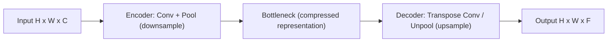
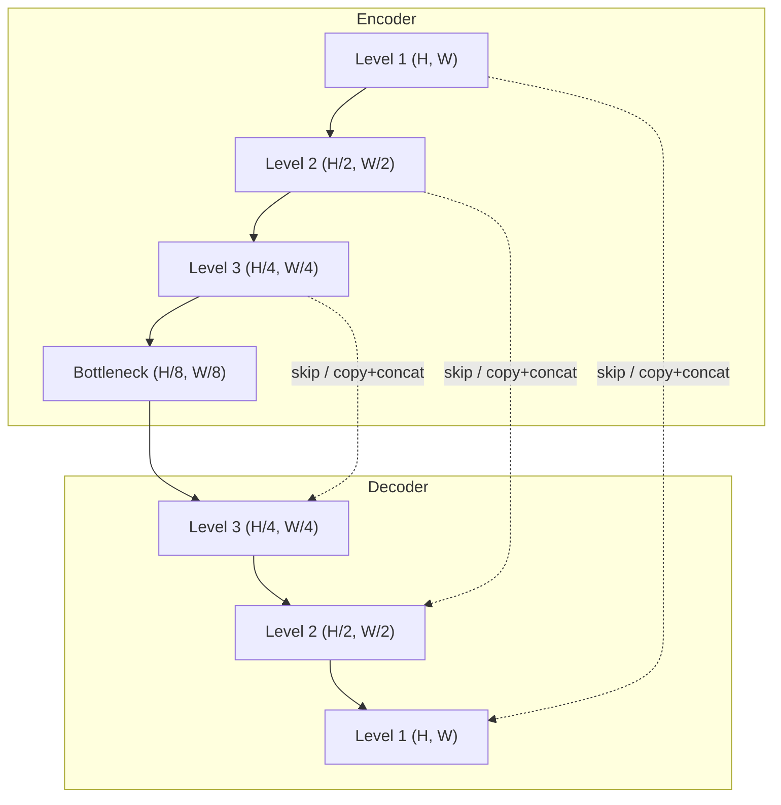
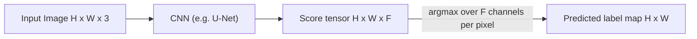

# CV Session #12: Semantic Segmentation and CV Metrics — Study Notes

**Source:** CV12.pdf — Session #12, Dhruba Adhikary (Dhruba.a@wilp.bits-pilani.ac.in)
**Acknowledgement (from slides):** Slide materials adapted from EECS 442 – David Fouhey, Winter 2023, University of Michigan. mAP section adapted from Karel Horak, Brno University of Technology / Czech Technical University in Prague.

---

## Extracted Info Page No 1:
- Title slide: "Session #12: Semantic Segmentation and CV Metrics", presenter Dhruba Adhikary.
- Recap header slide: "Convolutional Neural Network (CNN)" — shows a generic CNN pipeline:
$$x \to C \to f(n) \to C \to f(n) \to C \to f(n)$$
  where each $C$ is a convolution parameterized by weights $W$ and bias $b$ (e.g. $W_2, b_2, W_3, b_3$), followed by a non-linearity $f(n)$.
- Text: "CNN — Function of the image that is parameterized by the convolutional filter weights and biases. We design the form of the function and fit the parameters to data."
- "Now" slide: introduces the classic classification pipeline —
$$\text{Image}(H\times W \times C) \xrightarrow{\text{CNN}} \text{Vector}(1\times 1\times F)$$
  captioned "Convert HxW image into a F-dimensional vector."
- Three motivating pixel-level questions posed (these preview the rest of the session):
  - Which pixels in this image are a cat? (**semantic segmentation**)
  - How far is each pixel away from the camera? (**depth estimation**)
  - Which pixels of this image are fake? (**forgery/manipulation detection**)
- Handwritten annotations on this slide (student notes) list *traditional* (pre-deep-learning) segmentation methods for context: Mean-Shift algorithm, K-means segmentation, probabilistic segmentation (using RGB + xy coordinates, kernel density estimation/KDE), 2007/2008-era work, and DNN-based classification starting around then. Also lists non-visible-spectrum imaging modalities relevant to segmentation in other domains: Radar, Lidar, Magnetic, CT, Ultrasound, and hyperspectral/ultraspectral vision (multi-band beyond RGB).

## Explained in Simple Terms Page No 1:
Think of a CNN as a machine that keeps re-drawing the image using filters (small pattern detectors) and squashing it with a non-linearity, layer after layer — like passing a photo through several stacked Instagram filters, each one picking out edges, then textures, then whole patterns, then object parts.

Up to now (in previous sessions) the CNN's job ended by squeezing the whole image down into one single vector of numbers — basically the network's "opinion" as an F-dimensional summary of the whole picture (e.g., "this is 80% cat, 5% dog..."). That's *classification*: one label per image.

This session flips the question: instead of one label for the whole image, we want a label **for every single pixel**. "Which pixels are cat?" needs an answer per pixel, not per image — like coloring inside the lines of a coloring book, rather than just writing "there is an animal here" on a sticky note. The three example questions (cat pixels / depth / fake pixels) are really the same underlying problem shape: turn an image into another image (or image-shaped tensor) that encodes information per pixel.

The old-school methods noted in the handwriting (mean-shift, K-means, probabilistic segmentation using color+position) were how people did segmentation *before* deep learning — cluster pixels by similarity in color/space instead of learning filters from data. They still show up in classical CV pipelines and as baselines.

## Researched Context Page No 1:
Mean-shift and K-means segmentation are classic non-deep-learning clustering methods: mean-shift iteratively shifts points toward the mode (peak) of a density estimate (often built with a Kernel Density Estimate / KDE over color+spatial features), naturally grouping pixels into regions without needing to specify the number of clusters in advance — this made it popular for image segmentation and object tracking in the 2000s. K-means segmentation instead partitions pixels into a fixed number *k* of clusters by color/intensity similarity. Both predate the deep-learning wave (~2012 onward, AlexNet) that this slide deck's later content builds on. Modern hyperspectral/multispectral imaging (referenced in the handwriting) extends the "which pixels are X" idea beyond RGB into dozens or hundreds of spectral bands, used in remote sensing, agriculture, and material inspection — the same segmentation/classification network ideas from this deck apply per-band or per-pixel-spectrum.

Sources:
- [Mean Shift Segmentation Overview](https://en.wikipedia.org/wiki/Mean_shift)
- [K-means clustering for image segmentation](https://en.wikipedia.org/wiki/K-means_clustering)

---

## Extracted Info Page No 2:
- **Semantic Segmentation** intro: pipeline diagram $H\times W\times C \xrightarrow{\text{CNN}} H \times W \times F$ (image in, image-shaped tensor out — same spatial size, F channels).
  - "Today's Running Example"
    - Predict F-dimensional vector representing probability of each of F classes **at every pixel**.
    - Loss computed/backprop'd **at every pixel**.
- **Semantic Segmentation** (definition slide):
  - "Each pixel has label. Usually visualized by colors."
  - **Note: don't distinguish between object instances** (i.e., two people are both just "person" pixels — no separate "person #1" vs "person #2").
  - Shows Input/Label image pairs (horse-rider image, cyclists image) — colored masks over object categories. Image credit: Everingham et al., Pascal VOC 2012.
- **Semantic Segmentation** ("Semantic" wordplay slide):
  - "'Semantic': a usually meaningless word and an indication that someone is trying to trick you. Meant to indicate here that we're **naming** things."
  - Repeats Input/Label examples.
- **Semantic Segmentation** (loss formulation slide):
  - Pipeline: $H\times W \times 3 \xrightarrow{\text{CNN}} H\times W \times F$, and per-pixel loss:
$$-\log\left(\frac{\exp\left((Wx)_{y_i}\right)}{\sum_k \exp\left((Wx)_k\right)}\right)$$
    This is the standard **softmax cross-entropy loss**, applied independently at every pixel location $i$ with ground-truth class $y_i$, then summed/averaged over all $H\times W$ pixels and backpropagated.
  - Diagram shows a 128×128×3 RGB image → CNN → per-pixel F-way classification, with "Semantic Seg" vs "Instance" labels distinguished in a side note (semantic seg = same label for all people; instance seg = each person gets a distinct id, e.g. labeled 1 and 2 in red/yellow).
  - Handwritten annotation: ground-truth one-hot encoding table example, showing rows like class probabilities (0.1, 0.25, 0.45, 0.9…) — illustrating that ground truth for one pixel is a one-hot vector (or soft label) over F classes, and prediction is a softmax distribution over the same F classes.

## Explained in Simple Terms Page No 2:
Semantic segmentation = classification, but done separately for every pixel. Instead of the network outputting one F-length vector for the whole image, it outputs an F-length vector *at every (x,y) position*, so the final output tensor is $H \times W \times F$ — same height and width as the input image, but F "probability channels" instead of 3 color channels. Whichever channel has the highest value at a pixel tells you "the network thinks this pixel belongs to class such-and-such."

"Semantic" here just means "we're assigning names/categories" — the joke on the slide is that "semantic" sounds fancy but really just means labeling. Important nuance: semantic segmentation only cares about *category* (cat, person, road), not *identity*. If there are two people in the photo, both get the same "person" color — it doesn't know or care that they're two separate individuals. That's a job for **instance segmentation** (e.g., Mask R-CNN), which is a different, harder task.

The loss function looks scary but it's the same cross-entropy loss you'd use for ordinary image classification (softmax over classes, negative log of the correct class's probability) — the only twist is you compute it once per pixel, then sum/average all those per-pixel losses into one number to backpropagate. So a 128×128 image with 10 classes has 128×128 = 16,384 independent classification decisions each contributing to the total loss.

## Researched Context Page No 2:
The PASCAL VOC dataset (used for the horse-rider and cyclist example images here) was one of the earliest and most influential benchmarks for both object detection and semantic segmentation (2005–2012), and its per-pixel colored "segmentation label" convention (a fixed color map per class, black for background/ignore) became the de facto visualization standard still used today. A classic misconception addressed directly on this slide: people often assume "semantic segmentation" separates individual objects — it does not. The task that does separate individual instances of the same class is *instance segmentation* (e.g., Mask R-CNN, 2017), and the task that does both (per-pixel class **and** per-instance id) is *panoptic segmentation* (introduced by Kirillov et al., 2019). Modern production use of semantic segmentation includes autonomous driving (road/lane/sidewalk/pedestrian segmentation, e.g. Cityscapes dataset), medical imaging (tumor/organ segmentation), and satellite imagery (land-use classification).

Sources:
- [The PASCAL Visual Object Classes (VOC) Challenge](https://link.springer.com/article/10.1007/s11263-009-0275-4)
- [Panoptic Segmentation (Kirillov et al., CVPR 2019)](https://arxiv.org/abs/1801.00868)

---

## Extracted Info Page No 3:
- **Encoder-Decoder** slide:
  - Key idea: "First **downsample** towards middle of network. Then **upsample** from middle."
  - "How do we downsample? Convolutions, pooling."
  - Diagram: input $H\times W\times C$ → shrinking green/blue blocks (encoder) → narrowest point in the middle → growing blue blocks (decoder) → output $H\times W \times F$ (same spatial size as input, restored).
  - Handwritten labels identify the block sizes as an example: image encoded down through feature maps ending near $32\times32$ (with channel depth growing, e.g. to 512/1024), then decoded back up to $128\times128$ output; also references "encoding," "flatten," "maxpooling," "dropout" as building blocks and labels the two halves "Encoder" / "Decoder."
- **Where Do We Get Parameters?** (slide 1 of 3):
  - Shows a standard "convnet that maps images to vectors" (image classification backbone), input 224×224, ending in a $1\times1$ conv.
  - "Recall that we can rewrite any vector-vector operations via 1×1 convolutions" — i.e., a fully-connected layer at the end of a classifier is mathematically equivalent to a $1\times1$ convolution when the spatial size has been reduced to $1\times1$.
  - Citation: Long et al., *Fully Convolutional Networks For Semantic Segmentation*, CVPR 2014 (published version is CVPR 2015; preprint circulated in 2014/2015).
  - Handwritten worked example: computing output size via convolution formula $O = \left\lfloor \frac{W - K + 2P}{S} \right\rfloor + 1$, e.g. $224\times224\times3 \to$ (after a $7\times7$ conv, stride 2) $\to \left\lfloor\frac{224-7+0}{2}\right\rfloor + 1$ style computation reaching $\approx 32\times32\times1024$ before global pooling.
- **Where Do We Get Parameters?** (slide 2 of 3):
  - Same convnet, but now shows a second "convnet that maps images to images" also ending in $1\times1$ convs, both fed by the same 224×224 input.
  - "What if we make the input bigger?"
- **Where Do We Get Parameters?** (slide 3 of 3):
  - Shows: a "convnet that maps images to images" now applied to a 500×500 input, producing a $10\times10$ output feature map (instead of $1\times1$).
  - "Since it's convolution, can reuse an image network" — the key FCN insight: because convolution and pooling operations don't care about input size, a classification network's learned weights (trained on fixed 224×224 crops) can be reused/fine-tuned on arbitrarily larger inputs to produce a coarse spatial grid of class scores instead of one vector.
  - Handwritten notes: e.g. $4096\times512$ FC-equivalent turned into $1\times1\times512$ conv weights; "10 classes" example; GAP (Global Average Pooling) noted as an alternative pooling scheme; DenseNet mentioned as an example backbone; output spatial grid example $56\times56\times[\text{something}] \to 1\times1\times10 \to 56\times56\times10$.

## Explained in Simple Terms Page No 3:
The encoder-decoder shape is the backbone architecture for pixel-wise prediction: squeeze the image down (encoder — like zooming out to see the big picture, losing fine detail but gaining "what is generally going on"), then blow it back up to the original size (decoder — restoring a full-resolution map, but now filled with class predictions instead of raw pixels). It's shaped like the letter "V" or hourglass.

The trickier conceptual leap on this page is: how do we reuse a normal image classifier (trained to output one label for the whole image) as the *encoder* half of this pipeline? The answer: a fully-connected layer (the classic last layer of AlexNet/VGG-style classifiers, mapping "flattened features" → "class scores") is mathematically identical to a $1\times1$ convolution once your feature map has already been shrunk down to $1\times1$ spatially. Once you realize that, you can just... not shrink all the way down to $1\times1$. If you feed a *bigger* image into the exact same network with the exact same weights, the convolutions and poolings still work fine (they slide over whatever size you give them) — you just end up with a small grid of predictions (e.g., $10\times10$) instead of a single point. Each cell in that $10\times10$ grid is basically "what would the classifier have said if it looked at just this patch of the image" — a coarse, first pass at spatial prediction, for free, by recycling an existing trained classifier. This is the core trick from the original Fully Convolutional Network (FCN) paper: turn classifiers into segmenters by converting FC layers to convolutions.

## Researched Context Page No 3:
This "convert fully-connected layers to 1×1 convolutions" trick is exactly the central contribution of Long, Shelhamer & Darrell's *Fully Convolutional Networks for Semantic Segmentation* (CVPR 2015), which took existing classification networks (AlexNet, VGG, GoogLeNet) pretrained on ImageNet and repurposed them into dense, pixel-wise predictors without redesigning them from scratch — a hugely influential idea because it meant segmentation networks could inherit all the representational power of ImageNet-pretrained classifiers via transfer learning, rather than being trained from random weights on the (much smaller) segmentation datasets available at the time. FCN was the first end-to-end, pixel-to-pixel trained CNN for segmentation and set new state-of-the-art results on PASCAL VOC, NYUDv2, and SIFT Flow in 2015, while running in under a fifth of a second per image — a huge speedup over prior region-proposal-based segmentation pipelines.

Sources:
- [Fully Convolutional Networks for Semantic Segmentation (CVPR 2015, official)](https://openaccess.thecvf.com/content_cvpr_2015/html/Long_Fully_Convolutional_Networks_2015_CVPR_paper.html)
- [FCN paper on arXiv (1411.4038)](https://arxiv.org/abs/1411.4038)
- [Official FCN code release (Berkeley)](https://github.com/shelhamer/fcn.berkeleyvision.org)

---

## Extracted Info Page No 4:
- **How Do We Upsample?** — Poses the question: decoder needs to go from small spatial size $W\times H\times C$ back up to $2W \times 2H \times F$ (or similar upscaling). Two named strategies given later on this page: "opposite of how we downsample":
  1. Pooling → **"Unpooling"**
  2. Convolution → **"Transpose Convolution"**
- **Recall: Pooling** — worked numeric example of Max-pooling, 2×2 filter, stride 2, on a 4×4 input:
$$
\begin{bmatrix} 1 & 1 & 2 & 4 \\ 5 & 6 & 7 & 8 \\ 3 & 2 & 1 & 0 \\ 1 & 2 & 3 & 4 \end{bmatrix}
\xrightarrow{\text{max-pool }2\times2,\ s=2}
\begin{bmatrix} 6 & 8 \\ 3 & 4 \end{bmatrix}
$$
  (Each 2×2 block's maximum value is kept: top-left block max is 6, top-right is 8, bottom-left is 3, bottom-right is 4 — figures approximate/illustrative per the slide's simplified 2×2 output grid.)
- **Now: Unpooling** — "Nearest Neighbor Unpool ×2": takes a small grid (e.g., a 2×2 block with values 8, 6, 3, and another value) and expands ×2 in each spatial dimension by simply copying/repeating each value into a 2×2 block:
$$
\begin{bmatrix} 8 & 6 \\ 3 & \cdot \end{bmatrix}
\xrightarrow{\text{NN unpool }\times2}
\begin{bmatrix} 8 & 8 & 6 & 6 \\ 8 & 8 & 6 & 6 \\ 3 & 3 & \cdot & \cdot \\ 3 & 3 & \cdot & \cdot \end{bmatrix}
$$
  This is the inverse operation of nearest-neighbor downsampling — no learned parameters, just replication.
- **Recall: Convolution** — reviews standard $3\times3$ convolution, stride 2, pad 1: for each output location, take the dot product between filter $f$ and the corresponding input patch. (Example credit: L. Fei-Fei, J. Johnson, S. Yeung — this is the standard CS231n convolution-arithmetic example.)

## Explained in Simple Terms Page No 4:
Downsampling (pooling) throws information away to make the feature map smaller — like shrinking a photo by keeping only the brightest pixel in each little block. Upsampling has to do the reverse: make the feature map bigger again. The simplest possible way to do that is "nearest neighbor unpooling" — just copy each value into a bigger block (blow up a thumbnail by duplicating each pixel into a 2×2 patch). It's crude (no new detail is invented, everything within a block looks identical, and it doesn't use whatever information was thrown away in the original max-pool), but it's cheap and has no parameters to learn.

The pooling numeric example: original numbers get chopped into four 2×2 windows, and only the biggest number in each window survives — a lossy compression. The unpooling example shows the mirror-image operation done afterward, in the decoder: take a compressed value and stamp it out over the area it should influence.

## Researched Context Page No 4:
Max-pooling and nearest-neighbor upsampling are the "cheap, parameter-free" bookends of encoder-decoder segmentation networks. In practice, plain nearest-neighbor unpooling produces blocky, low-detail outputs, which is why more sophisticated variants exist: "max-unpooling" (used in SegNet, Badrinarayanan et al. 2015) remembers *which* location held the max value during pooling and places the upsampled value back at that exact original location (rather than smearing it uniformly), giving sharper boundaries; this is a direct improvement students often encounter right after this slide's naive nearest-neighbor version.

Sources:
- [SegNet: A Deep Convolutional Encoder-Decoder Architecture for Image Segmentation (Badrinarayanan et al., 2015)](https://arxiv.org/abs/1511.00561)

---

## Extracted Info Page No 5:
*(Continuation of "Recall: Convolution" — two near-duplicate slides repeating the same 3×3 stride-2 pad-1 convolution diagram with the sliding window moved to different positions; merged here as they are animation-build duplicates showing the same worked example at different filter positions.)*
- **Transpose Convolution** (introduction, two build-stages merged):
  - "3×3 Transpose Convolution, Stride 2, Pad 1"
  - "Output is filter $F$ weighted by input $I$" — for a small $2\times2$ (or similar) low-res input with values $I_{11}, I_{12}, I_{21}, I_{22}$, each input value multiplies (scales) the entire learned filter $F$, and the resulting scaled-filter "stamps" are placed into the (larger) output feature map at stride-spaced positions.
  - "Sum outputs at overlap (e.g., from $I_{11}F$ and $I_{21}F$)" — where two stamped filter copies overlap in the output, their values are **added together**.
  - Handwritten worked arithmetic: output size formula for transpose convolution:
$$\text{Output} = (\text{Input} - 1)\times S + K - 2P$$
    Worked example: input size 5, stride $S=1$, kernel $K=3$, pad $P=0$: $(5-1)\times1 + 3 - 0 = 7$, i.e., a $5\times5$ input transpose-convolved gives a $7\times7$ output. A second worked example derives $S$ from a given output/input pair: solving $7 = 4S + 3 \Rightarrow S=1$ and $11 = 4S+3 \Rightarrow S = 8/4 = 2$ (annotation shows the student solving for stride given assumed output sizes 7 and 11 from an $I=5$, $K=3$ setup).

## Explained in Simple Terms Page No 5:
Regular convolution takes a big input and a filter, and *slides + shrinks* — "in a neighborhood of pixels, compute one weighted-sum output value." Transpose convolution runs that process backwards: each *single* value in the small input gets multiplied by the entire filter (like a stencil), and that scaled stencil gets stamped down somewhere in the (larger) output canvas. Because the stencils are placed with some stride (spacing) between them, neighboring stencils overlap at the edges — and wherever two stencils land on the same output pixel, you just add their contributions together. That's the whole trick: instead of "take many inputs → make one output" (normal conv), it's "take one input → make many outputs, then merge overlaps by addition" (transpose conv). It's called "transpose" because the underlying matrix multiplication is literally the transpose of the matrix used for regular convolution.

The formula $(\text{Input}-1)\times S + K - 2P$ tells you exactly how big your upsampled output will be, given input size, stride, kernel size and padding — the mirror image of the familiar $\lfloor (W-K+2P)/S\rfloor + 1$ formula for regular convolution.

## Researched Context Page No 5:
Transpose convolution (sometimes loosely called "deconvolution", though that term is mathematically inaccurate — it isn't inverting a convolution, just using a transposed weight matrix) is the standard learnable upsampling operation in FCN, DCGAN generators, and many segmentation/generation decoders. A well-known and commonly tested pitfall (also relevant to the practical use of this operation) is the "checkerboard artifact" problem: when the kernel size isn't evenly divisible by the stride, some output pixels get contributions from more overlapping stencils than their neighbors, creating a periodic checkerboard-like pattern of brightness in generated images. The widely-cited Distill.pub article by Odena, Dumoulin & Olah (2016) demonstrates this visually and shows that replacing transpose convolution with "resize-then-convolve" (nearest-neighbor or bilinear upsample followed by an ordinary convolution) avoids the artifact — a fix now standard in many GAN and segmentation decoder designs.

Sources:
- [Deconvolution and Checkerboard Artifacts (Distill.pub)](https://distill.pub/2016/deconv-checkerboard/)
- [Checkerboard artifact free sub-pixel convolution (arXiv:1707.02937)](https://arxiv.org/pdf/1707.02937)

---

## Extracted Info Page No 6:
- **Putting it Together** — full encoder-decoder diagram:
  - Input ($H\times W\times C$) → **Downsample** (Conv, pool — "Encoder") → bottleneck → **Upsample** (Tr. Conv./Unpool — "Decoder") → Output ($H\times W\times F$).
  - "Convolutions + pooling downsample/compress/encode. Transpose convs./unpoolings upsample/uncompress/decode."
  - Mermaid representation of the overall data flow:

- **Putting It Together – Block Sizes** (slide 1):
  - "Networks come in lots of forms. Don't take any block sizes literally. Often (not always) keep some spatial resolution."
  - Two architecture-family diagrams: "Encode to spatially smaller tensor, then decode" vs. "Encode to 1D vector then decode" (the fully-collapsed-bottleneck variant, more lossy).
- **Putting It Together – Block Sizes** (slide 2):
  - "Often multiple layers at each spatial resolution." "Often halve spatial resolution and double feature depth every few layers."
  - Symmetric resolution/depth pattern shown:
$$H,W \to H/2,W/2 \to H/4,W/4 \to H/8,W/8 \to H/4,W/4 \to H/2,W/2 \to H,W$$
$$D \to 2D \to 4D \to 8D \to 4D \to 2D \to D$$
  (spatial size halves while channel depth doubles going down; both reverse going back up — the classic "hourglass"/U-shape channel-depth trade-off.)

## Explained in Simple Terms Page No 6:
This page is the "zoom out" summary tying pooling/unpooling and convolution/transpose-convolution together into one full pipeline. The rule of thumb worth remembering: as you go deeper into the encoder, spatial size shrinks (less "where") but channel depth grows (more "what") — a common pattern is halve H and W, double the channel count, every few layers. Then the decoder does the exact mirror image, so the final output matches the original image's height and width again, just with F class-channels instead of 3 color-channels.

There are two flavors of "how far do you compress": (1) shrink down to a small *spatial* grid (like 8×8×512) and decode from there — keeps some rough position info; or (2) shrink all the way down to a *single vector* (1×1×N, like a classifier bottleneck) and decode purely from that — much more lossy since ALL spatial layout information is discarded at the bottleneck. Most modern segmentation networks use option (1) precisely because option (2) throws away too much spatial detail.

## Researched Context Page No 6:
This encoder-decoder "hourglass" shape with halving-resolution/doubling-channels is a design pattern shared across FCN, SegNet, U-Net, and even modern diffusion-model U-Nets used in image generation (e.g., Stable Diffusion's denoising network) — the same shape keeps reappearing because it balances compute (fewer pixels to process at deep layers) against representational capacity (more channels to compensate). It's a good example of an idea from classic CV/CNN architecture research (2014-2015) still forming the architectural backbone of state-of-the-art 2024-2026 generative models.

Sources:
- [U-Net architecture in diffusion models (Stable Diffusion background)](https://arxiv.org/abs/2112.10752)

---

## Extracted Info Page No 7:
- **Missing Details** (slide 1): "While the output is HxW, just upsampling often produces results without details/not aligned with the image. Why? Information about details lost when downsampling!" Result image shown from Long et al. FCN CVPR 2014 — blurry, blob-like segmentation boundaries that don't precisely follow the true object edges.
- **Missing Details** (slide 2): "Where is the useful information about the high-frequency details of the image?" — shows five arrows labeled A, B, C, D, E pointing down at different depths/points inside the encoder-decoder network, prompting: at which layer is fine detail still present?
- **Missing Details** (slide 3, "Copy"): "How do you send details forward in the network? You copy the activations forward. Subsequent layers at the same resolution figure out how to fuse things." — This describes **skip connections**: copying the (fine-detail-rich) activations from an early encoder layer directly across to the matching-resolution decoder layer, where they get fused (concatenated) with the upsampled coarse features. Handwritten annotation labels this fusion as "**Concat**" (concatenation).
- **U-Net** slide: "Extremely popular architecture, was originally used for biomedical image segmentation." Citation: Ronneberger et al., *U-Net: Convolutional Networks for Biomedical Image Segmentation*, MICCAI 2015. Diagram shows the classic U-Net shape: encoder (downsampling, teal→blue blocks) on the left, decoder (upsampling, blue→gray blocks) on the right, with horizontal gray arrows directly connecting each encoder resolution level to its matching decoder resolution level (the skip/copy connections), each labeled with matching spatial sizes (e.g., $H/2, W/2$ on both the encoder and decoder side at that level).

Mermaid representation of the U-Net skip-connection pattern:


## Explained in Simple Terms Page No 7:
Here's the problem the whole page is building up to: after you've squeezed the image down to a small bottleneck and blown it back up again, the output segmentation looks blurry and doesn't line up cleanly with real object edges. Why? Because pooling/downsampling literally throws away fine detail (exact edge locations, textures) — you can't get back what was discarded just by resizing.

The fix is beautifully simple: **don't rely only on the bottleneck path — also copy the detailed, high-resolution activations from early in the encoder directly across to the matching point in the decoder**, skipping over the bottleneck entirely (a "skip connection"). At the decoder, you now have two streams of information at the same resolution: (1) the coarse, "what object is this roughly" information that traveled the long way through the bottleneck, and (2) the sharp, "here exactly are the edges" information that came straight across. You combine them (concatenate the channels together) and let subsequent layers learn how to blend the two. This is exactly the "Copy" arrows in the U-Net diagram — U-Net is basically "encoder-decoder + skip connections at every resolution level," shaped like the letter U when drawn (hence the name). Even though U-Net was originally invented for medical images (segmenting cells/organs in microscopy or scans), the skip-connection idea proved so effective it's now used everywhere in segmentation.

## Researched Context Page No 7:
U-Net (Ronneberger, Fischer & Brox, MICCAI 2015) is one of the most cited and reused architectures in all of computer vision, precisely because of this idea. It was designed to solve a very practical problem: biomedical datasets (e.g., microscope images of cells) typically have very few labeled training images available (annotating medical images requires expert time), so U-Net leaned heavily on data augmentation and an architecture that could train well from a "few thousand" annotated samples rather than millions. It won the ISBI cell tracking challenge 2015 by a large margin and beat prior sliding-window CNN approaches for electron-microscopy neuron segmentation. Skip connections in general (this "copy and concatenate" idea) are also conceptually related to the residual/skip connections in ResNet (2015, same era) — both address the same underlying issue (information/gradient loss through deep stacks of layers) though via different mechanisms (addition in ResNet vs. concatenation in U-Net). Beyond medicine, U-Net-style architectures now underpin satellite image segmentation, self-driving car perception stacks, and even the denoising backbone of diffusion image generators like Stable Diffusion.

Sources:
- [U-Net: Convolutional Networks for Biomedical Image Segmentation (arXiv:1505.04597)](https://arxiv.org/pdf/1505.04597)
- [U-Net paper (Springer, MICCAI 2015)](https://link.springer.com/chapter/10.1007/978-3-319-24574-4_28)
- [U-Net summary/walkthrough](https://www.sfu.ca/~kabhishe/posts/posts/summary_miccai_unet_2015/)

---

## Extracted Info Page No 8:
- **Evaluating Pixel Labels**: Pipeline Input Image → CNN → $H\times W\times F$ predicted score tensor → "**How do we convert final HxWxF into labels?**" → **argmax over labels** (i.e., for every pixel, pick the class channel with the highest score) → Predicted Classes ($H\times W$ label map).
  - Handwritten annotation lists evaluation metric names to come: Class, Acc(uracy), Pre(cision), Recall, F1 score, Loss — previewing the rest of the deck. Also notes "UNET" as the CNN used in this running example.
- **Evaluating Semantic Segmentation** (slide 1): "Given predictions, how well did we do?" — shows Input, Prediction ($\hat{y}$), and Ground-Truth ($y$) images side by side for a cyclists photo, visually comparing where the colored regions match vs. don't match. Handwritten annotations reference train/val loss curves and note example accuracy value "Cj = 48%" style scribbles (illustrative, not a clean printed number).
- **Evaluating Semantic Segmentation** (slide 2 — core definitions):
  - "Prediction and ground-truth are images where each pixel is one of F classes."
  - **Accuracy:** $\text{mean}(\hat{y} = y)$ — i.e., the fraction of pixels where predicted class equals ground-truth class.
  - **Intersection over union, averaged over classes** — shown visually as two overlapping colored blob shapes with a "/" between them (prediction blob over ground-truth blob), i.e., $\dfrac{\text{Prediction} \cap \text{Ground-Truth}}{\text{Prediction} \cup \text{Ground-Truth}}$, computed per class then averaged over all classes (this is the metric commonly called **mIoU**, mean Intersection over Union).
- **(unlabeled continuation slide)**: Handwritten flowchart sketch (student's own notes, not printed slide content) about a hypothetical multi-modal pipeline: MRI/CT images → CNN → Feature Map (FM) → attention → Transformer encoder → some output, with notes "class," "recon(struction)," "quality" — appears to be the student's own tangential sketch, not part of the official slide content, so not treated as core material here.

Mermaid version of the label-prediction pipeline:


## Explained in Simple Terms Page No 8:
Once your network spits out a score for every class at every pixel ($H\times W\times F$), how do you turn that into an actual "final answer" segmentation map? Simple: at each pixel, look across its F scores and just pick whichever class got the highest score — that's "argmax." Do that at every pixel independently and you get a clean $H\times W$ map where every pixel is now labeled with a single winning class (no more probabilities, just one decision per pixel).

Now, how do you grade that map against the true answer? Two natural options:
1. **Accuracy** — simplest possible idea: what fraction of pixels did you get exactly right? Just count matches and divide by total pixels.
2. **Intersection over Union (IoU)**, averaged across classes (**mIoU**) — a stricter, more informative metric. For a given class (say "cat"), draw the blob of pixels you predicted as cat, and the blob of pixels that are *actually* cat. IoU asks: "how much do these two blobs overlap, relative to their combined coverage?" $\frac{\text{overlap area}}{\text{total area covered by either blob}}$. If your predicted blob and the true blob are identical, IoU = 1 (perfect). If they don't overlap at all, IoU = 0.

Why prefer IoU over plain accuracy? Because accuracy can be misleading when most of the image is background — a lazy model that predicts "background" everywhere can still get high accuracy (since background dominates most images) while being useless at actually finding the object. IoU forces the model to get the object's *shape and extent* right, not just avoid big regions of easy background pixels.

## Researched Context Page No 8:
mIoU (mean Intersection-over-Union) is the standard reported metric in virtually every semantic segmentation paper and leaderboard (PASCAL VOC segmentation challenge, Cityscapes, ADE20K, COCO-Stuff) precisely because of the class-imbalance problem described above — plain pixel accuracy is well known to be a poor/misleading metric whenever background or one dominant class occupies most of the image (a classic example: a self-driving-car segmentation model that ignores small classes like "pedestrian" or "traffic light" can still score high pixel accuracy dominated by "road" and "sky" pixels, while being dangerously bad at the safety-critical small classes). This is exactly why mIoU averages IoU *per class first*, then averages those per-class scores together — giving small, rare classes equal weight to large, common ones, rather than letting large classes dominate the metric.

Sources:
- [Cityscapes benchmark (mIoU is the standard metric)](https://www.cityscapes-dataset.com/benchmarks/)
- [Evaluation metrics for object detection and segmentation: mAP / IoU](https://kharshit.github.io/blog/2019/09/20/evaluation-metrics-for-object-detection-and-segmentation)

---

## Extracted Info Page No 9:
- "**Performance Metrics for Segmentation** - see materials" (a pointer slide, minimal content — transitions from segmentation into the general CV-metrics section).
- **IoU (Intersection over union)** (definition slide):
  - "IoU measures the overlap between two boundaries."
  - "We use that to measure how much our predicted boundary overlaps with the ground truth (the real object boundary)."
  - "In some datasets, we predefine an IoU threshold (say 0.5) in classifying whether the prediction is a true positive or a false positive."
  - Diagram: two overlapping bounding boxes (Ground truth = blue outline, Prediction = orange outline) over a photo (a lantern/building), plus the formula:
$$\text{IoU} = \frac{\text{area of overlap}}{\text{area of union}}$$
  - Handwritten annotation restates: $\text{IoU} = \dfrac{B_{\text{overlap}}}{A_1 + A_2 - B_{\text{overlap}}}$ (equivalent form: union = sum of both box areas minus their overlap, to avoid double-counting the overlap region), plus a threshold note ">0.5" for deciding true/false positive.
- **mAP for Object Detection** (title slide): "Source: Karel Horak, Brno University of Technology / Czech Technical University in Prague, horak@feec.vutbr.cz" (external attributed source for the rest of the mAP section).
- **mAP for Object Detection** (definitions slide):
  - "mAP stands for mean Average Precision."
  - "AP is a popular metric in measuring the accuracy of object detectors like Faster R-CNN, SSD, etc."
  - "Average precision computes the average precision value for recall value over 0 to 1. It sounds complicated but actually pretty simple as we illustrate it with an example."
  - "But before that, we will do a quick recap on precision, recall, and IoU first."
  - Handwritten annotation lists example dataset scales: Pascal VOC ~27,000 (images/objects, illustrative), COCO ~1000 objects/categories-scale, "1 mil det(ections)" — giving a rough sense of dataset/benchmark scale for object detection.

## Explained in Simple Terms Page No 9:
This page pivots from segmentation-specific metrics to metrics used broadly across detection and segmentation: IoU and mAP.

**IoU**, in the object-detection context, works exactly like the segmentation IoU from the previous page, just applied to *bounding boxes* instead of pixel blobs: draw the box you predicted, draw the true box, and measure how much they overlap relative to their combined area. Datasets typically pick a threshold (very commonly 0.5, meaning "at least 50% overlap") to decide: "is this prediction close enough to count as correct (a true positive), or is it too far off (a false positive)?" This threshold-based true/false-positive decision is the foundation everything else on the next several pages builds on.

**mAP (mean Average Precision)** is the headline metric for object detection benchmarks — it answers a harder question than plain accuracy: "across all my detections, ranked from most to least confident, how good is my model overall at finding the right objects without too many false alarms?" The next several pages build this metric up piece by piece: first precision/recall, then a single-class "Average Precision" worked example, then how to combine multiple classes into "mean" AP.

## Researched Context Page No 9:
IoU thresholding at 0.5 (a "50% overlap = correct" rule) is a convention popularized by the PASCAL VOC object detection challenge (2007-2012) and remains one of the most quoted numbers in object detection papers today (e.g., "AP50" in YOLO/COCO papers refers to average precision computed at this exact 0.5 IoU threshold). The scale numbers referenced in the handwriting hint at why newer benchmarks like COCO superseded PASCAL VOC: PASCAL VOC has about 11,530 images with ~27,450 labeled objects across 20 classes, while COCO has over 200,000 labeled images and 1.5 million object instances across 80 categories — a roughly two-orders-of-magnitude jump in scale that pushed the field toward deeper, more data-hungry detectors (Faster R-CNN, SSD, YOLO, RetinaNet) that this slide references.

Sources:
- [The PASCAL Visual Object Classes (VOC) Challenge](https://link.springer.com/article/10.1007/s11263-009-0275-4)
- [Microsoft COCO: Common Objects in Context (Lin et al., 2014)](https://arxiv.org/abs/1405.0312)

---

## Extracted Info Page No 10:
- **Precision & recall**:
  - "Precision measures how accurate is your predictions. i.e. the percentage of your predictions are correct."
  - "Recall measures how good you find all the positives. For example, we can find 80% of the possible positive cases in our top K predictions."
  - "F1 score is a measure combining Precision and Recall."
  - Formulas:
$$\text{Precision} = \frac{TP}{TP + FP} \qquad \text{Recall} = \frac{TP}{TP+FN}$$
$$F_1 = 2\cdot\frac{\text{precision}\cdot\text{recall}}{\text{precision}+\text{recall}}$$
  - Legend: $TP$ = True positive, $TN$ = True negative, $FP$ = False positive, $FN$ = False negative.
  - Handwritten worked mini-example (illustrative, informal): four labeled regions/predictions "A, B, C, D" with computed values $A = 0.6$, $B = 0.7$, $C = 0$, $D = 0.25$ (appears to be a scratch exercise computing IoU or precision-like scores for four candidate detections against ground truth — exact input values not printed on the slide, only the handwritten results survive, so treat as illustrative practice rather than official slide content).
- **Numerical IoU worked example** (fully reconstructable from the handwritten numeric annotations):
  - Ground truth box: corners $(x_1,y_1) = (50,50)$, $(x_2,y_2) = (250,200)$.
  - Predicted box: corners $(70,80)$, $(280,220)$.
  - Intersection corners: $\max(70,50)=70$... i.e. intersection $x_{\min}=\max(70,50)=70$? — per the annotation: "Intersection Area = max(70,50), max(50,30)" reads as computing the intersection rectangle's top-left corner via elementwise max of the two boxes' top-left corners, and bottom-right via elementwise min of the two boxes' bottom-right corners: $(\min(250,280), \min(200,220)) = (250,200)$.
  - Intersection height $= 250-70 = 180$; intersection width $=200-80=120$ (annotation shows "Int ht = 250-70=180", "Int wd = 200-80=120").
  - Intersection Area $=180\times120 = 21{,}600$.
  - Union Area $= (200-50)\times(250-50) + (280-70)\times(220-80) - 21{,}600 = $ computed to $37{,}800$ (annotation: "Union Area ≈ 250×50-ish components → 37800" — final union area given directly as **37,800**).
  - $\text{IoU} = \dfrac{21{,}600}{37{,}800} = 0.57$ (also cross-checked against a "Dice coefficient" annotation: $\text{Dice} = \dfrac{2\times\text{IoU}}{1+\text{IoU}}$-style relation shown as $\frac{2\times21600}{37800}=0.95$-ish scratch, i.e. the slide margin separately notes the **Dice coefficient** formula $\text{Dice} = \dfrac{2|A\cap B|}{|A|+|B|}$ as a related overlap metric.)
- **Average Precision** (setup slide):
  - "Let us create an over-simplified example in demonstrating the calculation of the average precision."
  - "In this example, the whole dataset contains **five apples only**. We collect all the predictions made for apples in all the images and rank it in descending order according to the predicted confidence level. The second column indicates whether the prediction is correct or not. In this example, the prediction is correct if IoU ≥ 0.5."
  - Table shown (Rank, IoU-derived Correct?, Precision, Recall) — 10 ranked predictions total, with handwritten confidence values layered on top (e.g., 0.99, 0.95, 0.94...) and correctness marks (True/False per rank).
- **Average Precision** (rank #3 worked explanation):
  - "Let us take the row with rank #3 and demonstrate how precision and recall are calculated first."
  - "Precision is the proportion of TP = 2/3 = 0.67."
  - "Recall is the proportion of TP out of the possible positives = 2/5 = 0.4."
  - "Recall values increase as we go down the prediction ranking. However, precision has a zigzag pattern — it goes down with false positives and goes up again with true positives."
  - Table (Rank 1–7 shown): Rank/Correct?/Precision/Recall = (1,True,1.0,0.2)↑(2,True,1.0,0.4)↑(3,False,0.67,0.4)↓(4,False,0.5,0.4)↓(5,False,0.4,0.4)↓(6,True,0.5,0.6)↑(7,True,0.57,0.8)↑ — arrows indicate precision/recall increasing or decreasing versus the prior row.

## Explained in Simple Terms Page No 10:
**Precision** answers "of everything I claimed was positive (e.g., 'this is an apple'), how much did I actually get right?" **Recall** answers a different question: "of all the real apples that exist, how many did I actually manage to find?" You can trivially get 100% recall by predicting "apple" on literally everything (you'd never miss a real apple) — but your precision would tank because you'd also flag lots of non-apples. Conversely you can get high precision by only ever guessing when you're extremely sure — but you'll miss (low recall) any apple you weren't confident about. There's an inherent tension between the two, which is exactly why the **F1 score** exists: it's a single number balancing both (their harmonic mean), useful when you need one number rather than two.

The worked numeric IoU example is just plugging two rectangle corner coordinates into the intersection/union area formulas: find where the two boxes overlap (intersection rectangle), compute its area; then compute the union area as (box1 area + box2 area − overlap, to avoid double counting the overlap); divide. Result 0.57 here would count as a correct detection under the common IoU≥0.5 threshold rule from the previous page.

The **Average Precision** setup example is the classic "five apples in the whole dataset" toy example used to teach mAP. Here's the intuition for why precision "zigzags" while recall only ever goes up: as you walk down your ranked list of predictions (most confident first), every time you hit a *correct* detection, recall ticks up (you found one more of the 5 total real apples) — recall can never decrease, since you keep accumulating found-apples. But precision can go up OR down at each step, because it's judged fresh at every rank: a wrong guess (false positive) drags precision down at that step, while a right guess pulls precision back up. Rank #3 example: by the time you've looked at the top 3 predictions, 2 were correct and 1 wrong, so precision = 2/3 ≈ 0.67; and since only 2 of the 5 total real apples have been found so far, recall = 2/5 = 0.4.

## Researched Context Page No 10:
Precision, recall, and F1 originate from information retrieval (deciding whether a search result is relevant) and were adopted into machine learning classification generally before becoming central to object detection evaluation. The "five apples" toy example mirrors the standard teaching example used across many popular deep-learning-metrics tutorials (e.g., the widely circulated walkthrough by Jonathan Hui and similar), precisely because a tiny, hand-countable dataset makes the ranking/zigzag behavior of precision easy to trace by hand before scaling up to real datasets with thousands of detections. The Dice coefficient noted in the margin is mathematically closely related to IoU ($\text{Dice} = \frac{2\cdot\text{IoU}}{1+\text{IoU}}$) and is especially common in medical image segmentation literature (e.g., tumor segmentation challenges) as an alternative/complementary overlap metric to IoU.

Sources:
- [Mean Average Precision (mAP) in Object Detection (Medium walkthrough with the classic apples-style example)](https://abhishri-medewar.medium.com/mean-average-precision-map-in-object-detection-78900922b3f0)
- [Mean Average Precision (mAP) explained (LearnOpenCV)](https://learnopencv.com/mean-average-precision-map-object-detection-model-evaluation-metric/)

---

## Extracted Info Page No 11:
- **Average Precision** (PR-curve plot slide): "Let us plot the precision against the recall value to see this zig-zag pattern." "The general definition for the Average Precision (AP) is finding the area under the precision-recall curve."
$$\text{AP} = \int_0^1 p(r)\, dr$$
- **Average Precision** (smoothing/interpolation explanation slide): "Precision and recall are always between 0 and 1. Therefore, AP falls within 0 and 1 also." "Before calculating AP for the object detection, we often smooth out the zigzag pattern first." "Graphically, at each recall level, we replace each precision value with the maximum precision value to the right of that recall level."
- **Average Precision** (interpolation formula slide): "So the orange line is transformed into the green line and the curve will decrease monotonically instead of the zigzag pattern." "The calculated AP value will be less susceptible to small variations in the ranking." "Mathematically, we replace the precision value for recall $\hat r$ with the maximum precision for any recall $\geq \hat r$":
$$p_{\text{interp}}(r) = \max_{\hat r \geq r} p(\hat r)$$
- **Interpolated AP** (PASCAL VOC intro slide): "PASCAL VOC is a popular dataset for object detection." "For the PASCAL VOC challenge, a prediction is positive if IoU ≥ 0.5. Also, if multiple detections of the same object are detected, it counts the first one as a positive while the rest as negatives." "In Pascal VOC2008, an average for the **11-point interpolated AP** is calculated."

## Explained in Simple Terms Page No 11:
Plotting precision (y-axis) against recall (x-axis) at every rank gives you the "precision-recall curve" — and Average Precision is officially defined as the area under that curve. But the raw curve is jagged/zigzaggy (because precision bounces up and down as described on the previous page), which makes "area under the curve" sensitive to noisy little wiggles that don't really reflect meaningful model quality differences.

So before computing the area, we smooth the curve using a simple rule: "at any recall level, replace the precision there with the *best* (maximum) precision achieved at that recall level or any higher recall level." Intuitively: "if I was willing to accept a lower recall, what's the best precision I could have gotten by stopping earlier in my ranked list?" This turns the jagged orange zigzag into a clean, staircase-shaped green line that only ever goes down (monotonically decreasing) as recall increases — much more stable and comparable across different models/runs.

PASCAL VOC formalizes "correct or not" using the IoU≥0.5 rule from before, with one extra wrinkle: if your model finds the *same* real object multiple times (e.g., two overlapping boxes both claiming to have found the one true apple), only the first (highest-confidence) one counts as correct — the rest are penalized as wrong, so the model can't cheat by spamming duplicate detections around one object.

## Researched Context Page No 11:
The precision-recall interpolation trick ("replace precision at recall r with the max precision at recall ≥ r") comes directly from information retrieval evaluation practice, later adopted wholesale into the PASCAL VOC object detection challenge starting 2007. This interpolation choice reflects a real, well-understood tradeoff: it makes AP a fairer, less noise-sensitive summary statistic, at the cost of being a slight over-estimate of a detector's true precision-recall behavior at any single specific recall level. This exact interpolation and PR-curve/AP definition remains the conceptual foundation of virtually all detection benchmarks today (COCO, Open Images, LVIS), even though the exact sampling scheme used for the final averaging (11-point vs. all-point vs. 101-point, covered next) has evolved.

Sources:
- [Mean Average Precision (mAP) in Object Detection (Medium)](https://abhishri-medewar.medium.com/mean-average-precision-map-in-object-detection-78900922b3f0)
- [Object-Detection-Metrics reference implementation (rafaelpadilla)](https://github.com/rafaelpadilla/Object-Detection-Metrics/)

---

## Extracted Info Page No 12:
- **Interpolated AP** (numeric worked-example slide): "First, we divide the recall value from 0 to 1.0 into 11 points — 0, 0.1, 0.2, …, 0.9 and 1.0." "Next, we compute the average of maximum precision value for these 11 recall values." "In our example, $\text{AP} = (5\times1.0 + 4\times0.57 + 2\times0.5)/11$."
- Detailed worked object-detection example (constructed from the slide's assumptions box + student annotations):
  - **Assumptions used (standard object detection evaluation):**
    - #GT (ground-truth objects) = 6 (slide text — note: student's handwritten annotation separately writes "5 GT objects of interest," so treat 6 as the number printed/used for the worked numeric table, while a nearby annotation flags 5 as a possibly-intended count; the arithmetic below follows the printed table which is built on 6 GT boxes)
    - IoU threshold = 0.5
    - Detections are processed in descending confidence order
    - A detection counts as TP if IoU ≥ 0.5 **and** an unmatched GT box is still available (so total TPs cannot exceed the GT count; extra detections that overlap well but on an already-matched GT become FP as duplicates)
  - **Ranked detections table:**

| Rank | Conf | IoU | TP/FP | TP cum | FP cum | Precision | Recall |
|---|---|---|---|---|---|---|---|
| 1 | 0.99 | 0.64 | TP | 1 | 0 | 1.00 | 0.17 |
| 2 | 0.92 | 0.31 | FP | 1 | 1 | 0.50 | 0.17 |
| 3 | 0.92 | 0.31 | FP | 1 | 2 | 0.33 | 0.17 |
| 4 | 0.75 | 0.77 | TP | 2 | 2 | 0.50 | 0.33 |
| 5 | 0.72 | 0.51 | TP | 3 | 2 | 0.60 | 0.50 |
| 6 | 0.72 | 0.51 | TP | 4 | 2 | 0.67 | 0.67 |
| 7 | 0.71 | 0.45 | FP | 4 | 3 | 0.57 | 0.67 |
| 8 | 0.65 | 0.45 | FP | 4 | 4 | 0.50 | 0.67 |
| 9 | 0.61 | 0.70 | TP | 5 | 4 | 0.56 | 0.83 |
| 10 | 0.56 | 0.79 | TP | 6 | 4 | 0.60 | 1.00 |
| 11 | 0.42 | 0.53 | FP* | 6 | 5 | 0.55 | 1.00 |

  - Note on rank 11 (marked FP*): "Since the GT is 6 only even though the IoU is greater than 0.5 we deem it as FP. FP at rank 11 because we already reached 6 TPs (all GT matched). In normal matching, any additional detections are duplicates → FP."
  - **9-point interpolation table (recall levels 0.1 to 0.9):**

| Recall level (r) | $p_{\text{interp}}(r)$ |
|---|---|
| 0.1 | 1.000 |
| 0.2 | 0.667 |
| 0.3 | 0.667 |
| 0.4 | 0.667 |
| 0.5 | 0.667 |
| 0.6 | 0.667 |
| 0.7 | 0.600 |
| 0.8 | 0.600 |
| 0.9 | 0.600 |

  - VOC-style interpolation rule recap (from the slide body text overlay): $p_{\text{interp}}(r) = \max_{r' \geq r} p(r')$. Worked check at $r=0.7$: "eligible recalls are 0.8333, 1.0, 1.0 with precisions 0.5556, 0.6, 0.5455" [these decimal values correspond to a related independent numeric variant elsewhere on the slide's overlay] "So $p_{\text{interp}}(0.7) = \max(0.5556, 0.6, 0.5455) = 0.6$."

## Explained in Simple Terms Page No 12:
This page walks through a full realistic mini object-detection evaluation by hand, not just an abstract formula. Here's the story: your model made 11 detections across some images, each with a confidence score and an IoU against its best-matching ground-truth box. There are 6 real objects to find in total (the "GT" count).

You process detections in order of confidence (most confident first), and for each one ask: "does this IoU clear 0.5, AND is there still an un-claimed real object it could be matching?" If yes → true positive (TP), running TP-count goes up. If either condition fails (bad IoU, OR it's the 2nd/3rd/etc. box trying to claim an already-matched object) → false positive (FP). Notice rank 11 has a perfectly good IoU (0.53 ≥ 0.5) but still gets marked FP — because all 6 real objects were already claimed by earlier (higher-confidence) detections; it's a redundant, duplicate detection, and duplicates never get to "double count" as extra correct answers.

At each rank, running precision = (TPs so far)/(total detections so far), and running recall = (TPs so far)/(total real GT objects, 6). Once you have precision & recall at every rank, you again apply the smoothing rule from the previous page: at each of the 11 standard recall checkpoints (0, 0.1, 0.2, ..., 1.0), take the best (max) precision available at that recall level or higher. Average those 11 (or 9, if you exclude the endpoints as this worked table does) smoothed precision values, and that average is your Average Precision for this one class.

## Researched Context Page No 12:
This worked example format (a ranked detections table with running TP/FP counts feeding precision/recall) is the exact procedure implemented by every standard object-detection evaluation toolkit (the official PASCAL VOC development kit, and reference implementations like Cartucho's mAP repo or rafaelpadilla's Object-Detection-Metrics), so understanding this table by hand is directly transferable to reading a real evaluation script's internals. The "duplicate detection counted as FP" rule specifically prevents an easy exploit: without it, a detector could get artificially high recall/precision just by outputting many overlapping boxes around the same easy object, at zero cost — enforcing "one detection per GT object, first-come-first-served by confidence" keeps the metric honest.

Sources:
- [Object-Detection-Metrics reference implementation (rafaelpadilla)](https://github.com/rafaelpadilla/Object-Detection-Metrics/)
- [Mean Average Precision (mAP) in Object Detection (Medium)](https://abhishri-medewar.medium.com/mean-average-precision-map-in-object-detection-78900922b3f0)

---

## Extracted Info Page No 13:
- **11-point interpolation table (recall levels 0.0 to 1.0)** (continuation of the previous page's worked example, now including the two endpoints):

| Recall level (r) | $p_{\text{interp}}(r)$ |
|---|---|
| 0.0 | 1.000 |
| 0.1 | 1.000 |
| 0.2 | 0.667 |
| 0.3 | 0.667 |
| 0.4 | 0.667 |
| 0.5 | 0.667 |
| 0.6 | 0.667 |
| 0.7 | 0.600 |
| 0.8 | 0.600 |
| 0.9 | 0.600 |
| 1.0 | 0.600 |

- **Interpolated AP** (concluding bullets):
  - "When AP$_r$ turns extremely small, we can assume the remaining terms to be zero. i.e. we do not necessarily make predictions until the recall reaches 100%."
  - "If the possible maximum precision levels drop to a negligible level, we can stop."
  - "For 20 different classes in PASCAL VOC, we compute an AP for every class and also provide an average for those 20 AP results." (This average-across-classes is the "mean" in mean Average Precision.)
  - "However, this interpolated method is an approximation which suffers two issues: 1. It is less precise. 2. Second, it lost the capability in measuring the difference for methods with low AP."
  - "Therefore, a different AP calculation is adopted after 2008 for PASCAL VOC."
- **Handwritten worked arithmetic (9-point and 11-point AP calculation, continuing the page-12 example):**
  - 9-point formula: $\text{AP}_9 = \dfrac{1}{9}\sum_{r\in\{0.1,\dots,0.9\}} p_{\text{interp}}(r)$.
    - Sum: $1 + 3.333333 + 1.8 = 6.133333$ (grouping the nine values: one value at 1.000, four values at 0.667 → $4\times0.667=2.667$?, note the printed intermediate groups slightly differently as "$1 + 3.333333 + 1.8$"; regardless, the printed final sum is **6.133333**).
    - Divide by 9: $\text{AP}_9 = 6.133333 / 9 = 0.681481$.
    - **9-point mAP (AP₉) = 0.6815 (≈ 0.681)**
  - 11-point formula: $\text{AP}_{11} = \dfrac{1}{11}\sum_{r\in\{0.0,0.1,\dots,1.0\}} p_{\text{interp}}(r)$.
    - Substitute values, sum grouped as $2 + 5\cdot\frac{2}{3} + 4\cdot0.6$.
    - Sum: $2 + 3.333333 + 2.4 = 7.733333$.
    - Divide by 11: $\text{AP}_{11} = 7.733333/11 = 0.703030$.
    - **11-point mAP (AP₁₁) = 0.7030 (≈ 0.703)**
  - Handwritten side-note: illustrative mAP-across-classes example — "car: 0.68, bike: 0.5, human: 0.9, cat: 0.2" → averaged mAP ≈ their mean (illustrating the "mean" step across 4 example classes, separate from the single-class 9/11-point numbers above).

## Explained in Simple Terms Page No 13:
This page finishes the hand-worked AP calculation and then zooms out to explain why the field moved on from this exact method. First, plug the 11 smoothed precision values from the table into the average formula: add them all up, divide by 11 (or by 9, if you use the 9-point variant that skips the two endpoints) — giving a single number, e.g. AP₁₁ ≈ 0.703 for this worked "6 ground-truth objects" example. That one number now represents "how good was my detector at finding this one class of object," combining precision and recall into a single score.

To get from "AP for one class" to "mAP across the whole dataset," you just do this same 11-point calculation separately for every class (PASCAL VOC has 20 object classes: car, person, cat, etc.), then average *those* 20 numbers together — hence "mean Average Precision."

Why did the field move on from 11-point interpolation after 2008? Two honest weaknesses admitted right on the slide: (1) sampling only 11 fixed points is a rough approximation — real precision-recall curves can have much more nuanced shape between those points that gets smoothed away; and (2) it becomes a poor tool for telling apart two *weak* detectors, because when true AP is low, most of those 11 sample points end up near zero anyway, flattening out real differences between mediocre models. That motivated a switch to a finer, exact-area calculation (covered next page).

## Researched Context Page No 13:
The shift away from 11-point interpolation happened specifically for PASCAL VOC's 2010-2012 challenges, which switched to computing the exact area under the (smoothed) precision-recall curve using *all* the recall breakpoints where precision changes, rather than only 11 fixed samples — giving an exact rather than approximate AP. This detail matters practically: papers reporting results on "VOC07" metric vs. "VOC12" metric are using genuinely different AP formulas, and comparing numbers across the two without accounting for that difference is a common source of confusion/misreporting in the literature, and something graders/exam questions on this topic often probe.

Sources:
- [Mean Average Precision (mAP) in Object Detection (Medium) — 11-point vs. all-point history](https://abhishri-medewar.medium.com/mean-average-precision-map-in-object-detection-78900922b3f0)
- [Object-Detection-Metrics: VOC07 vs VOC12 metric distinction](https://github.com/rafaelpadilla/Object-Detection-Metrics/)

---

## Extracted Info Page No 14:
- **AP (Area under curve AUC)** (slide 1): "For later Pascal VOC competitions, VOC2010–2012 samples the curve at all unique recall values ($r_1, r_2, \dots$), whenever the maximum precision value drops." "With this change, we are measuring the exact area under the precision-recall curve after the zigzags are removed."
- **AP (Area under curve AUC)** (slide 2): "No approximation or interpolation is needed." "Instead of sampling 11 points, we sample $p(r_i)$ whenever it drops and computes AP as the sum of the rectangular blocks."
  - Formula shown:
$$\text{AP} = \sum_n (r_{n+1} - r_n)\, p_{\text{interp}}(r_{n+1})$$
$$p_{\text{interp}}(r_{n+1}) = \max_{\hat r \geq r_{n+1}} p(\hat r)$$
  - Diagram: precision-recall curve with the area broken into rectangular blocks of width $(r_{n+1}-r_n)$ and height $p(r_2)$ etc. — i.e., a Riemann-sum-style exact-area computation over the monotonically-smoothed (green) curve.
- **COCO mAP** (slide 1): "Latest research papers tend to give results for the COCO dataset only. In COCO mAP, a **101-point interpolated AP** definition is used in the calculation." "For COCO, AP is the average over multiple IoU (the minimum IoU to consider a positive match)." "**AP@[.5:.95]** corresponds to the average AP for IoU from 0.5 to 0.95 with a step size of 0.05." "For the COCO competition, AP is the average over 10 IoU levels on 80 categories (AP@[.50:.05:.95]: start from 0.5 to 0.95 with a step size of 0.05)."
- **COCO mAP** (slide 2 — metrics table, reproduced faithfully):
```
Average Precision (AP):
  AP                  % AP at IoU=.50:.05:.95 (primary challenge metric)
  AP^IoU=.50          % AP at IoU=.50 (PASCAL VOC metric)
  AP^IoU=.75          % AP at IoU=.75 (strict metric)
AP Across Scales:
  AP^small            % AP for small objects: area < 32^2
  AP^medium           % AP for medium objects: 32^2 < area < 96^2
  AP^large            % AP for large objects: area > 96^2
Average Recall (AR):
  AR^max=1            % AR given 1 detection per image
  AR^max=10           % AR given 10 detections per image
  AR^max=100          % AR given 100 detections per image
AR Across Scales:
  AR^small            % AR for small objects: area < 32^2
  AR^medium           % AR for medium objects: 32^2 < area < 96^2
  AR^large            % AR for large objects: area > 96^2
```

## Explained in Simple Terms Page No 14:
The exact-area (AUC) method fixes both weaknesses of the 11-point method from the previous page by not sampling at fixed points at all — instead, it looks at the actual precision-recall curve and finds every point where the smoothed (max-to-the-right) precision value changes, and computes the *exact* area of each resulting rectangle, then adds them all up. No approximation, no arbitrary "pick 11 spots" — it's the true area under the curve.

COCO (a newer, larger, harder benchmark than PASCAL VOC) goes even further in two ways: (1) it samples the curve at 101 points instead of 11 (much finer-grained interpolation, reducing approximation error even further), and (2) — the bigger conceptual change — instead of using one fixed IoU threshold (0.5) to decide correct/incorrect, COCO computes AP at *ten different* IoU thresholds (0.5, 0.55, 0.60, ..., 0.95) and averages across all of them. Why? Because a detector that only ever gets "loose" (barely 0.5 IoU) boxes will score fine under the old VOC-style 0.5-threshold metric, but COCO's stricter averaged metric punishes sloppy localization — you need boxes that are *tightly* aligned with the true object to score well at IoU=0.9 or 0.95, not just "roughly in the right place." This is why "COCO AP" (often just called "AP" without qualification) is considered a much harder, more demanding number than the old VOC AP. COCO also reports extra breakdowns: AP at just the lenient 0.5 threshold (labeled AP50, directly comparable to old VOC-style scores), AP at the strict 0.75 threshold, and separate scores by object size (small/medium/large) and by how many detections per image you're allowed to make (Average Recall variants) — giving a much more detailed diagnostic picture than a single number.

## Researched Context Page No 14:
COCO's AP@[.5:.95] (averaging over 10 IoU thresholds) has become the de facto primary metric quoted in virtually every modern object detection paper (Faster R-CNN, YOLO family, DETR, and beyond) — precisely because it rewards precise localization in a way the older single-threshold VOC metric didn't. This is exactly why you'll see papers report multiple numbers side-by-side (AP, AP50, AP75, APS, APM, APL) rather than a single score: different applications care about different things (e.g., autonomous driving cares a lot about small, distant object detection — APS — while a photo-tagging app might care more about AP50 for common, large objects). A frequently-tested distinction (also explicitly addressed on the next page's slide content): COCO makes "no distinction between AP and mAP" by convention, whereas in the earlier VOC-style literature "AP" specifically meant per-class and "mAP" meant averaged-over-classes.

Sources:
- [Evaluation metrics for object detection and segmentation: mAP](https://kharshit.github.io/blog/2019/09/20/evaluation-metrics-for-object-detection-and-segmentation)
- [Mean Average Precision (mAP) Using the COCO Evaluator (PyImageSearch)](https://pyimagesearch.com/2022/05/02/mean-average-precision-map-using-the-coco-evaluator/)
- [COCO Explained (Datature glossary)](https://datature.io/glossary/coco)
- [Microsoft COCO: Common Objects in Context (Lin et al., 2014)](https://arxiv.org/abs/1405.0312)

---

## Extracted Info Page No 15:
- **COCO mAP** (final example slide): "Example: the AP result for the YOLOv3 detector:" — reproduces a benchmark comparison table (from the YOLOv3 paper) of two-stage methods (Faster R-CNN++, Faster R-CNN w FPN, Faster R-CNN by G-RMI, Faster R-CNN w TDM) vs. one-stage methods (YOLOv2, SSD513, DSSD513, RetinaNet, YOLOv3 608×608), each with backbone, and columns AP, AP₅₀, AP₇₅, AP_S, AP_M, AP_L:

| Method | Backbone | AP | AP₅₀ | AP₇₅ | AP_S | AP_M | AP_L |
|---|---|---|---|---|---|---|---|
| Faster R-CNN++ [3] | ResNet-101-C4 | 34.9 | 55.7 | 37.4 | 15.6 | 38.7 | 50.9 |
| Faster R-CNN w FPN [6] | ResNet-101-FPN | 36.2 | 59.1 | 39.0 | 18.2 | 39.0 | 48.2 |
| Faster R-CNN by G-RMI [4] | Inception-ResNet-v2 | 34.7 | 55.5 | 36.7 | 13.5 | 38.1 | 52.0 |
| Faster R-CNN w TDM [18] | Inception-ResNet-v2-TDM | 36.8 | 57.7 | 39.2 | 16.2 | 39.8 | 52.1 |
| YOLOv2 [13] | DarkNet-19 | 21.6 | 44.0 | 19.2 | 5.0 | 22.4 | 35.5 |
| SSD513 [1, 2] | ResNet-101-SSD | 31.2 | 50.4 | 33.3 | 10.2 | 34.5 | 49.8 |
| DSSD513 [7] | ResNet-101-DSSD | 33.2 | 53.3 | 35.2 | 13.0 | 35.4 | 51.1 |
| RetinaNet [7] | ResNet-101-FPN | 39.1 | 59.1 | 42.3 | 21.8 | 42.7 | 50.2 |
| RetinaNet [7] | ResNeXt-101-FPN | **40.8** | **61.1** | **44.1** | **24.1** | **44.2** | 51.2 |
| YOLOv3 608×608 | Darknet-53 | 33.0 | 57.9 | 34.4 | 18.3 | 35.4 | 41.9 |

  (Table caption: "COCO for YOLOv3.") "For clarity, AP@.75 means the AP with IoU=0.75."
- **COCO mAP** (final concluding slide): "mAP (mean average precision) is the average of AP." "In some context, we compute the AP for each class and average them. But in some context, they mean the same thing. For example, under the COCO context, there is no difference between AP and mAP. Here is the direct quote from COCO: 'AP is averaged over all categories. Traditionally, this is called "mean average precision" (mAP). We make no distinction between AP and mAP (and likewise AR and mAR) and assume the difference is clear from context.'" "In ImageNet, the AUC method is used." "To summarize: even all of them follow the same principle in measurement AP, the exact calculation may vary according to the datasets. Fortunately, development kits are available in calculating this metric."
- Final slide: "Thank you" (slide 53 of the original larger deck numbering).
- Trailing scratch slide: handwritten-only sketch reiterating input/output shape example ($224\times224\times3 \to 32\times32\times1024$; $224\times224\times1$ noting $224/7=32$) — a leftover annotation recapping the earlier FCN receptive-field/downsampling arithmetic from page 3, not new slide content.

## Explained in Simple Terms Page No 15:
This closing page grounds everything in a real published benchmark table (from the YOLOv3 paper), showing how AP, AP50, AP75, and the small/medium/large breakdowns actually get reported for real detectors. Notice: RetinaNet (a one-stage detector with a strong ResNeXt-101-FPN backbone) actually beats every two-stage Faster R-CNN variant listed, and also beats YOLOv3 — illustrating that by the time RetinaNet came out, well-designed one-stage detectors had closed (and in this case exceeded) the accuracy gap with two-stage detectors, while historically being much faster. Also notice YOLOv3's AP50 (57.9) is much closer to the Faster R-CNN family's AP50 numbers than its overall AP (33.0) is — a concrete illustration of the point from the previous page: YOLOv3 is quite good at *finding* objects with roughly-correct boxes (its AP50 is competitive), but its precise box localization is comparatively weaker (hence a bigger relative drop at the stricter overall AP@[.5:.95]).

The final wrap-up bullet is an important terminology clarification worth remembering verbatim for exams: in COCO's own documentation, "AP" and "mAP" are treated as *the same thing* (both already mean "averaged over all categories"), whereas older literature sometimes reserved "AP" for a single class and "mAP" for the average across classes — so when reading any detection paper, check which convention it's using. The takeaway of the whole metrics section: every dataset/benchmark (VOC, COCO, ImageNet) computes "AP" with slightly different exact procedures (fixed-threshold vs. multi-threshold, 11-point vs. 101-point vs. exact-AUC), but they all share the same underlying precision-recall-curve-area concept — so once you understand the concept, adapting to any specific benchmark's exact formula is just a detail, and standard toolkits/development kits handle the arithmetic for you in practice.

## Researched Context Page No 15:
RetinaNet (Lin et al., ICCV 2017) is a landmark paper precisely because of the result illustrated in this table: it introduced "Focal Loss," a modified cross-entropy loss that down-weights easy/already-well-classified examples during training, specifically to fix the severe foreground-background class imbalance that had held one-stage detectors back in accuracy compared to two-stage ones — and the table on this slide is essentially the paper's headline result, showing a one-stage detector beating two-stage detectors on COCO for the first time at that scale. YOLOv3 (Redmon & Farhadi, 2018) is likewise a landmark paper for prioritizing speed and simplicity while still being competitive on AP50, explicitly trading some strict-localization accuracy (relatively weaker AP75) for much faster inference — a design tradeoff still highly relevant in real-time detection systems (robotics, video surveillance, autonomous driving) today. The direct-quote clarification about "AP == mAP" in COCO is taken from the official COCO detection evaluation documentation and is a commonly tested point of confusion between VOC-era and COCO-era papers.

Sources:
- [Focal Loss for Dense Object Detection / RetinaNet (Lin et al., ICCV 2017)](https://arxiv.org/abs/1708.02002)
- [YOLOv3: An Incremental Improvement (Redmon & Farhadi, 2018)](https://arxiv.org/abs/1804.02767)
- [COCO detection evaluation metrics documentation](https://cocodataset.org/#detection-eval)

---

# Document Summary

## Main Topics
- From image classification to per-pixel prediction: semantic segmentation as "classification at every pixel."
- Reusing classifiers as segmenters: converting fully-connected layers to 1×1 convolutions (Fully Convolutional Networks, FCN).
- Encoder-decoder architecture: downsampling (conv + pooling) followed by upsampling (unpooling + transpose convolution).
- Recovering lost spatial detail via skip connections (copy + concatenate), and the U-Net architecture.
- Converting a network's per-pixel score tensor into a final label map via argmax.
- Segmentation evaluation metrics: pixel accuracy and mean Intersection-over-Union (mIoU).
- Object detection evaluation: IoU for bounding boxes, precision, recall, F1 score.
- Average Precision (AP): the precision-recall curve, interpolation/smoothing, and worked numeric examples.
- Historical evolution of AP computation: PASCAL VOC 11-point interpolated AP → exact area-under-curve (VOC 2010–2012) → COCO 101-point interpolated AP with multi-IoU-threshold averaging.
- COCO's full metrics suite: AP@[.5:.95], AP50, AP75, AP by object scale (S/M/L), and Average Recall (AR) variants.

## Important Concepts
- Semantic segmentation output: $H\times W \times F$ tensor of per-pixel class scores; per-pixel softmax cross-entropy loss $-\log\left(\frac{\exp((Wx)_{y_i})}{\sum_k \exp((Wx)_k)}\right)$.
- Semantic segmentation does **not** distinguish object instances (that's instance/panoptic segmentation).
- FCN insight: a fully-connected layer at spatial size 1×1 is equivalent to a 1×1 convolution — enables reusing classification backbones on arbitrarily-sized inputs.
- Convolution output size: $O = \lfloor (W-K+2P)/S \rfloor + 1$.
- Transpose convolution output size: $O = (I-1)\times S + K - 2P$; overlapping stamped-filter outputs are summed.
- Checkerboard artifacts arise when transpose-conv kernel size isn't divisible by stride; fixed via resize-convolution.
- Skip connections (U-Net "copy" arrows): concatenate high-resolution encoder activations into the matching-resolution decoder layer to restore fine detail.
- Argmax over the F-channel score tensor produces the final predicted label map.
- Pixel accuracy: $\text{mean}(\hat y = y)$; mIoU: per-class $\frac{\text{Prediction}\cap\text{GT}}{\text{Prediction}\cup\text{GT}}$, averaged over classes — mIoU is preferred over accuracy under class imbalance.
- Bounding-box IoU: $\frac{\text{area of overlap}}{\text{area of union}}$; commonly thresholded at 0.5 for true/false positive decisions.
- Precision $=\frac{TP}{TP+FP}$; Recall $=\frac{TP}{TP+FN}$; $F_1 = 2\cdot\frac{\text{precision}\cdot\text{recall}}{\text{precision}+\text{recall}}$.
- AP $= \int_0^1 p(r)\,dr$ = area under the (smoothed) precision-recall curve; interpolation rule $p_{\text{interp}}(r) = \max_{\hat r\geq r} p(\hat r)$.
- PASCAL VOC (≤2007/2008): 11-point interpolated AP, $\text{AP}_{11} = \frac{1}{11}\sum_{r\in\{0,0.1,\dots,1.0\}} p_{\text{interp}}(r)$.
- PASCAL VOC (2010–2012): exact area-under-curve, $\text{AP} = \sum_n (r_{n+1}-r_n)\,p_{\text{interp}}(r_{n+1})$ — no approximation.
- COCO mAP: 101-point interpolated AP, averaged over 10 IoU thresholds from 0.5 to 0.95 step 0.05 (AP@[.5:.95]); also reports AP50, AP75, AP by object size, and Average Recall variants.
- COCO convention: no distinction made between "AP" (per class) and "mAP" (averaged across classes) — both terms used interchangeably.
- ImageNet detection uses the AUC method for AP.

## Frequently Tested Topics
- Deriving output spatial size for convolution vs. transpose convolution (plug-in-the-formula questions).
- Explaining *why* semantic segmentation loss is applied per-pixel (softmax cross-entropy at each pixel).
- Distinguishing semantic segmentation vs. instance segmentation vs. panoptic segmentation.
- Explaining the FCN "FC-layer-as-1×1-conv" trick and why it enables variable input sizes.
- Explaining why skip connections (U-Net) are needed — what information is otherwise lost during downsampling.
- Computing IoU numerically from two bounding-box coordinate pairs.
- Computing precision/recall/F1 from a TP/FP/FN confusion count.
- Full worked AP calculation from a ranked-detections table (as in Pages 12–13): assigning TP/FP by IoU threshold + duplicate-detection rule, computing running precision/recall, interpolating, and averaging (both 11-point and 9-point variants, and knowing which is used where).
- Explaining why plain pixel accuracy is a poor segmentation metric under class imbalance, and why mIoU is preferred.
- Comparing PASCAL VOC 11-point AP vs. exact AUC AP vs. COCO 101-point multi-threshold AP — what changed and why.
- Interpreting a COCO-style results table: distinguishing AP, AP50, AP75, and size-stratified AP/AR.

## Revision Checklist
- [ ] Can explain, in one sentence, what "semantic segmentation" predicts and how its output tensor shape differs from image classification.
- [ ] Can state why semantic segmentation does not distinguish object instances, and name the task that does (instance/panoptic segmentation).
- [ ] Can write the per-pixel softmax cross-entropy loss formula from memory.
- [ ] Can explain the FCN trick of converting FC layers into 1×1 convolutions and why it allows arbitrary input sizes.
- [ ] Can compute convolution and transpose-convolution output sizes given W/K/S/P.
- [ ] Can explain how transpose convolution works (stamp-and-sum) and why checkerboard artifacts occur.
- [ ] Can explain the encoder-decoder ("hourglass") shape and the "halve resolution, double depth" pattern.
- [ ] Can explain skip connections / U-Net's "copy" mechanism and why it recovers lost detail.
- [ ] Can compute pixel accuracy and mIoU from a prediction/ground-truth pair.
- [ ] Can compute bounding-box IoU numerically from coordinates.
- [ ] Can define precision, recall, and F1 score, and explain the precision/recall tradeoff.
- [ ] Can work through a full ranked-detections table to compute TP/FP, precision, recall, and AP by hand.
- [ ] Can explain precision-recall interpolation/smoothing and why it's used.
- [ ] Can distinguish 11-point interpolated AP, exact AUC AP, and COCO's 101-point AP, and state which dataset/era uses which.
- [ ] Can explain COCO's AP@[.5:.95] and why averaging over multiple IoU thresholds is stricter than a single 0.5 threshold.
- [ ] Can read a COCO-style results table and explain what AP, AP50, AP75, AP_S/M/L, and AR mean.
- [ ] Can state the COCO convention that "AP" and "mAP" are used interchangeably.

---

# Additional Research Sources
- [The PASCAL Visual Object Classes (VOC) Challenge](https://link.springer.com/article/10.1007/s11263-009-0275-4)
- [Panoptic Segmentation (Kirillov et al., CVPR 2019)](https://arxiv.org/abs/1801.00868)
- [Fully Convolutional Networks for Semantic Segmentation (CVPR 2015, official)](https://openaccess.thecvf.com/content_cvpr_2015/html/Long_Fully_Convolutional_Networks_2015_CVPR_paper.html)
- [FCN paper on arXiv (1411.4038)](https://arxiv.org/abs/1411.4038)
- [Official FCN code release (Berkeley)](https://github.com/shelhamer/fcn.berkeleyvision.org)
- [SegNet: A Deep Convolutional Encoder-Decoder Architecture for Image Segmentation (Badrinarayanan et al., 2015)](https://arxiv.org/abs/1511.00561)
- [Deconvolution and Checkerboard Artifacts (Distill.pub)](https://distill.pub/2016/deconv-checkerboard/)
- [Checkerboard artifact free sub-pixel convolution (arXiv:1707.02937)](https://arxiv.org/pdf/1707.02937)
- [U-Net architecture in diffusion models (Stable Diffusion background)](https://arxiv.org/abs/2112.10752)
- [U-Net: Convolutional Networks for Biomedical Image Segmentation (arXiv:1505.04597)](https://arxiv.org/pdf/1505.04597)
- [U-Net paper (Springer, MICCAI 2015)](https://link.springer.com/chapter/10.1007/978-3-319-24574-4_28)
- [U-Net summary/walkthrough](https://www.sfu.ca/~kabhishe/posts/posts/summary_miccai_unet_2015/)
- [Cityscapes benchmark (mIoU is the standard metric)](https://www.cityscapes-dataset.com/benchmarks/)
- [Evaluation metrics for object detection and segmentation: mAP / IoU](https://kharshit.github.io/blog/2019/09/20/evaluation-metrics-for-object-detection-and-segmentation)
- [Microsoft COCO: Common Objects in Context (Lin et al., 2014)](https://arxiv.org/abs/1405.0312)
- [Mean Average Precision (mAP) in Object Detection (Medium)](https://abhishri-medewar.medium.com/mean-average-precision-map-in-object-detection-78900922b3f0)
- [Mean Average Precision (mAP) explained (LearnOpenCV)](https://learnopencv.com/mean-average-precision-map-object-detection-model-evaluation-metric/)
- [Object-Detection-Metrics reference implementation (rafaelpadilla)](https://github.com/rafaelpadilla/Object-Detection-Metrics/)
- [Mean Average Precision (mAP) Using the COCO Evaluator (PyImageSearch)](https://pyimagesearch.com/2022/05/02/mean-average-precision-map-using-the-coco-evaluator/)
- [COCO Explained (Datature glossary)](https://datature.io/glossary/coco)
- [Focal Loss for Dense Object Detection / RetinaNet (Lin et al., ICCV 2017)](https://arxiv.org/abs/1708.02002)
- [YOLOv3: An Incremental Improvement (Redmon & Farhadi, 2018)](https://arxiv.org/abs/1804.02767)
- [COCO detection evaluation metrics documentation](https://cocodataset.org/#detection-eval)
