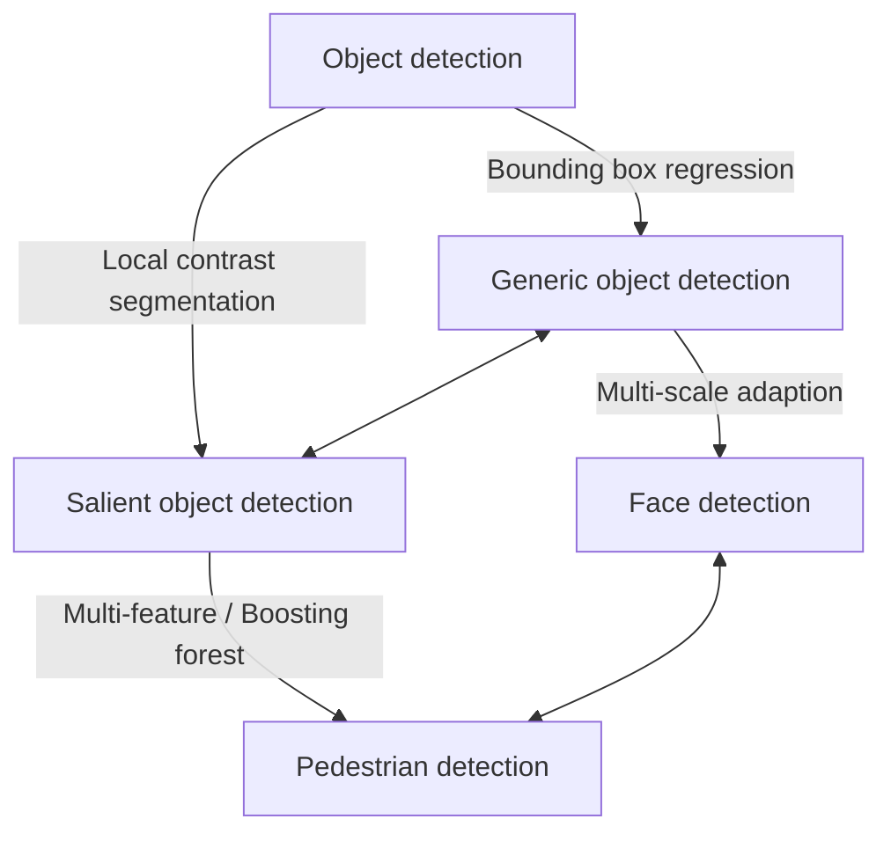
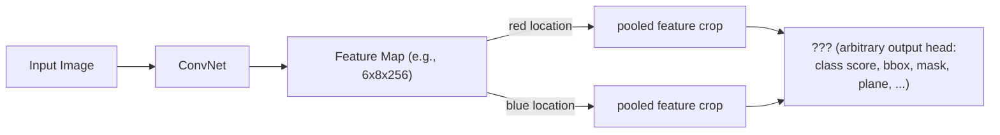
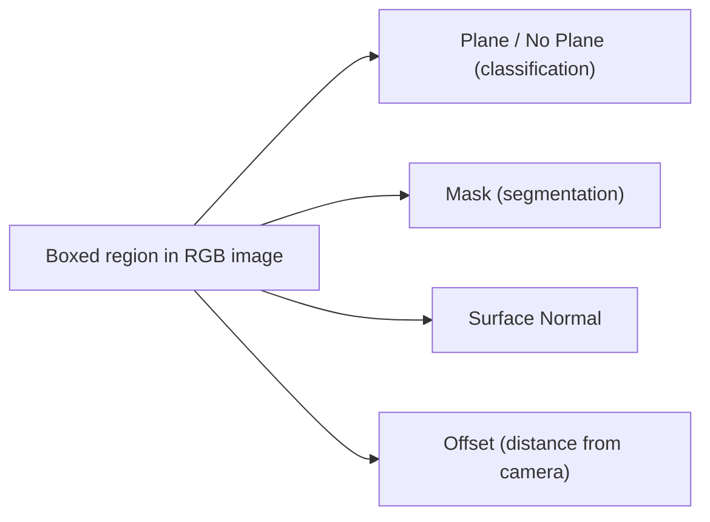
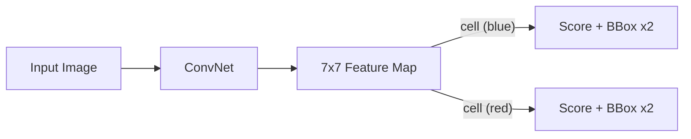
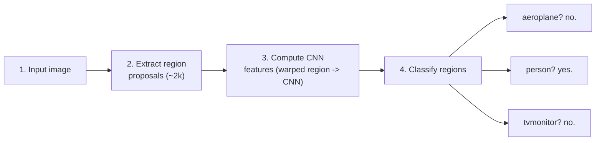
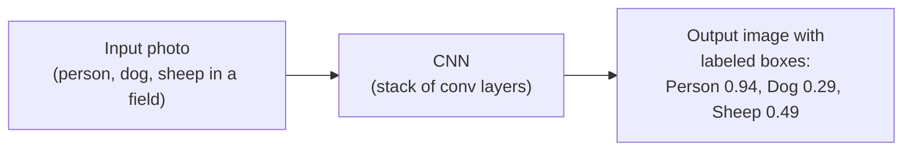
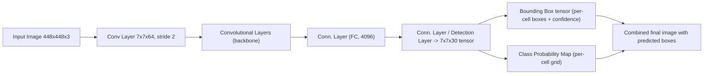
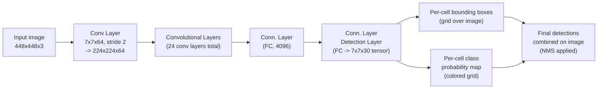

# CV Session #13-14: Object Detection — R-CNN Family & YOLO — Study Notes

**Source:** CV13.pdf — Session #13-14, Dhruba Adhikary (Dhruba.a@wilp.bits-pilani.ac.in), BITS Pilani M.Tech (AIML), Computer Vision, 2024-25 First Semester.
**Acknowledgement (from slides):** Slide materials adopted from "Intro to Computer Vision" (Cornell Tech), Noah Snavely — whose own course lineage draws on Stanford CS231n-style object detection lecture material.
**Format note:** The source PDF is exported as a 4-slides-per-page handout (2x2 grid per PDF page). Each "Page No X" section below corresponds to one PDF page and transcribes all original slides/panels found on it in reading order (top-left → top-right → bottom-left → bottom-right), noting where a panel is a pure animation-build duplicate that has been merged into its fullest version.

---

## Extracted Info Page No 1:

> Note on layout: the PDF is exported 4-slides-per-page (2x2 handout layout). Page 1 of the PDF contains four original deck slides, read in order top-left (TL), top-right (TR), bottom-left (BL), bottom-right (BR). They are transcribed as four blocks below.

**Slide A (TL) — Title Slide**
- Header: "CV 13: Object Detection Algorithms - RCNN"
- "Computer Vision" / "2024-25 First Semester, M.Tech (AIML)"
- "Session #13-14:" **Object Detection ( with introduction to RCNN, YOLO)**
- Instructor: Dhruba Adhikary — Dhruba.a@wilp.bits-pilani.ac.in
- Slide number: 1
- A taxonomy/mind-map diagram in the top-right of the slide relating object-detection sub-fields:

**Slide B (TR) — Topics**
- Header: "CV 13: Object Detection Algorithms - RCNN"
- Title: "Topics"
- Bullets:
  - ➔ Object Detection & Challenges
  - ➔ RCNN & Faster RCNN
  - ➔ Yolo & Its Variants
  - ➔ Demonstration
- Acknowledgement (highlighted): "Slide Materials adopted from - Intro to Computer Vision (Cornell Tech); Noah Snavely"
- Slide number: 2

**Slide C (BL) — "Key Differences" table (RCNN family), deck slide numbered 48**
- Header: "CV 14: Object Detection Algorithms" (this slide is rendered as an embedded image/screenshot on the page, not selectable text)
- Title: "Key Differences:"

| Feature | RCNN | Fast RCNN | Faster RCNN | Mask RCNN |
|---|---|---|---|---|
| Region Proposal | External methods (Selective Search) | External methods (Selective Search) | Integrated Region Proposal Network (RPN) | Integrated RPN with mask prediction |
| Speed | Slow | Faster than RCNN | Faster than Fast RCNN | Slightly slower than Faster RCNN due to mask branch |
| Architecture | Multi-stage | End-to-end with external region proposals | Fully end-to-end with shared features | Fully end-to-end with shared features and mask prediction |
| Output | Bounding boxes | Bounding boxes | Bounding boxes | Bounding boxes + segmentation masks |
| Training Complexity | High | Lower than RCNN | Single unified model | Similar to Faster RCNN but with additional mask training |
| Use Case | Basic object detection | Faster object detection | Real-time object detection | Object detection + instance segmentation |

**Slide D (BR) — "Extending Object Detection"**
- Header: "CV 14: Object Detection Algorithms"
- Title: "Extending Object Detection"
- Bullets:
  - "Can ask the network to predict *nearly* anything."
  - "If you can associate it with a bounding box and can get data for it, you can train the model"
- Diagram: an input photo fed into a "ConvNet", producing a "Feature Map (e.g., 6x8x256)"; two locations on the feature map (highlighted red and blue) are each pooled/cropped into a small feature block, which feeds into a generic prediction head marked "???"

- Citation: Liu et al., *PlaneRCNN: 3D Plane Detection and Reconstruction from a Single Image*, CVPR 2019.
- Slide number: 48 (deck-internal numbering, reused from an appendix)

---

## Explained in Simple Terms Page No 1:

- **Title slide**: sets the scene — this is a combined lecture (Sessions 13 & 14) on object detection, focused on two big families of methods: R-CNN (accurate but slower, region-proposal based) and YOLO (fast, single-pass). The mind-map shows that "object detection" is really an umbrella term: **generic object detection** (find any of many object categories, draw a box) is one branch, and **salient object detection** (find the single most visually "important"/attention-grabbing region, without needing a box, just a soft mask) is a different but related branch. Face detection and pedestrian detection are treated as specialized, narrower versions of generic detection because faces and walking people have much more regular, predictable shapes than "any object", so they can use extra tricks (multi-scale search for faces of different sizes, boosted classifiers for pedestrians).
- **Topics slide**: a simple table of contents — the lecture will cover why detection is hard, then the R-CNN lineage, then YOLO and its versions, then a live demo.
- **Key Differences table**: think of R-CNN, Fast R-CNN, Faster R-CNN, Mask R-CNN as four generations of the same family, each one fixing the previous generation's biggest bottleneck. R-CNN was slow because it ran a separate neural network on ~2000 candidate boxes per image. Fast R-CNN shares one CNN pass across the whole image so all boxes reuse the same computed features (much faster, and trainable end-to-end aside from proposal generation). Faster R-CNN removes the last non-neural bottleneck — it replaces the old "Selective Search" proposal algorithm with a small trainable neural network (Region Proposal Network) so literally the whole pipeline is one neural net. Mask R-CNN adds one more output branch to Faster R-CNN so that, in addition to a box, it also outputs a pixel-level mask (instance segmentation), at the cost of being a little slower.
- **Extending Object Detection slide**: this is the "big idea" slide of the lecture — once you have a CNN producing a feature map over an image, you are not limited to predicting just "is there an object + where". At any spatial location in that feature map you can attach any prediction head you like (a class score, a box, a segmentation mask, a 3D plane equation, etc.) as long as you have training labels for it. This is the conceptual bridge into the PlaneRCNN example shown next: instead of predicting "object class", the network predicts "is this a plane, what's its mask, what's its 3D orientation (surface normal), and how far is it from the camera (offset)."

---

## Researched Context Page No 1:

The R-CNN lineage is one of the best-documented "generation-by-generation" improvement stories in deep learning. Ross Girshick (then at UC Berkeley, later Microsoft Research/Facebook AI Research) authored R-CNN (2014), Fast R-CNN (2015), and co-authored Faster R-CNN (2015, with Shaoqing Ren, Kaiming He, Jian Sun) and later Mask R-CNN (2017, with Kaiming He et al., which won the Marr Prize / Best Paper at ICCV 2017). Each step targeted a concrete engineering bottleneck: R-CNN ran a full CNN forward pass separately on ~2,000 region proposals per image (extremely slow, ~47s/image with VGG16 at test time); Fast R-CNN introduced "RoI Pooling" so the CNN runs once on the whole image and each proposal just crops from the shared feature map, giving a ~213x test-time speedup over R-CNN; Faster R-CNN then replaced the external Selective Search proposal step with a learned Region Proposal Network (RPN) that shares convolutional features with the detection head, making proposal generation "nearly cost-free" and enabling near real-time detection (~5-7 FPS with very deep networks at the time). Mask R-CNN generalized Faster R-CNN to instance segmentation by adding a mask-prediction branch and replacing RoIPooling with RoIAlign to fix quantization/misalignment artifacts. This exact lineage (R-CNN → Fast R-CNN → Faster R-CNN → Mask R-CNN) became the dominant "two-stage detector" paradigm and is still the architecture family behind many production instance-segmentation systems (e.g., Detectron2, used widely in research and some industrial pipelines) even though single-stage detectors like YOLO later took over most real-time applications.

The "Extending Object Detection" idea (attach an arbitrary output head to a CNN feature map wherever you have paired training data) is a recurring theme in modern computer vision research — it is exactly the design principle behind PlaneRCNN (NVIDIA, CVPR 2019), which reuses the Mask R-CNN architecture but swaps the "class label" head for "plane parameters + surface normal + offset" heads, and behind many other multi-task detection heads (keypoints in Mask R-CNN's own keypoint variant, 3D bounding boxes in autonomous-driving detectors, etc.). PlaneRCNN's own follow-up, PlaneFormers (2022), builds on PlaneRCNN's single-view plane detector but adds a Transformer to reason jointly across multiple sparse views for full 3D room reconstruction.

The generic-vs-salient-vs-face-vs-pedestrian taxonomy diagram on this slide is a well-known figure from the object-detection survey literature (it closely matches Figure 1 of Zhao et al., "Object Detection with Deep Learning: A Review," IEEE TNNLS 2019), which groups detection tasks by how much they specialize the generic "classify + localize" pipeline: face/pedestrian detectors add domain-specific priors (multi-scale pyramids for faces of many sizes; boosted/part-based classifiers for the regular upright shape of pedestrians), while salient object detection abandons bounding boxes altogether in favor of dense pixel-wise "how visually important is this region" maps.

A common misconception worth flagging: "R-CNN" is often loosely used as a synonym for "any two-stage detector," but the original R-CNN did not use a neural network for region proposals at all — it used classical Selective Search, and only the classification of each proposed region was done with a CNN. The "fully neural, fully end-to-end" property only arrived with Faster R-CNN.

Sources:
- [A Brief History of CNNs in Image Segmentation: From R-CNN to Mask R-CNN](https://blog.athelas.com/a-brief-history-of-cnns-in-image-segmentation-from-r-cnn-to-mask-r-cnn-34ea83205de4)
- [Object Detection for Dummies Part 3: R-CNN Family (Lil'Log)](https://lilianweng.github.io/posts/2017-12-31-object-recognition-part-3/)
- [R-CNN vs Fast R-CNN vs Faster R-CNN (GeeksforGeeks)](https://www.geeksforgeeks.org/r-cnn-vs-fast-r-cnn-vs-faster-r-cnn-ml/)
- [Fast R-CNN (arXiv)](https://arxiv.org/abs/1504.08083)
- [Faster R-CNN: Towards Real-Time Object Detection with Region Proposal Networks (NeurIPS)](https://papers.nips.cc/paper/5638-faster-r-cnn-towards-real-time-object-detection-with-region-proposal-networks)
- [PlaneRCNN: 3D Plane Detection and Reconstruction from a Single Image (CVPR Open Access)](https://openaccess.thecvf.com/content_CVPR_2019/html/Liu_PlaneRCNN_3D_Plane_Detection_and_Reconstruction_From_a_Single_Image_CVPR_2019_paper.html)
- [PlaneRCNN (arXiv)](https://arxiv.org/abs/1812.04072)
- [PlaneRCNN GitHub (NVlabs)](https://github.com/NVlabs/planercnn)
- [PlaneFormers: From Sparse View Planes to 3D Reconstruction (arXiv)](https://arxiv.org/abs/2208.04307)
- [Object Detection with Deep Learning: A Review (arXiv)](https://arxiv.org/abs/1807.05511)

---

## Extracted Info Page No 2:

> Continuing the 4-up layout: Page 2 contains four more slides (TL, TR, BL, BR).

**Slide A (TL) — "Extending Object Detection": PlaneRCNN worked example**
- Header: "CV 14: Object Detection Algorithms"
- Title: "Extending Object Detection"
- Subtitle: "Example: RGB image input, detect planar surfaces"
- Image: a living-room photo with a red bounding box drawn around a window region.
- Diagram: arrows from that boxed region fan out to four separate output labels:
  - "Plane/No Plane"
  - "Mask"
  - "Surface Normal"
  - "Offset"
- Citation: Liu et al., *PlaneRCNN: 3D Plane Detection and Reconstruction from a Single Image*, CVPR 2019.

**Slide B (TR) — "Extending Object Detection": PlaneFormers example**
- Header: "CV 14: Object Detection Algorithms"
- Title: "Extending Object Detection"
- Images: three photos of the same room taken from different viewpoints (fireplace, mirror/dresser, doorway), plus two 3D mesh/point-cloud reconstruction renders below them showing recovered planar surfaces of the room.
- Text: "Core building block is detecting plane in image."
- Citation: S. Agarwala, L. Jin, C. Rockwell, D.F. Fouhey, *PlaneFormers: From Sparse View Planes to 3D Reconstruction*, 2022 (venue shown as "???" in the source slide, i.e., left blank/unfilled by the instructor).

**Slide C (BL) — "YOLO" (build 1)**
- Header: "CV 14: Object Detection Algorithms"
- Title: "YOLO"
- Citation (hyperlinked): J. Redmon, S. Divvala, R. Girshick, and A. Farhadi, *You Only Look Once: Unified, Real-Time Object Detection*, CVPR 2016.
- Bullets:
  - No proposals
  - Predict at each location in 7x7 feature map, score for each class + 2 bboxes
  - 7x faster than Faster-RCNN, but worse accuracy, precision
  - Immensely popular in robotics
  - Loads of similar methods (YOLOv2, YOLOv3)
- Diagram: an input photo → "ConvNet" → a 7x7 grid feature map; two individual grid cells (highlighted blue and red) each emit a small box of outputs labeled "• Score / • Bbox" (each cell predicts 2 bounding boxes + a score, per the bullet text).

**Slide D (BR) — "YOLO" (build 2 — merged animation build from page 2)**
- This slide is an animation-build duplicate of Slide C: identical header, identical title "YOLO", identical bullet list, and identical ConvNet/7x7-grid/Score+Bbox diagram.
- The only change is the citation line, which is swapped to: J. Redmon, A. Farhadi, *YOLOv3: An Incremental Improvement*.
- Merged here rather than repeated: content is Slide C's content; the slide additionally credits the YOLOv3 paper alongside the original 2016 YOLO (v1) paper, i.e., the instructor is using one slide to introduce the whole YOLO lineage (v1 through v3) at once.

---

## Explained in Simple Terms Page No 2:

- **PlaneRCNN example**: this shows concretely what "attach any prediction head to a bounding box" (from Page 1) means in practice. Point the detector at a region of a photo (here, a window/wall area) and instead of asking "what object is this?", ask four different questions at once: is this a flat plane at all (yes/no), exactly which pixels belong to it (mask), which way is it tilted in 3D (surface normal — a vector describing the plane's orientation), and how far away is it from the camera (offset). Combining all four lets you reconstruct the 3D layout of a room from a single 2D photo.
- **PlaneFormers example**: this extends the same idea from one photo to several photos of the same room taken from different angles. Each individual photo gives you its own set of detected planes (using something PlaneRCNN-like); PlaneFormers' job is to figure out how those separately-detected planes from different views line up in one shared 3D coordinate system, essentially "stitching" multiple partial 3D understandings into one consistent 3D room model — shown at the bottom as reconstructed 3D room meshes.
- **YOLO slides**: YOLO's core trick is to stop treating detection as "first guess where objects might be (proposals), then classify each guess" (the R-CNN way) and instead directly divide the image into a coarse 7x7 grid and, for every one of those 49 cells, directly output "here's a class score and up to 2 candidate boxes for whatever object is centered here" — all in a single forward pass through one ConvNet. Because there's no separate, slow proposal stage, YOLO runs about 7x faster than Faster R-CNN. The trade-off: because the grid is coarse (only 49 cells) and each cell can only propose 2 boxes, YOLO is worse at localizing small or overlapping objects, so its accuracy (mAP) is lower than Faster R-CNN's, even though it is dramatically faster. The duplicated slide simply signals that this same "single-shot grid" idea was refined across YOLOv1 → YOLOv2 → YOLOv3, so the instructor keeps the same explanatory slide but updates which paper it credits.

---

## Researched Context Page No 2:

PlaneRCNN (Liu, Kim, Gu, Furukawa, Kautz; NVIDIA, CVPR 2019) is a deep network that detects and reconstructs piecewise-planar surfaces from a single RGB image; it reuses a Mask R-CNN-style detection backbone but predicts per-instance plane parameters and segmentation masks, and it introduced a novel training loss that enforces consistency between detected planes and a nearby second view, plus a new benchmark of fine-grained plane segmentations. This kind of "single-image 3D room layout" problem underlies applications like AR furniture placement (e.g., IKEA Place-style apps), robot navigation, and real-estate 3D walkthroughs (e.g., Matterport-style scanning). PlaneFormers (Agarwala, Jin, Rockwell, Fouhey, 2022) takes this further: given only a handful of photos of a room from different, sparse viewpoints (no dense video, no calibrated multi-camera rig), it uses a Transformer to reason jointly across the per-image plane detections (built on an extended PlaneRCNN backbone) and predict the relative 3D camera poses and a merged 3D plane layout — a much harder "sparse-view" version of classical structure-from-motion.

YOLO (Joseph Redmon, Santosh Divvala, Ross Girshick, Ali Farhadi; CVPR 2016) is one of the most cited and most consequential computer vision papers of the 2010s. Its central contribution was reframing detection as a single regression problem — one CNN pass predicts a fixed S×S grid of class probabilities and box coordinates directly — rather than the "propose then classify" pipeline of R-CNN and its successors. The original paper reported the base model running at 45 FPS and a smaller "Fast YOLO" variant at 155 FPS, at a real, if reduced, accuracy compared to Faster R-CNN. This speed made YOLO immediately attractive for real-time and embedded applications: robotics (obstacle/pedestrian detection for mobile robots and drones), autonomous-driving perception stacks, video surveillance, sports analytics, industrial defect inspection, and medical-imaging screening tools. Its extreme popularity spawned a large, sometimes contentious lineage — YOLOv2/YOLO9000 and YOLOv3 by Redmon and Farhadi, then (after Redmon stepped away from CV research citing concerns about military and surveillance uses of his work) a proliferation of community- and company-maintained versions (YOLOv4 by Bochkovskiy et al., YOLOv5 by Ultralytics, and many more through YOLOv8/v9/v10/v11 and beyond) — making "which YOLO version" a running debate in the field since there is no single canonical maintainer past v3. A classic misconception is that "YOLO" refers to one fixed architecture; in reality it names a detection *philosophy* (single-pass, grid-based, no explicit proposal stage) that different research groups have re-implemented and re-optimized many times over, which is exactly why this slide bundles the v1 and v3 papers together under one description.

Sources:
- [You Only Look Once: Unified, Real-Time Object Detection (CVPR Open Access)](https://www.cv-foundation.org/openaccess/content_cvpr_2016/html/Redmon_You_Only_Look_CVPR_2016_paper.html)
- [You Only Look Once: Unified, Real-Time Object Detection (arXiv)](https://arxiv.org/abs/1506.02640)
- [YOLO advances to its genesis: a decadal and comprehensive review of the YOLO series (arXiv)](https://arxiv.org/abs/2406.19407)
- [PlaneRCNN: 3D Plane Detection and Reconstruction from a Single Image (arXiv)](https://arxiv.org/abs/1812.04072)
- [PlaneRCNN GitHub (NVlabs)](https://github.com/NVlabs/planercnn)
- [PlaneFormers: From Sparse View Planes to 3D Reconstruction (arXiv)](https://arxiv.org/abs/2208.04307)

---

## Extracted Info Page No 3:

**Slide A (TL) — YOLO paper "poster" slide**
- A stylized poster-style slide (image, likely reproduced from the original YOLO paper/talk) with:
  - Author names across the top: "JOSEPH REDMON", "ROSS GIRSHICK", "SANTOSH DIVVALA", "ALI FARHADI"
  - A photo of a husky-type dog outdoors in snowy mountains, with a magenta bounding box labeled "Dog"
  - Two badge/laurel graphics: "MOST ACCURATE — REAL TIME DETECTOR — 2016" and "FASTEST — OBJECT DETECTOR — IN THE LITERATURE"
  - Large stylized title text: **"YOU ONLY LOOK ONCE" / REAL-TIME DETECTION**

**Slide B (TR) — YOLO example detection image**
- Header: "CV 14: Object Detection Algorithms"
- A photo of an Icelandic-looking landscape (grassy field, mountain, cloudy sky) with a person, a dog, and a horse, each with a colored bounding box and label:
  - "Person" — orange box (standing figure in blue jacket)
  - "Dog" — magenta/pink box (dog lying/sitting in grass, lower left)
  - "Horse" — cyan box (white horse grazing, right side)
- A text/URL note on the slide: `https://docs.google.com/presentation/d/1kAa7NOamBt4calBU9iHgT8a86RRHz9Yz2oh4-GTdX6M/edit#slide=id.g151008b386_0_57` (a link back to the source Google Slides deck this material was adapted from).

**Slide C (BL) — "Accurate object detection is slow!" (build 1 of a multi-slide animation)**
- Title: "Accurate object detection is slow!"
- Table (columns: model name / Pascal 2007 mAP / Speed):

| Model | Pascal 2007 mAP | Speed |
|---|---|---|
| DPM v5 | 33.7 | .07 FPS (14 s/img) |

**Slide D (BR) — "Accurate object detection is slow!" (build 2)**
- Same title and table as Slide C, with one row added:

| Model | Pascal 2007 mAP | Speed |
|---|---|---|
| DPM v5 | 33.7 | .07 FPS (14 s/img) |
| R-CNN | 66.0 | .05 FPS (20 s/img) |

- Note: Slides C and D are the first two steps of an animated build-up of one comparison table. The build continues on Page 4, where two more rows (Fast R-CNN, Faster R-CNN, YOLO) and a "distance traveled by a self-driving car" visual are progressively added. The complete merged table and full analysis are presented under **Page No 4** (merged animation build spanning Pages 3-4); only the raw partial data is listed here to preserve the page-by-page record.

---

## Explained in Simple Terms Page No 3:

- **YOLO poster slide**: this is essentially the "marketing slide" for the YOLO paper — it advertises the two headline claims of the 2016 paper (most accurate *real-time* detector of 2016, and the fastest object detector in the literature at the time) using a picture of a dog correctly detected and boxed, next to the paper's memorable tagline "You Only Look Once."
- **Detection example photo**: this shows what a working detector's output actually looks like in practice — for one photo, the model draws a separate colored box around each object it finds and labels it with the predicted class name (here: a person, a dog, and a horse), which is the standard way object-detection results are visualized in every paper and demo.
- **"Accurate object detection is slow!" table (partial)**: this is the start of a running scoreboard the instructor builds up one algorithm at a time. mAP (mean Average Precision) is the standard accuracy score for detection benchmarks (Pascal VOC 2007 here) — higher is better. Speed is reported two ways: frames-per-second (FPS, higher is better) and seconds-per-image (lower is better) — the two columns are just reciprocals of each other. DPM v5 (a pre-deep-learning method) gets a mediocre 33.7 mAP and takes 14 seconds per image; R-CNN roughly doubles accuracy to 66.0 mAP but is even slightly slower (20 s/img) because it must run a CNN separately on ~2000 region proposals per image. The joke in the slide title ("Accurate object detection is slow!") is that jumping to deep learning bought a big accuracy win but made speed *worse* at first, setting up the motivation for Fast/Faster R-CNN and YOLO shown on the next page.

---

## Researched Context Page No 3:

DPM (Deformable Parts Model), introduced by Pedro Felzenszwalb in 2008 and refined by Felzenszwalb and Ross Girshick, was the dominant pre-deep-learning object detector, winning the PASCAL VOC detection challenges in 2007-2009 and earning its authors a PASCAL VOC "lifetime achievement" award in 2010. It represents an object as a coarse "root" filter over the whole object plus several higher-resolution "part" filters (e.g., separate filters for a person's head, arms, legs) connected by a spring-like deformation cost, essentially hand-engineered features (HOG) plus a latent-SVM classifier — no neural network at all. Its presence as the baseline on this slide is a deliberate before/after contrast: DPM (2008, hand-engineered, 33.7 mAP) versus R-CNN (2014, deep-learning-based, 66.0 mAP), illustrating the roughly 2x accuracy jump that convolutional features brought to detection almost overnight, which is one of the most-cited "deep learning changed everything" case studies in computer vision history. The PASCAL VOC 2007 benchmark itself (20 object categories, mAP as the scoring metric averaged over per-class precision-recall curves) was the standard yardstick for comparing detectors throughout this period, before COCO (with its more numerous categories and stricter IoU-averaged AP metric) took over as the dominant benchmark after roughly 2015.

The example detection photo (person/dog/horse in a grassy field) is a widely used demo/qualitative-results image in real-time object detection talks and slide decks (including Stanford's CS231n course, whose object-detection lecture this deck's structure and numbers closely mirror, per its own acknowledgement to "Intro to Computer Vision, Cornell Tech / Noah Snavely," a course lineage that itself draws on the same Stanford-style detection lecture materials). The two accolades on the YOLO poster slide — "Most Accurate Real-Time Detector 2016" and "Fastest Object Detector in the Literature" — reflect genuine claims made in the original YOLO paper and its CVPR 2016 oral presentation, which was noted for its engaging, meme-heavy presentation style (Joseph Redmon became known for unconventional, humor-filled paper presentations).

Sources:
- [Object Detection in 20 Years: A Survey (arXiv)](https://arxiv.org/abs/1905.05055)
- [You Only Look Once: Unified, Real-Time Object Detection (CVPR Open Access)](https://www.cv-foundation.org/openaccess/content_cvpr_2016/html/Redmon_You_Only_Look_CVPR_2016_paper.html)
- [A Study on Real-time Object Detection using Deep Learning (arXiv)](https://arxiv.org/abs/2602.15926)

---

## Extracted Info Page No 4:

> This entire page continues the "Accurate object detection is slow!" animated build from Page 3 (Slides C/D). All four quadrants (TL, TR, BL, BR) share the same title and growing table, each adding one more detector row plus a car-icon graphic illustrating how far a self-driving car would travel (blindly) in the time the detector takes to process one frame. Per the animation-build merging rule, the full content is consolidated below into one final table and one full description, noting the progressive reveal.

**Merged animation build from page 4 (TL → TR → BL → BR), continuing the build started on Page 3:**

- Title (all four slides): "Accurate object detection is slow!"
- Final, fully-built comparison table:

| Model | Pascal 2007 mAP | Speed (FPS) | Speed (s/img) |
|---|---|---|---|
| DPM v5 | 33.7 | .07 FPS | 14 s/img |
| R-CNN | 66.0 | .05 FPS | 20 s/img |
| Fast R-CNN | 70.0 | .5 FPS | 2 s/img |
| Faster R-CNN | 73.2 | 7 FPS | 140 ms/img |
| YOLO | 63.4 | 45 FPS | 22 ms/img |

- Alongside each newly added row, a small graphic of a Google self-driving car icon appears with a red/orange/green arrow showing the distance the car would travel (at highway speed) during that model's per-image processing time, revealed progressively:
  - TL (table = DPM v5 + R-CNN, i.e., R-CNN's 20 s/img): red arrow labeled **"⅓ Mile, 1760 feet"**
  - TR (table adds Fast R-CNN, i.e., its 2 s/img): red arrow labeled **"176 feet"**
  - BL (table adds Faster R-CNN, i.e., its 140 ms/img): orange arrow labeled **"12 feet"**, with an additional orange bracket/measurement labeled **"8 feet"** shown just above the start of the arrow (a reference/scale marking alongside the 12-foot travel distance)
  - BR (table adds YOLO, i.e., its 22 ms/img): green arrow labeled **"2 feet"**

---

## Explained in Simple Terms Page No 4:

This is the single most memorable slide in the deck, and it is a worked numeric example worth unpacking exactly. The setup: imagine a self-driving car that can only "see" once per detector run (no other sensors) — how far would it blindly drive while waiting for one image to be fully processed by each detector? All the distances quoted are computed for a single consistent assumed speed of **60 mph (= 88 feet per second)**, multiplied by each detector's per-image latency:

- R-CNN: 20 s/img → $20 \times 88 = 1760\text{ ft} = \tfrac{1760}{5280}\text{ mi} = \tfrac{1}{3}\text{ mile}$ — matches the "⅓ Mile, 1760 feet" label exactly.
- Fast R-CNN: 2 s/img → $2 \times 88 = 176\text{ ft}$ — matches "176 feet" exactly.
- Faster R-CNN: 140 ms/img = 0.14 s → $0.14 \times 88 = 12.32\text{ ft}$ — rounds to the "12 feet" label (the extra "8 feet" annotation is shown as a size/reference bracket alongside it, roughly the length of a car, to make the small distance viscerally comparable to something familiar).
- YOLO: 22 ms/img = 0.022 s → $0.022 \times 88 = 1.936\text{ ft}$ — rounds to the "2 feet" label.

So the "why" behind every number on this slide is simply: **distance = speed × time**, using the *same* speed (88 ft/s) throughout, and time = each detector's own measured seconds-per-image from the table. The point of the slide is visceral, not just numerical: waiting 20 seconds for R-CNN to process one frame means a highway-speed car would travel a third of a mile completely blind — clearly unacceptable for real-world driving — whereas YOLO's 22-millisecond latency means the car barely moves 2 feet before its next "look," which is why YOLO (despite having noticeably lower accuracy, 63.4 mAP, than Faster R-CNN's 73.2 mAP) became the far more practical choice for real-time, safety-critical robotics and driving applications. This slide is the payoff of the whole "Accurate object detection is slow!" narrative built up across Pages 3-4: accuracy alone doesn't matter if the model is too slow to be usable in a real-time control loop.

---

## Researched Context Page No 4:

This "how far does the car travel while the detector thinks" framing is a famous pedagogical device popularized in Stanford's CS231n (Convolutional Neural Networks for Visual Recognition) object-detection lecture, and it has been widely reused and adapted in computer vision courses worldwide since (this deck's own acknowledgement of "Intro to Computer Vision, Cornell Tech; Noah Snavely" places it in that same lecture lineage, since Snavely's and similar courses commonly build on Stanford-style CS231n detection material). The underlying numbers (DPM 33.7 mAP/14s, R-CNN 66.0 mAP/20s, Fast R-CNN 70.0 mAP/2s, Faster R-CNN 73.2 mAP/140ms, YOLO 63.4 mAP/22ms, all on PASCAL VOC 2007) are the actual reported figures from the respective original papers and are still frequently reproduced in surveys and tutorials as the canonical "speed vs. accuracy trade-off" table for the deep-learning-detector transition era (2008-2016).

In real production autonomous-driving stacks, this exact "single detector deciding everything, one image at a time" scenario doesn't happen quite so starkly — companies like Waymo (the Google self-driving car project whose iconic bubble-shaped prototype car appears as the icon in this very slide, originally used in the CS231n slide it was borrowed from) run multiple sensors (camera, LiDAR, radar) and multiple lightweight models in parallel/pipelined fashion at high frame rates, and use temporal tracking/Kalman filtering to avoid being "blind" between frames — but the core lesson generalizes directly: any perception latency in a moving robot or vehicle translates directly into a "blind travel distance," which is exactly why the entire single-stage detector line (YOLO, SSD, and later real-time transformer-based detectors) exists — trading a few points of mAP for a 10-100x cut in per-frame latency. A common misconception this slide corrects is the assumption that "more accurate is always better" in engineering practice — for latency-critical robotics/driving applications, a moderately-less-accurate-but-much-faster model (YOLO) is frequently the objectively better system-level choice than a marginally-more-accurate-but-far-slower one (Faster R-CNN), which is precisely why YOLO and its many descendants (YOLOv2 through the current YOLOv8-v11+ family, plus SSD, RetinaNet, and more recent efficient DETR variants) dominate real-time deployed detection systems today, while two-stage R-CNN-family detectors remain more common in offline/batch settings (e.g., automated satellite-image or medical-image analysis) where extra accuracy is worth the extra time.

Sources:
- [Fast and accurate object detector for autonomous driving based on improved YOLOv5 (Scientific Reports)](https://www.nature.com/articles/s41598-023-36868-w)
- [Object Detection in 20 Years: A Survey (arXiv)](https://arxiv.org/abs/1905.05055)
- [YOLO advances to its genesis: a decadal and comprehensive review of the YOLO series (arXiv)](https://arxiv.org/abs/2406.19407)

---

## Extracted Info Page No 5:

**Slide 5a — "Accurate object detection is slow!"**

- Heading: *Accurate object detection is slow!*
- Comparison table (Pascal 2007 mAP vs. Speed):

| Method | Pascal 2007 mAP | Speed (FPS) | Speed (time/img) |
|---|---|---|---|
| DPM v5 | 33.7 | .07 FPS | 14 s/img |
| R-CNN | 66.0 | .05 FPS | 20 s/img |
| Fast R-CNN | 70.0 | .5 FPS | 2 s/img |
| Faster R-CNN | 73.2 | 7 FPS | 140 ms/img |
| YOLO | ~~63.4~~ 69.0 (hand‑corrected on slide, original figure struck out in red and replaced with 69.0) | 45 FPS | 22 ms/img |

- Illustration: icon of a small self-driving car with a green arrow labeled **"2 feet"** pointing forward — used to visualize how far a moving vehicle travels during one detector's processing latency.

**Slide 5b — "Sliding window, DPM, R-CNN all train region-based classifiers to perform detection"** *(merged animation build from page 5 — this slide is built up in stages: first only the DPM diagram is shown, then only the R-CNN diagram is shown, and finally the full slide below appears with the headline text plus both diagrams together; the combined version is transcribed as the fullest build)*

- Headline text: "Sliding window, DPM, R-CNN all train region-based classifiers to perform detection"
- Left diagram — **DPM: Deformable Part Models**
  - Spatial description: a striped/textured gradient-orientation visualization (HOG-like root filter template) on the left, an "⊗" (convolution/multiply) symbol, then small greyscale part-filter patches in the middle, and an arrow pointing to a heatmap on the right (blue background with two bright yellow/white blobs) representing the response/score map where the parts are detected.
- Right diagram — **R-CNN: Regions with CNN features**, shown as a 4-step pipeline:

  - Visual: a photo of a person on a horse with yellow bounding boxes around candidate regions (person, horse, etc.), one region is "warped" to a fixed square, fed through a CNN icon (stack of rectangles), and CNN output feeds a classifier list ending in "aeroplane? no. / … / person? yes. / … / tvmonitor? no."

## Explained in Simple Terms Page No 5:

Think of this slide as the "why do we even need YOLO?" motivation slide. The table says: the older/more careful detectors (DPM, R-CNN, Fast R-CNN, Faster R-CNN) get progressively more accurate (mAP climbing from 33.7 up to 73.2) but each accuracy jump either costs speed or the speed improvements come from re-engineering the pipeline. R-CNN is very accurate (66.0 mAP) but painfully slow — 20 seconds per image, meaning it processes only 0.05 images per second. Fast R-CNN and Faster R-CNN are the same lineage getting progressively faster by sharing computation (explained on later slides), reaching 140 ms/image (7 FPS) for Faster R-CNN. YOLO trades a little bit of accuracy for a massive speed win: 22 milliseconds per image, i.e., 45 frames per second — over 900x faster than plain R-CNN's 20 s/img, and about 6x faster than Faster R-CNN.

The self-driving car with "2 feet" is a real-world stakes visual: a car doesn't get to pause the world while a neural network thinks. If a detector takes too long, the car keeps moving and can travel a significant distance "blind" between updates. Rough math: at a typical highway speed (~60 mph ≈ 88 feet/second), in the ~22 ms YOLO takes per frame, the car only travels about 88 × 0.022 ≈ 1.9 ≈ 2 feet before it gets its next detection update — small and safe. If you instead used R-CNN (20 s/img), the car would travel roughly 88 × 20 ≈ 1,760 feet (over 3 football fields!) before the next detection came back — clearly unacceptable for real-time driving. That is the entire point of the slide: accuracy alone isn't enough for embedded/real-time applications; you need speed too.

The bottom-right combined diagram is saying: DPM, sliding-window classifiers, and R-CNN are all fundamentally the same family of idea — "propose candidate regions/windows, then run a classifier on each one to decide what's there." DPM does this with hand-crafted HOG-like filters (a "root" template for the whole object plus smaller "part" templates that can shift slightly — hence "deformable parts" — combined into a response heatmap where bright spots mean "object likely here"). R-CNN modernizes this by swapping the hand-crafted classifier for a deep CNN: it proposes ~2000 candidate boxes per image (via an algorithm called Selective Search, not shown by name here but implied by "Extract region proposals"), warps each into a fixed square, runs a CNN over each one to get a feature vector, then classifies each region independently ("person? yes.", "aeroplane? no.", etc). Because every single region proposal needs its own full CNN forward pass, this is extremely slow — which sets up why Fast/Faster R-CNN and eventually YOLO were invented.

## Researched Context Page No 5:

This exact comparison table (DPM, R-CNN, Fast R-CNN, Faster R-CNN, YOLO on PASCAL VOC 2007) is a famous slide that traces directly back to Joseph Redmon's original YOLO paper and CVPR 2016 conference talk, and is widely reused in computer vision courses (e.g., Stanford CS231n's object detection lecture) because it tells the entire story of the 2012-2016 object-detection era in one row of numbers. A few grounding facts:

- **DPM (Deformable Parts Model)**, from Felzenszwalb, McAllester and Ramanan (2008/2010), was the dominant pre-deep-learning detector and won the PASCAL VOC detection challenges in 2007-2009. It represents an object as a coarse "root" HOG filter for the whole object plus several smaller, movable "part" filters, scored together with a spatial "deformation cost" for how far each part strays from its ideal location relative to the root — hence "deformable." Even the fastest cascade version of DPM only reached about 15 FPS with much lower accuracy (~30 mAP), which is why the slide places it far to the accuracy-losing side.
- **R-CNN** (Girshick et al., 2014, "Rich feature hierarchies for accurate object detection and semantic segmentation") was the paper that first showed CNN features dramatically beat hand-crafted features for detection, jumping mAP by roughly 30 points over the previous state of the art on VOC. Its bottleneck (and the reason for "20 s/img") is that it runs an independent CNN forward pass on each of ~2000 Selective-Search region proposals per image — there is no shared computation between regions.
- **Fast R-CNN** (Girshick, 2015) fixed the redundant-computation problem by running the CNN once on the whole image and then pooling per-region features from the shared feature map (ROI pooling) — giving the ~200x speedup context on this slide.
- **Faster R-CNN** (Ren, He, Girshick, Sun, 2015) replaced Selective Search itself with a learned Region Proposal Network (RPN), making the whole pipeline trainable end-to-end and pushing speed to real-time-adjacent territory (7 FPS / 140ms).
- **YOLO** (Redmon, Divvala, Girshick, Farhadi, 2016) abandoned the "propose then classify" paradigm entirely, treating detection as a single regression problem over a grid (detailed on the following pages), which is what allows the huge FPS jump. In production, this speed/accuracy trade-off matters concretely for use cases like autonomous driving perception stacks and live video analytics, where processing time directly bounds how "blind" a moving system is between updates — exactly the point of the self-driving-car "2 feet" illustration.

Sources:
- [You Only Look Once: Unified, Real-Time Object Detection (arXiv PDF)](https://arxiv.org/pdf/1506.02640)
- [Object Detection for Dummies Part 3: R-CNN Family — Lil'Log](https://lilianweng.github.io/posts/2017-12-31-object-recognition-part-3/)
- [Region-based CNNs (R-CNNs) — Dive into Deep Learning](https://d2l.ai/chapter_computer-vision/rcnn.html)
- [rbgirshick/rcnn — GitHub](https://github.com/rbgirshick/rcnn)
- [Object Detection with Deformable Part Models (DPM) — Pedro F. Felzenszwalb, CS143 slides](https://cs.brown.edu/courses/cs143/2011/lectures/DPM.pdf)
- [Object Detection in 20 Years: A Survey (arXiv PDF)](https://arxiv.org/pdf/1905.05055)

---

## Extracted Info Page No 6:

**Slide 6a — "YOLO: You Only Look Once"** *(merged animation build from page 6 — the diagram first appears without the headline text, then the headline "With YOLO, you only look once at an image to perform detection" is revealed on top of the same diagram; fullest version transcribed below)*

- Headline: "With YOLO, you only look once at an image to perform detection"
- Title label on diagram: **YOLO: *You Only Look Once***
- Pipeline diagram:

  - Steps listed under the diagram:
    1. Resize image.
    2. Run convolutional network.
    3. Threshold detections.
  - Output image shows colored bounding boxes: green box "Person: 0.94", another box "Dog: 0.29", purple box "Sheep: 0.49".

**Slide 6b — "We split the image into a grid"** *(merged animation build from page 6 — the plain photo appears first, then the grid overlay + headline appear on the same photo; fullest version transcribed below)*

- Headline: "We split the image into a grid"
- Spatial description: photograph of a dog sitting next to a red bicycle parked against a yellow wall/porch railing, with a tree and a parked white pickup truck visible in the background. An evenly spaced black grid (roughly 7 columns × 7 rows) is overlaid on top of the entire photo, dividing it into square cells.

## Explained in Simple Terms Page No 6:

This is the big conceptual pivot of the lecture: instead of R-CNN's "look at thousands of little candidate windows one at a time," YOLO looks at the *entire image only once*. The three-step pipeline is deliberately simple: (1) resize the input photo to a fixed size the network expects, (2) run it through one convolutional neural network, and (3) throw away (threshold) any predicted boxes whose confidence is too low, keeping only the good ones. That single forward pass at the end directly outputs the final boxes with their confidence scores (Person 0.94 = the model is 94% confident that's a person; Dog 0.29 is a much weaker/uncertain detection; Sheep 0.49 is roughly a coin-flip level of confidence) — no separate "propose regions" stage at all. That is the whole meaning of "you only look once."

The grid slide sets up *how* YOLO manages to do detection in a single pass. Instead of asking "is there an object here?" for thousands of arbitrary overlapping windows (like sliding-window/R-CNN approaches), YOLO cuts the image into a fixed grid (here drawn as about 7×7 cells) up front, and then — as the next pages show — asks each individual grid cell to be responsible for predicting whatever object's center falls inside it. This turns "find objects anywhere in a continuous image" into a much simpler, fixed-size prediction problem: a fixed number of cells, each producing a fixed number of numbers, which is exactly the kind of output a single CNN can be trained to regress directly.

## Researched Context Page No 6:

YOLO ("You Only Look Once: Unified, Real-Time Object Detection") was introduced by Joseph Redmon, Santosh Divvala, Ross Girshick, and Ali Farhadi in 2015/2016, and it was genuinely a paradigm shift: prior detectors (DPM, R-CNN family) all repurposed classifiers to run at many locations/scales ("classification-based" detection), whereas YOLO frames detection as a single regression problem straight from image pixels to bounding-box coordinates and class probabilities. The base YOLO network ran at 45 FPS and a smaller "Fast YOLO" variant hit 155 FPS on a Titan X GPU, which was the first time detection felt genuinely "real-time" for video, unlocking uses like live webcam demos (Redmon famously demoed YOLO running on a laptop webcam and later a phone camera), robotics, and — as the previous slide alluded to — perception for autonomous vehicles. The photo used in this exact slide set (dog + red bicycle + truck on a yellow porch) is a well-known example image reused across many YOLO tutorials and the original paper's qualitative figures, because it conveniently contains three very differently-scaled/shaped objects (a small dog, a large bicycle, a background car) in one frame, which stress-tests a detector across object sizes. A common misconception worth flagging here: "one look" doesn't mean the network only sees a few pixels — it means only one forward pass through one network is needed per image, as opposed to running a classifier network separately over thousands of proposed sub-images (R-CNN) or over many sliding-window crops (DPM/HOG detectors).

Sources:
- [You Only Look Once: Unified, Real-Time Object Detection (arXiv PDF)](https://arxiv.org/pdf/1506.02640)
- [You Only Look Once — Wikipedia](https://en.wikipedia.org/wiki/You_Only_Look_Once)
- [YOLO Object Detection Explained: A Beginner's Guide — DataCamp](https://www.datacamp.com/blog/yolo-object-detection-explained)
- [YOLO - You Only Look Once - Joseph Redmon et al. (annotated walkthrough)](https://iamhectorotero.github.io/yolo/)

---

## Extracted Info Page No 7:

**Slide 7 — "Each cell predicts boxes and confidences: P(Object)"** *(merged animation build from page 7 — all four quadrants on this page are successive animation-build steps of one slide; each is transcribed below in build order, with the last representing the fullest state reached on this page)*

- Headline (constant across all four quadrants): "Each cell predicts boxes and confidences: P(Object)"
- Build step 1 (top-left): the dog/bicycle photo with the 7×7 grid overlay, plus a single solid **red rectangle** drawn over part of one cell region (top-right area, near the parked truck) — representing a highlighted/high-confidence grid cell.
- Build step 2 (top-right): grid removed; instead, two black-outlined candidate bounding-box rectangles are drawn over the same top-right region of the (ungridded) photo — one wide/short box and one smaller box nested near it — representing the actual predicted box shapes for that cell.
- Build step 3 (bottom-left): grid restored, and the same two candidate bounding-box rectangles from step 2 are now drawn on top of the gridded photo together — combining "the cell" (grid) with "its predicted boxes" (rectangles).
- Build step 4 (bottom-right, fullest on this page): same gridded photo with the two candidate boxes near the truck, **plus** an additional solid red rectangle appears in the bottom-right area of the grid (over an empty porch-floor region) — showing a second cell also producing a (low-value/placeholder) confidence indicator.

## Explained in Simple Terms Page No 7:

This is the heart of how YOLO turns "a grid of cells" into "actual bounding boxes." Every single cell in the grid doesn't just say yes/no about whether an object's center is inside it — it also guesses the actual shape and position of a box around that object (or objects), and it attaches a confidence number to that guess. The red rectangle in step 1 is a stand-in for that confidence score — a highlighted cell that the model thinks is a good candidate. Step 2 then shows what the cell is actually predicting: not just "yes/no" but real box coordinates — YOLO typically has each cell predict a small fixed number of candidate boxes (commonly B=2 in the original YOLOv1), which is why you see two overlapping rectangles rather than one. Step 3 shows both ideas together: the grid cell "owns" those two candidate boxes. Step 4 shows this happening for more than one cell — a second highlighted (red) cell appears elsewhere in the image, hinting that this same box-and-confidence prediction is happening independently, in parallel, for every one of the 7×7 = 49 cells simultaneously in a single network pass (tying back to "you only look once").

The formal quantity being visualized, P(Object), literally answers "how likely is it that an object's center actually lives in this cell, and if so, how good is my proposed box?" It's not simply "yes there's an object" — it also folds in how well the predicted box would actually overlap the true object (measured by IoU, Intersection over Union), so a cell can have a low confidence score either because it doesn't believe there's an object there, or because it doesn't trust its own box's accuracy.

## Researched Context Page No 7:

In the original YOLOv1 formulation (Redmon et al., 2016), each grid cell predicts B bounding boxes, and for each box a confidence score is defined formally as:

$$\text{confidence} = \Pr(\text{Object}) \times \text{IOU}_{\text{pred}}^{\text{truth}}$$

If no object exists in that cell, the ideal confidence should be exactly 0 (since $\Pr(\text{Object})=0$); if an object does exist, the ideal confidence equals the IoU between the predicted box and the ground-truth box. Each bounding box itself is parameterized by 5 numbers: $(x, y, w, h, \text{confidence})$, where $(x,y)$ is the box center expressed relative to the grid cell's own boundaries (so it's always between 0 and 1 within the cell), and $(w,h)$ are predicted relative to the whole image. For the classic Pascal VOC setup, YOLOv1 used a 7×7 grid with B=2 boxes per cell and 20 classes, giving a final output tensor of shape 7×7×30 (2 boxes × 5 values + 20 class scores = 30 per cell) — this is exactly the S×S grid drawn in these slides. A classic misconception students have here is thinking every cell only predicts one box; in fact each cell predicts multiple candidate boxes (and only the highest-confidence ones survive the later non-max-suppression + thresholding step mentioned back on page 6's "3. Threshold detections" step). This grid + per-cell-boxes-and-confidence design is precisely what let YOLO run detection as one single feed-forward pass, in contrast to the sliding-window/region-proposal approaches (DPM, R-CNN) covered on page 5 that had to separately evaluate a classifier at many candidate locations.

Sources:
- [You Only Look Once: Unified, Real-Time Object Detection (arXiv PDF)](https://arxiv.org/pdf/1506.02640)
- [You Only Look Once — Wikipedia](https://en.wikipedia.org/wiki/You_Only_Look_Once)
- [YOLO Object Detection Explained: A Beginner's Guide — DataCamp](https://www.datacamp.com/blog/yolo-object-detection-explained)

---

## Extracted Info Page No 8:

**Slide 8a — "Each cell predicts boxes and confidences: P(Object)" (continued)** *(merged animation build continuing from page 7 — top-left and top-right quadrants of page 8 are further animation-build steps of the same slide as page 7; fullest state transcribed below)*

- Headline (same as page 7): "Each cell predicts boxes and confidences: P(Object)"
- Build step (top-left of page 8): grid removed again; just the two candidate bounding-box rectangles (one large, one small/nested) shown over the plain (ungridded) photo near the top-right region.
- Build step (top-right of page 8, fullest on this page for this concept): the same photo now covered with **dozens of overlapping thin black rectangles of many different sizes and positions spanning the entire image**, in addition to the earlier two bold candidate boxes near the truck — visually representing that *every* grid cell across the whole image is simultaneously proposing its own candidate boxes, producing a dense "swarm" of overlapping box predictions before any filtering/thresholding is applied.

**Slide 8b — "Each cell also predicts a class probability."** *(merged animation build from page 8 — bottom-left shows the bare grid, bottom-right shows the grid filled in with class-color coding; fullest version transcribed below)*

- Headline: "Each cell also predicts a class probability."
- Build step (bottom-left): plain dog/bicycle/truck photo with the 7×7 grid overlay, no coloring — same base image as before.
- Build step (bottom-right, fullest): the grid cells are now filled with translucent color coding representing each cell's most likely predicted class, with a legend of class names positioned around the grid:
  - **Bicycle** (label, left side) → magenta/pink-colored cells, concentrated over the bicycle frame/wheels area (center-left of the grid).
  - **Car** (label, right side) → orange-colored cells, concentrated over the background truck/road area (top rows).
  - **Dog** (label, left side, lower) → green-colored cells, over the dog's body (lower-left of the grid).
  - **Dining Table** (label, right side, bottom) → cyan-colored cells, over the plain porch floor/foreground area (bottom rows) — an apparent misclassification of empty floor as a "dining table," since that's one of the fixed Pascal VOC class labels.

## Explained in Simple Terms Page No 8:

The top half of this page finishes the point started on page 7: it's not just one or two cells producing candidate boxes — literally every cell in the grid is doing this at the same time, which is why the "everything overlaid" image looks like a chaotic tangle of dozens of rectangles. This raw output is intentionally messy; it's the model's full "brainstorm" of every possible box it thinks might contain something, before any cleanup. The next steps in a real YOLO pipeline (not fully shown on this page, but implied by "3. Threshold detections" from page 6) throw away all boxes below a confidence threshold and then use non-max suppression to collapse near-duplicate/overlapping boxes for the same object down to just one, turning that messy swarm into the small number of clean final detections you'd actually show a user.

The bottom half introduces the second ingredient YOLO needs besides "where is a box": "what is in that box?" Each grid cell, in addition to guessing boxes/confidences, also independently guesses which object class is most likely present in that region — like coloring in a paint-by-numbers grid where each square gets colored according to the object type the network believes lives there (bicycle = pink, dog = green, car = orange, dining table = cyan). Multiplying this per-cell class likelihood by the earlier per-box confidence gives the network a class-specific confidence for every candidate box, which is what actually lets the final output say "Dog: 0.29" or "Person: 0.94" rather than just "there's something here." The "Dining Table" coloring over the plain floor is a great real-world illustration of *why* this can go wrong: the network has to force every cell into one of a fixed, closed set of trained categories (Pascal VOC's 20 classes), so a plain, texture-less floor with no better match sometimes gets assigned to whatever unrelated class its training data statistically associated with similar-looking flat regions.

## Researched Context Page No 8:

This exact two-part figure — the "class probability map" colored grid alongside the "candidate boxes" swarm — mirrors Figure 2 ("The Model") from the original YOLO paper (Redmon, Divvala, Girshick, Farhadi, CVPR 2016), which shows the S×S grid, then bounding boxes + confidences, then the class probability map, and finally these two combined via thresholding to get the final detections. Formally, each grid cell predicts C conditional class probabilities $\Pr(\text{Class}_i \mid \text{Object})$ — conditioned on there being an object in that cell at all — and only one set of class probabilities is predicted per cell regardless of how many candidate boxes (B) that cell proposes. At test time these are combined with the per-box confidence to produce class-specific confidence scores:

$$\Pr(\text{Class}_i \mid \text{Object}) \times \Pr(\text{Object}) \times \text{IOU}_{\text{pred}}^{\text{truth}} = \Pr(\text{Class}_i) \times \text{IOU}_{\text{pred}}^{\text{truth}}$$

This single number simultaneously encodes both "how likely is class i" and "how good is this specific box," and it's the score ultimately thresholded and non-max-suppressed to produce final detections. Historically, this exact worked example image (dog, bicycle, parked car/truck) is one of the canonical qualitative figures reused throughout YOLO-related teaching material (it also appears with a "person" bounding box in some course slide decks, e.g., Stanford's CS231n object detection lecture, and in Joseph Redmon's own conference talk slides/video for YOLO at CVPR 2016), precisely because the scene has clearly separated small/medium/large objects of different classes plus plain background regions, making it a good demonstration of both correct detections and a class-map failure mode like the "dining table" floor misclassification. In production systems today, this basic "grid cell → box + objectness + class probabilities" recipe, refined heavily through YOLOv2 through YOLOv8+ (anchor boxes, multi-scale grids, decoupled heads, etc.), remains the backbone of most modern real-time single-stage detectors used in applications like live video surveillance, retail shelf analytics, sports analytics, and ADAS/autonomous-driving perception stacks — precisely because the single-pass, grid-based design keeps inference fast enough for real-time constraints, as motivated back on page 5.

Sources:
- [You Only Look Once: Unified, Real-Time Object Detection (arXiv PDF)](https://arxiv.org/pdf/1506.02640)
- [You Only Look Once — Wikipedia](https://en.wikipedia.org/wiki/You_Only_Look_Once)
- [YOLOv1 to YOLOv10: The fastest and most accurate real-time object detection systems (arXiv PDF)](https://arxiv.org/pdf/2408.09332)
- [YOLO Object Detection Explained: A Beginner's Guide — DataCamp](https://www.datacamp.com/blog/yolo-object-detection-explained)

---

## Extracted Info Page No 9:

> Note: this PDF page is laid out as a 4-panel handout (2x2 grid) containing four distinct, sequential slides from the "YOLO: Detection without Proposals" walkthrough. All four are transcribed below as separate panels since they carry different content (not animation-build duplicates of each other).

**Panel 1 — "Conditioned on object: P(Car | Object)"**
- A photo of a dog next to a bicycle (parked on a porch, car visible in background) overlaid with a 7x7 grid.
- Each grid cell is colored according to which class has the highest conditional class probability for that cell, given that an object is present in that cell:
  - Magenta cells = Bicycle
  - Orange cells = Car
  - Green cells = Dog
  - Cyan cells = Dining Table
- A legend on the left/right of the image labels the colors: Bicycle, Car, Dog, Dining Table.
- This visualizes the per-cell class probability map $P(\text{Class}_i \mid \text{Object})$ that YOLO's network produces for every one of the 49 cells.

**Panel 2 — "Then we combine the box and class predictions."**
- The same dog/bicycle/car photo, now overlaid with a dense set of many colored bounding boxes of varying sizes (thin colored rectangles in blue, red, orange, magenta, green, etc.) scattered across the image.
- Represents combining, for every cell, the predicted bounding boxes (regressed coordinates) together with the predicted class-probability map from Panel 1, producing many candidate (box, class, confidence) predictions at once.

**Panel 3 — "Finally we do NMS and threshold detections"**
- Same base photo, now showing only 3 clean bounding boxes surviving after filtering:
  - A magenta box around the dog
  - A green box around the bicycle
  - An orange box around a car/truck visible in the background
- Illustrates the final output after Non-Maximum Suppression (NMS) removes overlapping/duplicate boxes and a confidence threshold discards low-confidence detections.

**Panel 4 — "This parameterization fixes the output size"**
- Heading text: "Each cell predicts:"
  - "For each bounding box:"
    - "4 coordinates (x, y, w, h)"
    - "1 confidence value"
  - "Some number of class probabilities"
- "For Pascal VOC:"
  - "7x7 grid"
  - "2 bounding boxes / cell"
  - "20 classes"
- Equation (exact, as shown):
$$7 \times 7 \times (2 \times 5 + 20) = 7 \times 7 \times 30 \text{ tensor} = \mathbf{1470 \text{ outputs}}$$
- A 3D tensor diagram (7x7x30 cube) is drawn to the right, split into colored slabs labeled: Box #1 (values 1st–5th: x, y, Width, Height, P(Object)), Box #2 (values 6th–10th: x, y, Width, Height, P(Object)), and Class Probabilities (values 11th–30th, e.g. P(Bird|Object), P(Cat|Object), ..., P(TV|Object)).

## Explained in Simple Terms Page No 9:

This page shows the four-step "mental movie" of how YOLO turns one image into final detected boxes in a single forward pass.

1. **Class map (Panel 1):** Imagine chopping the photo into a 7x7 checkerboard (49 cells). For each cell, the network guesses "if there's an object centered here, what is it most likely to be?" — that's why each cell gets painted with the color of its most likely class (dog, bicycle, car, dining table). This is a conditional probability because it only makes sense "given" something is actually in that cell.
2. **Combine box + class (Panel 2):** Separately, each cell also proposes some raw candidate boxes (with a confidence score) irrespective of class. When you combine "where the boxes are" with "what class each region probably is," you get a huge pile of messy, overlapping candidate detections — like throwing spaghetti at a wall.
3. **Clean up with NMS (Panel 3):** Most of those overlapping guesses are redundant — many boxes point at the same dog. Non-Maximum Suppression keeps only the highest-confidence box in each overlapping cluster and throws out the rest, plus a threshold drops guesses that aren't confident enough. That's how 1000s of raw candidates collapse down to 3 clean final boxes.
4. **Why the output size is fixed (Panel 4):** Neural networks need a fixed-size output vector to be trained with normal backpropagation — you can't have "however many boxes happen to be in the picture." So YOLO forces every cell to always predict exactly 2 boxes (4 coordinates + 1 confidence each = 5 numbers per box) plus 20 class probabilities, no matter how many real objects are actually in that cell. Multiply it out: 2 boxes x 5 numbers = 10, plus 20 classes = 30 numbers per cell, times 49 cells = 1470 total numbers the network always outputs — a fixed-length vector, just like a classification network's fixed-length softmax output.

## Researched Context Page No 9:

This is the classic **YOLOv1** design from Joseph Redmon, Santosh Divvala, Ross Girshick, and Ali Farhadi's 2016 CVPR paper "You Only Look Once: Unified, Real-Time Object Detection." The core innovation was treating detection as a single regression problem: one CNN pass over the image directly predicts both bounding boxes and class probabilities, unlike the two-stage R-CNN family (region proposals, then classification) covered earlier in this same lecture deck. The exact 7x7x30 = 1470-output tensor shown here is the headline number from the original paper: with the network fine-tuned on Pascal VOC (20 classes) at 448x448 input resolution, using S=7 grid cells and B=2 boxes per cell, the formula S x S x (B*5 + C) gives 7x7x30.

A classic misconception is that this "grid + class map" step alone gives you final detections — but as this slide sequence emphasizes, the raw per-cell predictions are extremely noisy and overlapping (Panel 2), and it's Non-Maximum Suppression plus confidence thresholding (Panel 3) that does the real cleanup work; without NMS, YOLO would report the same dog as detected by a dozen adjacent, near-duplicate boxes. This grid-cell responsibility scheme (each object "owned" by the cell containing its center) is also the direct ancestor of the assignment strategy used in later YOLO versions (v2–v8) and single-shot detectors like SSD, though those replaced YOLOv1's fully-connected output layer with fully-convolutional predictions and anchor boxes for better accuracy. In production, this single-pass design is why YOLO variants remain the default choice for real-time detection on edge devices, dashcams, and robotics, where R-CNN-style two-stage pipelines are too slow.

Sources:
- [YOLOv1 — How object detection was reframed as a regression problem (Medium)](https://medium.com/@tnodecode/yolov1-a0e7672d11ee)
- [A Comprehensive Review of YOLO Architectures: From YOLOv1 to YOLOv8 and YOLO-NAS (arXiv)](https://arxiv.org/pdf/2304.00501)
- [Reviews: You Only Look Once: Unified, Real-Time Object Detection (pjreddie.com)](https://pjreddie.com/publications/yolo/)

---

## Extracted Info Page No 10:

**Panel 1 — "Thus we can train one neural network to be a whole detection pipeline"**
- An architecture/pipeline diagram (converted to Mermaid below), showing an input image passed through convolutional layers, then fully-connected/"detection" layers, producing two outputs (a boxes tensor and a class-probability grid) which are combined into the final annotated image with bounding boxes.
- Small labels visible in the diagram: "Conv Layer 7x7x64-s-2", "Convolutional Layers", "Conn. Layer", "Conn. Layer Detection Layer", with numeric dimension labels (e.g., 448, 224, 7, 30) on the layer blocks — consistent with the classic YOLOv1 backbone (a single CNN + 2 fully connected layers reshaped into the 7x7x30 tensor).

**Panel 2 — "During training, match example to the right cell"**
- Photo of dog + bicycle overlaid with the 7x7 grid.
- A green dot marks the center of the ground-truth dog bounding box.
- A green rectangle is drawn around the single grid cell that contains that green dot (the cell responsible for the dog).
- (Note: a second copy of this exact same panel/title appears elsewhere on the page — see merge note below.)

**Panel 3 — merged animation build from Panel 2 ("During training, match example to the right cell")**
- Identical title and identical image/markup to Panel 2 (same green dot, same green cell highlight). This is a duplicate animation-build state with no new visual element added, so it is merged into Panel 2 above rather than described separately.

**Panel 4 — "Adjust that cell's class prediction"**
- Same grid image, but the green dot is now replaced by a solid green-filled rectangle covering that same cell.
- Text overlay to the left:
  - "**Dog = 1**"
  - "Cat = 0"
  - "Bike = 0"
  - "..."
- Shows that once a cell is matched to a ground-truth object, its class-probability target vector is set to a one-hot vector (1 for the true class, 0 for all others) and the network's class prediction for that cell is pushed toward that target.

## Explained in Simple Terms Page No 10:

- **Panel 1** is the "big picture" architecture recap: it's just one convolutional neural network, end to end. Feed in an image, run it through a stack of convolution layers (which extract visual features), then a couple of fully-connected layers at the end reshape everything into that 7x7x30 tensor from the previous slide. No separate region-proposal network, no separate classifier stage — one network does everything in one shot, which is exactly where "You Only Look Once" gets its name.
- **Panels 2/3** explain how you'd actually teach (train) this network. During training, you know the ground truth: "there's a dog here." You find the center point of that dog's true bounding box, see which of the 49 grid cells that center point falls inside, and say "OK, this cell is now responsible for detecting the dog." All the other 48 cells are not blamed for missing the dog.
- **Panel 4** shows what happens next: that one responsible cell's class-output vector is trained like a mini classification problem — force "Dog" to be 1 and every other class ("Cat", "Bike", etc.) to be 0, using something like cross-entropy loss on that cell's 20-class output.

## Researched Context Page No 10:

The architecture in Panel 1 is YOLOv1's backbone, inspired by GoogLeNet: 24 convolutional layers followed by 2 fully connected layers, trained first on ImageNet classification (at lower resolution) and then fine-tuned end-to-end for detection at 448x448. Redmon et al. also released a lightweight "Fast YOLO" variant with 9 conv layers for even higher frame rates, trading some accuracy for speed — a recurring theme across the whole YOLO lineage (n/s/m/l/x size variants in YOLOv5–v8 today).

The training assignment rule in Panels 2–4 ("the cell containing the object's center is responsible") is a deliberately simple heuristic that avoids the need for a separate region-proposal step, but it's also the classic textbook explanation for one of YOLOv1's best-known weaknesses: because each cell can only be "responsible" for one object (regardless of how many boxes it predicts), YOLOv1 struggles with small objects that cluster together — e.g., a flock of birds or a crowd of people where many object centers fall in the same or adjacent cells. This limitation was a major motivation for anchor boxes (introduced in YOLOv2/YOLO9000) and finer-grained/multi-scale grids (YOLOv3's three detection scales), which loosened the "one object per cell" bottleneck.

Sources:
- [YOLOv1 — How object detection was reframed as a regression problem (Medium)](https://medium.com/@tnodecode/yolov1-a0e7672d11ee)
- [A Comprehensive Review of YOLO Architectures: From YOLOv1 to YOLOv8 and YOLO-NAS (arXiv)](https://arxiv.org/pdf/2304.00501)

---

## Extracted Info Page No 11:

**Panel 1 — "Look at that cell's predicted boxes"**
- Photo of dog + bicycle with 7x7 grid overlay.
- Two thin green bounding boxes are drawn, both originating from the same responsible cell: one larger box roughly covering the dog + part of the bike, and one smaller nested box tighter around just the dog's head/torso region.
- Represents the B=2 candidate boxes that the responsible cell predicts.

**Panel 2 — "Find the best one, adjust it, increase the confidence" (first build state)**
- Same two green boxes as Panel 1, both still thin/normal weight.

**Panel 3 — merged animation build from Panel 2**
- Same title ("Find the best one, adjust it, increase the confidence"). A green arrow now appears, pointing at the larger of the two boxes (the one with higher IoU against the ground-truth box), indicating it has been selected/identified as "the best one."

**Panel 4 — merged animation build from Panels 2–3**
- Same title again. The selected (larger) box is now rendered much thicker/bolder than before, while the arrow still points at it and the smaller inner box remains thin. The increased line weight visually represents the box's confidence value being pushed up (adjusted/increased).

*(Panels 2, 3, and 4 all share the identical title "Find the best one, adjust it, increase the confidence" and are three successive animation-build states of one slide: (a) two plain boxes shown, (b) an arrow appears marking the chosen box, (c) that chosen box is drawn bold/thick to represent increased confidence. They are merged here into a single described progression rather than three separate entries.)*

## Explained in Simple Terms Page No 11:

Once you know which grid cell is "responsible" for the dog (from the previous page), that cell had actually predicted 2 candidate boxes (because B=2). This page explains how training picks a winner between those 2 boxes:
- Look at both candidate boxes the cell proposed.
- Compare each one to the real (ground-truth) box using IoU (Intersection over Union) — basically, "how much do they overlap?"
- Whichever candidate box overlaps the real box the most is declared "the best one" / the "responsible predictor" for this object.
- That winning box then gets two things adjusted during training: its coordinates get nudged to match the ground truth more closely, and its confidence score gets pushed up toward 1 (or toward the actual IoU value), teaching the network "yes, be more sure about this box."
- The other (losing) box in that same cell is NOT told to match the dog — it's mostly left alone for localization purposes (this is the "specialization" trick: over training, one predictor slot per cell tends to become good at wide boxes, the other at tall boxes, etc.).

## Researched Context Page No 11:

This "find the best one" step is literally YOLOv1's box-matching rule taken from the paper: "YOLO predicts multiple bounding boxes per grid cell. At training time we only want one bounding box predictor to be responsible for each object. We assign one predictor to be 'responsible' for predicting an object based on which prediction has the highest current IOU with the ground truth." This is a form of hard assignment (similar in spirit to hard-EM), and it's what allows each of the 2 predicted boxes per cell to specialize (e.g., empirically one box "slot" tends to learn to predict certain aspect ratios or sizes better than the other) — a phenomenon explicitly noted in the original paper's discussion.

This concept directly foreshadows the "anchor box" matching strategies used in nearly every detector since: SSD and Faster R-CNN match ground-truth boxes to anchors by IoU threshold rather than picking exactly one "best" predictor per location, and YOLOv2 onward assign objects to specific anchor boxes (of different aspect ratios) rather than to an unconstrained predictor pair. Getting this "who is responsible for this loss term" assignment right is one of the most conceptually important — and most commonly misunderstood — parts of single-shot detector loss functions; a very common student mistake is assuming every predicted box in a cell is trained toward the ground truth, when in fact only the responsible (best-IoU) one is used for the coordinate and class loss terms.

Sources:
- [YOLOv1 Loss Function Walkthrough: Regression for All (Towards Data Science)](https://towardsdatascience.com/yolov1-loss-function-walkthrough-regression-for-all/)
- ["Nano-YOLO" — insights on the multi-part loss function of a simplified YOLOv1 (Towards Data Science)](https://towardsdatascience.com/nano-yolo-insights-on-the-multi-part-loss-function-of-a-simplified-yolo-v1-5104bdee7ff1/)

---

## Extracted Info Page No 12:

**Panel 1 — "Decrease the confidence of other boxes"**
- Same grid photo. The winning (bold, thick) green box from the previous page is shown, plus a smaller thin green inner box, with a red arrow now pointing at the smaller/inner box (the "other," non-responsible box in that same cell).

**Panel 2 — merged animation build from Panel 1**
- Identical title and identical markup to Panel 1 (same bold outer box, same thin inner box, same red arrow). This is a duplicate build state with no new element added, merged into Panel 1 above.

**Panel 3 — "Some cells don't have any ground truth detections!"**
- Same base grid photo (dog + bicycle), but now with no green boxes at all — instead, a single solid magenta/pink filled rectangle appears over one empty cell (an empty patch of porch floor/background, away from the dog and bike).
- Illustrates a grid cell that contains no object at all.

**Panel 4 — merged animation build from Panel 3 ("Some cells don't have any ground truth detections!")**
- Same title and same base image. Now the solid magenta fill is replaced/accompanied by two magenta bounding-box outlines drawn from that empty cell (a larger outline and a smaller nested outline, mirroring the "2 predicted boxes per cell" structure shown in earlier slides) — showing that even an empty cell still produces 2 predicted boxes, which have no ground truth to be compared against.

## Explained in Simple Terms Page No 12:

- **Panel 1 (decrease confidence of other boxes):** The box that "lost" the best-match comparison on the previous slide isn't just ignored — it's actively pushed toward a low confidence score (target confidence 0), since it did NOT end up representing a real detected object as well as the winner did. So in that cell you get one box being trained "be more confident" (the winner) and one box being trained "be less confident" (the loser).
- **Panels 3/4 (empty cells):** Not every one of the 49 cells has a dog, bike, or car sitting in it — most cells are just background (grass, sidewalk, sky). For these cells there's no ground-truth box to match against at all, so there's nothing to compute coordinate error or class error against. But the cell's predicted boxes still exist and still have confidence scores, so training simply says "your confidence should be 0 here" (push all boxes in this cell toward "no object present"), without touching coordinates or class predictions since there's nothing correct to compare them to.

## Researched Context Page No 12:

This pair of slides sets up the intuition behind YOLOv1's full loss function, which is a weighted sum of localization loss (coordinates), confidence loss for boxes matched to an object, confidence loss for boxes not matched to an object, and classification loss — computed only over the responsible predictor in object-containing cells, and only over the confidence term in non-object cells. Because a typical image has far more empty grid cells than object-containing ones, the paper introduces a specific down-weighting constant, $\lambda_{noobj} = 0.5$ (versus $\lambda_{coord} = 5$ for coordinate loss), precisely so that the sheer number of "no object" cells doesn't overwhelm the loss and drown out the learning signal from the comparatively rare cells that actually contain objects. Without this down-weighting, early training would collapse toward predicting zero confidence everywhere, since that trivially minimizes loss over the (much more numerous) empty cells.

This "foreground/background imbalance" problem shown concretely here (most cells are empty) is the same fundamental issue that later motivated Focal Loss in RetinaNet (Lin et al., 2017) for one-stage detectors — YOLO's fixed $\lambda_{noobj}$ scalar is a simple, hand-tuned fix for exactly the class-imbalance problem that focal loss later solved in a more principled, adaptive way.

Sources:
- [Yolo Object Detectors: Final Layers and Loss Functions (Oracle Developers / Medium)](https://medium.com/oracledevs/final-layers-and-loss-functions-of-single-stage-detectors-part-1-4abbfa9aa71c)
- ["Nano-YOLO" — insights on the multi-part loss function of a simplified YOLOv1 (Towards Data Science)](https://towardsdatascience.com/nano-yolo-insights-on-the-multi-part-loss-function-of-a-simplified-yolo-v1-5104bdee7ff1/)
- [YOLOv1 Loss Function Walkthrough: Regression for All (Towards Data Science)](https://towardsdatascience.com/yolov1-loss-function-walkthrough-regression-for-all/)

---

## Extracted Info Page No 13:

*Note: like other pages in this deck, the PDF page is a 4-up printout containing four separate slides arranged in a 2x2 grid. All four are transcribed below in reading order (top-left, top-right, bottom-left, bottom-right). Running header on each: "CV 14: Object Detection Algorithms."*

**Sub-slide 1 (top-left) — "Decrease the confidence of these boxes"**
- Image: a photo of a dog sitting next to a red road bicycle, parked car and tree in background, overlaid with a 7x7 grid (YOLO's output grid).
- A large magenta rectangle is drawn around the bicycle region (spanning several grid cells), and a smaller magenta rectangle is drawn around a sub-region of the wheel/porch area inside it.
- These two boxes represent two candidate detections proposed by different grid cells for the *same* physical object (the bicycle) — one is redundant.

**Sub-slide 2 (top-right) — "Decrease the confidence of these boxes" (merged animation build from page 13, sub-slide 1)**
- Identical heading and identical base image/grid.
- The build shows the same two overlapping magenta boxes slightly repositioned/highlighted, indicating the algorithm is now comparing box overlap (this is a progressive reveal of the same idea, not new content) — the point is that when two boxes strongly overlap and predict the same class, the lower-confidence one should have its confidence score reduced.

**Sub-slide 3 (bottom-left) — "Don't adjust the class probabilities or coordinates"**
- Same dog/bicycle image and grid.
- The smaller inner box is now shown fully filled in solid magenta (rather than just an outline), signaling it has been "selected" as the box to keep.
- Text instructs that only the **confidence score** of suppressed boxes is changed — the class probability distribution and the (x, y, w, h) box coordinates predicted by each cell are left untouched.

**Sub-slide 4 (bottom-right) — "We train with standard tricks:"**
- Bullet list:
  - Pretraining on ImageNet
  - SGD with decreasing learning rate
  - Extensive data augmentation
  - For details, see the paper
- Diagram (YOLO v1 architecture, from Redmon et al. 2016), redrawn as a flowchart below:

- The output tensor (7x7x30 for the original YOLO on 20 PASCAL classes) is split conceptually into (a) a grid of candidate bounding boxes with confidence scores and (b) a grid of per-cell class probabilities; these two are combined and filtered (via the confidence-suppression process described in sub-slides 1-3) to produce the final drawn boxes on the dog/bike/car image.

---

## Explained in Simple Terms Page No 13:

This page is about **cleaning up YOLO's raw predictions** — a step usually called Non-Max Suppression (NMS) — plus a quick note on how YOLO is trained.

Imagine you chop a photo into a 7x7 checkerboard of cells. YOLO asks *every single cell*, "do you see (part of) an object centered near you, and if so, what box and what class?" Because objects are usually bigger than one cell, several neighboring cells all end up guessing boxes for the *same* bicycle — that's why you see two overlapping magenta boxes over the same bike in the picture. That's redundant: you don't want three "bicycle" labels stamped on one bicycle.

The fix: compare overlapping boxes that predict the same class. Keep the one the network is most confident about, and **turn down (suppress) the confidence** of the others so they get filtered out later when only high-confidence boxes are kept. Crucially, you only touch the confidence number — you do NOT change the still-useful class prediction or the exact coordinates of the losing boxes, because that would corrupt information (and other parts of training/analysis may still want the original untouched numbers).

The architecture diagram is simply YOLO's assembly line: image goes in, several convolution layers squeeze it down into a compact feature map, two fully-connected layers turn that into a fixed-size tensor, and that tensor is a bundle of "boxes" and "class scores" for every grid cell, which get combined and cleaned up (via NMS) into the final picture with boxes drawn on it. Training itself uses nothing exotic — start from ImageNet-pretrained weights, use SGD with a learning rate that shrinks over time, and augment the data a lot (crops, color jitter, flips) so the model doesn't just memorize the training images.

---

## Researched Context Page No 13:

YOLO ("You Only Look Once"), introduced by Joseph Redmon, Santosh Divvala, Ross Girshick, and Ali Farhadi in 2016, reframed object detection as a single regression problem: one CNN pass over the whole image directly predicts a fixed S×S grid of bounding boxes, confidences, and class probabilities, instead of the two-stage "propose then classify" approach used by R-CNN and its successors (Fast/Faster R-CNN). Because there's only one forward pass, YOLOv1 ran at 45 FPS (and a smaller "Fast YOLO" at over 150 FPS), which is why it became the go-to architecture for real-time applications like live video analytics, robotics, and later, mobile/edge deployment.

Non-Max Suppression is not unique to YOLO — practically every detector (Faster R-CNN, SSD, RetinaNet, modern YOLO versions) uses some form of it as a post-processing step, typically implemented as: sort all candidate boxes by confidence, take the highest one, and remove ("suppress") any remaining box whose Intersection-over-Union (IoU) with it exceeds a threshold (e.g., 0.5) and which predicts the same class; repeat until no boxes remain. A common student misconception is that NMS "deletes wrong detections" — it doesn't judge correctness at all, it only removes *duplicate* detections of an object that has already been found by a higher-confidence box. Newer research (e.g., Soft-NMS, and fully end-to-end detectors like DETR that use bipartite matching to avoid NMS altogether) exists precisely because hand-tuned NMS thresholds can suppress legitimate overlapping objects (e.g., people standing close together in a crowd).

Sources:
- [You Only Look Once: Unified, Real-Time Object Detection (arXiv)](https://arxiv.org/pdf/1506.02640)
- [YOLO Algorithm and YOLO Object Detection — Appsilon](https://www.appsilon.com/post/object-detection-yolo-algorithm)
- [A Comprehensive Review of YOLO Architectures in Computer Vision: From YOLOv1 to YOLOv8 and YOLO-NAS (arXiv)](https://arxiv.org/pdf/2304.00501)

---

## Extracted Info Page No 14:

**Sub-slide 1 (top-left) — "YOLO works across a variety of natural images"**
- Photo grid showing YOLO detections on natural photos:
  - A formation of fighter jets, each boxed in magenta and labeled "aeroplane" (multiple instances).
  - A scene with two sports cars, each boxed in purple/blue.
  - A person performing a mid-air jump/stunt over a car, boxed in pink ("person"-type box, unlabeled text visible).
  - A bald eagle in flight, boxed twice in green and labeled "bird".

**Sub-slide 2 (top-right) — "It also generalizes well to new domains (like art)"**
- YOLO applied to paintings/artwork:
  - A painting of a woman in a hat and a man at a dining table — boxes labeled "person" (orange, x2), "bottle" (cyan), and "diningtable" (green).
  - Edvard Munch's "The Scream" — a box labeled "person" around the central figure.
  - The Mona Lisa holding a cat (a composited/edited image) — boxes labeled "person" and "cat" (orange).

**Sub-slide 3 (bottom-left) — "YOLO outperforms methods like DPM and R-CNN when generalizing to person detection in artwork"**
- Precision-Recall plot: curves for "Humans", "YOLO", "DPM", "Poselets", "RCNN", "D&T", with Humans near the top-right (high precision and recall) and YOLO's curve above the other automated methods.
- Table comparing AP (Average Precision) across datasets:

| Method | VOC 2007 AP | Picasso AP | Picasso Best F1 | People-Art AP |
|---|---|---|---|---|
| **YOLO** | **59.2** | **53.3** | **0.590** | **45** |
| R-CNN | 54.2 | 10.4 | 0.226 | 26 |
| DPM | 43.2 | 37.8 | 0.458 | 32 |

- Citations shown: S. Ginosar, D. Haas, T. Brown, and J. Malik, "Detecting people in cubist art," Computer Vision–ECCV 2014 Workshops, pp. 101–116, Springer, 2014; H. Cai, Q. Wu, T. Corradi, and P. Hall, "The cross-depiction problem: Computer vision algorithms for recognising objects in artwork and in photographs."

**Sub-slide 4 (bottom-right) — "Code available! pjreddie.com/yolo"**
- Logos: University of Washington ("CS" shield), Facebook AI Research, AI2 (Allen Institute for AI) — indicating the institutional collaboration behind YOLO.
- Table comparing PASCAL VOC 2007 mAP and speed:

| Method | Pascal 2007 mAP | Speed (FPS) | Time/img |
|---|---|---|---|
| DPM v5 | 33.7 | .07 FPS | 14 s/img |
| R-CNN | 66.0 | .05 FPS | 20 s/img |
| Fast R-CNN | 70.0 | .5 FPS | 2 s/img |
| Faster R-CNN | 73.2 | 7 FPS | 140 ms/img |
| YOLO | ~~63.4~~ 69.0 | 45 FPS | 22 ms/img |

  (Note: the original "63.4" YOLO mAP figure is struck through with a red X and corrected to 69.0 in the slide, reflecting an updated/corrected number from a later version of the paper.)
- The same YOLO architecture diagram from page 13 (conv layers → FC layers → box grid + class grid → combined detections) is repeated here as a recurring reference figure.

---

## Explained in Simple Terms Page No 14:

This page is YOLO's "highlight reel," showing off two things: (1) it works well on ordinary photos across many object categories (jets, cars, people, birds), and (2) surprisingly, it also works reasonably well on *paintings* — Cubist portraits, "The Scream," even a joke composite of the Mona Lisa holding a cat — even though it was never trained on paintings. That's a big deal because paintings can distort shapes, colors, and proportions in ways real cameras never do, so a detector that only memorized "photo-like" pixel patterns should fail here.

The Precision-Recall chart and table make this quantitative: YOLO's curve stays much closer to the "Humans" ceiling than R-CNN or DPM's curves. On the specialized art datasets (Picasso, People-Art), YOLO's AP score barely drops (from 59.2 on normal photos to 53.3/45 on art) while R-CNN's collapses (54.2 down to just 10.4/26). The intuition given in the original paper is that YOLO reasons about the *whole image* holistically and learns more generalizable, less texture-dependent notions of "what a person's shape/context looks like," whereas R-CNN relies on region proposals and local descriptors that are more tied to photograph-specific statistics (crisp edges, camera noise patterns).

The bottom-right table is the classic "speed vs. accuracy" comparison. Reading it as a story: DPM (older, hand-crafted features) is accurate-ish but painfully slow (14 seconds per image — essentially unusable for video). R-CNN roughly doubles accuracy but takes 20 seconds per image because it runs a CNN separately on ~2000 region proposals. Fast R-CNN shares computation across proposals and gets down to 2 seconds. Faster R-CNN adds a learned region-proposal network and reaches 140 ms/image (7 FPS) — approaching real time. YOLO throws out the two-stage pipeline entirely, so it runs in just 22 ms/image (45 FPS) — real-time video speed — while still being competitive in accuracy (69.0 mAP vs Faster R-CNN's 73.2). This is the core trade-off the whole R-CNN → YOLO story of the course is building toward: two-stage detectors are more accurate but slower; one-stage (YOLO-style) detectors sacrifice a little accuracy for a huge speed win.

---

## Researched Context Page No 14:

The cross-domain (art) generalization test comes from Ginosar, Haas, Brown, and Malik's "Detecting People in Cubist Art" (ECCV 2014 Workshops), which built the **Picasso Dataset** (218 Cubist paintings, mostly by Picasso, with figures) specifically to test whether detectors trained on natural photographs (like PASCAL VOC) transfer to abstract, fragmented depictions of the human body. This connects to the broader "cross-depiction problem" studied by Cai, Wu, Corradi, and Hall — the general challenge of recognizing the same semantic object across radically different depiction styles (photo, painting, sketch, cartoon). The YOLO paper (Redmon et al., 2016) used exactly this benchmark, plus the **People-Art dataset**, as evidence that YOLO's grid-based, whole-image reasoning generalizes better out-of-domain than the region-proposal pipeline used by R-CNN, and even than DPM (Deformable Parts Model), which — interestingly — held up fairly well on art because its explicit part-based spatial model doesn't rely on photographic texture cues.

The famous "DPM / R-CNN / Fast R-CNN / Faster R-CNN / YOLO" speed-accuracy table is one of the most frequently reproduced tables in computer vision courses and blog posts; it captures the historical progression of detectors from 2008 (DPM) through 2016 (YOLO) and is often used to motivate why single-shot detectors (YOLO, SSD) and, later, RetinaNet and anchor-free detectors emerged — real-time inference (>30 FPS) is a hard requirement for applications like autonomous driving and robotics, where two-stage detectors (even Faster R-CNN at 7 FPS) were historically too slow. YOLO's public code release (`pjreddie.com/yolo`, later Darknet), backed by University of Washington, Allen Institute for AI (AI2), and Facebook AI Research, was also unusually developer-friendly for its time (C implementation with minimal dependencies), which helped it become one of the most widely deployed detection architectures in industry, with the YOLO lineage (YOLOv3, v4, v5, v7, v8, and beyond, maintained by various groups including Ultralytics) still being a default choice for real-time detection in production systems today.

Sources:
- [Detecting People in Cubist Art (arXiv)](https://arxiv.org/abs/1409.6235)
- [Detecting People in Cubist Art (ECCV 2014 Workshops PDF)](https://shiry.ttic.edu/publications/Picasso_ECCV_2014.pdf)
- [Computer Vision Algorithms Detect Human Figures In Cubist Art — Physics arXiv Blog](https://medium.com/the-physics-arxiv-blog/computer-vision-algorithms-detect-human-figures-in-cubist-art-e82995bb42a0)
- [You Only Look Once: Unified, Real-Time Object Detection (arXiv)](https://arxiv.org/pdf/1506.02640)

---

## Extracted Info Page No 15:

**Sub-slide 1 (top-left) — "YOLO" (title only)**
- Scatter/line chart: x-axis "inference time (ms)" (50 to 250+), y-axis "COCO AP" (28 to 38).
- Three series plotted: YOLOv3 (magenta stars, clustered at low inference time ~22-51ms), RetinaNet-50 (blue circles), RetinaNet-101 (orange diamonds) — both RetinaNet curves need much higher inference time to reach similar/higher AP.
- Accompanying table:

| Method | mAP | time (ms) |
|---|---|---|
| [B] SSD321 | 28.0 | 61 |
| [C] DSSD321 | 28.0 | 85 |
| [D] R-FCN | 29.9 | 85 |
| [E] SSD513 | 31.2 | 125 |
| [F] DSSD513 | 33.2 | 156 |
| [G] FPN FRCN | 36.2 | 172 |
| RetinaNet-50-500 | 32.5 | 73 |
| RetinaNet-101-500 | 34.4 | 90 |
| RetinaNet-101-800 | 37.8 | 198 |
| **YOLOv3-320** | 28.2 | 22 |
| **YOLOv3-416** | 31.0 | 29 |
| **YOLOv3-608** | 33.0 | 51 |

- Points on the chart are lettered [B] through [G] to match the table rows.
- Page number "102" printed in the corner (an artifact of the original slide deck's own page numbering).

**Sub-slide 2 (top-right) — "New detection benchmark: COCO (2014)"**
- Bullets: "80 categories instead of PASCAL's 20"; "Current best mAP: 52%"
- COCO logo image.
- List of COCO dataset features (with checkmarks): Object segmentation; Recognition in context; Superpixel stuff segmentation; 330K images (>200K labeled); 1.5 million object instances; 80 object categories; 91 "stuff" categories; 5 captions per image; 250,000 people with keypoints.
- A grid of sample COCO images showing diverse everyday scenes/objects (e.g., person on a horse/bike, an airplane, an elephant, a train, a market scene).
- Link: http://cocodataset.org/#home

**Sub-slide 3 (bottom-left) — "A Few Caveats"**
- Bullets:
  - Flickr images come from a really weird process
  - Step 1: user takes a picture
  - Step 2: user decides to upload it
  - Step 3: user decides to write something like "refrigerator" somewhere in the description
  - Step 4: a vision person stumbles on it while searching Flickr for refrigerators for a dataset

**Sub-slide 4 (bottom-right) — "Who takes photos of open refrigerators?????"**
- Grid of photographs, all depicting open refrigerators/freezers in unusual contexts:
  - A person's reflection/silhouette peering into a lit fridge.
  - Two people (one wearing a hood/mask) looking into a fully-stocked open fridge.
  - A man reaching into a fridge with the door open, food visible on shelves.
  - A woman peering into a fridge.
  - A dark, moody photo of bottles in an open fridge.
  - A person crouched, rummaging in a lower cabinet/fridge.
  - A chest freezer with lid open, food inside.
  - A smiling woman standing in front of an open fridge holding a drink, with sticky notes on the fridge door.

---

## Explained in Simple Terms Page No 15:

The top-left chart is the "victory lap" chart from the YOLOv3 paper: it plots detection accuracy (COCO AP, higher is better) against inference time (lower is better/faster). Notice the magenta YOLOv3 points sit far to the *left* (fast) while achieving accuracy roughly comparable to the RetinaNet points, which need 2-4x longer to run. The takeaway line from the original paper (informally) is "if you want state-of-the-art accuracy at any cost, use RetinaNet-101; if you want almost-as-good accuracy several times faster, use YOLOv3" — the classic speed/accuracy trade-off curve, just measured on the newer, harder COCO benchmark instead of PASCAL VOC.

The COCO dataset slide explains *why* the field moved to a harder benchmark: PASCAL VOC only had 20 object categories and relatively simple, iconic photos; COCO has 80 categories, "stuff" categories (background material like grass, sky), 1.5 million object instances, captions, and human keypoints — pushing detectors to handle more categories, more clutter, and more context. Even so, "current best mAP: 52%" (as of when this slide was made) shows COCO detection was (and largely still is) far from solved compared to VOC's ~70-80% numbers, because COCO images contain smaller objects, occlusion, and more categories to confuse.

The "A Few Caveats" and refrigerator slides are making a subtler, almost humorous point about *dataset bias*: many older datasets (like the one used for object/scene recognition experiments) were built by scraping Flickr and searching for keyword tags typed by users. But think about who actually bothers to photograph an *open refrigerator* and upload it with the word "refrigerator" in the caption — it's not a random sample of what refrigerators normally look like! It's a weird, self-selected subset (people show off full fridges, or are photographing for a specific project). So a dataset built this way is quietly biased in ways researchers may not notice, and a model trained on it can learn spurious patterns (e.g., "refrigerators are usually open and well-lit") that don't hold in the real world.

---

## Researched Context Page No 15:

**COCO** (Common Objects in Context), introduced by Lin et al. in "Microsoft COCO: Common Objects in Context" (ECCV 2014), was deliberately designed to be harder and more realistic than PASCAL VOC: it has 80 "thing" categories plus 91 "stuff" categories, ~330K images (>200K labeled), roughly 1.5 million object instances, and evaluates detectors using a stricter mAP averaged over multiple IoU thresholds (0.5 to 0.95) rather than VOC's single IoU=0.5 threshold — which is why "COCO AP" numbers (like the 28-38 range on this chart) look much lower than PASCAL VOC mAP numbers (60-80 range) even for strong models; they are measuring a harder, stricter task, not worse models. COCO remains the standard detection/segmentation benchmark used to evaluate virtually every modern detector (Faster R-CNN, Mask R-CNN, YOLO family, DETR, etc.).

The refrigerator/dataset-bias point echoes a well-known line of research on **dataset bias**, most famously articulated in Torralba & Efros's "Unbiased Look at Dataset Bias" (CVPR 2011), which showed that classifiers trained on one popular dataset (e.g., Caltech-101, LabelMe, PASCAL) often fail to generalize to another because each dataset has its own idiosyncratic "signature" — Caltech-101 images tend to be centered and clean, while Flickr-sourced datasets carry biases from what people choose to photograph and tag. Because Flickr images are typically collected by keyword search over user-supplied tags/captions, category "refrigerator" ends up populated disproportionately by unusual, camera-conscious photos (open doors, people posing, "look what's in my fridge" novelty shots) rather than typical, boring, closed refrigerators as they normally appear in daily life — a vivid, memorable illustration of *selection bias* in how computer vision benchmarks get built, and a caution that a high accuracy number on such data doesn't guarantee real-world reliability.

Sources:
- [Microsoft COCO: Common Objects in Context (arXiv)](https://arxiv.org/pdf/1405.0312)
- [COCO Detection Dataset — Ultralytics Docs](https://docs.ultralytics.com/datasets/detect/coco)
- [Unbiased Look at Dataset Bias (Torralba & Efros, CVPR 2011, MIT CSAIL PDF)](https://people.csail.mit.edu/torralba/publications/datasets_cvpr11.pdf)
- [Unbiased Look at Dataset Bias — Project Page, MIT CSAIL](https://people.csail.mit.edu/torralba/research/bias/)
- [YOLOv3: An Incremental Improvement (arXiv)](https://arxiv.org/pdf/1804.02767)
- [Object detection: speed and accuracy comparison — Jonathan Hui](https://jonathan-hui.medium.com/object-detection-speed-and-accuracy-comparison-faster-r-cnn-r-fcn-ssd-and-yolo-5425656ae359)

---

## Extracted Info Page No 16:

**Sub-slide 1 (top-left) — "Guess the category!"**
- Caption: "These were detected with >90% confidence, corresponding to 99% precision on original dataset"
- Two photos, each with a red bounding box around a patch of leopard-print fabric/material (appears to be a leopard-print blanket, pillow, or clothing item photographed in close-up, in what looks like a workshop/nest-like setting).
- Answer options given below the images: "(1) Person  (2) Giraffe  (3) Bicycle"
- (The implied punchline, consistent with the deck's dataset-bias theme, is that the model — trained on biased data — confidently mislabels a textured fabric pattern as one of these categories, e.g., misled by leopard-print texture resembling a giraffe's coat pattern.)

**Sub-slide 2 (top-right) — "Kitchens from Googling"**
- Grid of 12 photographs, all depicting clean, staged, or professional-looking kitchens (a chef in a kitchen, dining areas, stovetops, breakfast bars, tiled kitchens, brightly lit modern kitchens, a pink kitchen, etc.).
- Citation: "Places 365 Dataset, Zhou et al. '17"

**Sub-slide 3 (bottom-left) — "New detection benchmark: COCO (2014)" (distinct new content, not an animation repeat of page 15)**
- Scatter plot: x-axis "GPU Time" (0-1000), y-axis "Overall mAP" (10-40).
- Points colored by "Meta Architecture": Faster RCNN (blue), R-FCN (green), SSD (orange), forming a Pareto frontier (dashed line) showing diminishing accuracy returns for more GPU time.
- Annotated points: "SSD w/MobileNet, Lo Res", "SSD w/Inception V2, Lo Res", "R-FCN w/ResNet, Hi Res, 100 Proposals", "Faster R-CNN w/ResNet, Hi Res, 50 Proposals", "Faster R-CNN w/Inception ResNet, Hi Res, 300 Proposals, Stride 8" (this last one reaching highest mAP, ~35-36, at high GPU time ~800+).
- Citation: J. Huang et al., "Speed/accuracy trade-offs for modern convolutional object detectors," CVPR 2017 (with a hyperlink shown in the slide).

**Sub-slide 4 (bottom-right) — "What's It Good For?"**
- Real-world application images:
  - "Imaging Setup": a custom camera rig/stand for photographing museum specimens (multiple cameras mounted on a frame over a platform).
  - "Instance Segmentation": a photo of small bones/specimens arranged on a dark background, with colored segmentation masks overlaid on individual bones (e.g., yellow, teal, green, pink masks).
  - "Skull" callout: a photo of a bird skull with measurement "36.08 mm".
  - "Femur" callout: a photo of a bird femur bone with measurement "18.97 mm".
- Citations: Z. Zhou, G. Hassena, B.C. Weeks, D.F. Fouhey, "Quantifying Bird Skeletons," CVPR Workshops, 2021; B.C. Weeks, Z. Zhou, B.K. O'Brien, R. Darling, M. Dean, T. Dias, G. Hassena, M. Zhang, D.F. Fouhey, "A deep neural network for high throughput measurement of functional traits on museum skeletal specimens," Methods in Ecology and Evolution, 2022.

---

## Explained in Simple Terms Page No 16:

This page continues the "dataset bias / be careful what you trust" theme from page 15, then pivots to a genuinely positive real-world application.

"Guess the category!" is a gotcha exercise: even though a detector reports very high confidence (>90%) and the dataset it was validated on shows 99% precision at that confidence level, the actual detections shown are on a texture (leopard print) that has nothing to do with a person, giraffe, or bicycle. The lesson: a model can be confidently, systematically wrong when it has latched onto a superficial visual cue (like a spotted/textured pattern resembling animal skin) rather than true object structure — a classic case of a model exploiting a spurious shortcut feature that happened to correlate with the label in training data, and "99% precision on the original dataset" doesn't protect you from this if the test image differs from what the training data typically looked like.

"Kitchens from Googling" reinforces the same idea from a different angle: if you build a "kitchen" dataset by Googling for kitchen photos, you get a strong bias toward *staged, tidy, magazine-style* kitchens (real estate listings, cooking blogs) rather than typical messy home kitchens. A model trained on Googled images might then fail on ordinary photos of real kitchens because the training distribution wasn't representative.

The second COCO plot (mAP vs GPU time) is the practical engineer's version of the speed/accuracy trade-off: instead of just listing FPS numbers for a handful of named models (like page 14's DPM/R-CNN/YOLO table), this plot from Huang et al. 2017 systematically sweeps many combinations of detector "meta-architecture" (Faster R-CNN, R-FCN, SSD) crossed with different backbone networks and settings, showing that no single architecture dominates — SSD is fast but lower accuracy, Faster R-CNN with a heavy backbone (Inception-ResNet) reaches the highest accuracy but is much slower, and the "frontier" of best trade-offs curves upward with diminishing returns (spending much more compute only buys a little more accuracy at the high end).

Finally, "What's It Good For?" answers the implicit question the whole lecture has been building toward: object detection and instance segmentation aren't just benchmark games — they get used for real science. Here, a museum uses a multi-camera imaging rig to photograph bird skeletons, an instance-segmentation model automatically finds and labels each individual bone in the image, and then automated measurement extracts precise lengths (skull 36.08 mm, femur 18.97 mm) for each bone. This is exactly the same underlying technology (draw a box/mask around each object instance, classify it) as detecting "person" or "bicycle" in a street photo — just pointed at a scientific measurement problem, letting biologists measure thousands of specimens far faster than doing it by hand with calipers.

---

## Researched Context Page No 16:

The "leopard print misclassified as giraffe/person/bicycle" style example is a well-known category of failure now widely discussed under the umbrella of **texture bias** and **spurious correlation** in deep vision models. Researchers (e.g., Geirhos et al., "ImageNet-trained CNNs are biased towards texture," ICLR 2019) showed that standard CNNs classify images largely by local texture rather than global shape — a cat photo with an elephant-skin texture applied gets classified as "elephant" by a texture-biased network even though the shape is clearly a cat. The slide's "99% precision on the original dataset" line is a pointed critique often made in dataset-bias discussions: a benchmark metric can look excellent while the model has learned the wrong thing for the wrong reason, and it only becomes visible when you probe it with out-of-distribution or adversarially chosen examples — a caution now central to ML robustness and fairness research (compare also "Clever Hans" effects in ML, where a model achieves high accuracy using an unintended shortcut in the data).

"Kitchens from Googling" nods to the **Places dataset** family (Places205, Places365) built by Zhou, Lapedriza, Khosla, Oliva, and Torralba (the Places365 CVPR/TPAMI work cited on the slide), a large-scale scene-recognition dataset (365 scene categories, ~1.8M training images) explicitly built to study and reduce the kind of curated/staged-image bias that comes from naive web image search, by combining multiple sources (online search engines, photo-sharing sites) and heavy human verification — precisely because a naive "Google Images for X" dataset is a biased, non-representative sample of category X in the real world.

Huang et al.'s "Speed/Accuracy Trade-offs for Modern Convolutional Object Detectors" (CVPR 2017), from Google, was influential because it was one of the first papers to build a single, fair, unified TensorFlow implementation (which became the basis of the TensorFlow Object Detection API) allowing apples-to-apples comparison of Faster R-CNN, R-FCN, and SSD across different feature extractor backbones (MobileNet, Inception, ResNet, Inception-ResNet) and settings (image resolution, number of region proposals) — turning "which detector should I use?" from an anecdotal question into a systematically measured trade-off curve, still commonly cited when choosing a detector for a production system with fixed latency/compute budgets.

Finally, the bird-skeleton application (Zhou, Hassena, Weeks, Fouhey, "Quantifying Bird Skeletons," CVPR Workshops 2021, later extended into Weeks et al., "A deep neural network for high-throughput measurement of functional traits on museum skeletal specimens," Methods in Ecology and Evolution, 2022/2023) is a real case study of computer vision accelerating natural history museum research: the system uses an imaging rig plus deep instance segmentation to automatically locate and measure skeletal elements (skull, femur, etc.) across thousands of museum bird specimens (ultimately spanning over 2,000 species and over 14,000 individual specimens), cutting manual measurement time roughly 15x compared to a researcher measuring each bone by hand with calipers — a concrete example of object detection/segmentation research (like the YOLO/R-CNN family covered in this lecture) being applied well outside of the "cars, pedestrians" domain typically emphasized in CV courses.

Sources:
- [ImageNet-trained CNNs are biased towards texture; increasing shape bias improves accuracy and robustness (Geirhos et al., arXiv)](https://arxiv.org/abs/1811.12231)
- [Speed/accuracy trade-offs for modern convolutional object detectors (arXiv)](https://arxiv.org/pdf/1611.10012)
- [Speed/accuracy trade-offs for modern convolutional object detectors — Google Research](https://research.google/pubs/speed-and-accuracy-trade-offs-for-modern-convolutional-object-detectors/)
- [Quantifying Bird Skeletons (CVPR Workshops 2021, PDF)](https://cs.nyu.edu/~fouhey/2021/quantifying/skeletor_cameraready.pdf)
- [A deep neural network for high-throughput measurement of functional traits on museum skeletal specimens — Methods in Ecology and Evolution](https://besjournals.onlinelibrary.wiley.com/doi/full/10.1111/2041-210X.13864)

---

---

## Extracted Info Page No 17:

> Note on layout: this PDF page is a "4 slides per page" handout print — it physically bundles four separate original slides into one page (top-left, top-right, bottom-left, bottom-right quadrants). Each is transcribed below as its own block, keeping the page's true content intact.

**Block A (top-left quadrant) — "What's It Good For?"** (header tag on the slide reads "CV 14: Object Detection Algorithms" — this is a preview/carry-over slide from the next lecture bleeding into this deck's export, transcribed faithfully as it appears)
- Title: *What's It Good For?*
- Three side-by-side photographs of bird bones laid out in rows against a dark background, each with a 1 cm scale bar, labeled:
  - "Carpometacarpus" (a row of small wing-bones)
  - "Humerus" (a row of long bones)
  - "Skull" (a row of bird skulls)
- Bullets:
  - UM has 25K bird skeletons but measuring bird bones by hand is hard and tedious.
  - New solution: dump the bones, take a picture, use a deep network.
  - Now enabling testing hypotheses about birds at huge scale
- Citations printed at the bottom of the slide:
  - Z. Zhou, G. Hassena, B.C. Weeks, D.F. Fouhey. *Quantifying Bird Skeletons*. CVPR Workshops, 2021.
  - B.C. Weeks, Z. Zhou, B.K. O'Brien, R. Darling, M. Dean, T. Dias, G. Hassena, M. Zhang, D.F. Fouhey. *A deep neural network for high throughput measurement of functional traits on museum skeletal specimens*. Methods in Ecology and Evolution, 2022.
- Leftover original-deck page number printed bottom-right: "111"

**Block B+C (right/bottom-left quadrants) — References slide, merged animation build**
(The top-right quadrant shows only references 1–3; the bottom-left quadrant shows the same slide with references 4–6 added. Per the merge rule, the fuller bottom-left version is used below, noting it absorbs the partial top-right build of the same slide.)
- Header: "CV 13: Object Detection Algorithms - RCNN"
- References list:
  1. Computer Vision: Algorithms and Applications, 2nd ed (Text Book-1), Richard Szeliski; Section 6.3
  2. Object Detection with Deep Learning: A Review [IEEE Transactions on NN & LS]
  3. Chapter -10 - Object Detection, Yolo and their Implementation
  4. R-CNN paper - https://arxiv.org/pdf/1311.2524
  5. Fast R-CNN - https://arxiv.org/pdf/1504.08083
  6. Faster R-CNN - https://arxiv.org/pdf/1506.01497
- Leftover original-deck page number printed bottom-right: "67"

**Block D (bottom-right quadrant) — Worked numerical example: computing IoU (setup, continues onto Page 18)**
- Heading: "Numericals"
- GT BBox → $(x_1,y_1)$ (Bottom Left), $(x_2,y_2)$ (Top Right) = $(50, 50, 250, 200)$
- Pred BBox → $(70, 80, 280, 220)$
- "Calculate the IoU?"
- $$IoU = \frac{\text{Intersection Area}}{\text{Union of Area}}$$
- Union of Area = Area of GT + Area of Pred − Area of Overlap:
$$= (200-50)_{ht}\times(250-50)_{width} + (220-80)_{ht}\times(280-70) - 21600$$
$$= 30000 + 29400 - 21600$$
- Intersection Area (top-left corner of the overlap rectangle) $= \max(50,70),\ \max(50,80) = (70, 80)$
- Accompanying hand-drawn diagram (coordinate plot, axes 0–300 on both x and y):
  - A green rectangle labeled "GT" with corners at $(50,50)$ and $(250,200)$
  - A red rectangle labeled "Pred" with corners circled at $(70,80)$ and $(280,220)$
  - Both boxes overlap in the middle of the plot; the circled corner points mark the bottom-left/top-right coordinates used in the calculation above

---

## Explained in Simple Terms Page No 17:

**Block A (bird skeletons):** This is a real-world "why do we even care about object detection/CV" motivating example. A museum (University of Michigan, "UM") has 25,000 bird skeletons in its collection. Scientists want to measure bone dimensions (like the length of a wing bone or skull) to study how birds evolved traits, but manually measuring 25K skeletons by hand with calipers would take forever. The fix: photograph the bones and let a deep neural network automatically detect the bones in the image and measure them from pixel coordinates — turning a task that used to take years of grad-student labor into something that runs at "huge scale" in a fraction of the time. This is a direct real application of the same detection/segmentation ideas taught in this course (find object → get its precise boundary/keypoints → derive a measurement).

**Block B+C (references):** This is simply the reading list backing up the R-CNN family lecture — the Szeliski textbook chapter on object recognition/detection, a survey paper on deep-learning-based detection, a supplementary chapter on YOLO, and the three foundational papers in the R-CNN lineage (R-CNN → Fast R-CNN → Faster R-CNN), each a clickable arXiv link so students can read the original source.

**Block D (IoU numericals setup):** This is a step-by-step worked example of Intersection over Union (IoU), the metric used to check "how well does my predicted box overlap the true box?" Two boxes are given: the Ground Truth (GT) box — where the object actually is — spans from $(50,50)$ to $(250,200)$; the Predicted box — where the model guessed the object is — spans from $(70,80)$ to $(280,220)$. To compute IoU you need two areas: the Union (total area covered by either box) and the Intersection (area where they overlap).
- The GT box's height is $200-50=150$ and width is $250-50=200$, so its area is $150\times200=30000$.
- The Pred box's height is $220-80=140$ and width is $280-70=210$, so its area is $140\times210=29400$.
- The formula subtracts the overlap once (because otherwise it would be double-counted): Union $= 30000+29400-\text{overlap}$. The overlap value (21600) is computed on Page 18 but plugged in here directly.
- To locate the overlapping rectangle itself, take the *bottom-left* corner of the intersection as the point that is furthest "inward" from both boxes' bottom-left corners: $x=\max(50,70)=70$ (the Pred box starts further right, so the overlap can't start before that), and $y=\max(50,80)=80$ (the Pred box starts higher up). This gives the intersection rectangle's bottom-left corner as $(70,80)$ — visible as the circled point in the diagram.

---

## Researched Context Page No 17:

The bird-skeleton example is a genuine published computer-vision application, not a toy example: it is the "SkeleVision" project from the University of Michigan (Fouhey Lab), described in Zhou, Hassena, Weeks & Fouhey, "Quantifying Bird Skeletons" (CV4Animals Workshop, CVPR 2021), and extended in Weeks et al., "A deep neural network for high-throughput measurement of functional traits on museum skeletal specimens" (Methods in Ecology and Evolution, 2023). The system uses a deep network to segment photographs of skeletal specimens into individual bones and automatically measure functional traits (bone lengths, etc.), cutting capture time roughly 15x compared to manual caliper measurement and enabling trait databases now spanning over 2,000 bird species and more than 14,000 individual specimens — this is a nice real illustration of why object detection/segmentation research matters beyond self-driving cars and phone cameras: it unlocks biology research at a scale that was previously infeasible.

The reference list's three core papers form the canonical "two-stage detector" lineage covered in this course: R-CNN (Girshick et al., 2014, arXiv:1311.2524) first showed that region proposals + a CNN classifier could beat hand-crafted features (HOG/SIFT + SVM) by a huge margin on PASCAL VOC; Fast R-CNN (Girshick, 2015, arXiv:1504.08083) fixed R-CNN's biggest weakness (running the CNN separately on ~2000 proposals per image) by computing features once per image and pooling per-region (RoI Pooling); Faster R-CNN (Ren et al., 2015, arXiv:1506.01497) then replaced the external, slow Selective-Search region-proposal step with a learned Region Proposal Network (RPN), making the whole pipeline trainable end-to-end and much faster — a direct lineage students are expected to know cold for the object-detection portion of a CV course.

Sources:
- [A deep neural network for high-throughput measurement of functional traits on museum skeletal specimens (Weeks et al., 2023, Methods in Ecology and Evolution)](https://besjournals.onlinelibrary.wiley.com/doi/full/10.1111/2041-210X.13864)
- [Quantifying Bird Skeletons (Zhou, Hassena, Weeks, Fouhey — Semantic Scholar record)](https://www.semanticscholar.org/paper/Quantifying-Bird-Skeletons-Zhou-Hassena/3ec6e16a5ec2c34bf0d152118a56e53aaaec7a95)
- [R-CNN paper (arXiv:1311.2524)](https://arxiv.org/pdf/1311.2524)
- [Fast R-CNN (arXiv:1504.08083)](https://arxiv.org/pdf/1504.08083)
- [Faster R-CNN (arXiv:1506.01497)](https://arxiv.org/pdf/1506.01497)

---

## Extracted Info Page No 18:

> Note on layout: like page 17, this PDF page is a "4 slides per page" handout print bundling four original slides. Transcribed below quadrant by quadrant.

**Block A (top-left quadrant) — IoU worked example, continuation of Page 17 Block D**
- Bottom-right (max) corner of the intersection rectangle:
$$\min(250,280),\ \min(200,220) = (250,200)$$
- Intersection Height $= (200-80) = 120$
- Intersection Width $= (250-70) = 180$
- Intersection Area $= 120 \times 180 = 21600$
- Union Area $= 37800$ (i.e. $30000+29400-21600$, carried over from Page 17)
$$IoU = \frac{21600}{37800} = 0.57$$
- Dice Coefficient, computed alongside as a bonus comparison metric:
$$\text{Dice Coeff} = \frac{2\times\text{Intersection}}{\text{Total Area}} = \frac{2\times21600}{30000+29400} = \frac{43200}{59400} = 0.7272$$
(the slide labels the numerator "$2\times IOU$", but the arithmetic shown uses $2\times$Intersection Area over the sum of the two raw box areas — the standard Dice/Sørensen formula — so "IOU" here is a labeling shorthand for "Intersection", not the IoU ratio itself)

**Block B (top-right quadrant) — mAP worked example: setup + per-detection table**
- Header chain (with a small doodle of overlapping/crossed rectangles in the corner, illustrating multiple boxes competing for the same object):
$$TP,\ FP,\ FN,\ TN,\ mAP \;\rightarrow\; \text{9 point} \;\rightarrow\; \text{11 point}$$
- "single object detection" / "car." — the example evaluates detections for a single class ("car")
- "GT has 5 cars." "Model predicts 10 [boxes] → CF, IoU's." (CF = confidence score of each predicted box)
- Precision formula: $P = \dfrac{TP}{TP+FP}$
- Per-detection table (10 predicted boxes, already sorted by descending confidence score CS; IoU threshold for a match = 0.5):

| # | CS (confidence) | IoU with matched GT | TP/FP |
|---|------|------|-------|
| 1 | 0.98 | 0.92 | TP |
| 2 | 0.95 | 0.85 | TP |
| 3 | 0.91 | 0.40 | FP |
| 4 | 0.88 | 0.78 | TP |
| 5 | 0.82 | 0.35 | FP |
| 6 | 0.79 | 0.81 | TP |
| 7 | 0.75 | 0.72 | TP |
| 8 | 0.71 | 0.20 | FP |
| 9 | 0.65 | 0.15 (boxed for emphasis — far below threshold) | FP |
| 10 | 0.60 | 0.55 | FP (circled) |

- Callout (green box) attached to row 10 with an arrow: **"Caveat — Even though [IoU] greater than IoU [threshold, 0.5] but we have already detected it based on CS [confidence-score ranking]."** i.e. row 10's IoU (0.55) clears the 0.5 threshold, but the ground-truth car it overlaps was already claimed by an earlier, higher-confidence detection, so this one is still counted as a False Positive (duplicate detection).

- Ranking / cumulative Precision–Recall table (5 GT cars total):

| Rank | TP/FP | Cumulative Precision (cum. TP / rank) | Recall (cum. TP / 5) |
|------|-------|----------------------------------------|------------------------|
| 1 | TP | 1/1 = 1 | 1/5 = 0.2 |
| 2 | TP | 2/2 = 1 | 2/5 = 0.4 |
| 3 | FP | 2/3 = 0.67 | 2/5 = 0.4 |
| 4 | TP | 3/4 = 0.75 | 3/5 = 0.6 |
| 5 | FP | 3/5 = 0.6 | 3/5 = 0.6 |
| 6 | TP | 4/6 = 0.67 | 4/5 = 0.8 |
| 7 | TP | 5/7 = 0.71 | 5/5 = 1 |
| 8 | FP | 5/8 = 0.63 | 5/5 = 1 |
| 9 | FP | 5/9 = 0.56 | 5/5 = 1 |
| 10 | TP (as written on slide) | 5/10 = 0.5 | 5/5 = 1 |

(Note: row 10 is labeled "TP" in this table on the slide, but the cumulative-TP numerator stays at 5 — unchanged from row 7 — which is only consistent with treating row 10 as a False Positive, exactly per the caveat above. This looks like a labeling slip in the handwriting; the arithmetic itself already applies the "duplicate detection = FP" rule correctly.)

**Block C (bottom-left quadrant) — 9-point interpolated Precision and mAP**
- "Interpolated Precision at 9 recall levels."
$$P_{inter}(r) = \max_{r' \ge r} P(r') \quad \text{for all } r$$
(the slide shows a correction: an initially-written "$r' \le r$" is struck through and replaced with "$r' \ge r$", i.e. the standard rule — interpolated precision at recall $r$ is the highest precision achieved at any recall $\ge r$)
- List of recall levels from 0 to 1 in steps of 0.1: 0, 0.1, 0.2, 0.3, 0.4, 0.5, 0.6, 0.7, 0.8, 0.9, 1
- Interpolated precision values computed for recall = 0.1 through 0.9 (9 levels): $1,\ 1,\ 1,\ 1,\ 0.75,\ 0.75,\ 0.71,\ 0.71,\ 0.71$
- 9-point Average Precision for the "car" class:
$$AP_{9pt,\,car} = \frac{1}{9}\sum P_{inter}(r) = \frac{1}{9}\left(1+1+1+1+0.75+0.75+0.71+0.71+0.71\right) = \frac{7.63}{9} \approx 0.8$$
- Additional green annotation (illustrative aside on multi-class mAP):
$$mAP = \frac{0.8 + 0.9 + 0.1}{1000}$$
(shown incomplete/unresolved on the slide; conceptually this is meant to illustrate that mAP is the **mean** of the per-class AP over all classes — here 0.8 is the car-class AP just computed, and 0.9, 0.1 stand in as two more hypothetical per-class AP values — but the denominator "1000" does not match 3 example classes; it appears to be a rough/placeholder gesture at "averaging over many classes" (e.g., a 1000-class benchmark) rather than a literally correct formula for this 3-number example)

**Block D (bottom-right quadrant) — closing slide**
- Header: "CV 13: Object Detection Algorithms - RCNN"
- BITS Pilani logo (crest) with text "BITS Pilani — Pilani | Dubai | Goa | Hyderabad"
- Large centered text: "Thank you"
- Leftover original-deck page number printed bottom-right: "72"

---

## Explained in Simple Terms Page No 18:

**Block A (finishing the IoU example):** Now that we know the intersection rectangle's bottom-left corner is $(70,80)$ (from Page 17), we need its top-right corner too — that's the *smaller* of the two boxes' top-right coordinates: $\min(250,280)=250$ for x and $\min(200,220)=200$ for y, giving $(250,200)$. So the overlapping rectangle runs from $(70,80)$ to $(250,200)$: its height is $200-80=120$ and its width is $250-70=180$, giving an overlap area of $120\times180=21600$ square units. Plug that into the Union formula from Page 17: $30000+29400-21600=37800$. Finally, $IoU = 21600/37800 \approx 0.57$ — meaning the predicted box and the true box overlap by about 57% of their combined footprint, a "decent but not great" localization (anything above 0.5 usually counts as a valid detection in benchmarks like PASCAL VOC/COCO). The instructor also computes the Dice coefficient for comparison: $2\times21600/(30000+29400) = 0.7272$. Dice tends to report a higher number than IoU for the exact same overlap because it double-counts the intersection in the numerator and uses the sum of the two areas (not their union) in the denominator — it's mathematically "more forgiving." That's why 0.73 (Dice) looks better than 0.57 (IoU) even though they're describing the same two boxes.

**Block B (mAP setup and the duplicate-detection trap):** Imagine there are 5 real cars in a photo (5 ground-truth boxes), and the object detector fires off 10 candidate boxes with varying confidence. To score the detector fairly, you sort its 10 guesses from most confident to least confident, then walk down the list one at a time deciding "is this a correct catch (TP) or a mistake (FP)?" A guess only counts as TP if (a) its IoU with some real car is above 0.5, AND (b) that particular real car hasn't already been "claimed" by an earlier (higher-confidence) guess. That second condition is the whole point of the "caveat" in this slide: prediction #10 has IoU=0.55 (which clears the 0.5 bar) with a car — but that same car was already correctly matched by an earlier, more confident prediction. Since a detector shouldn't get credit twice for finding the same object, prediction #10 is scored as a False Positive even though its raw IoU number looks fine. This exact same rule (highest-confidence match wins, everything else touching that ground truth is FP) is standard practice in every major detection benchmark (PASCAL VOC, COCO), and it's a classic "gotcha" that trips up people implementing mAP for the first time. As you walk down the ranked list, you keep a running (cumulative) Precision = correct-so-far/guesses-so-far, and running Recall = correct-so-far/5(total cars) — this running pair at each rank is one point on the Precision-Recall curve.

**Block C (turning the PR curve into one number):** A raw Precision-Recall curve is jagged (it zig-zags up and down as you go through the ranked list). To get one clean summary number, we "interpolate": at each of several fixed recall checkpoints (here, 0.1, 0.2, ..., 0.9 — 9 checkpoints), take the *best* precision achieved at that recall level or any higher recall level. This flattens out the jagged curve into a smooth staircase that only goes down (or stays flat), never up, which avoids being fooled by noisy dips. Then Average Precision (AP) for the class is just the plain average of those 9 checkpoint values: $(1+1+1+1+0.75+0.75+0.71+0.71+0.71)/9 \approx 0.85$, rounded here to 0.8 in the slide. mAP ("mean Average Precision") then extends this one more level: if your dataset has multiple object classes (cars, people, dogs, ...), you compute an AP like this separately for each class, then average all those AP's into one single mAP score for the whole model. The final green line on the slide is a (loosely sketched) reminder of that idea — averaging AP across several classes — though the specific numbers used there don't fully resolve into a clean worked example.

**Block D (closing slide):** Simple end-of-deck "Thank you" slide with the institution's branding (BITS Pilani). Purely administrative — no technical content to explain.

---

## Researched Context Page No 18:

The distinction drawn here between IoU and Dice is a well-known and frequently confused pair of overlap metrics. IoU is defined as intersection/union (equivalently $TP/(TP+FP+FN)$ in a pixel-classification framing), while the Dice coefficient (also called the Sørensen–Dice index or F1-score for overlap) is $2\cdot TP/(2\cdot TP+FP+FN)$ — twice the intersection over the sum of the two areas. Because Dice puts a factor of 2 on the intersection and uses the sum-of-areas instead of the union in the denominator, Dice scores are always ≥ IoU scores for the same pair of shapes, and the two are related by the identity $Dice = 2\cdot IoU/(1+IoU)$. In computer vision, IoU (often as "mean IoU") is the standard benchmark metric for semantic segmentation (Cityscapes, PASCAL VOC, ADE20K) and for detection box-matching, while Dice is the dominant metric in medical image segmentation (e.g. tumor or organ segmentation challenges), largely because it is comparatively more forgiving/less harsh on small structures.

The 5-GT / 10-predictions worked example is a compact version of exactly how PASCAL VOC's mAP was defined starting with the 2007 challenge: detections are sorted by descending confidence, each is matched to its best-overlapping unmatched ground-truth box, only the first (highest-confidence) match to a given ground-truth box counts as a TP, and any subsequent detection overlapping an already-matched ground-truth box is scored as a FP — precisely the "caveat" the slide calls out. PASCAL VOC 2007 popularized 11-point interpolated AP (recall levels 0, 0.1, ..., 1.0); VOC 2010 onward switched to "all-point" interpolation (using every unique recall value rather than a fixed grid) because the 11-point version was too coarse to distinguish similar-performing detectors. Modern benchmarks like MS COCO extend this further by averaging AP over 10 IoU thresholds (0.5 to 0.95 in steps of 0.05) and reporting mAP averaged across all 80 object categories — this "AP@[.5:.95]" is the headline metric quoted for models like Faster R-CNN, YOLO, and DETR in virtually every modern detection paper. A very common beginner mistake (which this slide is explicitly teaching around) is forgetting the "one match per ground truth" rule and accidentally letting duplicate high-IoU boxes for the same object inflate the true-positive count — this is also exactly the failure mode that Non-Maximum Suppression (NMS) is designed to prevent before evaluation even begins, by suppressing redundant overlapping boxes for the same object ahead of time.

Sources:
- [Mean Average Precision (mAP) in Object Detection (LearnOpenCV)](https://learnopencv.com/mean-average-precision-map-object-detection-model-evaluation-metric/)
- [Mean average precision (mAP) in object detection (SuperAnnotate)](https://www.superannotate.com/blog/mean-average-precision-and-its-uses-in-object-detection)
- [Image Segmentation Evaluation Metrics: IoU, Dice (apxml)](https://apxml.com/courses/cnns-for-computer-vision/chapter-4-image-segmentation-techniques/segmentation-evaluation-metrics)
- [Understanding Key Evaluation Metrics in Deep Learning: IoU, mAP, and Dice Coefficient (Medium)](https://medium.com/@kushagratomar2016/understanding-key-evaluation-metrics-in-deep-learning-iou-map-and-dice-coefficient-d54c2e4d48c9)

---

# Document Summary

## Main Topics
- Object detection taxonomy: generic vs. salient object detection, face/pedestrian detection as specialized sub-cases.
- The two-stage ("region proposal + classify") detector lineage: R-CNN -> Fast R-CNN -> Faster R-CNN -> Mask R-CNN, and the "Extending Object Detection" idea of attaching arbitrary prediction heads to a CNN feature map (PlaneRCNN, PlaneFormers).
- The one-stage ("single regression pass") detector paradigm: YOLO (v1), its grid-cell design, bounding-box + confidence + class-probability formulation, training/loss design, and Non-Max Suppression (NMS).
- Speed vs. accuracy trade-offs across DPM, R-CNN family, and YOLO/YOLOv3, illustrated with the "self-driving car blind-travel-distance" example and COCO-based speed/accuracy charts (YOLOv3 vs RetinaNet, Huang et al. 2017 meta-architecture sweep).
- Cross-domain generalization (YOLO on artwork: Picasso/People-Art datasets) and dataset bias (Flickr "open refrigerator" images, Googled "kitchen" images, texture bias / spurious correlations).
- Evaluation metrics: IoU, Dice coefficient, Precision/Recall, interpolated Average Precision (AP), and mean Average Precision (mAP), each with a fully worked numeric example.
- Real-world application: automated bird-skeleton measurement from museum specimens using detection/instance segmentation (Fouhey Lab, University of Michigan).

## Important Concepts
- **R-CNN family bottleneck fixes:** R-CNN (CNN run separately per ~2000 Selective Search proposals, slow) -> Fast R-CNN (shared CNN pass + RoI Pooling) -> Faster R-CNN (Region Proposal Network replaces Selective Search, fully end-to-end) -> Mask R-CNN (adds mask branch + RoIAlign).
- **YOLOv1 output tensor:** $S\times S\times(B\times5+C)$; for Pascal VOC, $7\times7\times(2\times5+20)=7\times7\times30=1470$ outputs.
- **Box confidence:** $\text{confidence}=\Pr(\text{Object})\times IOU_{\text{pred}}^{\text{truth}}$; class-specific confidence: $\Pr(\text{Class}_i\mid\text{Object})\times\Pr(\text{Object})\times IOU_{\text{pred}}^{\text{truth}}=\Pr(\text{Class}_i)\times IOU_{\text{pred}}^{\text{truth}}$.
- **Training assignment rule:** the grid cell containing an object's ground-truth center is "responsible"; among that cell's B predicted boxes, the one with highest IoU to ground truth is the responsible predictor (coordinates + confidence pushed up); the other box's confidence is pushed down; empty cells only get a confidence-to-zero target ($\lambda_{noobj}=0.5$ down-weighting vs. $\lambda_{coord}=5$).
- **IoU:** $IoU=\dfrac{\text{Intersection Area}}{\text{Union Area}}$; worked example gives $IoU=21600/37800\approx0.57$.
- **Dice coefficient:** $\text{Dice}=\dfrac{2\times\text{Intersection}}{\text{Area}_1+\text{Area}_2}$; worked example gives $0.7272$; relation to IoU: $\text{Dice}=\dfrac{2\cdot IoU}{1+IoU}$ (Dice >= IoU always).
- **Precision:** $P=\dfrac{TP}{TP+FP}$; **Recall** $=\dfrac{TP}{TP+FN}$ (here, cumulative TP / total GT count).
- **Duplicate-detection rule:** only the highest-confidence match to a given ground-truth box counts as TP; any later, lower-confidence detection overlapping that same (already-claimed) ground truth is scored FP, even if its IoU clears the threshold.
- **Interpolated Precision:** $P_{inter}(r)=\max_{r'\ge r}P(r')$; **N-point AP** $=\frac{1}{N}\sum P_{inter}(r)$ over N fixed recall levels (9-point example: $AP\approx0.8$ for "car"); **mAP** = mean of per-class AP over all classes.
- **Non-Max Suppression (NMS):** sort boxes by confidence, keep the highest, suppress (zero out confidence of) other boxes with high IoU to it and the same class — removes duplicate detections of the same object, not "wrong" detections.
- **Self-driving-car latency example:** distance = speed x time, at 60 mph = 88 ft/s: R-CNN (20 s/img) -> 1760 ft (1/3 mile); Fast R-CNN (2 s/img) -> 176 ft; Faster R-CNN (140 ms/img) -> ~12 ft; YOLO (22 ms/img) -> ~2 ft.
- **PASCAL VOC 2007 mAP/speed table:** DPM v5 33.7/14s, R-CNN 66.0/20s, Fast R-CNN 70.0/2s, Faster R-CNN 73.2/140ms, YOLO 63.4->69.0 (corrected)/22ms.
- **COCO vs PASCAL VOC:** COCO has 80 "thing" + 91 "stuff" categories, ~330K images, ~1.5M instances, and averages mAP over IoU thresholds 0.5-0.95 ("AP@[.5:.95]"), making COCO AP numbers look much lower than VOC mAP for comparably strong models.

## Frequently Tested Topics
- Deriving/explaining the YOLOv1 output tensor size ($7\times7\times30=1470$) and what each of the 30 numbers per cell represents.
- Worked IoU and Dice coefficient calculations from raw box coordinates (this exact style of numeric problem, per Page 17-18).
- Worked mAP / interpolated-AP calculation from a ranked table of detections, including correctly applying the "duplicate detection = FP" rule.
- Explaining why R-CNN is slow and how each successor (Fast R-CNN, Faster R-CNN) fixes the specific bottleneck.
- Explaining the YOLO training assignment rule (responsible cell, responsible predictor box, non-object confidence suppression) and the role of $\lambda_{noobj}$/$\lambda_{coord}$.
- Contrasting one-stage (YOLO) vs. two-stage (R-CNN family) detectors on speed/accuracy trade-offs, with the self-driving-car and PASCAL VOC/COCO numbers as canonical examples.
- Explaining Non-Max Suppression and why it's needed after per-cell box prediction.
- Dataset bias examples (Flickr refrigerators, Googled kitchens, texture bias) and why high validation accuracy doesn't guarantee real-world robustness.

## Revision Checklist
- [ ] Can state the four-generation R-CNN lineage (R-CNN, Fast R-CNN, Faster R-CNN, Mask R-CNN) and the one specific bottleneck each generation fixed.
- [ ] Can derive the YOLOv1 output tensor formula $S\times S\times(B\times5+C)$ and compute it for Pascal VOC ($7\times7\times30=1470$).
- [ ] Can explain the per-box confidence formula and per-class confidence formula, and what each factor means.
- [ ] Can explain how YOLOv1 assigns ground-truth objects to grid cells and to a specific predictor box during training (responsible cell/predictor, non-object suppression).
- [ ] Can compute IoU and Dice coefficient by hand from two bounding boxes' coordinates.
- [ ] Can compute Precision/Recall at each rank and build a 9-point (or 11-point) interpolated AP from a ranked detection table, correctly handling duplicate-detection FPs.
- [ ] Can explain Non-Max Suppression and why it only changes confidence scores, not coordinates or class predictions.
- [ ] Can explain the self-driving-car "blind travel distance" example and reproduce its arithmetic (distance = speed x time) for any given latency.
- [ ] Can compare PASCAL VOC vs. COCO as benchmarks (category count, stuff vs. thing, IoU-averaged AP) and explain why COCO AP numbers look lower.
- [ ] Can explain at least one dataset-bias example (Flickr refrigerators, Googled kitchens, or texture bias) and its implication for trusting benchmark accuracy.
- [ ] Can describe a real-world non-driving application of detection/instance segmentation (e.g., bird-skeleton measurement) and why it matters.

# Additional Research Sources

- [A Brief History of CNNs in Image Segmentation: From R-CNN to Mask R-CNN](https://blog.athelas.com/a-brief-history-of-cnns-in-image-segmentation-from-r-cnn-to-mask-r-cnn-34ea83205de4)
- [Object Detection for Dummies Part 3: R-CNN Family (Lil'Log)](https://lilianweng.github.io/posts/2017-12-31-object-recognition-part-3/)
- [R-CNN vs Fast R-CNN vs Faster R-CNN (GeeksforGeeks)](https://www.geeksforgeeks.org/r-cnn-vs-fast-r-cnn-vs-faster-r-cnn-ml/)
- [Fast R-CNN (arXiv)](https://arxiv.org/abs/1504.08083)
- [Faster R-CNN: Towards Real-Time Object Detection with Region Proposal Networks (NeurIPS)](https://papers.nips.cc/paper/5638-faster-r-cnn-towards-real-time-object-detection-with-region-proposal-networks)
- [PlaneRCNN: 3D Plane Detection and Reconstruction from a Single Image (CVPR Open Access)](https://openaccess.thecvf.com/content_CVPR_2019/html/Liu_PlaneRCNN_3D_Plane_Detection_and_Reconstruction_From_a_Single_Image_CVPR_2019_paper.html)
- [PlaneRCNN (arXiv)](https://arxiv.org/abs/1812.04072)
- [PlaneRCNN GitHub (NVlabs)](https://github.com/NVlabs/planercnn)
- [PlaneFormers: From Sparse View Planes to 3D Reconstruction (arXiv)](https://arxiv.org/abs/2208.04307)
- [Object Detection with Deep Learning: A Review (arXiv)](https://arxiv.org/abs/1807.05511)
- [You Only Look Once: Unified, Real-Time Object Detection (CVPR Open Access)](https://www.cv-foundation.org/openaccess/content_cvpr_2016/html/Redmon_You_Only_Look_CVPR_2016_paper.html)
- [You Only Look Once: Unified, Real-Time Object Detection (arXiv)](https://arxiv.org/abs/1506.02640)
- [YOLO advances to its genesis: a decadal and comprehensive review of the YOLO series (arXiv)](https://arxiv.org/abs/2406.19407)
- [Object Detection in 20 Years: A Survey (arXiv)](https://arxiv.org/abs/1905.05055)
- [A Study on Real-time Object Detection using Deep Learning (arXiv)](https://arxiv.org/abs/2602.15926)
- [Fast and accurate object detector for autonomous driving based on improved YOLOv5 (Scientific Reports)](https://www.nature.com/articles/s41598-023-36868-w)
- [You Only Look Once: Unified, Real-Time Object Detection (arXiv PDF)](https://arxiv.org/pdf/1506.02640)
- [Region-based CNNs (R-CNNs) — Dive into Deep Learning](https://d2l.ai/chapter_computer-vision/rcnn.html)
- [rbgirshick/rcnn — GitHub](https://github.com/rbgirshick/rcnn)
- [Object Detection with Deformable Part Models (DPM) — Pedro F. Felzenszwalb, CS143 slides](https://cs.brown.edu/courses/cs143/2011/lectures/DPM.pdf)
- [Object Detection in 20 Years: A Survey (arXiv PDF)](https://arxiv.org/pdf/1905.05055)
- [You Only Look Once — Wikipedia](https://en.wikipedia.org/wiki/You_Only_Look_Once)
- [YOLO Object Detection Explained: A Beginner's Guide — DataCamp](https://www.datacamp.com/blog/yolo-object-detection-explained)
- [YOLO - You Only Look Once - Joseph Redmon et al. (annotated walkthrough)](https://iamhectorotero.github.io/yolo/)
- [YOLOv1 to YOLOv10: The fastest and most accurate real-time object detection systems (arXiv PDF)](https://arxiv.org/pdf/2408.09332)
- [YOLOv1 — How object detection was reframed as a regression problem (Medium)](https://medium.com/@tnodecode/yolov1-a0e7672d11ee)
- [A Comprehensive Review of YOLO Architectures: From YOLOv1 to YOLOv8 and YOLO-NAS (arXiv)](https://arxiv.org/pdf/2304.00501)
- [Reviews: You Only Look Once: Unified, Real-Time Object Detection (pjreddie.com)](https://pjreddie.com/publications/yolo/)
- [YOLOv1 Loss Function Walkthrough: Regression for All (Towards Data Science)](https://towardsdatascience.com/yolov1-loss-function-walkthrough-regression-for-all/)
- ["Nano-YOLO" — insights on the multi-part loss function of a simplified YOLOv1 (Towards Data Science)](https://towardsdatascience.com/nano-yolo-insights-on-the-multi-part-loss-function-of-a-simplified-yolo-v1-5104bdee7ff1/)
- [Yolo Object Detectors: Final Layers and Loss Functions (Oracle Developers / Medium)](https://medium.com/oracledevs/final-layers-and-loss-functions-of-single-stage-detectors-part-1-4abbfa9aa71c)
- [YOLO Algorithm and YOLO Object Detection — Appsilon](https://www.appsilon.com/post/object-detection-yolo-algorithm)
- [Detecting People in Cubist Art (arXiv)](https://arxiv.org/abs/1409.6235)
- [Detecting People in Cubist Art (ECCV 2014 Workshops PDF)](https://shiry.ttic.edu/publications/Picasso_ECCV_2014.pdf)
- [Computer Vision Algorithms Detect Human Figures In Cubist Art — Physics arXiv Blog](https://medium.com/the-physics-arxiv-blog/computer-vision-algorithms-detect-human-figures-in-cubist-art-e82995bb42a0)
- [Microsoft COCO: Common Objects in Context (arXiv)](https://arxiv.org/pdf/1405.0312)
- [COCO Detection Dataset — Ultralytics Docs](https://docs.ultralytics.com/datasets/detect/coco)
- [Unbiased Look at Dataset Bias (Torralba & Efros, CVPR 2011, MIT CSAIL PDF)](https://people.csail.mit.edu/torralba/publications/datasets_cvpr11.pdf)
- [Unbiased Look at Dataset Bias — Project Page, MIT CSAIL](https://people.csail.mit.edu/torralba/research/bias/)
- [YOLOv3: An Incremental Improvement (arXiv)](https://arxiv.org/pdf/1804.02767)
- [Object detection: speed and accuracy comparison — Jonathan Hui](https://jonathan-hui.medium.com/object-detection-speed-and-accuracy-comparison-faster-r-cnn-r-fcn-ssd-and-yolo-5425656ae359)
- [ImageNet-trained CNNs are biased towards texture; increasing shape bias improves accuracy and robustness (Geirhos et al., arXiv)](https://arxiv.org/abs/1811.12231)
- [Speed/accuracy trade-offs for modern convolutional object detectors (arXiv)](https://arxiv.org/pdf/1611.10012)
- [Speed/accuracy trade-offs for modern convolutional object detectors — Google Research](https://research.google/pubs/speed-and-accuracy-trade-offs-for-modern-convolutional-object-detectors/)
- [Quantifying Bird Skeletons (CVPR Workshops 2021, PDF)](https://cs.nyu.edu/~fouhey/2021/quantifying/skeletor_cameraready.pdf)
- [A deep neural network for high-throughput measurement of functional traits on museum skeletal specimens — Methods in Ecology and Evolution](https://besjournals.onlinelibrary.wiley.com/doi/full/10.1111/2041-210X.13864)
- [Quantifying Bird Skeletons (Zhou, Hassena, Weeks, Fouhey — Semantic Scholar record)](https://www.semanticscholar.org/paper/Quantifying-Bird-Skeletons-Zhou-Hassena/3ec6e16a5ec2c34bf0d152118a56e53aaaec7a95)
- [R-CNN paper (arXiv:1311.2524)](https://arxiv.org/pdf/1311.2524)
- [Fast R-CNN (arXiv:1504.08083)](https://arxiv.org/pdf/1504.08083)
- [Faster R-CNN (arXiv:1506.01497)](https://arxiv.org/pdf/1506.01497)
- [Mean Average Precision (mAP) in Object Detection (LearnOpenCV)](https://learnopencv.com/mean-average-precision-map-object-detection-model-evaluation-metric/)
- [Mean average precision (mAP) in object detection (SuperAnnotate)](https://www.superannotate.com/blog/mean-average-precision-and-its-uses-in-object-detection)
- [Image Segmentation Evaluation Metrics: IoU, Dice (apxml)](https://apxml.com/courses/cnns-for-computer-vision/chapter-4-image-segmentation-techniques/segmentation-evaluation-metrics)
- [Understanding Key Evaluation Metrics in Deep Learning: IoU, mAP, and Dice Coefficient (Medium)](https://medium.com/@kushagratomar2016/understanding-key-evaluation-metrics-in-deep-learning-iou-map-and-dice-coefficient-d54c2e4d48c9)
