# CV Session 9 & 10 — Image Classification, Attention, Transformers & Vision Transformers (ViT)

**Source:** `CV9-10 Attention - Image Classification.pdf` (118 pages)
**Course:** Computer Vision, S1-24_AIMLCZG525, M.Tech (AIML), BITS Pilani
**Presenter:** Dhruba Adhikary

> This document merges two lecture sessions: **Session 9 (pages 1–63): Image Classification** (kNN, linear classifiers, loss functions) and **Session 10 (pages 64–118): Attention, Transformers & Vision Transformers**. Session 10 opens with an extensive review of RNN encoder-decoder architectures and attention before introducing the Transformer and ViT.

---

## Page 1 - Course Title Slide: Computer Vision Session 9


**Computer Vision**
S1-24_AIMLCZG525, M.Tech (AIML)

BITS Pilani (Pilani | Dubai | Goa | Hyderabad) logo shown top-right.

**Session # 9:**
Image Classification

Presenter: Dhruba Adhikary

- Figure: A photo-mosaic collage image (composed of many small thumbnail photos of animals, vehicles, and objects arranged to form a larger picture) is displayed on the right side of the slide, representing the diversity of images used in image classification datasets (evocative of ImageNet/CIFAR-style dataset visualizations).

## Page 2 - Session Topics Overview


### Topics

- Image classification pipeline
- Training, validation, testing
- Nearest neighbor classification
- Linear classification
- Building up to... CNNs for learning, transformers and vision transformers (next class)

**Acknowledgement:** Slide Materials adopted from - Intro to Computer Vision (Cornell Tech); Noah Snavely, Fei-Fei Li, Justin Johnson, Serena Yeung

## Page 3 - What Matters in Recognition


### What matters in recognition?

- Machine learning methods (e.g., linear classification, deep learning)
- Representation (e.g., SIFT, HoG, deep learned features)
- **Data** (e.g., PASCAL, ImageNet, COCO)

## Page 4 - Image Classification: A Core Task in Computer Vision


### Image Classification: A core task in Computer Vision

- Assume given set of discrete labels, e.g. {cat, dog, cow, apple, tomato, truck, ... }

```latex
f(\text{[apple image]}) = \text{"apple"}
f(\text{[tomato image]}) = \text{"tomato"}
f(\text{[cow image]}) = \text{"cow"}
```

- Figure description (photographic examples, not a diagram):
  - Three labeled example images, each following the pattern $f(\text{image}) = \text{"label"}$
  - Image 1: a photo of an apple on a blue background → labeled "apple"
  - Image 2: a photo of a tomato on a blue background → labeled "tomato"
  - Image 3: a photo of a cow on a blue background → labeled "cow"

Dataset: ETH-80, by B. Leibe. Slide credit: L. Lazebnik

## Page 5 - Image Classification Demo (Cloud Vision APIs)


### Image classification demo

- Figure description (screenshot of a web application, not a flow diagram):
  - Browser window showing the Google Cloud "Vision API - Image Content" product page (cloud.google.com/vision/)
  - Center of page: an uploaded photo labeled "oboe.jpg" showing a woodwind instrument (oboe) resting on sheet music
  - Below the image: a results panel with confidence bars:

| Label | Confidence |
|---|---|
| Musical Instrument | 95% |
| Woodwind Instrument | 90% |
| Wind Instrument | (partially cut off, ~80%+) |

- Link: https://cloud.google.com/vision/
- See also:
  - https://aws.amazon.com/rekognition/
  - https://www.clarifai.com/
  - https://azure.microsoft.com/en-us/services/cognitive-services/computer-vision/
  - ...

## Page 6 - Image Classification: Mapping Image to Label


### Image Classification

- (assume given set of discrete labels)
  {dog, cat, truck, plane, ...}

- Figure description:
  - Left: photograph of a grey cat sitting on a wooden fence post among bare tree branches
  - An arrow points from the image to the text output "cat", illustrating the classification function mapping an input image to a discrete label

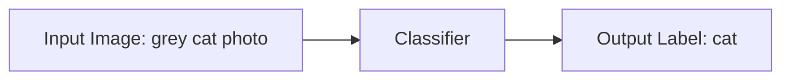

**Figure caption:** The image classification task takes a raw image as input and outputs one label from a predefined discrete set (e.g., {dog, cat, truck, plane, ...}).

Slides from Andrej Karpathy and Fei-Fei Li. http://vision.stanford.edu/teaching/cs231n/

## Page 7 - Image Classification: The Semantic Gap Problem


### Image Classification: Problem

- Figure description:
  - Left: photograph of a grey cat sitting on a wooden fence post
  - Right: a zoomed-in grid of numbers (pixel intensity values, e.g., 08, 02, 22, 97, 38...) labeled "What the computer sees" — showing that to a computer, an image is just a large 2D array of numeric (RGB/grayscale) pixel values, not a semantic object
  - Lines connect a small patch of the cat image (near its nose) to the corresponding block of numbers in the grid, illustrating the pixel-level representation

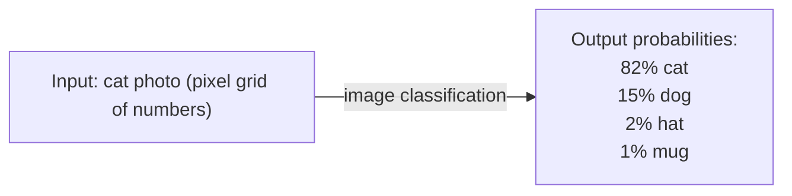

**Figure caption:** Illustrates the "semantic gap" — the raw pixel array a computer perceives versus the classification pipeline that converts pixels into class probability scores (82% cat, 15% dog, 2% hat, 1% mug).

## Page 8 - Recall: Challenges of Recognition


### Recall from last time: Challenges of recognition

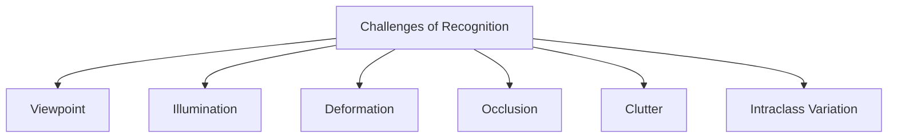

**Figure caption:** Taxonomy of six core challenges that make visual recognition difficult.

- Figure description (photographic examples for each challenge, spatial layout — top row then bottom row):
  - **Viewpoint** (top-left): A camera icon with a curved arrow pointing toward a photo of a cat, next to a zoomed pixel-value grid — illustrating that the same object can be captured from different camera viewpoints/angles, changing its pixel representation.
  - **Illumination** (top, second): Close-up photo of a cat's face lit dramatically from one side against a dark background — illustrating lighting variation.
  - **Deformation** (top, third): Photo of a cat lying on its back in a stretched, twisted pose on pavement — illustrating non-rigid body deformation.
  - **Occlusion** (top-right): Photo of a cream leather couch where only a cat's tail is visible peeking from behind a cushion — illustrating partial object occlusion.
  - **Clutter** (bottom-left): Photo of a cat camouflaged among dry leaves and foliage on the ground — illustrating background clutter making the object hard to distinguish.
  - **Intraclass Variation** (bottom-right): Photo of five kittens of different colors and fur patterns (orange, grey-striped, white) standing together on grass — illustrating variation within the same class ("cat").
  - Image credits (small text under each photo): CC0 1.0 public domain / CC-BY 2.0 licensed, various photographers (Umberto Salvagnin, jonsson, etc.)

**Note on animation-build duplication:** Page 8 recaps prior-lecture content (challenges of recognition) as a standalone review slide; no build-duplicate relationship detected within pages 1-8.
## Page 9 - Challenges in Image Recognition


**Figure 6.4** Challenges in image recognition: (a) sample images from the Xerox 10 class dataset (*Csurka, Dance* et al. *2006*) © 2007 Springer; (b) axes of difficulty and variation from the ImageNet dataset (*Russakovsky, Deng* et al. *2015*) © 2015 Springer.

**(a) Xerox 10-class dataset sample images** — a grid of photographs illustrating within-class variation across categories such as bicycles, books/bookshelves, chairs, phones, and shoes/sandals, each shown in 3 example images per row.

**(b) ImageNet axes of difficulty (Low → High variation)** — each row shows a spectrum of example object classes ordered from low to high along a given challenge dimension:

- **Object Scale**: Candle → Oyster → Cannon → Spider Web
- **Number of Instances**: Lizard → Stocking → Mushroom → Strawberry
- **Image Clutter**: Compass → Racket → Minivan → Steel Drum
- **Deformability**: Canoe → Pill Bottle → Horse-cart → Monkey
- **Amount of Texture**: Skewdriver → Hatchet → Pool Table → Leopard
- **Color Distinctiveness**: Mug → Tank → Ant → Red Wine
- **Shape Distinctiveness**: Jigsaw Puzzle → Foreland → Lion → Bell
- **Real-world Size**: Orange → Laptop → Four-poster → Airliner

Each row is depicted as a horizontal double-headed arrow spanning "Low" (left) to "High" (right), with four representative photo examples placed along the spectrum.

---

## Page 10 - An Image Classifier


### An image classifier

```python
def classify_image(image):
    # Some magic here?
    return class_label
```

Unlike e.g. sorting a list of numbers,

**no obvious way** to hard-code the algorithm for recognizing a cat, or other classes.

*Slide credit: Fei-Fei Li & Justin Johnson & Serena Yeung*

---

## Page 11 - Data-Driven Approach (Overview)


### Data-driven approach

- Collect a database of images with labels
- Use ML to train an image classifier
- Evaluate the classifier on test images

**Example training set**

- Photographs are organized into four labeled columns, each containing 15 example images (3 columns × 5 rows per category):
  - **cat** — various cats (tabby, black, orange, calico) in different poses and backgrounds
  - **dog** — various dogs (dark-coated, spotted, husky) in outdoor and indoor settings
  - **mug** — various mugs and cups of different shapes, colors, and materials
  - **hat** — various hats and knitted caps worn by different people

*Slides from Andrej Karpathy and Fei-Fei Li — http://vision.stanford.edu/teaching/cs231n/*

---

## Page 12 - Data-Driven Approach (Code)


> **Note:** This page is a build/continuation of Page 11 — same title "Data-driven approach" and same bullet points and training-set image grid, with an added code snippet below.

### Data-driven approach

- Collect a database of images with labels
- Use ML to train an image classifier
- Evaluate the classifier on test images

```python
def train(train_images, train_labels):
    # build a model of images -> labels

def predict(image):
    # evaluate the model on the image
    return class_label
```

*Slides from Andrej Karpathy and Fei-Fei Li — http://vision.stanford.edu/teaching/cs231n/*

---

## Page 13 - Training Pipeline


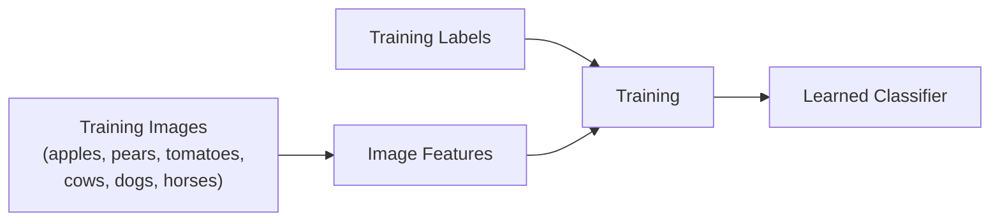

**Figure caption:** The training pipeline — training images are converted into image features, which together with training labels are fed into a training process to produce a learned classifier.

Dataset: ETH-80, by B. Leibe. Slide credit: D. Hoiem, L. Lazebnik.

---

## Page 14 - Training and Testing Pipeline


> **Note:** This page builds on Page 13 by adding the "Testing" flow beneath the same "Training" flow.

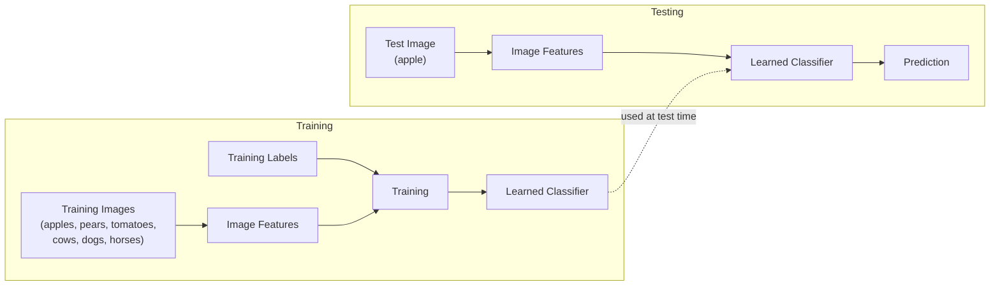

**Figure caption:** Full pipeline showing both training (training images/labels → features → training → learned classifier) and testing (a test image → features → the learned classifier → prediction).

Dataset: ETH-80, by B. Leibe. Slide credit: D. Hoiem, L. Lazebnik.

---

## Page 15 - Bag of Words


### Bag of Words


**Figure caption:** Typical bag-of-words processing pipeline — key patches are detected, features extracted at each patch, quantized into a histogram over visual words, and classified using a decision surface.

Below the pipeline boxes, illustrative outputs for each stage are shown:

- **Key-patch detection**: a cat's face photo with several blue circles marking detected keypoint patches (around eyes, nose, ears).
- **Feature extraction**: a cropped keypoint patch (cat's nose/mouth region) mapped to a binary feature vector $x = \begin{bmatrix} 0 \\ 1 \\ \vdots \\ 0 \end{bmatrix}$.
- **Histogram computation**: a bar chart showing a distribution (histogram) over learned visual words (feature cluster centers), with varying bar heights.
- **Classification**: a 2D scatter plot with red squares and blue dots as two classes, separated by a straight decision boundary line (e.g., learned via SVM).

**Figure 6.6** A typical processing pipeline for a bag-of-words category recognition system (*Csurka, Dance* et al. *2006*) © 2007 Springer. Features are first extracted at keypoints and then quantized to get a distribution (histogram) over the learned visual words (feature cluster centers). The feature distribution histogram is used to learn a decision surface using a classification algorithm, such as a support vector machine.

*Computer Vision: Algorithms and Applications, 2nd ed.*

---

## Page 16 - Classifiers (Overview List)


### Classifiers

- Nearest Neighbor
- kNN ("k-Nearest Neighbors")
- Linear Classifier
- Neural Network
- Deep Neural Network
- …
## Page 17 - First: Nearest Neighbor (NN) Classifier


# First: Nearest Neighbor (NN) Classifier

- **Train**
  - Remember all training images and their labels
- **Predict**
  - Find the closest (most similar) training image
  - Predict its label as the true label

---

## Page 18 - CIFAR-10 Dataset Example


# CIFAR-10 and NN results

**Example dataset: CIFAR-10**
- 10 labels
- 50,000 training images, each image is tiny: 32x32
- 10,000 test images

- Class labels (rows) with sample thumbnail images (columns) for each class:
  - airplane
  - automobile
  - bird
  - cat
  - deer
  - dog
  - frog
  - horse
  - ship
  - truck

**Figure:** A grid of sample CIFAR-10 images, organized with one row per class label (airplane, automobile, bird, cat, deer, dog, frog, horse, ship, truck), each row showing ~10 example thumbnail photos belonging to that class.

---

## Page 19 - CIFAR-10 and NN Results (Nearest Neighbors)


*Note: This page is a build/continuation of Page 18 — it retains the same CIFAR-10 class grid on the left and adds a new panel on the right.*

# CIFAR-10 and NN results

**Example dataset: CIFAR-10**
- 10 labels
- 50,000 training images
- 10,000 test images

Left panel: class label thumbnail grid (same as Page 18) — airplane, automobile, bird, cat, deer, dog, frog, horse, ship, truck.

Right panel: **"For every test image (first column), examples of nearest neighbors in rows"**

- Structure:
  - Column 1: a single test image (e.g., ship, ship, dog, deer, boat, cat, horse, cat, deer)
  - Arrow (→) pointing from the test image toward a row of retrieved images
  - Columns 2–10: the nearest-neighbor training images retrieved for that test image, ranked left to right by similarity

**Figure caption:** Demonstrates qualitative nearest-neighbor retrieval on CIFAR-10 — each row shows a test image followed by its top nearest neighbors found in the training set via pixel-distance comparison.

Source note: *Slides from Andrej Karpathy and Fei-Fei Li, http://vision.stanford.edu/teaching/cs231n/*

---

## Page 20 - k-Nearest Neighbor (k-NN)


# k-nearest neighbor

- Find the k closest points from training data
- Take **majority vote** from K closest points

- Three side-by-side scatter/decision-region plots:
  - **"the data"**: raw 2D scatter plot with three classes of points colored red, green, and blue, showing overlapping clusters (red cluster upper-left, green cluster upper-right, blue cluster lower-middle, with scattered outliers of all colors)
  - **"NN classifier"**: the same 2D space partitioned into red/green/blue decision regions using 1-nearest-neighbor; boundaries are jagged and irregular, with small "islands" of one color appearing inside regions of another color (sensitive to noise/outliers)
  - **"5-NN classifier"**: the same space partitioned using 5-nearest-neighbors; boundaries are smoother, noise islands are mostly gone, and white/gray regions appear where the vote is tied (ambiguous regions)

**Figure caption:** Compares decision boundaries produced by 1-NN (noisy, overfit to outliers) versus 5-NN (smoother, more robust boundaries with visible tie/ambiguous zones) on the same synthetic 3-class dataset.

---

## Page 21 - What Does This Look Like? (Nearest Neighbor Predictions, Unlabeled)


# What does this look like?

- A grid of paired rows demonstrating NN classification results:
  - Each row has a query/test image on the left, an arrow (→), followed by ~9 retrieved/predicted images to its right.
  - Rows shown (by apparent test image content): boat, small white dog, orange animal/fox, frog, truck, bird/ostrich, boat, cat, frog, person/flamingo-like figure.
- No color-coded correctness indicators are present yet on this page (see Page 22, which is a build of this page adding red/green borders).

**Figure caption:** Presents raw nearest-neighbor prediction examples (test image → retrieved neighbor images) without indicating which predictions are correct, prompting the audience to judge quality visually.

**Animation-build note:** Page 22 is a build of this page — it reuses the identical image grid and layout, adding colored (red/green) borders around the first retrieved result to indicate incorrect/correct predictions.

---

## Page 22 - What Does This Look Like? (With Correctness Highlighted)


*Build of Page 21: same test-image-to-nearest-neighbor grid, now annotated with colored borders.*

# What does this look like?

- Same structure as Page 21: each row shows a test image, an arrow (→), and a row of nearest-neighbor retrieved images.
- The first retrieved (top match) image in each row now has a colored border:
  - **Red border** = incorrect prediction (majority of rows: rows 1, 3, 4, 5, 6, 9 appear red-bordered)
  - **Green border** = correct prediction (rows 2, 7, 8 appear green-bordered)

**Figure caption:** Highlights which top-1 nearest-neighbor predictions match the true class (green) versus mismatch (red), illustrating that simple pixel-distance NN often retrieves visually similar but semantically wrong matches (e.g., background/color similarity dominating over object identity).

---

## Page 23 - Distance Metric: L1 Distance


# How to find the most similar training image? What is the distance metric?

**L1 distance:**

```latex
d_1(I_1, I_2) = \sum_{p} |I_1^p - I_2^p|
```

Where $I_1$ denotes image 1, and $p$ denotes each pixel.

Worked example — computing L1 distance between a test image and a training image (4×4 pixel patches):

**test image**
| 56 | 32 | 10 | 18 |
|----|----|----|----|
| 90 | 23 | 128 | 133 |
| 24 | 26 | 178 | 200 |
| 2 | 0 | 255 | 220 |

minus

**training image**
| 10 | 20 | 24 | 17 |
|----|----|----|----|
| 8 | 10 | 89 | 100 |
| 12 | 16 | 178 | 170 |
| 4 | 32 | 233 | 112 |

equals

**pixel-wise absolute value differences**
| 46 | 12 | 14 | 1 |
|----|----|----|----|
| 82 | 13 | 39 | 33 |
| 12 | 10 | 0 | 30 |
| 2 | 32 | 22 | 108 |

Sum of all differences → **456**

Source note: *Slides from Andrej Karpathy and Fei-Fei Li, http://vision.stanford.edu/teaching/cs231n/*

---

## Page 24 - Choice of Distance Metric (L1 vs L2)


# Choice of distance metric

- Hyperparameter

**L1 (Manhattan) distance**

```latex
d_1(I_1, I_2) = \sum_{p} |I_1^p - I_2^p|
```

**L2 (Euclidean) distance**

```latex
d_2(I_1, I_2) = \sqrt{\sum_{p} (I_1^p - I_2^p)^2}
```

Source note: *Slides from Andrej Karpathy and Fei-Fei Li, http://vision.stanford.edu/teaching/cs231n/*
## Page 25 - K-Nearest Neighbors: Distance Metric


**K-Nearest Neighbors: Distance Metric**

Two common distance metrics used to compare images for KNN classification:

**L1 (Manhattan) distance**

```latex
d_1(I_1, I_2) = \sum_{p} \left| I_1^p - I_2^p \right|
```

**L2 (Euclidean) distance**

```latex
d_2(I_1, I_2) = \sqrt{\sum_{p} \left( I_1^p - I_2^p \right)^2}
```

- **Figure:** Two side-by-side decision-boundary plots (K = 1) for a 2D toy dataset with five classes (blue, red, green, yellow/orange, purple points):
  - Left plot (L1/Manhattan distance): the colored decision regions have boundaries that tend to align with the coordinate axes, producing more angular/jagged, diamond-like region edges.
  - Right plot (L2/Euclidean distance): the decision regions have smoother, more rounded/curved boundaries between classes.
  - Both plots partition the same 2D point cloud into five colored regions (blue, green, red/salmon, purple, yellow), one per class, with the scattered training points shown as dots in their class color.
  - A small yellow "island" region appears near the center of both plots (an isolated point creating its own decision region), illustrating the classic overfitting behavior of K=1 nearest neighbor.

Demo: [http://vision.stanford.edu/teaching/cs231n-demos/knn/](http://vision.stanford.edu/teaching/cs231n-demos/knn/)

---

## Page 26 - Hyperparameters


**Hyperparameters**

- What is the **best distance** to use?
- What is the **best value of k** to use?
- These are **hyperparameters**: choices about the algorithm that we set rather than learn.
- How do we set them?
  - One option: try them all and see what works best

---

## Page 27 - Setting Hyperparameters (Idea #1)


**Setting Hyperparameters**

**Idea #1**: Choose hyperparameters that work best on the data.


**Figure caption:** The entire available dataset is shown as a single undivided block, used both to select hyperparameters and evaluate performance.

---

## Page 28 - Setting Hyperparameters (Idea #1, why it's bad)


> **Note:** This page is an animation-build of Page 27 — it reveals the same "Your Dataset" diagram plus a critique callout for Idea #1.

**Setting Hyperparameters**

**Idea #1**: Choose hyperparameters that work best on the data.


**Figure caption:** Same single-block dataset diagram as Page 27.

> **BAD:** K = 1 always works perfectly on training data.

---

## Page 29 - Setting Hyperparameters (Idea #2)


> **Note:** This page is an animation-build of Page 28 — it retains the Idea #1 critique and adds a new Idea #2 diagram below it.

**Setting Hyperparameters**

**Idea #1**: Choose hyperparameters that work best on the data.


> **BAD:** K = 1 always works perfectly on training data.

**Idea #2**: Split data into **train** and **test**, choose hyperparameters that work best on test data.

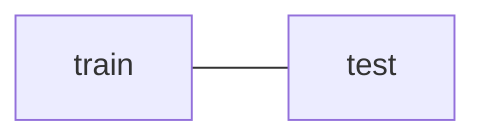

**Figure caption:** The dataset bar is partitioned into a larger "train" segment and a smaller "test" segment.

---

## Page 30 - Setting Hyperparameters (Idea #2, why it's bad)


> **Note:** This page is an animation-build of Page 29 — it adds a critique callout for Idea #2 (no new diagram).

**Setting Hyperparameters**

**Idea #1**: Choose hyperparameters that work best on the data.


> **BAD:** K = 1 always works perfectly on training data.

**Idea #2**: Split data into **train** and **test**, choose hyperparameters that work best on test data.


> **BAD:** No idea how algorithm will perform on new data.

---

## Page 31 - Setting Hyperparameters (Idea #3, train/val/test split)


> **Note:** This page is an animation-build of Page 30 — it keeps Idea #1 and Idea #2 (with their critiques) and adds a new Idea #3 diagram.

**Setting Hyperparameters**

**Idea #1**: Choose hyperparameters that work best on the data.


> **BAD:** K = 1 always works perfectly on training data.

**Idea #2**: Split data into **train** and **test**, choose hyperparameters that work best on test data.


> **BAD:** No idea how algorithm will perform on new data.

**Idea #3**: Split data into **train**, **val**, and **test**; choose hyperparameters on val and evaluate on test. — **Better!**

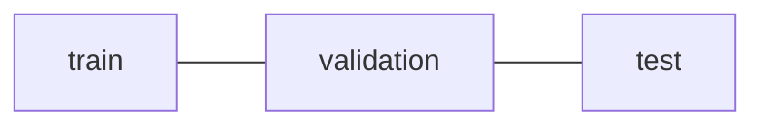

**Figure caption:** The dataset bar is now split into three segments — train (largest), validation (small), and test (small, held out) — where hyperparameters are tuned on validation and final performance is reported only on test.

---

## Page 32 - Setting Hyperparameters (Idea #4: Cross-Validation)


**Setting Hyperparameters**


**Idea #4**: **Cross-Validation**: Split data into **folds**, try each fold as validation and average the results.

| Iteration | Fold 1 | Fold 2 | Fold 3 | Fold 4 | Fold 5 | Held-out |
|---|---|---|---|---|---|---|
| Round 1 | train | train | train | train | **validation** | test |
| Round 2 | train | train | train | **validation** | train | test |
| Round 3 | train | train | **validation** | train | train | test |

**Figure caption:** The dataset (excluding a fixed final "test" segment) is divided into 5 folds; across rounds, a different fold rotates into the "validation" role while the rest serve as "train," and results from all rounds are averaged to select hyperparameters.

Useful for small datasets, but not used too frequently in deep learning.
## Page 33 - Cross-Validation Example for Choosing k


- **Example of 5-fold cross-validation for the value of k.**
- Each point on the plot represents a single outcome (accuracy for one fold at a given k).
- The line traces the **mean** cross-validation accuracy across folds; the error bars indicate **standard deviation**.
- Plot details:
  - X-axis: **k** (ranging from 0 to 120)
  - Y-axis: **Cross-validation accuracy** (ranging from 0.24 to 0.32)
  - A vertical red reference line is drawn near k ≈ 10
  - Accuracy rises sharply from k≈0 to a peak around k≈5–10, then gradually declines as k increases toward 100–120
- **Conclusion (highlighted in red):** "Seems that k ~= 7 works best for this data."

---

## Page 34 - Recap: How to Pick Hyperparameters?


- **Methodology**
  - Train and test
  - Train, validate, test
- Train for original model
- Validate to find hyperparameters
- Test to understand generalizability

---

## Page 35 - kNN: Complexity and Storage


- N training images, M test images
- Training: $O(1)$
- Testing: $O(MN)$
- Hmm…
  - Normally need the opposite
  - Slow training (ok), fast testing (necessary)

---

## Page 36 - k-Nearest Neighbor on Images Never Used


**k-Nearest Neighbor on images never used.**
- Terrible performance at test time
- Distance metrics on the level of whole images can be very unintuitive

**Figure description** (photographic illustration, not a flow diagram):
- Four face images arranged left to right, each labeled underneath: **original**, **shifted**, **messed up**, **darkened**
- "original": unmodified portrait photo of a woman
- "shifted": same portrait shifted slightly to the side
- "messed up": same portrait but with three black rectangular boxes covering the eyes and mouth region
- "darkened": same portrait rendered with reduced brightness/darker skin tone
- Caption below the images: "(all 3 images have same L2 distance to the one on the left)"
- This demonstrates that L2 (Euclidean) distance on raw pixels fails to capture perceptual/semantic similarity — shifting, occluding, and darkening an image can all produce identical L2 distance to the original despite very different visual content.

---

## Page 37 - k-Nearest Neighbors: Summary


- In **image classification** we start with a **training set** of images and labels, and must predict labels on the **test set**.
- The **K-Nearest Neighbors** classifier predicts labels based on nearest training examples.
- Distance metric and K are **hyperparameters**.
- Choose hyperparameters using the **validation set**; only run on the test set once at the very end!

---

## Page 38 - Linear Classifiers (Analogy)


**Figure description** (annotated photograph, not a flowchart — physical Lego-brick illustration):
- A photo of a child's hand stacking Lego Duplo blocks into a tower (colors from bottom to top: yellow/red striped, yellow, green, blue, blue, green).
- Two hand-drawn labels with arrows point to different parts of the tower:
  - **"Linear classifiers"** (bottom-left label) — two arrows point to the **lower blocks** of the tower (the yellow/red/green base bricks)
  - **"Neural Network"** (top label) — one curved arrow points down to a **single brick near the top** of the tower (where the hand is placing/holding a green brick)
- Analogy conveyed: a neural network is built up from many simple linear-classifier "building blocks," much like a tall Lego tower is built from individual bricks — each brick (linear classifier) is simple, but stacking many of them (neural network) creates something more complex.
- Attribution note: "This image is CC0 1.0 public domain"

---

## Page 39 - Score Function (Overview)


*Note: This page is a simpler animation-build predecessor of Page 40 — it shows only the image→class-scores flow without the parametric formula, which Page 40 adds.*

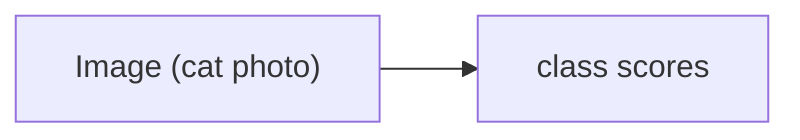
**Figure caption:** A cat image is passed through a score function to produce class scores (no formula shown yet — high-level concept only).

Attribution: "Slides from Andrej Karpathy and Fei-Fei Li — http://vision.stanford.edu/teaching/cs231n/"

---

## Page 40 - Score Function: f (Parametric Approach)


**Parametric approach**

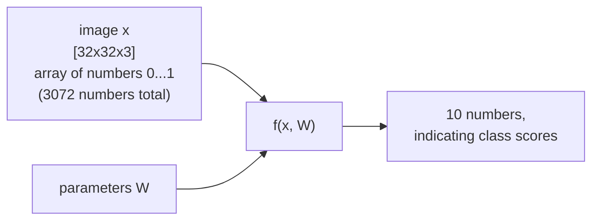
**Figure caption:** The score function $f(x, W)$ takes an image $x$ (a 32x32x3 array, 3072 numbers total, values 0...1) and parameters $W$ as input, and outputs 10 numbers representing class scores.

- Image shown: small cat photo, labeled **[32x32x3]** array of numbers 0...1 (3072 numbers total)
- Function notation: $f(\mathbf{x}, \mathbf{W})$ where $\mathbf{x}$ = image (blue), $\mathbf{W}$ = parameters (red)
- Output: **10** numbers, indicating class scores
## Page 41 - Parametric Approach: Linear Classifier (score function, no bias)


**Parametric approach: Linear classifier**

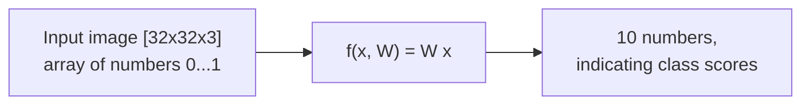
**Figure caption:** An input image is stretched into a column vector and multiplied by a weight matrix to produce class scores.

- Score function:
```latex
f(x, W) = Wx
```
- Dimensions:
  - $f(x,W)$: $10 \times 1$ (output — 10 class scores)
  - $W$: $10 \times 3072$ (the **parameters**, or "weights")
  - $x$: $3072 \times 1$ (flattened image vector)
- Input image: $[32 \times 32 \times 3]$ array of numbers in range $0 \dots 1$ (example shown: a cat image).
- Output: 10 numbers, indicating class scores.

## Page 42 - Parametric Approach: Linear Classifier (with bias term)


> **Note (animation build):** Page 42 is a build of Page 41 — identical diagram, with the addition of a bias term `(+b)` of dimension $10\times1$ added to the score function.

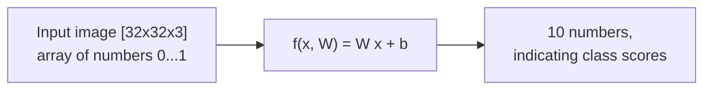
**Figure caption:** Same linear classifier pipeline as Page 41, now including an additive bias vector.

- Score function:
```latex
f(x, W) = Wx + (b)
```
- Dimensions:
  - $f(x,W)$: $10 \times 1$
  - $W$: $10 \times 3072$ (parameters, or "weights")
  - $x$: $3072 \times 1$
  - $b$: $10 \times 1$ (bias term, added after the matrix multiply)
- Input image: $[32\times32\times3]$ array of numbers $0\dots1$.
- Output: 10 numbers indicating class scores.

## Page 43 - Linear Classifier: Annotated Score Function


**Linear Classifier**

"Define a **score function**":

```latex
f(x_i, W, b) = W x_i + b
```

Annotated components (labeled callouts on the equation):
- $f(x_i, W, b)$ → **class scores**
- $x_i$ → **data (image)**
- $W$ → **"weights"**, also referred to collectively (with $b$) as **"parameters"**
- $b$ → **"bias vector"**

> **Definition:** A linear classifier computes class scores as an affine (linear + bias) function of the flattened input image: $f(x_i, W, b) = Wx_i + b$, where $W$ ("weights") and $b$ ("bias vector") are the learned **parameters**.

## Page 44 - Worked Example: 4-Pixel Image, 3 Classes


**Example with an image with 4 pixels, and 3 classes (cat/dog/ship)**

**Problem:** Given a toy image with 4 pixels (stretched into a column vector $x_i$), a weight matrix $W$ (3 classes × 4 pixels), and a bias vector $b$ (3×1), compute the class scores $f(x_i; W, b) = Wx_i + b$.

**Setup:**
- Input image is stretched into a single column: $x_i = [56, 231, 24, 2]^T$

Weight matrix $W$ (rows = classes, columns = pixel weights):

| Class | w1 | w2 | w3 | w4 |
|-------|------|-------|------|------|
| cat   | 0.2  | -0.5  | 0.1  | 2.0  |
| dog   | 1.5  | 1.3   | 2.1  | 0.0  |
| ship  | 0    | 0.25  | 0.2  | -0.3 |

Bias vector $b$:

| Class | bias |
|-------|------|
| cat   | 1.1  |
| dog   | 3.2  |
| ship  | -1.2 |

**Solution:** Computing $f(x_i; W, b) = Wx_i + b$:

| Class | Score |
|-------|-------|
| cat   | -96.8 |
| dog   | 437.9 |
| ship  | 61.95 |

Result: the classifier assigns the highest score to the **dog** class for this (toy, untrained) example — illustrating that with arbitrary/untrained weights, scores need not match the true label (the image is actually a cat).

## Page 45 - Interpretation: Template Matching


**Interpretation: Template matching**

- Each row of the learned weight matrix $W$ can be reshaped back into the shape of an input image, producing a visual "template" for each class.
- The score function is $f(x_i, W, b) = Wx_i + b$; each class's score is the dot product (correlation) between the input image and that class's template.
- Ten learned templates are shown side-by-side, one per CIFAR-10 class:
  - plane — blue, blob-shaped silhouette resembling sky/plane on a blue background
  - car — a dark, elongated blob on a purple/blue background
  - bird — a green background with a darker central blob
  - cat — a muted pink/gray background with a soft blob
  - deer — greenish background with a brown central shape
  - dog — brownish/tan background with a lighter blob
  - frog — yellow-green background with a yellow-brown blob
  - horse — brownish background with a reddish/maroon horse-like shape
  - ship — blue background with a lighter blob (boat-like)
  - truck — dark reddish-purple background with a blocky shape

**Figure:** Ten small color images, each the visualization of one row of the learned weight matrix $W$, reshaped to $32\times32\times3$ — effectively a "template" the linear classifier correlates against new images for that class.

## Page 46 - Geometric Interpretation


**Geometric Interpretation**

```latex
f(x_i, W, b) = W x_i + b
```

- Each image is treated as a single point in a high-dimensional pixel space (illustrated here in 2D for intuition).
- The linear classifier for each class defines a line (hyperplane in general) through this space, and moving in the direction of that class's weight vector increases that class's score.
- Three example classifier lines are drawn on the scatter plot:
  - **airplane classifier** (blue line): separates airplane/boat/plane images (upper-left cluster) from the rest; arrow points toward increasing airplane score (upper-left direction).
  - **car classifier** (red line): separates car images (upper-right cluster of car photos) from the rest; arrow points toward increasing car score (upper-right direction).
  - **deer classifier** (green line): separates deer/animal images (lower-middle cluster) from the rest; arrow points toward increasing deer score (lower-right direction).
- Images are scattered around the origin (0) as points, grouped roughly by visual/class similarity: boats/planes upper-left, cars upper-right, animals (cat, frog, deer, chicken) lower-middle/lower-right.

**Figure:** A 2D scatter of image "points" with three linear decision boundaries (airplane, car, deer classifiers) drawn as lines through the space, each with an arrow indicating the direction of increasing score for that class.

## Page 47 - Linear Classifiers: Separating Hyperplane


**Linear classifiers**

- Find a linear function (**hyperplane**) to separate positive and negative examples.
- Decision rule:

```latex
x_i \text{ positive}: \quad x_i \cdot w + b \geq 0
```
```latex
x_i \text{ negative}: \quad x_i \cdot w + b < 0
```

- Scatter plot shows red dots (positive examples, upper-right region) and blue dots (negative examples, lower-left region).
- Multiple candidate separating lines (5 black lines) are drawn, all passing through roughly the same central region, each fanning out at a different angle — representing different possible hyperplanes that separate the two classes.
- Open question posed: "Which hyperplane is best? We will come back to this later."

> **Definition:** A linear classifier finds a hyperplane $x\cdot w + b = 0$ such that points on one side ($x_i \cdot w + b \geq 0$) are classified positive, and points on the other side ($x_i \cdot w + b < 0$) are classified negative.

## Page 48 - Hard Cases for a Linear Classifier


**Hard cases for a linear classifier**

Three toy 2D decision-region examples, each showing why a single linear boundary can fail:

- **Case 1 — Quadrant split:**
  - Class 1: first and third quadrants (top-right and bottom-left, shown blue)
  - Class 2: second and fourth quadrants (top-left and bottom-right, shown pink)
  - This is the classic **XOR** problem (hand-annotated in red on the slide) — not linearly separable, since no single straight line can separate diagonally-opposite quadrants.

- **Case 2 — Ring/annulus:**
  - Class 1: points with $1 \leq \|x\|_2 \leq 2$ (an annular ring shown in blue)
  - Class 2: everything else (center disk and outer region, shown pink)
  - A linear boundary cannot separate a ring-shaped region from the region inside/outside it.

- **Case 3 — Three disjoint modes:**
  - Class 1: three separate blob "modes" (blue circles scattered in different quadrants)
  - Class 2: everything else (pink background)
  - Multiple disconnected clusters of the same class cannot be captured by one linear boundary.

**Figure:** Three grid diagrams (quadrant split labeled "XOR", a ring/annulus, and three scattered blobs) illustrating classification patterns that are not linearly separable, motivating the need for non-linear classifiers.
## Page 49 - Linear Classifier: Three Viewpoints


# Linear Classifier: Three Viewpoints

The slide presents three complementary ways to understand the linear classifier, arranged in three columns separated by vertical dividers.

### Algebraic Viewpoint

$$f(x, W) = Wx$$

Worked numeric example (stretching an image into a column vector, then computing scores as $Wx + b$):

- Input image (e.g. a 2×2 image with values 56, 231, 24, 2) is **stretched into a column vector**: $x = [56, 231, 24, 2]^T$
- Weight matrix $W$ (3 rows × 4 columns):

| | | | |
|---|---|---|---|
| 0.2 | -0.5 | 0.1 | 2.0 |
| 1.5 | 1.3 | 2.1 | 0.0 |
| 0 | 0.25 | 0.2 | -0.3 |

- Bias vector: $b = [1.1, 3.2, -1.2]^T$
- Computation: $Wx + b = $ result

| Class | Score |
|---|---|
| Cat score | -96.8 |
| Dog score | 437.9 |
| Ship score | 61.95 |

### Visual Viewpoint

**One template per class** — each class is represented by a single learned visual template. A row of 10 blurred/averaged "template" images is shown for the CIFAR-10 classes: plane, car, bird, cat, deer (top row) and dog, frog, horse, ship, truck (bottom row). Each template is a blurry, color-averaged representation of what the classifier considers typical for that class.

### Geometric Viewpoint

**Hyperplanes cutting up space** — each class's row of $W$ defines a hyperplane in the high-dimensional image (pixel) space. The figure shows:
- A 2D scatter of small thumbnail images (as points in pixel space), with three labeled linear boundaries: "airplane classifier" (blue line), "car classifier" (red line), "deer classifier" (green line), each cutting the space into a positive and negative region.
- Below/left, a 3D plot showing a piecewise linear (orange/blue) surface, representing the score function extended into a third (score) dimension.

**Figure caption:** Three equivalent views of the same linear classifier: as matrix algebra ($Wx+b$), as one learned template image per class, and as a set of hyperplanes partitioning pixel space.

---

## Page 50 - Example Class Scores for Three Images


**So far**: Defined a (linear) score function $f(x, W) = Wx + b$

Example class scores for 3 images (cat, car/automobile photo, frog) for some particular $W$:

| Class | Cat image | Car image | Frog image |
|---|---|---|---|
| airplane | -3.45 | -0.51 | 3.42 |
| automobile | -8.87 | **6.04** | 4.64 |
| bird | 0.09 | 5.31 | 2.65 |
| cat | **2.9** | -4.22 | 5.1 |
| deer | 4.48 | -4.19 | 2.64 |
| dog | 8.02 | 3.58 | 5.55 |
| frog | 3.78 | 4.49 | **-4.34** |
| horse | 1.06 | -4.37 | -1.5 |
| ship | -0.36 | -2.09 | -4.79 |
| truck | -0.72 | -2.93 | 6.14 |

*(Bolded values indicate the score for the true/ground-truth class of each image — note the cat image's cat score is low and the frog image's frog score is actually negative, illustrating a poor classifier.)*

Question posed: **How can we tell whether this $W$ is good or bad?**

Image credits: Cat image by Nikita, licensed under CC-BY 2.0; Car image is CC0 1.0 public domain; Frog image is in the public domain.

---

## Page 51 - Recap


## Recap

- Learning methods
  - k-Nearest Neighbors
  - **Linear classification**
- Classifier outputs a **score function** giving a score to each class
- How do we define how good a classifier is based on the training data? (Spoiler: define a *loss function*)

---

## Page 52 - Linear Classification: Output Scores and TODOs


**Note:** This page reuses the same score table from Page 50 (cat/car/frog images, same 10-class scores) labeled "Output scores" — it is an incremental build of Page 50, now adding a TODO list for the next steps.

## Linear classification

Output scores (same table as Page 50):

| Class | Cat image | Car image | Frog image |
|---|---|---|---|
| airplane | -3.45 | -0.51 | 3.42 |
| automobile | -8.87 | **6.04** | 4.64 |
| bird | 0.09 | 5.31 | 2.65 |
| cat | **2.9** | -4.22 | 5.1 |
| deer | 4.48 | -4.19 | 2.64 |
| dog | 8.02 | 3.58 | 5.55 |
| frog | 3.78 | 4.49 | **-4.34** |
| horse | 1.06 | -4.37 | -1.5 |
| ship | -0.36 | -2.09 | -4.79 |
| truck | -0.72 | -2.93 | 6.14 |

**TODO:**
1. Define a **loss function** that quantifies our unhappiness with the scores across the training data.
2. Come up with a way of efficiently finding the parameters that minimize the loss function. **(optimization)**

---

## Page 53 - Loss Function Setup: Dataset Notation


Suppose: 3 training examples, 3 classes. With some $W$ the scores $f(x, W) = Wx$ are:

| | Cat image | Car image | Frog image |
|---|---|---|---|
| cat | **3.2** | 1.3 | 2.2 |
| car | 5.1 | **4.9** | 2.5 |
| frog | -1.7 | 2.0 | **-3.1** |

*(Bold values are the scores for the ground-truth class of each image.)*

A **loss function** tells how good our current classifier is.

Given a dataset of examples:

$$\{(x_i, y_i)\}_{i=1}^N$$

Where $x_i$ is image and $y_i$ is (integer) label.

Loss over the dataset is a sum of loss over examples:

$$L = \frac{1}{N}\sum_i L_i(f(x_i, W), y_i)$$

---

## Page 54 - Loss Function, Cost/Objective Function


## Loss function, cost/objective function

- Given ground truth labels ($y_i$), scores $f(x_i, \mathbf{W})$
  - how unhappy are we with the scores?
- Loss function or objective/cost function measures unhappiness
- During training, **want to find the parameters W that minimizes the loss function**

---

## Page 55 - Simpler Example: Binary Classification


## Simpler example: binary classification

- Two classes (e.g., "cat" and "not cat")
  - AKA "positive" and "negative" classes

Illustrative photographs:
- Left column, labeled **cat** (in blue text): a kitten reaching a paw toward the camera; a cat peeking out from inside a rolled-up rug/blanket.
- Right column, labeled **not cat** (in red text): a golden Labrador puppy looking at the camera; a llama lying on grass.

**Figure:** Four example photographs illustrating the binary "cat" vs. "not cat" classification task — two cat images labeled positive (blue), two non-cat images (puppy, llama) labeled negative (red).

---

## Page 56 - Linear Classifiers: Separating Hyperplane


## Linear classifiers

Find linear function (*hyperplane*) to separate positive and negative examples.

Decision rule:

$$x_i \text{ positive}: \quad x_i \cdot w + b \geq 0$$
$$x_i \text{ negative}: \quad x_i \cdot w + b < 0$$

- Scatter plot of 2D points: red dots (positive examples) clustered in the upper-right region; blue dots (negative examples) clustered in the lower-left region.
- Five candidate straight lines (hyperplanes) all pass through roughly the same central point, fanning out at different angles, each attempting to separate the red points from the blue points.
- An annotation points to the fan of lines asking: **"Which hyperplane is best? We need a loss function to decide."**

**Figure:** A 2D scatter of positive (red) and negative (blue) points with five candidate separating lines radiating from a common point, illustrating that many hyperplanes can separate the data and a loss function is needed to pick the best one.
## Page 57 - What is a good loss function?


- One possibility
  - Number of misclassified examples

**Figure** — Three scatter plots, each showing two classes of 2D points (blue dots and red dots) with a straight black decision boundary line separating them:
  - Plot 1: boundary line separates most blue (lower-left) from red (upper-right) points, but 2 points fall on the wrong side → **Loss: 2**
  - Plot 2: boundary line correctly separates all points, no misclassifications → **Loss: 0**
  - Plot 3: a differently-angled boundary line also correctly separates all points → **Loss: 0**
  - All three plots use the same underlying point cloud (blue points scattered lower-left, red points scattered upper-right, with some overlap/noise), only the boundary line's position/angle differs.

- Problems: discrete, can't break ties
- We want the loss to lead to *good generalization*
- We want the loss to work for more than 2 classes

---

## Page 58 - Softmax classifier


```latex
f(x_i, W) = W x_i \quad \text{(score function)}
```

$$
\text{softmax function: } \frac{e^{f_{y_i}}}{\sum_j e^{f_j}}
$$

Example with three classes:

```latex
[1, -2, 0] \rightarrow [e^{1}, e^{-2}, e^{0}] = [2.71, 0.14, 1] \rightarrow [0.7, 0.04, 0.26]
```

Interpretation: squashes values into *probabilities* ranging from 0 to 1

```latex
P(y_i \mid x_i; W)
```

---

## Page 59 - Cross-entropy loss


```latex
f(x_i, W) = W x_i \quad \text{(score function)}
```

> **Note (animation-build flag):** This slide appears to be an early build stage of an animated sequence — only the title "Cross-entropy loss" and the restated score function are shown, with the actual cross-entropy formula not yet revealed on this page (it likely appears fully in a subsequent build step / the Summary slide on Page 61, which shows the complete loss expression).

---

## Page 60 - Losses


- Cross-entropy loss is just one possible loss function
  - One nice property is that it reinterprets scores as probabilities, which have a natural meaning
- SVM (max-margin) loss functions also used to be popular
  - But currently, cross-entropy is the most common classification loss

---

## Page 61 - Summary


- Have score function and loss function
  - Currently, score function is based on linear **classifier**
  - Next, will generalize to convolutional neural **networks**
- Find W and b to minimize loss

```latex
L = \frac{1}{N} \sum_i -\log\left(\frac{e^{f_{y_i}}}{\sum_j e^{f_j}}\right) + \lambda \sum_k \sum_l W_{k,l}^2
```

---

## Page 62 - Additional Readings and References


- **Additional Readings and References:**
- Stanford CS231N
  - [http://cs231n.stanford.edu/](http://cs231n.stanford.edu/)
- [https://www.cs.toronto.edu/~kriz/cifar.html](https://www.cs.toronto.edu/~kriz/cifar.html)

Hands on: [https://github.com/mithunkumarsr/LearnComputerVisionWithMithun/blob/main/CV9_Image_Classification.ipynb](https://github.com/mithunkumarsr/LearnComputerVisionWithMithun/blob/main/CV9_Image_Classification.ipynb)

---

## Page 63 - Thank you (closing slide)


- BITS Pilani (Pilani | Dubai | Goa | Hyderabad) logo
- **Thank you**

---

## Page 64 - Session 10 Title: Attention, Transformers & Vision Transformers (ViT)


> **Note:** This page begins a new lecture session (Session 10), distinct from the Image Classification content of the prior pages. It is a title slide with extensive hand-drawn (red ink) annotations overlaid on a printed template and a Vision Transformer (ViT) architecture diagram.

**Printed/typed content:**
- Computer Vision — S1-24_AIMLCZG525, M.Tech (AIML)
- **Session # 10: Attention, Transformers & Vision Transformers (ViT)**
- Presenter: Dhruba Adhikary
- BITS Pilani logo (Pilani | Dubai | Goa | Hyderabad)

**Hand-drawn annotations (left side, red ink):**
- "Pre-Processing" → "✓ function (BC, MC, —)" → "T.M." box → "O/P"
- "g/p →" feeding into the "T.M." box
- "Dataset → Train, Test, Val" (Val circled)
- "Crossfold Validation →" a row of boxes: fold 1, fold 2, 3, 4 → "Avg →"

**Hand-drawn annotations (center, red ink):**
- "Image classi[fication]"
- Circled terms: "KNN" and "LC" (linear classifier)

**ViT architecture diagram (right side):**

```mermaid
flowchart BT
    Patches["Input image split into patches (grid of small image tiles)"] --> LinProj["Linear Projection of Flattened Patches"]
    LinProj --> PatchEmb["Patch + Position Embedding: 0* (extra learnable class embedding), 1, 2, 3, 4, 5, 6, 7, 8, 9"]
    PatchEmb --> Encoder["Transformer Encoder"]
    Encoder --> MLP["MLP Head"]
    MLP --> ClassOut["Class: Bird / Ball / Car / ..."]
```

**Figure caption:** Vision Transformer (ViT) pipeline — an image is divided into fixed-size patches, flattened and linearly projected, combined with a learnable class token and position embeddings, passed through a Transformer Encoder, and finally an MLP head predicts the class label.

- A red circle/box hand-drawn around the "Transformer Encoder → MLP Head → Class" portion emphasizes the classification output path.

---

**Note on page 59:** flagged above as a partial animation-build slide (title + repeated score-function equation only, missing the full cross-entropy formula that appears completed by Page 61's Summary slide).

**Note on page 64:** marks a topic transition — pages 57-63 concluded the "Image Classification / Loss Functions" lecture, and page 64 opens the next lecture ("Attention, Transformers & Vision Transformers") with a preview architecture diagram and review annotations of prior concepts (train/test/val split, cross-fold validation, KNN, linear classifier).
## Page 65 - Topics


### Topics

- Attention (Review)
- Transformers (Review)
- Vision Transformer (ViT)
- Applications of ViT in Computer Vision
- Popular ViT Variants

**Acknowledgement**: Slide Materials adopted from - Intro to Computer Vision (Cornell Tech); Noah Snavely

---

## Page 66 - (Review) Encoder-Decoder Architecture for Seq. to Seq. Translation


### (Review) Encoder - Decoder Arch for Seq. to Seq. Translation

```mermaid
flowchart LR
    x1(("x1")) --> Enc["Encoder"]
    x2(("x2")) --> Enc
    xn(("xn (...)")) --> Enc
    Enc -->|learns| Context["Context"]
    Context --> Dec["Decoder"]
    Dec --> y1(("y1"))
    Dec --> y2(("y2"))
    Dec --> ym(("ym (...)"))
```

**Figure caption:** High-level encoder-decoder architecture — the Encoder consumes input tokens $x_1, x_2, \dots, x_n$ and learns a Context vector, which the Decoder uses to generate output tokens $y_1, y_2, \dots, y_m$.

**Components:**
1. Encoder
2. Context Vector, $c$
3. Decoder

> **Note:** The context is a function of the hidden representations of the input, and may be used by the decoder in a variety of ways.

**Handwritten annotations (instructor notes):**
- Top annotation: "2014" (year), with an arrow to "→ CNN's"
- "Resnet 95%", "AutoEncoders" — a small sketch showing Input ≈ Output (I/P ~ O/P) with tall/short rectangle shapes representing an autoencoder's bottleneck
- Near the Context box: "Spa" (Spanish, circled) → Context → "Engl." (English)
- Below the encoder input arrows: worked example "Le Bruha verde" (Spanish source, informal spelling of "La bruja verde") → translated as "Eng" — with the target example "The witch died" written above the decoder outputs $y_1, y_2, \dots, y_m$

---

## Page 67 - (Review) Encoder-Decoder: Unrolled RNN with Source/Target Concatenation


*(Note: This page builds on Page 66's diagram, adding a fully unrolled, detailed RNN view of encoder+decoder as a single sequence with embedding/hidden/softmax layers.)*

### (Review) Encoder - Decoder Arch for Seq. to Seq. Translation

```mermaid
flowchart LR
    subgraph SourceText["Source Text"]
        the["the"] --> green["green"] --> witch["witch"] --> arrived["arrived"]
    end
    subgraph HiddenEnc["hidden layer(s) — encoder"]
        h1["hidden"] --> h2["hidden"] --> h3["hidden"] --> hn["h_n"]
    end
    the --> h1
    green --> h2
    witch --> h3
    arrived --> hn

    hn -->|context| hS["hidden (separator)"]
    s0(("< s >")) --> hS
    hS --> hD1["hidden"]
    llego_in(("llegó")) --> hD1
    hD1 --> hD2["hidden"]
    la_in(("la")) --> hD2
    hD2 --> hD3["hidden"]
    bruja_in(("bruja")) --> hD3
    hD3 --> hD4["hidden"]
    verde_in(("verde")) --> hD4

    hS --> sm0["softmax"] --> out0(("llegó"))
    hD1 --> sm1["softmax"] --> out1(("la"))
    hD2 --> sm2["softmax"] --> out2(("bruja"))
    hD3 --> sm3["softmax"] --> out3(("verde"))
    hD4 --> sm4["softmax"] --> out4(("< / s >"))
```

**Figure caption:** The source text ("the green witch arrived") and target text ("llegó la bruja verde") are concatenated through a separator token `<s>`; the encoder's output is ignored (softmax not applied on source side), and $h_n$ (labeled "context") feeds into the decoding portion which predicts each target word.

> **Note (blue text):** We make the context vector $c$ available to more than just the first decoder hidden state, to ensure that the influence of the context vector, $c$, doesn't wane as the output sequence is generated.

**Handwritten annotations (instructor notes):**
- "RNN's" (top right)
- "Hindi" example: "पढ़ रहा हूँ !" → English: "I am studying !"
- "Spanish" labeled over the target-side outputs (llegó, la, bruja, verde, </s>)
- "context" annotation with arrow near the encoder→decoder hidden-state connection
- "100 short words" (crossed out) / "200"
- "Book"
- "1 vanishing gradient problem" (noting the long-range dependency issue in this architecture)

---

## Page 68 - (Review) Explicit Encoder/Decoder Split with Shared Context State


*(Builds on Page 67 — same underlying architecture, now explicitly labeled with separate Encoder/Decoder blocks and $h^e$/$h^d$ notation.)*

### (Review) Encoder - Decoder Arch for Seq. to Seq. Translation

```mermaid
flowchart LR
    subgraph Encoder["Encoder"]
        he1["h^e_1"] --> he2["h^e_2"] --> he3["h^e_3"] --> hen["h^e_n = c = h^d_0"]
    end
    x1(("x1")) --> he1
    x2(("x2")) --> he2
    x3(("x3")) --> he3
    xn(("xn")) --> hen

    subgraph Decoder["Decoder"]
        hd1["h^d_1"] --> hd2["h^d_2"] --> hd3["h^d_3"] --> hd4["h^d_4"] --> hdm["h^d_m"]
    end
    hen -->|context| hd1
    s0(("<s>")) --> hd1
    y1_in(("y1")) --> hd2
    y2_in(("y2")) --> hd3
    y3_in(("y3")) --> hd4

    hd1 --> sm1["softmax"] --> out1(("y1"))
    hd2 --> sm2["softmax"] --> out2(("y2"))
    hd3 --> sm3["softmax"] --> out3(("y3"))
    hd4 --> sm4["softmax"] --> out4(("y4"))
    hdm --> sm5["softmax"] --> out5(("< / s >"))
```

**Figure caption:** The Encoder's final hidden state $h^e_n$ is set equal to the context vector $c$, which becomes the Decoder's initial hidden state $h^d_0$; the Decoder then autoregressively generates $y_1 \ldots y_m$.

> **Note (blue text):** Source and target sentences are concatenated with a separator token in between, and the decoder uses context information from the encoder's last hidden state.

**Handwritten annotations (instructor notes):**
- "LSTM's & GRU's" boxed together with "Long term Short term Memory"
- Worked ambiguous example: "I am going to a **bank** which is by the **bank** of a river" (illustrating word-sense ambiguity that later motivates attention)
- "Attention" (written on the right, foreshadowing the next topic)
- "2020" (year annotation)
- "context" label pointing at the $h^e_n = c = h^d_0$ node

---

## Page 69 - (Review) Per-Word Loss Computation with Teacher Forcing


### (Review) Encoder - Decoder Arch for Seq. to Seq. Translation

```mermaid
flowchart LR
    subgraph Encoder["Encoder"]
        e1["hidden"] --> e2["hidden"] --> e3["hidden"] --> e4["hidden"]
    end
    x1(("the")) --> e1
    x2(("green")) --> e2
    x3(("witch")) --> e3
    x4(("arrived")) --> e4

    e4 --> d1["hidden"]
    s(("<s>")) --> d1
    d1 --> d2["hidden"]
    y1in(("llegó")) --> d2
    d2 --> d3["hidden"]
    y2in(("la")) --> d3
    d3 --> d4["hidden"]
    y3in(("bruja")) --> d4
    d4 --> d5["hidden"]
    y4in(("verde")) --> d5

    d1 --> sm1["softmax ŷ"] --> L1["L1 = -log P(y1)"] --> g1["gold: llegó"]
    d2 --> sm2["softmax ŷ"] --> L2["L2 = -log P(y2)"] --> g2["gold: la"]
    d3 --> sm3["softmax ŷ"] --> L3["L3 = -log P(y3)"] --> g3["gold: bruja"]
    d4 --> sm4["softmax ŷ"] --> L4["L4 = -log P(y4)"] --> g4["gold: verde"]
    d5 --> sm5["softmax ŷ"] --> L5["L5 = -log P(y5)"] --> g5["gold: < / s >"]
```

**Figure caption:** Each decoder step's softmax output $\hat{y}$ is compared against the gold answer to compute a per-word cross-entropy loss $L_i$; these are averaged to obtain the total sentence loss.

**Total loss** is the average cross-entropy loss per target word:

```latex
L = \frac{1}{T}\sum_{i=1}^{T} L_i
```

> **Note (blue text):** In the decoder we usually don't propagate the model's softmax outputs $\hat{y}_t$, but use **teacher forcing**. We compute the softmax output distribution over $\hat{y}$ in the decoder, which can then be averaged to compute a loss for the sentence.

---

## Page 70 - (Review) The Representational Bottleneck


### (Review) Encoder - Decoder Arch for Seq. to Seq. Translation

```mermaid
flowchart LR
    subgraph Encoder["Encoder"]
        e1["e"] --> e2["e"] --> e3["e"] --> e4["e"] --> e5["e (bottleneck)"]
    end
    subgraph Decoder["Decoder (no attention)"]
        d1["d"] --> d2["d"] --> d3["d"] --> d4["d"]
    end
    e5 -.->|"context c"| d1
    e5 -.-> d2
    e5 -.-> d3
    e1 --> e2 --> e3 --> e4 --> e5 --> d1 --> d2 --> d3 --> d4
    e5 --> d1
```

**Figure caption:** The last encoder unit (circled, labeled "bottleneck") must compress the entire source sentence into a single context vector $c$, which is passed (without attention) to the decoder chain.

> **Note (blue text):** Requiring the context $c$ to be only the encoder's final hidden state forces all the information from the entire source sentence to pass through this representational bottleneck.

**Handwritten annotations (instructor notes):**
- "no Attention" (top right)
- "bottleneck" (green, labeling the last encoder unit)
- "bank" — recalling the word-sense-ambiguity example, showing why a single fixed context vector is insufficient

---

## Page 71 - (Review) Attention — Motivation (Static Context Problem)


### (Review) Attention !

```mermaid
flowchart LR
    c(("c")) --> hd1["h^d_1"]
    c --> hd2["h^d_2"]
    c --> hdi["h^d_i"]
    hd1 --> hd2 --> hdi
    hd1 --> y1(("y1"))
    hd2 --> y2(("y2"))
    hdi --> yi(("yi"))
```

**Figure caption:** Without attention, every decoder hidden state receives the *same* static context vector $c$, regardless of which output word is currently being generated.

> Without attention, a decoder sees the same context vector, which is a static function of all the encoder hidden states.

```latex
\mathbf{h}^d_t = g(\hat{y}_{t-1}, \mathbf{h}^d_{t-1}, \mathbf{c})
```

**Handwritten annotations (instructor notes) — illustrating why a single static context $c$ ("bank") is problematic:**

| Sense of "bank" | Probability |
|---|---|
| financial | 0.9 |
| river | 0.05 |
| curvature of road | 0.05 |

For the phrase "bank of river," the correct sense distribution should instead be:

| Sense of "bank" | Probability |
|---|---|
| financial | 0.1 |
| river | 0.85 |
| curvature of road | 0.05 |

This illustrates that a single fixed context cannot adapt to disambiguate meaning depending on the decoding context — motivating attention.

---

## Page 72 - (Review) Attention — Dynamic, Per-Step Context


*(Builds on Page 71 — the left-hand diagram and equation are identical to Page 71's "without attention" case; this page adds the "with attention" counterpart on the right for direct comparison.)*

### (Review) Attention !

```mermaid
flowchart LR
    subgraph WithoutAttention["Without Attention"]
        c(("c")) --> hd1["h^d_1"] --> hd2["h^d_2"] --> hdi["h^d_i"]
        c --> hd2
        c --> hdi
        hd1 --> y1(("y1"))
        hd2 --> y2(("y2"))
        hdi --> yi(("yi"))
    end
    subgraph WithAttention["With Attention"]
        c1(("c1")) --> hd1b["h^d_1"] --> hd2b["h^d_2"] --> hdib["h^d_i"]
        c2(("c2")) --> hd2b
        ci(("ci")) --> hdib
        hd1b --> y1b(("y1"))
        hd2b --> y2b(("y2"))
        hdib --> yib(("yi"))
    end
```

**Figure caption:** Left: without attention, the decoder uses one static context $c$ for every step. Right: with attention, each decoder step $i$ receives its own dynamic context $c_i$, computed as a function of all encoder hidden states relevant to that step.

**Equations:**

Without attention:
```latex
\mathbf{h}^d_t = g(\hat{y}_{t-1}, \mathbf{h}^d_{t-1}, \mathbf{c})
```

With attention:
```latex
\mathbf{h}^d_i = g(\hat{y}_{i-1}, \mathbf{h}^d_{i-1}, \mathbf{c}_i)
```

> - **Without attention:** a decoder sees the same context vector, which is a static function of all the encoder hidden states.
> - **With attention:** the decoder sees a different, dynamic context at each step, which is a function of all the encoder hidden states.

**Worked example (handwritten, illustrating word-sense disambiguation via context):**
"He went to the **bank** to find his bank account was empty and then he went to the river **bank** and cried."
- First "bank" → annotated "F1" (financial sense 1) and "on a banking road" note
- "his bank account" → annotated "F1" (financial)
- "river bank" → annotated "B of River" (river-bank sense)
- Context vector at step 1, $c_1$, is circled — showing that attention lets each occurrence of "bank" draw a different, context-appropriate meaning.
## Page 73 - Attention Review: Decoder With vs. Without Attention


**(Review) Attention!**

```mermaid
flowchart LR
    subgraph WithoutAttention["Without Attention (static context)"]
        direction LR
        c["c (static context)"]
        hd1["h_d1"] --> hd2["h_d2"] --> dots1["..."] --> hdi["h_di"]
        c --> hd1
        c --> hd2
        c --> hdi
        hd1 --> y1["y1"]
        hd2 --> y2["y2"]
        hdi --> yi["yi"]
    end
```

```mermaid
flowchart LR
    subgraph WithAttention["With Attention (dynamic context per step)"]
        direction LR
        c1["c1"] --> hd1b["h_d1"]
        c2["c2"] --> hd2b["h_d2"]
        ci["ci"] --> hdib["h_di"]
        hd1b --> hd2b --> dots2["..."] --> hdib
        hd1b --> y1b["y1"]
        hd2b --> y2b["y2"]
        hdib --> yib["yi"]
    end
```

**Figure caption:** Comparison of decoder architectures — left: without attention, every decoder step reuses the same static context vector $\mathbf{c}$ (a fixed function of all encoder hidden states); right: with attention, each decoder step gets its own dynamic context vector ($\mathbf{c}_1, \mathbf{c}_2, \dots, \mathbf{c}_i$) computed freshly from the encoder hidden states at every step.

- Without attention, a decoder sees the same context vector, which is a static function of all the encoder hidden states.
- With attention, the decoder sees a different, dynamic context at each step, which is a function of all the encoder hidden states.

```latex
\mathbf{h}_t^d = g(\hat{y}_{t-1}, \mathbf{h}_{t-1}^d, \mathbf{c})
```

```latex
\mathbf{h}_i^d = g(\hat{y}_{i-1}, \mathbf{h}_{i-1}^d, \mathbf{c}_i)
```

- With attention, the decoder gets information from all the hidden states of the encoder, not just the last hidden state of the encoder. Each context vector is obtained by taking a weighted sum of all the encoder hidden states.
- The weights focus on ("attend to") a particular part of the source text that is relevant for the token the decoder is currently producing.

---

## Page 74 - Attention Steps 1 & 2: Scoring and Normalization


**(Review) Attention!**

**Step-1:** Find out how relevant each encoder state is to the present decoder state $\mathbf{h}_{i-1}^d$.

Compute a score of similarity between $\mathbf{h}_{i-1}^d$ and all the encoder states: $score(\mathbf{h}_{i-1}^d, \mathbf{h}_j^e)$

> **Definition (Dot Product Attention)**
> ```latex
> score(\mathbf{h}_{i-1}^d, \mathbf{h}_j^e) = \mathbf{h}_{i-1}^d \cdot \mathbf{h}_j^e
> ```

**Step-2:** Normalize all the scores with softmax to create a vector of weights, $\alpha_{i,j}$.

$\alpha_{i,j}$ indicates the proportional relevance of each encoder hidden state $j$ to the prior hidden decoder state, $\mathbf{h}_{i-1}^d$.

```latex
\alpha_{ij} = \text{softmax}\big(score(\mathbf{h}_{i-1}^d, \mathbf{h}_j^e) \; \forall j \in e\big) = \frac{\exp\big(score(\mathbf{h}_{i-1}^d, \mathbf{h}_j^e)\big)}{\sum_k \exp\big(score(\mathbf{h}_{i-1}^d, \mathbf{h}_k^e)\big)}
```

*Handwritten annotation on slide: a circled note "0–1" next to the softmax step, marking that the normalized weights $\alpha_{ij}$ lie in the range [0,1].*

---

## Page 75 - Attention Step 3: Computing the Context Vector


**(Review) Attention!**

**Step-3:** Given the distribution in $\alpha$, compute a fixed-length context vector for the current decoder state by taking a weighted average over all the encoder hidden states.

```latex
\mathbf{c}_i = \sum_j \alpha_{ij}\, \mathbf{h}_j^e
```

*Note: This page presents only Step-3, which reappears (identically) as the top portion of Page 76 before the additional "Plus" content — an animation-build style continuation rather than new material.*

---

## Page 76 - Attention Step 3 (recap) + Parameterized Scoring Function


**(Review) Attention!**

*This page repeats Step-3 from Page 75 (build/continuation of the same slide) and then adds new content below.*

**Step-3:** Given the distribution in $\alpha$, compute a fixed-length context vector for the current decoder state by taking a weighted average over all the encoder hidden states.

```latex
\mathbf{c}_i = \sum_j \alpha_{ij}\, \mathbf{h}_j^e
```

**Plus:** In step-1, we can get a more powerful scoring function by parameterizing the score with its own set of weights, $\mathbf{W}_s$:

```latex
score(\mathbf{h}_{i-1}^d, \mathbf{h}_j^e) = \mathbf{h}_{t-1}^d \, \mathbf{W}_s \, \mathbf{h}_j^e
```

- $\mathbf{W}_s$ is trained during normal end-to-end training.
- $\mathbf{W}_s$ gives the network the ability to learn which aspects of similarity between the decoder and encoder states are important to the current application.

---

## Page 77 - Attention Mechanism: Full Encoder-Decoder Diagram


**(Review) Attention!**

```latex
\mathbf{h}_i^d = g(\hat{y}_{i-1}, \mathbf{h}_{i-1}^d, \mathbf{c}_i)
```

```mermaid
flowchart LR
    subgraph Encoder
        x1["x1"] --> he1["h_e1"]
        x2["x2"] --> he2["h_e2"]
        x3["x3"] --> he3["h_e3"]
        xn["xn"] --> hen["h_en"]
        he1 --> he2 --> he3 --> hen
    end

    he1 -- ".4" --> ci["c_i"]
    he2 -- ".3" --> ci
    he3 -- ".1" --> ci
    hen -- ".2" --> ci

    subgraph Decoder
        hdim1["h_d(i-1)"] --> hdi["h_di"]
        yi1prev["y(i-1)"] --> hdim1
        yi["y_i (current input)"] --> hdi
        hdim1 --> yi_out["y_i (output)"]
        hdi --> yi1_out["y_(i+1) (output)"]
    end

    ci --> hdi
    cim1["c_(i-1)"] --> hdim1
```

**Figure caption:** Full attention pipeline — encoder hidden states $h^e_1 \ldots h^e_n$ produce attention weights $\alpha_{ij}$ (example values .4, .3, .1, .2), which are combined into context vector $\mathbf{c}_i = \sum_j \alpha_{ij} h^e_j$; this context feeds into the decoder hidden state $h^d_i$ alongside the previous decoder state and previous output token, producing output $y_i$.

- **attention weights** $\alpha_{ij}$ = weighted sum $\sum_j \alpha_{ij} h_j^e$ shown as example values 0.4, 0.3, 0.1, 0.2 over encoder hidden states.
- **hidden layer(s):** encoder states $h^e_1, h^e_2, h^e_3, \ldots, h^e_n$ driven by inputs $x_1, x_2, x_3, \ldots, x_n$.
- Decoder side shows histograms (output distributions) above $y_i$ and $y_{i+1}$, with dashed lines indicating the recurrent flow of $c_{i-1}$, $c_i$, and previous outputs $y_{i-1}$, $y_i$ into the decoder states.

---

## Page 78 - Transformers Review: Attention Is All You Need


**(Review) Transformers**

*Handwritten annotation at top: "2014 → AE," (likely referencing an earlier related concept/architecture, e.g. attention originating in 2014, prior to the Transformer).*

- **2017**, NIPS, Vaswani et. al., *Attention Is All You Need* !!! *(handwritten emphasis: "2017" circled, title underlined)*
- Transformers **map sequences** of input vectors $(x_1, \ldots, x_n)$ to sequences of output vectors $(y_1, \ldots, y_n)$ **of the same length**.
- Made up of **transformer blocks** in which the key component is **self-attention** layers.
  > [Self-attention allows a network to directly extract and use information from arbitrarily large contexts directly !!!]
- Transformers are **not based on recurrent connections** ⇒ Parallel implementations possible ⇒ Efficient to scale (comparing LSTM).

---

## Page 79 - Self-Attention Definition


**(Review) Self-Attention | Transformers**

- **Attention** ⇒ Ability to compare an item of interest to a collection of other items in a way that reveals their relevance in the current context.
- **Self-attention** ~
  - Set of *comparisons* are to other elements *within a given sequence*.
  - Use these comparisons to compute an output for the current input.

---

## Page 80 - Self-Attention Distribution Visualization (BERT-style, Layer 5 vs Layer 6)


**(Review) Self-Attention | Transformers**

*Handwritten example sentence at top (instructor annotation, appears to be a separate word-sense-disambiguation example): "I went to the bank by a banking road." — highlighting the ambiguous word "bank."*

The diagram itself shows a classic self-attention visualization for the sentence: *"The animal didn't cross the street because it was too tired."*

```mermaid
graph LR
    subgraph Layer6["Layer 6 tokens"]
        The6["The"]
        animal6["animal"]
        didnt6["didn't"]
        cross6["cross"]
        the6b["the"]
        street6["street"]
        because6["because"]
        it6["it"]
        was6["was"]
        too6["too"]
        tired6["tired"]
    end

    subgraph Layer5["Layer 5 tokens"]
        The5["The"]
        animal5["animal"]
        didnt5["didn't"]
        cross5["cross"]
        the5b["the"]
        street5["street"]
        because5["because"]
        it5["it"]
        was5["was"]
        too5["too"]
        tired5["tired"]
    end

    it6 -- "strong" --> animal5
    it6 -- "light" --> The5
    it6 -- "light" --> street5
```

**Figure caption:** Self-attention distribution visualization (e.g., BertViz-style) for the token "it" — at Layer 6, "it" is shown (via hand-circled annotations) attending broadly across the whole sentence ("The", "animal", "didn't", "cross", "the", "street", "because"); at Layer 5, the attention from "it" is concentrated most strongly on "animal" (dark highlight) with lighter attention on "The" and "street", illustrating how self-attention resolves the pronoun "it" to refer to "the animal" rather than "the street."

- **Layer 6** row: all tokens of the sentence shown left to right; red hand-drawn circles mark "The", "animal", "didn't", "cross", "the", "street", "because" as words connected via the self-attention distribution of the highlighted token "it" (shown in solid teal/blue bar).
- **self-attention distribution**: thin blue lines connect the token "it" in Layer 6 down to specific tokens in the Layer 5 row.
- **Layer 5** row: same sentence tokens repeated; "animal" is highlighted in dark blue (strongest attention), "The" and "street" are highlighted in light blue (weaker attention) — showing how the representation of "it" is built up progressively across layers by attending to disambiguating context words.
## Page 81 - Self-Attention Layer (Review): Overview Diagram


### (Review) Self-Attention | Transformers

```mermaid
flowchart BT
    subgraph Inputs["Input Sequence"]
        x1["x1"]
        x2["x2"]
        x3["x3"]
        x4["x4"]
        x5["x5"]
    end

    subgraph SAL["Self-Attention Layer"]
        b1["box 1"]
        b2["box 2"]
        b3["box 3"]
        b4["box 4"]
        b5["box 5"]
    end

    subgraph Outputs["Output Sequence"]
        y1["y1"]
        y2["y2"]
        y3["y3"]
        y4["y4"]
        y5["y5"]
    end

    x1 --> b1
    x1 --> b2
    x2 --> b2
    x1 --> b3
    x2 --> b3
    x3 --> b3
    x1 --> b4
    x2 --> b4
    x3 --> b4
    x4 --> b4
    x1 --> b5
    x2 --> b5
    x3 --> b5
    x4 --> b5
    x5 --> b5

    b1 --> y1
    b2 --> y2
    b3 --> y3
    b4 --> y4
    b5 --> y5
```
**Figure caption:** Each position's self-attention box attends only to the current and preceding input tokens (causal/left-to-right attention), producing one output per position.

In processing each element of the sequence, the model attends to all the inputs up to, and including, the current one.

Unlike RNNs, the computations at each time step are independent of all the other steps and therefore can be performed in parallel.

---

## Page 82 - Self-Attention: Score, Softmax Weight, and Output Equations


> **Note:** This page reuses the exact same architecture diagram as Page 81 (animation build — Page 82 = Page 81 diagram + added equations).

### (Review) Self-Attention | Transformers

```mermaid
flowchart BT
    subgraph Inputs["Input Sequence"]
        x1["x1"]
        x2["x2"]
        x3["x3"]
        x4["x4"]
        x5["x5"]
    end

    subgraph SAL["Self-Attention Layer"]
        b1["box 1"]
        b2["box 2"]
        b3["box 3"]
        b4["box 4"]
        b5["box 5"]
    end

    subgraph Outputs["Output Sequence"]
        y1["y1"]
        y2["y2"]
        y3["y3"]
        y4["y4"]
        y5["y5"]
    end

    x1 --> b1
    x1 --> b2
    x2 --> b2
    x1 --> b3
    x2 --> b3
    x3 --> b3
    x1 --> b4
    x2 --> b4
    x3 --> b4
    x4 --> b4
    x1 --> b5
    x2 --> b5
    x3 --> b5
    x4 --> b5
    x5 --> b5

    b1 --> y1
    b2 --> y2
    b3 --> y3
    b4 --> y4
    b5 --> y5
```
**Figure caption:** Same causal self-attention architecture as Page 81, now annotated with the scoring, softmax-weight, and output equations.

Equations governing the self-attention layer:

```latex
\text{score}(\mathbf{x}_i, \mathbf{x}_j) = \mathbf{x}_i \cdot \mathbf{x}_j
```

```latex
\alpha_{ij} = \text{softmax}(\text{score}(\mathbf{x}_i, \mathbf{x}_j)) \quad \forall j \le i
= \frac{\exp(\text{score}(\mathbf{x}_i, \mathbf{x}_j))}{\sum_{k=1}^{i} \exp(\text{score}(\mathbf{x}_i, \mathbf{x}_k))} \quad \forall j \le i
```

```latex
\mathbf{y}_i = \sum_{j \le i} \alpha_{ij} \mathbf{x}_j
```

---

## Page 83 - Transition Slide: How Transformers Use Self-Attention


> **Note:** This page is a near-empty transition/build slide — only the section title and a single bullet are present, with the rest of the slide blank (subsequent animation builds will fill it in, as seen on later pages).

### (Review) Self-Attention | Transformers

- Let us understand how transformers uses self-attention!

---

## Page 84 - Query, Key, Value Vectors: Roles and Computation


### (Review) Self-Attention | Transformers

```latex
\mathbf{W}^V, \mathbf{W}^K, \mathbf{W}^Q \in \mathbb{R}^{d \times d}
```

> Note (annotation): In Vaswani et al., 2017, $d$ was 1024.

- Let us understand how transformers uses self-attention!

```latex
\mathbf{q}_i = \mathbf{W}^Q \mathbf{x}_i \qquad \mathbf{k}_i = \mathbf{W}^K \mathbf{x}_i \qquad \mathbf{v}_i = \mathbf{W}^V \mathbf{x}_i
```

| Role | Description |
|---|---|
| **Query, Q** | As the current focus of attention when being compared to all of the other preceding inputs. |
| **Key, K** | In its role as a preceding input being compared to the current focus of attention. |
| **Value, V** | As a value used to compute the output for the current focus of attention. |

Three different roles each $x_i$ (input embedding) plays in the computation of self-attention.

---

## Page 85 - Scaled Dot-Product Score and Weighted Output (Worked Example Annotations)


> **Note:** This page is a build of Page 84 — same title, same $\mathbf{W}^V, \mathbf{W}^K, \mathbf{W}^Q$ note and $\mathbf{q}_i, \mathbf{k}_i, \mathbf{v}_i$ equations, with additional scaled dot-product score, softmax weight, and output equations plus handwritten worked-example annotations (e.g., "I am studying", weight range "(0–1)").

### (Review) Self-Attention | Transformers

```latex
\mathbf{W}^V, \mathbf{W}^K, \mathbf{W}^Q \in \mathbb{R}^{d \times d}
```

> Note (annotation): In Vaswani et al., 2017, $d$ was 1024.

- Let us understand how transformers uses self-attention!

```latex
\mathbf{q}_i = \mathbf{W}^Q \mathbf{x}_i \qquad \mathbf{k}_i = \mathbf{W}^K \mathbf{x}_i \qquad \mathbf{v}_i = \mathbf{W}^V \mathbf{x}_i
```

```latex
\text{score}(\mathbf{x}_i, \mathbf{x}_j) = \frac{\mathbf{q}_i \cdot \mathbf{k}_j}{\sqrt{d_k}}
```

> The simple dot product can be an arbitrarily large; scaled dot-product is used in transformers.

```latex
\alpha_{ij} = \text{softmax}(\text{score}(\mathbf{x}_i, \mathbf{x}_j)) \quad \forall j \le i
= \frac{\exp(\text{score}(\mathbf{x}_i, \mathbf{x}_j))}{\sum_{k=1}^{i} \exp(\text{score}(\mathbf{x}_i, \mathbf{x}_k))} \quad \forall j \le i
```

```latex
\mathbf{y}_i = \sum_{j \le i} \alpha_{ij} \mathbf{v}_j
```

Handwritten annotations on the slide: softmax output $\alpha_{ij}$ falls in the range $(0-1)$; example sentence fragment "I am studying" is used to illustrate the query/key/value roles.

---

## Page 86 - Worked Example: Computing y3 with Causal Self-Attention


### (Review) Self-Attention | Transformers

> Handwritten annotation: RNN's, LSTM's → "Sequential in nature" (contrasted with self-attention's parallelizability).

- Each output, $y_i$, is computed independently
- Entire process can be parallelized

Calculating the value of $y_3$, the third element of a sequence using causal (left-to-right) self-attention.

```mermaid
flowchart BT
    x1["x1 (token: I)"]
    x2["x2 (token: am)"]
    x3["x3 (token: studying)"]

    subgraph GenKQV["Generate key, query, value vectors"]
        w1["Wk, Wq, Wv projections"]
        k1["k1"]
        q1["q1"]
        v1["v1"]
        k2["k2"]
        q2["q2"]
        v2["v2"]
        k3["k3"]
        q3["q3"]
        v3["v3"]
    end

    x1 --> k1
    x1 --> q1
    x1 --> v1
    x2 --> k2
    x2 --> q2
    x2 --> v2
    x3 --> k3
    x3 --> q3
    x3 --> v3

    subgraph KQComp["Key/Query Comparisons: softmax(q3·kT / sqrt(dk))"]
        c1["q3 · k1"]
        c2["q3 · k2"]
        c3["q3 · k3"]
    end

    k1 --> c1
    q3 --> c1
    k2 --> c2
    q3 --> c2
    k3 --> c3
    q3 --> c3

    subgraph Softmax["Softmax alpha_i,j"]
        s1["0.1 (I)"]
        s2["0.2 (am)"]
        s3["0.7 (study)"]
    end

    c1 --> s1
    c2 --> s2
    c3 --> s3

    subgraph WeightSum["Weight and Sum value vectors"]
        sum["Sum(alpha_3j * vj)"]
    end

    s1 --> sum
    s2 --> sum
    s3 --> sum
    v1 --> sum
    v2 --> sum
    v3 --> sum

    sum --> out["Output Vector y3"]
```
**Figure caption:** Worked example generating key/query/value vectors for tokens "I", "am", "studying", comparing query $q_3$ against all keys up to position 3, applying softmax to get attention weights (0.1, 0.2, 0.7), then weighting and summing the value vectors to produce output $y_3$.

---

## Page 87 - Matrix Formulation of Self-Attention (Q, K, V)


### (Review) Self-Attention | Transformers

- Pack the input embeddings of the N input tokens into a single matrix

```latex
\mathbf{X} \in \mathbb{R}^{N \times d}
```

  - Each row of X is the embedding of one token of the input

- Multiply X by the key, query, and value ($d \times d$) matrices

```latex
\mathbf{Q} = \mathbf{X}\mathbf{W}^Q; \quad \mathbf{K} = \mathbf{X}\mathbf{W}^K; \quad \mathbf{V} = \mathbf{X}\mathbf{W}^V
```

---

## Page 88 - QK^T Matrix and Causal Masking in Self-Attention


### (Review) Self-Attention | Transformers

```latex
\text{SelfAttention}(\mathbf{Q}, \mathbf{K}, \mathbf{V}) = \text{softmax}\left(\frac{\mathbf{Q}\mathbf{K}^\top}{\sqrt{d_k}}\right)\mathbf{V}
```

**$\mathbf{Q}\mathbf{K}^\top$ Matrix** (size $N \times N$), shown here for the example sequence "I am studying" (handwritten annotation on q1·k1, q2·k1, q2·k2, q3·k3, etc.):

| | col 1 | col 2 | col 3 | col 4 | col 5 |
|---|---|---|---|---|---|
| **row 1** | q1·k1 | −∞ | −∞ | −∞ | −∞ |
| **row 2** | q2·k1 | q2·k2 | −∞ | −∞ | −∞ |
| **row 3** | q3·k1 | q3·k2 | q3·k3 | −∞ | −∞ |
| **row 4** | q4·k1 | q4·k2 | q4·k3 | q4·k4 | −∞ |
| **row 5** | q5·k1 | q5·k2 | q5·k3 | q5·k4 | q5·k5 |

> **Note:** Upper-triangle portion of the comparisons matrix is zeroed out (set to $-\infty$, which the softmax will turn to zero) — this enforces the causal (left-to-right) attention constraint so each query position $i$ only attends to keys $j \le i$.

---

**Summary of pages 81-88:** These pages form a cohesive "Review" section on self-attention in Transformers, building up progressively — starting from the general causal self-attention architecture diagram (pp. 81-82), a brief transition slide (p. 83), the Query/Key/Value projection roles and equations (pp. 84-85), a fully worked numeric example computing an output vector for the sentence "I am studying" (p. 86), and finally the compact matrix formulation $Q=XW^Q, K=XW^K, V=XW^V$ with the $QK^\top$ scaled dot-product formula and causal masking via $-\infty$ upper-triangle entries (pp. 87-88).

**Animation-build note:** Pages 81→82 and 84→85 are animation-build pairs (identical base diagram/equations with progressively added annotations).
## Page 89 - Review: Transformer Block Architecture


### (Review) Transformer Blocks | Transformers

```mermaid
flowchart BT
    X["x1, x2, x3, ... xn (input sequence)"] --> SA["Self-Attention Layer"]
    SA --> ADD1(("+ Residual connection"))
    X -. residual .-> ADD1
    ADD1 --> LN1["Layer Normalize"]
    LN1 --> FFN["Feedforward Layer"]
    FFN --> ADD2(("+ Residual connection"))
    LN1 -. residual .-> ADD2
    ADD2 --> LN2["Layer Normalize"]
    LN2 --> Y["yn (output)"]
```

**Figure caption:** A single Transformer Block: input embeddings pass through a self-attention layer with a residual connection and layer normalization, followed by a feedforward layer with its own residual connection and layer normalization, producing the block output $y_n$.

Equations governing the block:

```latex
z = \text{LayerNorm}(x + \text{SelfAttention}(x))
```

```latex
y = \text{LayerNorm}(z + \text{FFN}(z))
```

Handwritten annotations on the slide mark checkmarks over the input tokens ($x_1, x_2, x_3$), the self-attention layer, the feedforward layer, and circle the final output $y_n$ — emphasizing the flow of computation through the block.

---

## Page 90 - Summary (Score Function and Loss)


**Note:** This slide appears to be carried over from an earlier module (classifier/loss function review) rather than a continuation of the Transformer discussion on the surrounding pages — content shifts from Transformers back to linear classifiers and loss functions.

### Summary

- Have score function and loss function
  - Currently, score function is based on **linear classifier**
  - Next, will generalize to **convolutional neural networks**
- Find $W$ and $b$ to minimize loss

```latex
L = \frac{1}{N}\sum_i -\log\left(\frac{e^{f_{y_i}}}{\sum_j e^{f_j}}\right) + \lambda \sum_k \sum_l W_{k,l}^2
```

Handwritten annotation circles this loss equation (softmax cross-entropy loss plus L2 regularization term), and includes a side note reading "$P(P/y/N)$" (illegible handwriting, likely referencing a probability notation such as $P(y|x)$).

---

## Page 91 - Review: Transformer Block with LayerNorm Detail


**Note:** This page is a build/reveal of Page 89 — same Transformer Block diagram, but with the **LayerNorm** computation expanded on the right-hand side (mean, standard deviation, normalization, and affine transform formulas added).

### (Review) Transformer Blocks | Transformers

```mermaid
flowchart BT
    X["x1, x2, x3, ... xn"] --> SA["Self-Attention Layer"]
    SA --> ADD1(("+"))
    X -. residual connection .-> ADD1
    ADD1 --> LN1["Layer Normalize"]
    LN1 --> FFN["Feedforward Layer"]
    FFN --> ADD2(("+"))
    LN1 -. residual connection .-> ADD2
    ADD2 --> LN2["Layer Normalize"]
    LN2 --> Y["yn"]
```

**Figure caption:** Same Transformer Block architecture as Page 89, now annotated with the detailed LayerNorm formula.

Block equations:

```latex
z = \text{LayerNorm}(x + \text{SelfAttention}(x))
```

```latex
y = \text{LayerNorm}(z + \text{FFN}(z))
```

**LayerNorm** (highlighted):

```latex
\mu = \frac{1}{d_h}\sum_{i=1}^{d_h} x_i
```

```latex
\sigma = \sqrt{\frac{1}{d_h}\sum_{i=1}^{d_h}(x_i - \mu)^2}
```

```latex
\hat{x} = \frac{(x - \mu)}{\sigma}
```

```latex
\text{LayerNorm} = \gamma \hat{x} + \beta
```

> **Definition** LayerNorm normalizes each input vector's activations across the hidden dimension $d_h$ by subtracting the mean $\mu$ and dividing by the standard deviation $\sigma$, then applies a learned scale $\gamma$ and shift $\beta$.

---

## Page 92 - Review: Multihead Attention Motivation


### (Review) Multihead-Attention | Transformers

- Different words in a sentence can relate to each other in many different ways simultaneously
  - A single transformer block to learn to capture all different kinds of parallel relations among its inputs is inadequate
- **Multihead self-attention layers**
  - **Heads** → sets of self-attention layers, that reside in parallel layers at the same depth in a model, each with its own set of parameters.
  - Each head learns different aspects of the relationships that exist among inputs at the same level of abstraction

> **Definition** A **head** is a self-attention layer residing in parallel with other heads at the same depth of a Transformer block, each with independently learned parameters, allowing the model to attend to different relational aspects of the input simultaneously.

---

## Page 93 - Review: Multihead Attention Formula (Build of Page 92)


**Note:** This page is a build/reveal of Page 92 — identical bullet content, with added handwritten annotations ("2017", "1 million", an empty highlighted box) and the reveal of the MultiHeadAttention formula block at the bottom.

### (Review) Multihead-Attention | Transformers

- Different words in a sentence can relate to each other in many different ways simultaneously
  - A single transformer block to learn to capture all different kinds of parallel relations among its inputs is inadequate
- **Multihead self-attention layers**
  - **Heads** → sets of self-attention layers, that reside in parallel layers at the same depth in a model, each with its own set of parameters.
  - Each head learns different aspects of the relationships that exist among inputs at the same level of abstraction

Multi-head attention formulas:

```latex
\text{MultiHeadAttention}(X) = (\text{head}_1 \oplus \text{head}_2 \dots \oplus \text{head}_h) W^O
```

```latex
Q = X W_i^Q \; ; \; K = X W_i^K \; ; \; V = X W_i^V
```

```latex
\text{head}_i = \text{SelfAttention}(Q, K, V)
```

Handwritten side notes: "2017" (referencing the original "Attention is All You Need" publication year) and "1 million" (likely referencing a parameter or data scale figure, exact context unclear from annotation).

---

## Page 94 - Review: Multihead Attention Layer Diagram


### (Review) Multihead-Attention | Transformers

```mermaid
flowchart BT
    subgraph Input["Input sequence"]
        X1(("x1"))
        X2(("x2"))
        X3(("x3"))
        Xdots["..."]
        Xn(("xn"))
    end

    X1 & X2 & X3 & Xn --> H1["Head 1: WQ1, WK1, WV1"]
    X1 & X2 & X3 & Xn --> H2["Head 2: WQ2, WK2, WV2"]
    X1 & X2 & X3 & Xn --> H3["Head 3: WQ3, WK3, WV3"]
    X1 & X2 & X3 & Xn --> H4["Head 4: WQ4, WK4, WV4"]

    subgraph MHA["Multihead Attention Layer"]
        H1 --> C1["head1"]
        H2 --> C2["head2"]
        H3 --> C3["head3"]
        H4 --> C4["head4"]
        C1 & C2 & C3 & C4 --> WO["W^O (Project down to d, Concatenate Outputs)"]
    end

    WO --> Y["yn"]
```

**Figure caption:** The Multihead Attention Layer computes four parallel attention heads (each with its own Q/K/V weight matrices) over the input sequence, concatenates their outputs, and projects the concatenation back down to dimension $d$ via $W^O$ to produce the layer output.

**Note (highlighted text on slide):** Each of the multihead self-attention layers is provided with its own set of key, query and value weight matrices. The outputs from each of the layers are concatenated and then projected down to $d$, thus producing an output of the same size as the input so layers can be stacked.

---

## Page 95 - Review: Positional Embeddings


### (Review) Positional Embeddings | Transformers

```mermaid
flowchart BT
    subgraph Words["Word Embeddings"]
        W1["Janet"]
        W2["will"]
        W3["back"]
        W4["the"]
        W5["bill"]
    end
    subgraph Positions["Position Embeddings"]
        P1["1"]
        P2["2"]
        P3["3"]
        P4["4"]
        P5["5"]
    end
    W1 & P1 --> A1(("+"))
    W2 & P2 --> A2(("+"))
    W3 & P3 --> A3(("+"))
    W4 & P4 --> A4(("+"))
    W5 & P5 --> A5(("+"))
    A1 --> C1["Composite Embedding 1"]
    A2 --> C2["Composite Embedding 2"]
    A3 --> C3["Composite Embedding 3"]
    A4 --> C4["Composite Embedding 4"]
    A5 --> C5["Composite Embedding 5"]
    subgraph TB["Transformer Blocks (3 layers, full self-attention connectivity)"]
        C1 & C2 & C3 & C4 & C5 --> L1["Layer 1 (5 units)"]
        L1 --> L2["Layer 2 (5 units)"]
        L2 --> L3["Layer 3 (5 units)"]
    end
```

**Figure caption:** Positional embeddings (1 through 5) are elementwise-added to word embeddings ("Janet", "will", "back", "the", "bill") to form composite embeddings, which feed into a stack of Transformer blocks with full cross-token self-attention connectivity.

**Note (highlighted text on slide):**
- A simple way to model position: Add an embedding representation of the absolute position to the input word embedding to produce a new embedding of the same dimensionality.
- A combination of sine and cosine functions with differing frequencies was used in the original transformer work.

Handwritten annotations circle each word/position embedding pair (Janet/1, will/2, back/3, the/4, bill/5), emphasizing the pairing of word tokens to their positional indices.

---

## Page 96 - Review: Transformers as Language Models


### (Review) Transformers as Language Models

```mermaid
flowchart BT
    subgraph Input["Input Embeddings"]
        I1["So"]
        I2["long"]
        I3["and"]
        I4["thanks"]
        I5["for"]
        Idots["..."]
    end
    I1 --> TB["Transformer Block"]
    I2 --> TB
    I3 --> TB
    I4 --> TB
    I5 --> TB
    TB --> LL["Linear Layer"]
    LL --> SM["Softmax over Vocabulary"]
    SM --> NW1["Next word: long"]
    SM --> NW2["Next word: and"]
    SM --> NW3["Next word: thanks"]
    SM --> NW4["Next word: for"]
    SM --> NW5["Next word: all"]
    NW1 --> Loss1["-log y_long"]
    NW2 --> Loss2["-log y_and"]
    NW3 --> Loss3["-log y_thanks"]
    NW4 --> Loss4["-log y_for"]
    NW5 --> Loss5["-log y_all"]
```

**Figure caption:** Autoregressive language modeling with a Transformer: each position's input embedding ("So", "long", "and", "thanks", "for", ...) attends over prior tokens (causal self-attention arrows fan out to the right), passes through a transformer block, linear layer, and softmax over the vocabulary to predict the next word, with cross-entropy loss computed at each position.

Overall loss (averaged over sequence length $T$):

```latex
\frac{1}{T}\sum_{t=1}^{T} L_{CE}
```

The diagram shows the causal/autoregressive attention pattern: each transformer block position only attends to itself and earlier positions (arrows point forward left-to-right into each block), consistent with next-word prediction.
## Page 97 - Vision Transformers (Section Divider)


# Vision Transformers

Section title/divider slide. No further content is present on this page besides the section heading "Vision Transformers" and the standard template decoration (BITS Pilani WILP watermark and header banner).

---

## Page 98 - Vision Transformer (ViT): Introduction Image


# Vision Transformer (ViT)

- A close-up photograph of a Bengal cat's face is shown as the running example image that will be used throughout this explanation of ViT.
- This image will be progressively divided into patches on the following pages to illustrate how ViT processes an image.

**Reference:** Dosovitskiy et al., "An Image is Worth 16x16 Words: Transformers for Image Recognition at Scale," ICLR 2021.

**Figure:** A single Bengal cat photograph — the source image that will be cut into 3×3 (nine) patches on subsequent slides.

**Attribution note (bottom right):** Cat image is free for commercial use under a Pixabay license.

---

## Page 99 - Splitting the Image into Patches


# Vision Transformer (ViT)

> **Note (animation build):** Page 99 is a build of Page 98 — the same cat photo now has a $3\times3$ patch grid overlaid on it, plus live instructor annotations.

- The cat image is divided into a **3×3 grid of 9 patches** (red hand-drawn grid lines shown over the top-left patch as an example of how the grid is applied).
- Hand-drawn instructor annotations on this slide (live-lecture scribbles, not part of the original slide design):
  - "Cm" / "PE 1 2" — shorthand notes referring to **Patch Embedding (PE)**, with position labels 1 and 2.
  - Two small ladder/comb-shaped sketches labeled "I am working" — these are informal hand-drawn representations of **embedding vectors** (a row of "teeth" standing in for vector dimensions), a drawing convention that reappears formally as small rectangles in later slides.
  - A third ladder-shaped sketch labeled "3" — likely a third embedding vector example.
  - A circled "9" — likely denoting the total patch count (9 patches from the 3×3 grid).

**Figure:** Cat image overlaid with a 3×3 grid, illustrating that the image is split into 9 fixed-size patches; margin sketches informally introduce the idea of a "vector" per patch before the formal notation is introduced.

---

## Page 100 - Patches Flattened into a Sequence


# Vision Transformer (ViT)

> **Note (animation build):** Page 100 is a build of Page 99 — the 3×3 grid of patches has now been extracted and laid out as a flat, numbered sequence of 9 image crops.

```mermaid
flowchart LR
    P1["Patch 1"] --- P2["Patch 2"] --- P3["Patch 3"] --- P4["Patch 4"] --- P5["Patch 5"] --- P6["Patch 6"] --- P7["Patch 7"] --- P8["Patch 8"] --- P9["Patch 9"]
```

**Figure caption:** The nine $3\times16\times16$ patches cut from the cat image are unrolled into a single ordered sequence (patch 1 through patch 9), the same way a sentence is unrolled into a sequence of word tokens in NLP.

- **N input patches, each of shape** $3 \times 16 \times 16$ (3 color channels, 16×16 pixels per patch).

---

## Page 101 - Linear Projection to D-Dimensional Vectors


# Vision Transformer (ViT)

> **Note (animation build):** Page 101 builds on Page 100 by adding the linear projection step, plus extensive hand-drawn instructor annotations drawing an analogy to word embeddings (as in NLP/word2vec). The core architecture diagram is a partial build — only the first patch has a fully drawn projection vector at this stage; the rest are placeholders.

```mermaid
flowchart BT
    subgraph Patches["N input patches, each 3x16x16"]
        P1["Patch 1"]
        P2["Patch 2"]
        P3["Patch 3"]
        P4["Patch 4"]
        P5["Patch 5"]
        P6["Patch 6"]
        P7["Patch 7"]
        P8["Patch 8"]
        P9["Patch 9"]
    end
    subgraph Linear["Linear projection to D-dimensional vector"]
        L1["Vector 1 (drawn, ~1255 example)"]
        L2["Vector 2"]
        L3["Vector 3"]
        L4["Vector 4"]
        L5["Vector 5"]
        L6["Vector 6"]
        L7["Vector 7"]
        L8["Vector 8"]
        L9["Vector 9"]
    end
    P1 --> L1
    P2 --> L2
    P3 --> L3
    P4 --> L4
    P5 --> L5
    P6 --> L6
    P7 --> L7
    P8 --> L8
    P9 --> L9
```

**Figure caption:** Each of the 9 image patches is passed through a shared linear projection to produce a D-dimensional vector (embedding); patch 1's vector is drawn explicitly with example numbers, the rest are shown as placeholder boxes.

- **Linear projection to D-dimensional vector** (labeled on the left).
- **N input patches, each of shape** $3 \times 16 \times 16$.
- Circled numbers/labels on the diagram: **"20 B"** (circled), **"786"** (circled), and **"1255"** — these appear to be example dimensionality values the instructor is testing out for D (e.g., 768 is the actual ViT-Base embedding dimension: $16\times16\times3 = 768$ flattened patch size, matching the "flatten 256|250|200" style box on the right, i.e. flattening a $16\times16\times3$ patch to a 768-length vector before projection).
- Right-hand box: **"flatten 258|250|200"** with an arrow into a rectangle — representing the flattening of a patch's raw pixels into a 1-D vector before the linear projection. A circled "0-1" nearby likely denotes pixel value normalization range.

### Instructor's word-embedding analogy (hand-drawn side notes)
These annotations draw a parallel between patch embeddings in ViT and word embeddings in NLP:
- **"50,000"** — analogous to vocabulary size in NLP embeddings.
- **"king →"**, **"Queen →"** — classic word2vec example vectors.
- Dimension-name examples for an embedding space: **Admin, Warrior, Gender, Royalty, Country, Death/Alive** — illustrating that each dimension of a word (or patch) embedding can informally correspond to some semantic attribute.
- **"bank = inst / road / river"** — the classic polysemy example (bank as financial institution vs. river bank), used to motivate why context (and thus attention/Transformers) matters even at the embedding stage.
- A circled **"N"** with an arrow pointing down — likely denoting the sequence length N (number of tokens/patches) feeding into the following steps.

> **Definition (implicit):** A **patch embedding** is produced by flattening a $3\times16\times16$ patch into a vector and passing it through a shared learned linear projection, analogous to how a word embedding maps a discrete word/token to a dense D-dimensional vector.

---

## Page 102 - Adding Positional Embeddings


# Vision Transformer (ViT)

> **Note (animation build):** Page 102 is a cleaned-up build of Page 101 — the hand-drawn analogy notes are gone, all 9 linear-projection vectors are now fully drawn (gray + orange boxes), and a new row of positional embeddings (blue boxes) is added and summed in via "+".

```mermaid
flowchart BT
    subgraph Patches["N input patches, each 3x16x16"]
        P1["Patch 1"]
        P2["Patch 2"]
        P3["Patch 3"]
        P4["Patch 4"]
        P5["Patch 5"]
        P6["Patch 6"]
        P7["Patch 7"]
        P8["Patch 8"]
        P9["Patch 9"]
    end
    subgraph Linear["Linear projection to D-dimensional vector"]
        L1["Vector 1"]
        L2["Vector 2"]
        L3["Vector 3"]
        L4["Vector 4"]
        L5["Vector 5"]
        L6["Vector 6"]
        L7["Vector 7"]
        L8["Vector 8"]
        L9["Vector 9"]
    end
    subgraph PosEmb["+ Positional embedding (learned D-dim vector per position)"]
        E1["Embedded 1"]
        E2["Embedded 2"]
        E3["Embedded 3"]
        E4["Embedded 4"]
        E5["Embedded 5"]
        E6["Embedded 6"]
        E7["Embedded 7"]
        E8["Embedded 8"]
        E9["Embedded 9"]
    end
    P1 --> L1 -->|"+"| E1
    P2 --> L2 -->|"+"| E2
    P3 --> L3 -->|"+"| E3
    P4 --> L4 -->|"+"| E4
    P5 --> L5 -->|"+"| E5
    P6 --> L6 -->|"+"| E6
    P7 --> L7 -->|"+"| E7
    P8 --> L8 -->|"+"| E8
    P9 --> L9 -->|"+"| E9
```

**Figure caption:** Each patch's linear-projection vector has a learned, position-specific D-dimensional positional embedding added to it (element-wise "+"), giving the model information about where each patch sits in the image grid — exactly analogous to positional encodings in NLP Transformers.

- **Add positional embedding: learned D-dim vector per position.**
- **Linear projection to D-dimensional vector.**
- **N input patches, each of shape** $3 \times 16 \times 16$.

---

## Page 103 - Feeding the Sequence into the Transformer


# Vision Transformer (ViT)

> **Note (animation build):** Page 103 builds on Page 102 by stacking a "Transformer" block on top of the position-embedded patch sequence and adding a row of output vectors above it. Hand-drawn red circles highlight the first five output vectors (likely instructor emphasis during the lecture).

```mermaid
flowchart BT
    subgraph Patches["N input patches, each 3x16x16"]
        P1["Patch 1"]
        P2["Patch 2"]
        P3["..."]
        P9["Patch 9"]
    end
    subgraph Linear["Linear projection to D-dimensional vector"]
        L1["Vector 1"]
        L2["Vector 2"]
        L3["..."]
        L9["Vector 9"]
    end
    subgraph PosEmb["+ Positional embedding"]
        E1["Embedded 1"]
        E2["Embedded 2"]
        E3["..."]
        E9["Embedded 9"]
    end
    TR["Transformer"]
    subgraph Out["Output vectors"]
        O1["Output 1"]
        O2["Output 2"]
        O3["..."]
        O9["Output 9"]
    end
    P1 --> L1 --> E1 --> TR
    P2 --> L2 --> E2 --> TR
    P3 --> L3 --> E3 --> TR
    P9 --> L9 --> E9 --> TR
    TR --> O1
    TR --> O2
    TR --> O3
    TR --> O9
```

**Figure caption:** The full sequence of position-embedded patch vectors is fed into a standard Transformer encoder, which produces one output vector per input patch — the same Transformer architecture used in NLP, applied here to a sequence of image patches instead of words.

- **Output vectors** (top row, yellow boxes — first five circled by hand for emphasis).
- **"Exact same as NLP Transformer!"** — key takeaway: the Transformer block itself is unmodified from its NLP usage; only the input tokenization (patch embedding + positional embedding) is vision-specific.
- **Add positional embedding: learned D-dim vector per position.**
- **Linear projection to D-dimensional vector.**
- **N input patches, each of shape** $3 \times 16 \times 16$.

---

## Page 104 - Adding the Classification Token


# Vision Transformer (ViT)

> **Note (animation build):** Page 104 is the final build of this diagram sequence (building on Page 103) — an extra, darker-shaded input/output token is added at the front of the sequence, representing the special classification (CLS) token used for the final image classification decision.

```mermaid
flowchart BT
    CLS0["Classification token (learned, D dims)"]
    subgraph Patches["N input patches, each 3x16x16"]
        P1["Patch 1"]
        P2["Patch 2"]
        P3["..."]
        P9["Patch 9"]
    end
    subgraph Linear["Linear projection to D-dimensional vector"]
        LC["CLS Vector"]
        L1["Vector 1"]
        L2["Vector 2"]
        L3["..."]
        L9["Vector 9"]
    end
    subgraph PosEmb["+ Positional embedding"]
        EC["Embedded CLS (position 0)"]
        E1["Embedded 1"]
        E2["Embedded 2"]
        E3["..."]
        E9["Embedded 9"]
    end
    TR["Transformer"]
    subgraph Out["Output vectors"]
        OC["Output CLS (used for classification)"]
        O1["Output 1"]
        O2["Output 2"]
        O3["..."]
        O9["Output 9"]
    end
    CLS0 --> LC --> EC --> TR
    P1 --> L1 --> E1 --> TR
    P2 --> L2 --> E2 --> TR
    P3 --> L3 --> E3 --> TR
    P9 --> L9 --> E9 --> TR
    TR --> OC
    TR --> O1
    TR --> O2
    TR --> O3
    TR --> O9
```

**Figure caption:** A special, learned classification (CLS) token is prepended to the sequence of patch embeddings before entering the Transformer; its corresponding output vector aggregates information from the whole image and is used for the final classification decision, mirroring the [CLS] token convention from BERT-style NLP Transformers.

- **Special extra input: classification token (D dims, learned)** — added as an additional input alongside the 9 patch embeddings, occupying position 0.
- **Output vectors** — now include the classification token's output alongside the 9 patch outputs.
- **Add positional embedding: learned D-dim vector per position.**
- **Linear projection to D-dimensional vector.**
- **N input patches, each of shape** $3 \times 16 \times 16$.
## Page 105 - Vision Transformer (ViT): Overall Architecture


**Vision Transformer (ViT)**

The diagram shows the end-to-end ViT pipeline, processing an image (example: a cat) from raw pixel patches up to class prediction scores.

```mermaid
flowchart BT
    subgraph Patches["N input patches, each of shape 3x16x16"]
        P1["Patch 1"]
        P2["Patch 2"]
        Pdots["..."]
        P9["Patch 9"]
    end

    subgraph LinProj["Linear projection to D-dimensional vector"]
        L1["D-dim vec 1"]
        L2["D-dim vec 2"]
        Ldots["..."]
        L9["D-dim vec 9"]
        CLS["Special extra input: classification token (D dims, learned)"]
    end

    subgraph PosEmb["Add positional embedding: learned D-dim vector per position"]
        E1["+ pos 1"]
        E2["+ pos 2"]
        Edots["..."]
        E9["+ pos 9"]
        ECLS["+ pos (cls)"]
    end

    TR["Transformer (exact same as NLP Transformer!)"]

    subgraph OutVec["Output vectors"]
        O1["Out 1"]
        O2["Out 2"]
        Odots["..."]
        OCLS["Out (cls)"]
    end

    HEAD["Linear projection to C-dim vector of predicted class scores"]

    P1 --> L1 --> E1 --> TR
    P2 --> L2 --> E2 --> TR
    Pdots --> Ldots --> Edots --> TR
    P9 --> L9 --> E9 --> TR
    CLS --> ECLS --> TR

    TR --> O1
    TR --> O2
    TR --> Odots
    TR --> OCLS
    OCLS --> HEAD
```

**Figure caption:** ViT pipeline — an image is split into N patches, each linearly projected to a D-dimensional vector, combined with a learned positional embedding and a special learned classification (CLS) token, fed through a standard Transformer encoder, and the CLS token's output vector is linearly projected to C class scores.

**Key annotations (highlighted with red circles in the figure):**
- The final linear projection (top right) maps the CLS output vector to a **C-dimensional vector of predicted class scores**.
- The extra input at the bottom right of the embedding stage is a **special learned classification token** (D dimensions, learned) — analogous to a `[CLS]` token in NLP.

**Other labels:**
- "Exact same as NLP Transformer!" — the Transformer block used is identical to the one used in NLP.
- "Add positional embedding: learned D-dim vector per position."
- "Linear projection to D-dimensional vector" — each patch is flattened and linearly projected.
- "N input patches, each of shape 3x16x16" — patches are RGB (3 channels), 16x16 pixels each.

**Citation:** Dosovitskiy et al., "An Image is Worth 16x16 Words: Transformers for Image Recognition at Scale", ICLR 2021

*Source: Slides from Justin Johnson, Course: EECS498, UMich. Cat image is free for commercial use under a Pixabay license.*

---

## Page 106 - ViT: "No Convolutions" Claim


> **Note (animation build):** Page 106 is a build of Page 105 — the same ViT diagram, with a new green annotation added under the title. The diagram itself (patches → linear projection → positional embedding → CLS token → Transformer → output → class scores) is unchanged from Page 105.

**New annotation added:**
> (ViT) — *Computer vision model with no convolutions!*

This restates the core claim of the Vision Transformer: unlike CNNs, ViT processes the image purely with linear projections, positional embeddings, and self-attention (Transformer layers) — no convolutional layers are used in the main architecture.

The full architecture diagram is identical to Page 105 (see mermaid diagram above).

**Citation:** Dosovitskiy et al., "An Image is Worth 16x16 Words: Transformers for Image Recognition at Scale", ICLR 2021

*Source: Slides from Justin Johnson, Course: EECS498, UMich.*

---

## Page 107 - ViT: Patch Embedding is Actually a Convolution


> **Note (animation build):** Page 107 is a build of Page 106 — same diagram, with an additional red-text clarification/counterpoint added to the right of the green "no convolutions" claim.

**New annotation added (in red, correcting/qualifying the "no convolutions" claim):**
> Not quite: With patch size $p$, first layer is $\text{Conv2D}(p \times p,\ 3 \rightarrow D,\ \text{stride}=p)$

**Explanation:** The patch-extraction + linear-projection step at the bottom of the architecture is mathematically equivalent to a single 2D convolution layer with kernel size $p \times p$, mapping 3 input channels to $D$ output channels, with stride $p$ (non-overlapping patches). So while there is no *deep stack* of convolutions, the very first operation of ViT technically is a convolution.

The full architecture diagram is identical to Page 105 (see mermaid diagram in Page 105 section).

**Citation:** Dosovitskiy et al., "An Image is Worth 16x16 Words: Transformers for Image Recognition at Scale", ICLR 2021

*Source: Slides from Justin Johnson, Course: EECS498, UMich.*

---

## Page 108 - ViT: Transformer MLPs are Also "Convolutions"


> **Note (animation build):** Page 108 is a build of Page 107 — same diagram, with the red-text annotation replaced/extended to a second clarification about the Transformer's internal MLP layers.

**New annotation added (in red):**
> Not quite: MLPs in Transformer are stacks of $1 \times 1$ convolution

**Explanation:** The point-wise feed-forward (MLP) sublayers inside each Transformer block operate independently on each token/position, which is mathematically equivalent to a $1\times1$ convolution applied across the spatial/sequence dimension. This reinforces the earlier point (Page 107) that "no convolutions" is an oversimplification — ViT still contains convolution-equivalent operations, just not the multi-scale spatial convolutions typical of CNNs.

The full architecture diagram is identical to Page 105 (see mermaid diagram in Page 105 section).

**Citation:** Dosovitskiy et al., "An Image is Worth 16x16 Words: Transformers for Image Recognition at Scale", ICLR 2021

*Source: Slides from Justin Johnson, Course: EECS498, UMich.*

---

## Page 109 - ViT: Practical Patch Sizes and Attention Matrix Cost


> **Note:** The diagram is unchanged from Page 105; the top annotation text has been replaced with new practical sizing details (this is a new sub-topic rather than a strict incremental build of Page 108's red-text clarifications, though it reuses the same base figure).

**New annotations added (in green):**

- "In practice: take 224x224 input image, divide into 14x14 grid of 16x16 pixel patches (or 16x16 grid of 14x14 patches)"
- "Each attention matrix has $14^4 = 38{,}416$ entries, takes 150 KB (or $16^4 = 65{,}536$ entries, takes 256 KB)"

**Explanation / worked numbers:**
- A $224 \times 224$ image split into $16\times16$ patches gives a $14\times14$ grid → $N = 196$ tokens. The self-attention matrix per head is $N \times N = 196 \times 196 = 14^4 = 38{,}416$ entries ≈ 150 KB (at 4 bytes/entry).
- Alternatively, splitting into $14\times14$ patches gives a $16\times16$ grid → $N = 256$ tokens, so the attention matrix has $256 \times 256 = 16^4 = 65{,}536$ entries ≈ 256 KB.

```latex
N \times N \text{ entries per attention matrix}, \quad N \in \{196, 256\}
```

The full architecture diagram is identical to Page 105 (see mermaid diagram in Page 105 section).

**Citation:** Dosovitskiy et al., "An Image is Worth 16x16 Words: Transformers for Image Recognition at Scale", ICLR 2021

*Source: Slides from Justin Johnson, Course: EECS498, UMich.*

---

## Page 110 - ViT: Total Attention Memory Across All Layers/Heads


> **Note (animation build):** Page 110 is a build of Page 109 — the left-side green text (image/patch sizing) is unchanged; the right-side green text is replaced with the total memory cost across all layers and heads.

**New annotation added (in green, right side):**
> "With 48 layers, 16 heads per layer, all attention matrices take 112 MB (or 192MB)"

**Explanation / worked numbers:**
- Total attention matrices = $48 \text{ layers} \times 16 \text{ heads} = 768$ matrices.
- Case 1 (196 tokens, 150 KB each): $768 \times 150\text{KB} \approx 112\text{ MB}$.
- Case 2 (256 tokens, 256 KB each): $768 \times 256\text{KB} \approx 192\text{ MB}$.

```latex
\text{Total memory} = (\text{layers} \times \text{heads}) \times (\text{attention matrix size})
```

The full architecture diagram is identical to Page 105 (see mermaid diagram in Page 105 section).

**Citation:** Dosovitskiy et al., "An Image is Worth 16x16 Words: Transformers for Image Recognition at Scale", ICLR 2021

*Source: Slides from Justin Johnson, Course: EECS498, UMich.*

---

## Page 111 - ViT: Total Attention Memory (Duplicate Slide)


> **Flag: exact duplicate.** Page 111 is visually and textually identical to Page 110 — same diagram, same green annotations ("In practice: take 224x224 input image, divide into 14x14 grid of 16x16 pixel patches (or 16x16 grid of 14x14 patches)" and "With 48 layers, 16 heads per layer, all attention matrices take 112 MB (or 192MB)"). No new content is revealed; this appears to be a leftover/duplicate frame from the slide's animation build rather than an incremental reveal.

All content is the same as Page 110 (see above), including the full architecture diagram (mermaid in Page 105 section).

**Citation:** Dosovitskiy et al., "An Image is Worth 16x16 Words: Transformers for Image Recognition at Scale", ICLR 2021

*Source: Slides from Justin Johnson, Course: EECS498, UMich.*
## Page 112 - Vision Transformer (ViT) vs ResNets: ResNet Baseline


**Note:** This page begins a multi-slide animated build. Pages 113–118 progressively reveal additional data points, annotations, and commentary on top of the same base scatter plot introduced here. Each subsequent page is flagged as a build of this one.

A scatter/line plot comparing pre-training dataset size against ImageNet Top-1 accuracy for ResNets vs Vision Transformers (ViT).

- **Axes:** X-axis = Pre-training dataset (`ImageNet`, `ImageNet-21k`, `JFT-300M`); Y-axis = ImageNet Top1 Accuracy [%] (range 70–90)
- **Visible data on this page:** A single circled/annotated data point labeled `ResNet-152x4` at approximately (ImageNet-21k, ~74%)
- **Side legend (static across all build pages):**
  - B = Base
  - L = Large
  - H = Huge
  - "/32, /16, /14 is patch size; smaller patch size is a bigger model (more patches)"

Citation: Dosovitskiy et al, "An Image is Worth 16x16 Words: Transformers for Image Recognition at Scale", ICLR 2021

**Figure caption:** Empty/starting scatter plot axes with only the ResNet-152x4 baseline point highlighted, setting up the ViT vs. ResNet comparison.

## Page 113 - ViT vs ResNets: ImageNet-only Pretraining


**Note:** Build of Page 112 — same chart, now with the full legend and ViT data points at the `ImageNet` pretraining column revealed.

- **Left-side text callouts:**
  - "Recall: ImageNet dataset has 1k categories, 1.2M images"
  - "When trained on ImageNet, ViT models perform worse than ResNets"
- **Chart legend (bubble sizes indicate model size):**

| Series | Marker |
|---|---|
| ResNets | gray square, line |
| ViT-B/32 | small blue dot |
| ViT-B/16 | pink/mauve dot |
| ViT-L/32 | green dot |
| ViT-L/16 | large light-blue dot |
| ViT-H/14 | orange dot |

- **Data visible (at x = ImageNet):** ResNets ≈ 81%; ViT-L/16 ≈ 77%; ViT-B/16 ≈ 78%; ViT-B/32 ≈ 73%; ViT-L/32 ≈ 71%
- Side legend: B = Base, L = Large, H = Huge; "/32, /16, /14 is patch size; smaller patch size is a bigger model (more patches)"

Citation: Dosovitskiy et al, "An Image is Worth 16x16 Words: Transformers for Image Recognition at Scale", ICLR 2021

**Figure caption:** When pre-trained only on the small ImageNet dataset, all ViT variants underperform ResNets, showing ViTs need larger pretraining data to shine.

## Page 114 - ViT vs ResNets: Adding ImageNet-21k Pretraining


**Note:** Build of Page 113 — connecting lines now extend to the `ImageNet-21k` column, revealing a new set of data points.

- **Left-side text callouts:**
  - "ImageNet-21k has 14M images with 21k categories"
  - "If you pretrain on ImageNet-21k and fine-tune on ImageNet, ViT does better: big ViTs match big ResNets" (underlined in red for emphasis)
- **Data visible (at x = ImageNet-21k):** ResNets ≈ 80%; ViT-L/16 ≈ 85% (highest); ViT-B/16 ≈ 84%; ViT-L/32 ≈ 81%
- Gray trend lines/shaded band now connect ImageNet → ImageNet-21k points for ResNets (lower line) and the ViT-L/16 upper bound (upper line)
- Side legend unchanged: B = Base, L = Large, H = Huge; patch size note

Citation: Dosovitskiy et al, "An Image is Worth 16x16 Words: Transformers for Image Recognition at Scale", ICLR 2021

**Figure caption:** With larger ImageNet-21k pretraining, large ViT models (ViT-L/16) begin to match or exceed ResNet performance on ImageNet.

## Page 115 - ViT vs ResNets: Adding JFT-300M Pretraining


**Note:** Build of Page 114 — the final `JFT-300M` column of data points is now revealed, completing the trend lines across all three pretraining datasets.

- **Left-side text callouts:**
  - "JFT-300M is an internal Google dataset with 300M labeled images"
  - "If you pretrain on JFT and finetune on ImageNet, large ViTs outperform large ResNets"
- **Data visible (at x = JFT-300M):** ViT-H/14 ≈ 88% (highest); ViT-L/16 ≈ 87%; ViT-L/32 ≈ 84%; ResNets ≈ 79%; ViT-B/32 ≈ 81%
- Shaded band between the ResNet line (declining slightly, 81% → 80% → 79%) and the top ViT line (rising, 77% → 85% → 87–88%) visually emphasizes the crossover
- Side legend unchanged

Citation: Dosovitskiy et al, "An Image is Worth 16x16 Words: Transformers for Image Recognition at Scale", ICLR 2021

**Figure caption:** Full comparison across three pretraining dataset scales: with sufficient pretraining data (JFT-300M), large ViT models decisively outperform large ResNets, while ResNets degrade slightly at the largest scale.

## Page 116 - ViT vs ResNets: Training Compute Cost


**Note:** Build of Page 115 — same complete chart, with new annotations added on the right side about training compute cost.

- **Right-side annotations (new):**
  - "ViT: 2.5k TPU-v3 core days of training" (orange text, circled, arrow pointing to the ViT-H/14 top point)
  - "ResNet: 9.9k TPU-v3 core days of training" (gray text, arrow pointing to the ResNet trend line at JFT-300M)
  - "ViTs make more efficient use of GPU / TPU hardware (matrix multiply is more hardware-friendly than conv)"
- Chart data and legend unchanged from Page 115

Citation: Dosovitskiy et al, "An Image is Worth 16x16 Words: Transformers for Image Recognition at Scale", ICLR 2021

**Figure caption:** Despite achieving higher accuracy, ViT-H/14 required roughly 4x less TPU-v3 core-days of training compute (2.5k) than ResNets (9.9k), highlighting ViT's hardware efficiency advantage.

## Page 117 - ViT vs ResNets: Inductive Bias Claim


**Note:** Build of Page 116 — same chart and right-side compute annotations, with a new critical commentary box added on the left.

- **Left-side text callout (new):**
  > Claim: ViT models have "less inductive bias" than ResNets, so need more pretraining data to learn good features
  >
  > (Not sure I buy this explanation: "inductive bias" is not a well-defined concept we can measure!)
- This is the instructor's own skeptical annotation/critique of the common explanation for why ViTs need more data than CNNs.
- Chart and right-side annotations unchanged from Page 116

Citation: Dosovitskiy et al, "An Image is Worth 16x16 Words: Transformers for Image Recognition at Scale", ICLR 2021

**Figure caption:** Same ViT-vs-ResNet compute/accuracy chart, now paired with a critical discussion of the "inductive bias" explanation for why ViTs require more pretraining data.

## Page 118 - ViT vs ResNets: Open Question on Improving ViT on ImageNet


**Note:** Build of Page 117 — the inductive-bias critique text is replaced with a forward-looking discussion question, and a green highlight box is added around the ImageNet column of the chart. This appears to be the final slide of the deck.

- **Left-side text callout (new):**
  > How can we improve the performance of ViT models on ImageNet?
- **Chart annotation (new):** A green rectangular highlight box is drawn around the `ImageNet` column of data points (ResNets ≈ 81%, ViT-L/16 ≈ 77%, ViT-B/16 ≈ 78%, ViT-B/32 ≈ 73%, ViT-L/32 ≈ 71%), drawing attention to the region where ViTs still underperform ResNets when only small-scale pretraining data is available
- Right-side annotations (TPU compute cost, hardware efficiency note) remain unchanged from Pages 116–117
- Legend and axes unchanged

Citation: Dosovitskiy et al, "An Image is Worth 16x16 Words: Transformers for Image Recognition at Scale", ICLR 2021

**Figure caption:** The complete ViT-vs-ResNet comparison chart, closing with an open discussion question on how to close the performance gap for ViTs trained only on smaller datasets like ImageNet — likely a lead-in to later topics such as data augmentation, distillation, or hybrid architectures.

---

# Document Summary

## Main Topics

**Session 9 — Image Classification (pages 1–63)**
1. The image classification task and its challenges (semantic gap, viewpoint, illumination, deformation, occlusion, clutter, intraclass variation)
2. Data-driven approach: train / predict pipeline
3. Nearest Neighbor and k-Nearest Neighbor (k-NN) classifiers, distance metrics (L1 vs L2)
4. Hyperparameter selection: train/val/test split and k-fold cross-validation
5. Linear classifiers: score function $f(x,W)=Wx+b$, algebraic/visual/geometric viewpoints, template matching
6. Loss functions: number-of-misclassifications, softmax, cross-entropy loss, regularization

**Session 10 — Attention, Transformers & Vision Transformers (pages 64–118)**
1. Review: RNN encoder-decoder architecture for sequence-to-sequence translation, the context-vector bottleneck
2. Attention mechanism: dynamic per-step context vectors, dot-product and parameterized scoring, softmax-normalized weights
3. Transformers: self-attention (Q/K/V), scaled dot-product attention, causal masking, multi-head attention, positional embeddings, transformer blocks (residual + LayerNorm), use as autoregressive language models
4. Vision Transformer (ViT): patchifying images, linear patch projection, classification (CLS) token, positional embeddings, feeding patch sequences through a standard Transformer encoder
5. ViT vs. CNN discussion: patch embedding as a strided convolution, MLP sublayers as 1×1 convolutions, attention-matrix memory cost, ViT vs. ResNet accuracy/compute tradeoffs across pretraining dataset scale (ImageNet, ImageNet-21k, JFT-300M)

## Important Concepts

- **Semantic gap**: images are pixel arrays to a computer; classification must bridge pixels → semantic labels.
- **k-NN**: no training cost, but expensive at test time ($O(MN)$); raw pixel distance is perceptually meaningless (Page 36).
- **Hyperparameter discipline**: never tune on the test set — use a validation set or cross-validation; test set touched only once.
- **Linear classifier**: one template per class; fails on XOR, ring, and multi-modal class distributions (Page 48).
- **Loss function**: quantifies "unhappiness" with scores; cross-entropy (softmax) is the standard choice today.
- **Attention**: replaces a single static context vector with a per-step dynamic weighted sum over all encoder states — solves the RNN bottleneck and enables word-sense disambiguation (the "bank" example, pp. 71–72).
- **Self-attention (Q,K,V)**: $\text{SelfAttention}(Q,K,V)=\text{softmax}(QK^\top/\sqrt{d_k})V$; causal masking sets future positions to $-\infty$ before softmax.
- **Multi-head attention**: parallel attention heads with independent $W^Q,W^K,W^V$, concatenated and projected by $W^O$.
- **Transformer block**: self-attention → residual + LayerNorm → feedforward → residual + LayerNorm.
- **ViT**: treats an image as a sequence of flattened patches + a learnable CLS token + positional embeddings, fed to an unmodified NLP Transformer encoder; the CLS output drives classification.
- **ViT vs. CNN inductive bias**: ViT underperforms ResNet on small data (ImageNet) but overtakes it with large-scale pretraining (JFT-300M), at lower training compute (Pages 112–118).

## Frequently Tested Topics

- Computing L1/L2 distance by hand (worked pixel-grid example, Page 23)
- Why K=1 always fits training data perfectly but generalizes poorly (Pages 27–28)
- Train/val/test split vs. k-fold cross-validation — when to use which (Pages 29–33)
- Linear classifier score computation given $W$, $b$, and a flattened image (worked example, Pages 44, 49)
- Cases where a linear classifier fails (XOR, ring, disjoint modes) (Page 48)
- Softmax + cross-entropy loss derivation and the role of the regularization term $\lambda\sum W^2$ (Page 61)
- Deriving attention weights $\alpha_{ij}$ via score → softmax → weighted sum of encoder states (Pages 74–77)
- Scaled dot-product attention formula and why scaling by $\sqrt{d_k}$ is needed (Page 85)
- Manually tracing the QKV computation for a toy 3-token sentence ("I am studying") (Page 86)
- Multi-head attention: why multiple heads, and how outputs are concatenated + projected (Pages 92–94)
- ViT patch/positional embedding pipeline end-to-end, and the role of the CLS token (Pages 98–105)
- Debate: is ViT's first layer "actually a convolution"? (Pages 106–108)
- ViT vs ResNet accuracy crossover as a function of pretraining dataset size (Pages 112–118)

## Revision Checklist

- [ ] Explain the semantic gap and list the six challenges of visual recognition
- [ ] Describe the k-NN train/predict procedure and compute L1/L2 distance between two images
- [ ] Explain why train/val/test (or cross-validation) is required instead of tuning on the test set
- [ ] Write the linear classifier score function $f(x,W,b)=Wx+b$ and interpret $W$ as per-class templates
- [ ] Give three linearly-inseparable patterns (XOR, ring, disjoint blobs) and explain why they need non-linear models
- [ ] Derive the softmax + cross-entropy loss and state why it's preferred over misclassification count
- [ ] Explain the RNN encoder-decoder bottleneck problem and how attention fixes it
- [ ] Write the attention equations: score → softmax($\alpha_{ij}$) → weighted context vector $c_i$
- [ ] Write scaled dot-product self-attention and explain causal masking
- [ ] Explain multi-head attention and why concatenating heads helps
- [ ] Describe a Transformer block (self-attention + residual + LayerNorm + FFN + residual + LayerNorm)
- [ ] Explain how ViT converts an image into a token sequence (patches, linear projection, CLS token, positional embedding)
- [ ] Discuss whether ViT's patch embedding and MLP layers are "convolutions in disguise"
- [ ] Summarize the ViT vs. ResNet accuracy/compute tradeoff across ImageNet, ImageNet-21k, and JFT-300M pretraining
